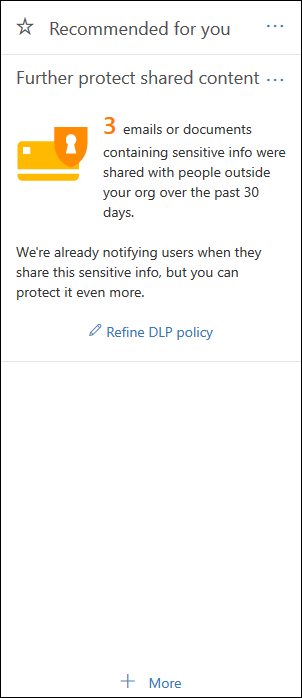

# 开始使用默认 DLP 策略

在创建首个数据丢失防护（DLP）策略之前，DLP 将帮助使用默认策略保护您的敏感信息。 此默认策略及其建议（如下所示）有助于在组织外部的人员共享包含信用卡号的电子邮件或文档时通知你，以确保敏感内容的安全。 你将在安全&amp;合规中心的**主页**上看到此建议。 
  
您可以使用此小组件快速查看共享敏感信息的时间和大小，然后只需单击一次或两次，从而精炼默认的 DLP 策略。 您还可以随时编辑默认的 DLP 策略，因为它是完全可自定义的。 请注意，如果最初看不到建议，请尝试在 "**建议为你**" 部分的底部单击 " **+ 更多**"。 
  

  
## 查看报告并优化默认 DLP 策略

当小组件显示用户与组织外部的人员共享敏感信息时，请选择底部的 "**优化 DLP 策略**"。 
  
详细报告显示了在过去30天内共享包含信用卡号的内容的时间和数量。 请注意，规则匹配最长可能需要48小时才能在小部件中显示。
  
为了帮助保护敏感信息，默认的 DLP 策略为：
  
- 检测何时包含至少一个信用卡号的 Exchange、SharePoint 和 OneDrive 中的内容与组织外部的人员共享。
    
- 显示策略提示，并在用户尝试与组织外部的人员共享此敏感信息时向用户发送电子邮件通知。 有关这些选项的详细信息，请参阅[发送电子邮件通知和显示 DLP 策略的策略提示](use-notifications-and-policy-tips.md)。
    
- 生成详细的活动报告，以便您可以跟踪与组织外部的人员共享内容以及他们何时执行的操作。 您可以使用[DLP 报告](view-the-dlp-reports.md)和[审核日志数据](search-the-audit-log-in-security-and-compliance.md)（其中**活动** = **DLP**）查看此信息。
    
若要快速优化默认的 DLP 策略，您可以选择使用它：
  
- 当用户与组织外部的人员共享此敏感信息时，向您发送事件报告电子邮件。
    
- 将其他用户添加到电子邮件事件报告中。
    
- 阻止访问包含敏感信息的内容，但允许用户覆盖和共享或发送（如果需要）。
    
有关事件报告或限制访问的详细信息，请参阅[数据丢失防护策略概述](data-loss-prevention-policies.md)。
  
如果以后要更改这些选项，您可以随时编辑默认的 DLP 策略-请参阅下一节。
  

  
## 编辑默认的 DLP 策略

此策略名为 "**默认 DLP 策略**"，显示在安全&amp;合规中心的 "**策略**" 页上的 "**数据丢失防护**" 下。 
  
此策略可完全自定义，与你从头开始创建的任何 DLP 策略相同。 您还可以关闭或删除策略，以便用户不再接收策略提示或电子邮件通知。
  

  
## 小组件何时出现且不显示

"安全&amp;合规性中心"**主页**的 "**建议**" 部分会显示名为 "**进一步保护共享内容**" 的小部件。 
  
仅在以下情况时显示此小组件：
  
- 安全&amp;合规中心或 Exchange 管理中心中没有数据丢失防护策略。 此小组件旨在帮助你开始使用 DLP，因此如果你已具有 DLP 策略，则不会显示它。
    
- 在过去30天内，与组织外部的某个人共享的包含至少一张信用卡的内容已被共享。
    
请注意，规则匹配最长可能需要48个小时才能用于小组件，因此，在检测到外部共享敏感信息后，可能需要长达两天的时间才能显示建议。
  
最后，在使用小部件优化默认的 DLP 策略后，该小部件将从**主页**中消失。 
  

