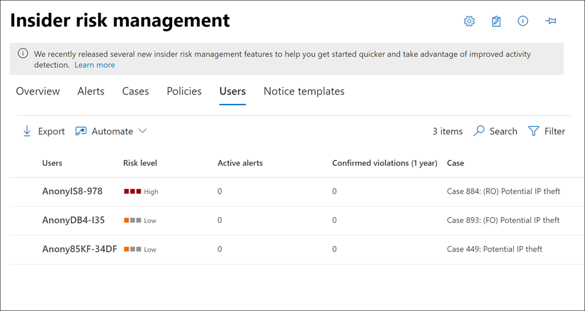

# 内幕风险管理用户仪表板

**用户仪表板**是内幕风险管理工作流中的一个重要工具，可帮助调查人员和分析师更全面地了解风险活动。 此仪表板提供了视图和管理功能，可满足创建内幕风险管理策略和管理内幕风险管理案例之间的管理需求。

将用户添加到内幕风险管理策略后，后台流程将自动评估[触发指标](insider-risk-management-policies.md#indicators)的用户活动。 存在触发指示器后，会为用户活动分配风险分数。 其中一些活动可能会导致出现内幕风险警报，但某些活动可能无法满足最低风险分数水平，并且不会创建内幕风险警报。 **用户仪表板**允许您查看具有这些类型的指示器和风险分数的用户，以及具有活动的内幕风险警报的用户。

此外，在内幕风险管理工作流外部报告不正常的事件后，还可能需要将临时用户添加到内幕风险策略中。 **用户仪表板**允许您将用户手动添加到内幕风险策略中的特定时间段，并绕过对用户具有触发指示器的要求。 当活动分配到策略时，这些用户将始终显示在用户仪表板中。

详细了解用户仪表板如何在以下情况下显示用户：

- 具有活动内幕风险策略警报的仪表板用户
- 具有触发指示器的仪表板用户
- 向策略临时添加的仪表板用户

## 具有活动内幕风险策略警报的仪表板用户

**用户仪表板**将自动显示具有活动的内幕风险策略通知的所有用户。 具有警报的这些用户具有触发指示器和活动风险评分，符合创建内幕风险警报的要求。 通过在**用户仪表板**中选择用户并导航到 "**用户活动**" 选项卡，可以查看这些用户的活动。

## 具有触发指示器的仪表板用户

**用户仪表板**将自动显示具有触发指示器的所有用户，但不具有可创建内幕风险活动的活动风险分数。 例如，将显示一个具有报告的辞职日期的用户，因为此事件是触发指示器，而不是具有风险分数的活动。 通过在**用户仪表板**中选择用户并导航到 "**用户活动**" 选项卡，可以查看这些用户的活动。

## 向策略临时添加的仪表板用户

**用户仪表板**允许您在内部人员风险管理工作流之外的异常事件之后，临时向现有的内幕风险管理策略中添加用户。 临时添加用户是将用户添加到测试策略的内幕风险管理策略中的一种方法，即使未配置所需的连接器也是如此。

在手动将用户添加到策略时，将对以前的90天的用户活动进行评分并将其添加到**用户活动**日程表中。 例如，当前不在内部人员风险策略中的用户和用户的数据泄漏活动报告给组织中的法律部门。 法律部门建议为用户配置新的短期监视要求。 可以在指定的一段时间（激活窗口）中临时将用户分配给*数据泄漏*策略。 由于会放弃触发指示器要求，因此在**用户仪表板**中临时添加的所有用户都会显示出来。

>[!NOTE]
>在**用户仪表板**中显示新的手动添加的用户可能需要几个小时。 之前90天的活动显示这些用户可能需要长达24小时才能显示。 若要查看手动添加的用户的活动，请在**用户仪表板**上选择用户，然后在详细信息窗格中打开 "**用户活动**" 选项卡。

当**激活窗口**中定义的时间过期时，将自动从内幕策略和**用户仪表板**中删除用户：

- 用户没有任何触发指标或内幕风险策略警报，
- 如果手动定义的**激活窗口**持续时间长于全局策略**激活窗口**持续时间。 

使用持续时间最长的**激活窗口**设置将始终覆盖**激活窗口**设置的持续时间较短。 例如，您已将内幕风险管理全局设置中的 "全局**策略时段**" 选项卡上的**激活窗口**配置为15天，这将自动应用于所有内幕风险策略。 

您将用户临时添加到*数据泄漏*内幕风险策略中，并将30天定义为此用户的**激活窗口**。 15天的全局**激活窗口**设置将被覆盖，为临时添加的用户定义30天的**激活窗口**设置。 临时添加的用户将保留在**用户仪表板**中，并且是策略在30天内的范围。

在与为临时添加的用户定义的**激活窗口**设置长度相同的 "全局**激活**窗口" 设置的相反方案中，"全局**激活" 窗口**设置将覆盖临时添加用户的**激活窗口**设置。 临时添加的用户将保留在**用户仪表板**中，并且是策略在全局**激活窗口**设置中定义的天数的范围内。

## 在用户仪表板上查看用户信息

**用户仪表板**中显示的每个用户都包含以下信息：

- **Users**：用户的用户名。 如果已启用内幕风险管理的全局 anonymization 设置，则此字段为匿名。
- **风险级别**：用户的当前计算的风险级别。 此分数每24小时计算一次，并使用与该用户关联的所有活动警报中的警报风险分数。 对于仅具有触发指示器的用户，风险级别为零。
- **主动警报**：针对所有策略的活动警报数。
- 已**确认冲突**：针对用户确认的已*确认策略冲突*的案例数。
- **案例**：用户的当前活动事例。

>[!NOTE]
>在某些情况下，**用户仪表板**上显示的用户数量可能会受到限制，具体取决于活动警报和匹配策略的数量。 在生成警报时，在**用户仪表板**上显示具有活动警报的用户，在达到最大显示用户数的情况下，可能会发生这种情况。 如果发生这种情况，则在对用户仪表板进行了会审时不显示活动警报的用户将被添加到**用户仪表板**中。

## 查看用户详细信息

若要查看有关某个用户的风险活动的更多详细信息，请双击用户**仪表板**中的用户以打开用户详细信息窗格。 在 "详细信息" 窗格中，您可以查看以下信息：

- **用户配置文件**选项卡
    - **名称和标题**：来自 Azure Active Directory 中的用户的名称和位置标题。 如果已启用内幕风险管理的全局 anonymization 设置，则这些用户字段将为匿名或空。
    - **用户电子邮件**：用户的电子邮件地址。
    - **别名**：用户的网络别名。
    - **组织或部门**：用户的组织或部门。

- **用户活动**选项卡
    - **最近用户活动的历史记录**：列出了用户活动的触发指示器和内幕风险指标，最长可达最后180天。 所有与内幕风险指示器相关的活动也会被评分，但这些活动可能会或可能不会生成内幕风险警报。 触发指示器示例可能是辞职日期或用户的上次计划工作日期。 内幕风险指标是确定为具有风险的元素并在中包含用户的策略中定义的活动。 列出了事件和风险活动，其中最新的项最先列出。

## 临时向策略中添加用户

若要将用户临时添加到内部风险管理策略，您将使用 Microsoft 365 合规性中心内的**内幕风险管理**解决方案中的 "**用户**" 选项卡。 用户为其添加到的策略添加了手动绕过触发指示器要求，并显示在**用户仪表板**中。 若要将用户永久添加到内部风险管理策略，您将使用策略向导。

完成以下步骤以将用户添加到现有内幕风险策略：

1. 在[Microsoft 365 合规性中心](https://compliance.microsoft.com)中，转到 "**内幕风险管理**"，然后选择 "**用户**" 选项卡。
2. 选择 "在工具栏上**向策略添加用户**"。
3. 在 "**添加新用户**" 对话框中，开始在 "**用户**" 字段中键入用户名。 选择要添加到策略中的用户。
4. 选择 "**策略**" 字段的下拉箭头以显示配置的 "内幕风险管理策略"。 选择要将用户添加到的策略。
5. 使用**激活窗口**滑块控件可定义用户在策略中的包含时间并显示在用户仪表板中的时间。 您指定的时间确定该用户的策略在多长时间后启动，并在检测到第一个警报或检测到触发指示器（如 DLP 策略匹配）时启动。 **激活窗口**的范围是5到30天。
6. 选择 "**添加**"，然后**确认**将该用户添加到策略中。

>[!NOTE]
>在**用户仪表板**中显示新的手动添加的用户可能需要几个小时。 之前90天的活动显示这些用户可能需要长达24小时才能显示。 若要查看手动添加的用户的活动，请在**用户仪表板**上选择用户，然后在详细信息窗格中打开 "**用户活动**" 选项卡。
