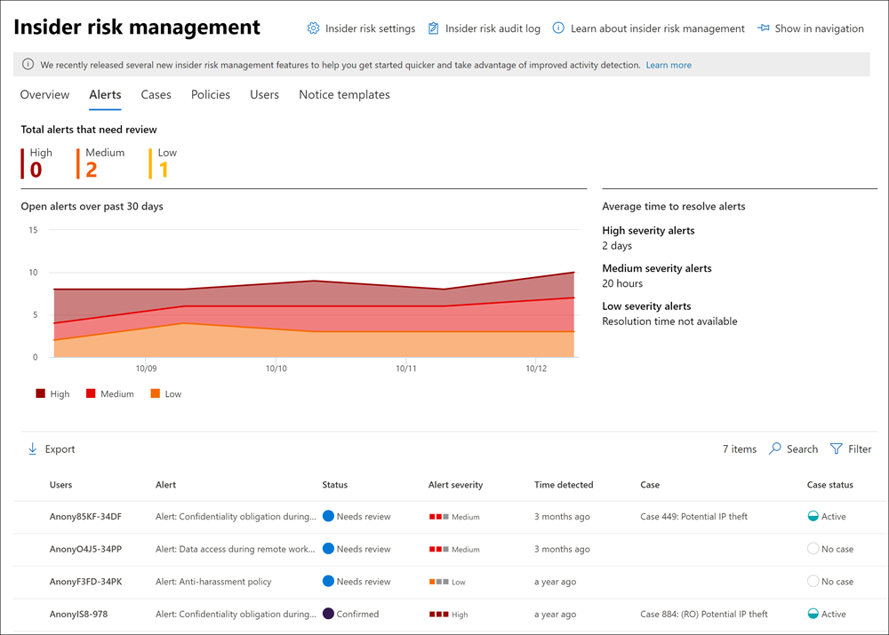

# Microsoft 365 中的内幕风险管理

内幕风险管理是 Microsoft 365 中的一种解决方案，可帮助您检测、调查并对组织中的危险活动采取措施，从而帮助最大限度地减少内部风险。 自定义策略允许您检测组织中的恶意和意外风险活动并采取措施，包括在需要时向 Microsoft 高级电子数据展示上报案例。 组织中的风险分析师可以快速采取适当的措施，以确保用户符合组织的合规性标准。

观看以下视频，了解内幕风险管理如何帮助您的组织防止、检测和包含风险，同时确定组织价值、文化和员工体验的优先级：
 
 
>[!VIDEO https://www.microsoft.com/videoplayer/embed/RE4j9CN]

## 新式风险痛点

管理和最大限度地减少组织中的风险从了解新式工作区中发现的风险类型开始。 某些风险由外部事件和因素驱动，并在直接控制范围内。 其他风险由可以消除并避免的内部事件和员工活动驱动。 有些示例是来自员工和经理的非法、不正当、未授权或不道德行为和操作的风险。 这些行为包括员工的多种内部风险：

- 敏感数据泄露和数据外泄
- 违反机密性
- 知识财产（IP）盗窃
- 防
- 内幕交易
- 法规遵从性冲突

新式工作区中的员工有权在各种各样的平台和服务中创建、管理和共享数据。 在大多数情况下，组织具有有限的资源和工具来识别和缓解组织范围的风险，同时还能满足员工隐私标准。

Microsoft 365 中的内幕风险管理使用全面的服务和第三方指示器来帮助您快速确定、会审并对风险活动采取措施。 通过使用 Microsoft 365 和 Microsoft Graph 中的日志，内幕风险管理允许您定义特定策略以标识风险指示器。 通过这些策略，您可以确定危险活动并采取措施来缓解这些风险。

内幕风险管理的中心围绕以下原则：

- **透明度**：根据设计隐私体系结构，平衡员工隐私和组织风险。
- **可配置**：基于行业、地理位置和业务组的可配置策略。
- **集成**：跨 Microsoft 365 合规性解决方案的集成工作流。
- 可**操作**：提供有关启用员工通知、数据调查和员工调查的见解。

## 工作流

内幕风险管理可帮助您确定、调查和采取措施来解决组织中的内部风险。 使用集中式策略模板、跨 Microsoft 365 服务的全面活动信号和灵活的工作流，您可以使用可操作的见解快速识别和解决有风险的行为。

使用以下工作流确定和解决 Microsoft 365 中的内幕风险管理的内部风险活动和合规性问题：

### 策略

内幕风险管理策略是使用预定义的模板和策略条件（定义在 Microsoft 365 功能区域中检查哪些风险指示器）创建的。 这些条件包括指示器用于通知、策略中包含的用户、确定优先顺序的服务以及监视时间段。

您可以从以下[策略模板](insider-risk-management-policies.md#policy-templates)中进行选择，以便快速开始使用 "内幕风险管理"：

- 脱离员工数据失窃
- 数据泄露
- 电子邮件中的冒犯性语言

有关详细信息，请参阅[内幕风险管理策略](insider-risk-management-policies.md)。

### 警报

警报由符合策略条件并显示在 "**通知" 仪表板**中的风险指示器自动生成。 通过此仪表板，可以快速查看需要查看的所有警报、一段时间内打开的警报以及组织的警报统计信息。 将显示所有策略警报，其中包含相关信息，以帮助您快速识别现有通知的当前状态和需要采取操作的新警报：

- 状态
- Severity
- 检测时间
- 情况
- 案例状态

有关详细信息，请参阅[内幕风险管理警报](insider-risk-management-alerts.md)。

### 诊断

需要调查的新活动会自动生成为其分配了 "*需要审阅*" 状态的警报。 审阅者可以快速识别这些通知并滚动到每个通知进行评估和会审。 

通过打开新事例、将警报分配给现有事例或消除警报来解决警报。 使用警报筛选器，可以轻松地根据状态、严重性或时间来识别警报。 作为会审过程的一部分，审阅者可以查看策略匹配的警报详细信息、查看与匹配项关联的用户活动、查看警报的严重性并查看用户配置文件信息。

### 调查

为需要深入审查和调查策略匹配周围的详细信息和情况的警报创建案例。 **事例仪表板**提供了所有活动案例的详细视图、一段时间内的开放事例以及贵组织的案例统计信息。 审阅者可以按状态、打开案例的日期以及上次更新事例的日期来快速筛选案例。

在事例仪表板上选择一个事例将打开调查和审阅的案例。 这一步是内幕风险管理工作流的核心。 此区域是风险活动指标、策略条件、警报详细信息和员工详细信息合成到审阅者的集成视图中的地方。 此区域中的主要调查工具是：

- **用户活动**：用户活动将自动显示在交互式图表中，该图表按时间和当前或过去风险活动的风险级别绘制风险活动。 审阅者可以快速筛选和查看员工的整个风险历史记录，并深入了解具体活动以了解详细信息。
- **内容资源管理器**：与警报风险活动相关联的所有数据文件和电子邮件都将自动捕获并显示在内容资源管理器中。 审阅者可以按数据源、文件类型、标记、对话以及其他许多属性来筛选和查看文件和邮件。
- **案例备注**：审阅者在 "事例注释" 部分中提供了有关案例的注释。 此列表合并了一个中心视图中的所有笔记，并包含审阅者和提交的日期信息。

有关详细信息，请参阅[内幕风险管理案例](insider-risk-management-cases.md)。

### Action

在调查事例之后，审阅者可以快速采取措施解决案例或与组织中的其他风险承担者进行协作。 当员工意外或无意地违反策略条件时，可以向员工发送一个简单的提醒通知，您可以为您的组织配置通知模板。 这些通知可用作简单的提醒，也可指导员工进行复习培训或指导，以帮助防止将来出现风险的行为。 有关详细信息，请参阅[内幕风险管理通知模板](insider-risk-management-notices.md)。

在最严重的情况下，您可能需要与组织中的其他审阅人共享内幕风险管理案例信息。 内幕风险管理与其他 Microsoft 365 合规性功能紧密集成，可帮助您进行端到端风险解决方案。 升级案例以使您能够将案例的数据和管理转移到 Microsoft 365 中的高级电子数据展示。 高级电子数据展示提供了端到端工作流，以保留、收集、查看、分析和导出对组织内部和外部调查做出响应的内容。 它允许法律团队管理整个法律封存通知工作流。 若要了解有关高级电子数据展示事例的详细信息，请参阅[Microsoft 365 中的高级电子数据展示概述](overview-ediscovery-20.md)。

## 应用场景

内幕风险管理可帮助您在以下几个常见方案中检测、调查和采取措施来缓解组织中的内部风险：

### 通过脱离员工进行数据窃取

当员工离开组织（自愿或作为终止的结果）时，通常会对公司、客户和员工数据存在风险带来合法的关注。 员工可能 innocently 认为项目数据并非专有，或者他们可能会尝试将公司数据用于个人利益，并违反公司政策和法律标准。 使用[传出员工数据失窃](insider-risk-management-policies.md#policy-templates)策略模板的内幕风险管理策略可自动检测通常与此类型的盗窃相关联的活动。 使用此策略，您将自动收到与传出员工失窃相关的可疑活动的警报，以便您可以采取适当的调查操作。 为您的组织配置[Microsoft 365 HR 连接器](import-hr-data.md)是此策略模板所必需的。

### 敏感或机密信息的有意或无意泄露

在大多数情况下，员工最好先尝试其正确处理敏感或机密信息。 但有时员工会导致错误，并且信息会在您的组织外部意外共享或违反您的信息保护策略。 有时，员工可能会有意泄露或共享敏感和机密信息，以实现恶意目的和潜在的个人利益。 使用[数据泄露](insider-risk-management-policies.md#policy-templates)策略模板创建的内幕风险管理策略将自动检测通常与共享敏感信息或机密信息相关的活动。 对于此策略模板，至少需要为您的组织配置一个 Microsoft 365[数据丢失保护（DLP）策略](create-test-tune-dlp-policy.md)。

### 违反企业策略的操作和行为

员工对员工的通信通常是意外或恶意违反公司策略的来源。 这些冲突可能包括员工之间的冒犯性语言、威胁和网络威胁。 此类型的活动可分配给恶意工作环境，并可能导致对员工和更大的组织的法律活动。 内幕风险管理使用新的内置 Microsoft 365 分类器和[电子邮件](insider-risk-management-policies.md#policy-templates)策略模板中的冒犯性语言。 通过这些分类器和模板，可以快速配置策略，以自动检测并提醒您此类行为。

## 准备好开始了吗？

- 有关如何准备在组织中启用内幕风险管理策略的说明，请参阅[Plan for 内幕风险管理](insider-risk-management-plan.md)。
- 请参阅 "[内幕风险管理入门](insider-risk-management-configure.md)"，配置先决条件、创建策略并开始接收通知。
