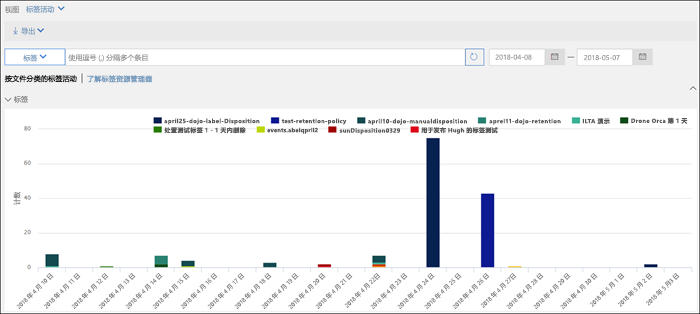

# 了解保留标签

>*[Microsoft 365 安全性与合规性许可指南](https://aka.ms/ComplianceSD)。*

整个组织中可能有不同类型的内容。为了遵守行业法规和内部策略，必须采取不同的操作。例如，可能有：
  
- 至少必须**保留**一段时间的纳税申报表格。 
    
- 达到一定年限后必须**永久删除**的新闻材料。 
    
- 必须先**保留**再**永久删除**的竞争性研究。 
    
- 必须**标记为记录**以免被编辑或删除的工作签证。 
    
无论是上述哪种用途，保留标签都可有助于对正确的内容执行适当的操作。借助保留标签，可对整个组织中的数据进行分类来管理数据，并根据此分类强制执行保留规则。
  
借助保留标签，你可以：
  
- **使组织中的人员手动将保留标签应用于** Outlook 网页版、Outlook 2010 及更高版本、OneDrive、SharePoint 和 Microsoft 365 组中的内容。用户通常最了解自己处理的内容类型，因此可对数据进行分类，并应用适当的策略。 
    
- **将保留标签自动应用于**符合特定条件的内容，如内容包含： 
    
    - 特定类型敏感信息。
    
    - 与所创建的查询匹配的特定关键字。
    
    - 可训练分类器的模式匹配。
    
  能否将保留标签自动应用于内容非常重要，这是因为：
    
     - 无需为用户提供有关所有分类的培训。
    
     - 无需依赖用户，即可对全部内容进行正确分类。
    
   - 用户不再需要了解数据管理策略，反而可以专注于自己的工作。

- **将默认保留标签应用于 SharePoint 中的文档库、文件夹或文档集**，以让存储在该位置的所有文档都继承默认保留标签。

此外，保留标签支持跨 Microsoft 365 应用和服务对电子邮件和文档实施[记录管理](records-management.md)。 你可以使用保留标签将内容分类为记录。 在此情况下，无法更改或删除标签，也不能编辑或删除内容。 

租户支持的保留标签数没有限制。 但是，租户支持的最大策略数为 10,000，其中包括应用标签的策略（保留标签策略和自动应用保留策略）以及保留策略。

## 如何结合使用保留标签和保留标签策略

使保留标签对组织中的人员可用以便对内容进行分类的过程分为两个步骤： 

1. 创建保留标签

2. 使用保留标签策略发布保留标签
  

  
保留标签是独立且可重复使用的构建基块，其包含在一个或多个保留标签策略中。 保留标签策略的主要目的是对一组保留标签进行分组，并指定要显示标签的位置。
  

  
1. 发布保留标签时，它们将包含在保留标签策略中。 保留标签名称不可变；也就是说，它们一旦创建就无法编辑了。

2. 一个保留标签可以包含在多个保留标签策略中。

3. 一个位置也可以包括在许多保留标签策略中。
    
3. 保留标签策略指定保留标签发布位置。
    
## 一次只能分配一个保留标签

请务必了解，电子邮件或文档等内容一次只能分配有一个保留标签：
  
- 对于最终用户手动分配的保留标签，用户可删除或更改所分配的保留标签。
    
- 可将内容分配有的自动应用标签替换为，最终用户手动分配的保留标签。
    
- 如果最终用户已手动向内容分配保留标签，无法使用自动应用标签来替换手动分配的保留标签。
    
- 若有多个规则要分配自动应用标签，且内容满足多个规则的条件，那么分配的是年限最长规则的保留标签。
    
若要了解如何以及为何应用一个保留标签（而非另一个），则了解显式分配标签和隐式分配标签之间的差异非常有用：

- 手动分配的标签属于显式分配
- 自动应用的标签属于隐式分配

显式分配的保留标签优先于隐式分配的保留标签。 有关详细信息，请参阅本页上的[保留原则或优先性是什么？](#the-principles-of-retention-or-what-takes-precedence)部分。

## 保留标签策略和位置

不同类型的保留标签可发布到不同位置，具体视保留标签用途而定。
  
|**如果保留标签…**|**可将标签策略应用于…**|
|:-----|:-----|
|发布给最终用户    |Exchange、SharePoint、OneDrive、Microsoft 365 组    |
|根据敏感信息类型自动应用    |Exchange（仅全部邮箱）、SharePoint 和 OneDrive    |
|根据查询自动应用    |Exchange、SharePoint、OneDrive、Microsoft 365 组    |
   
在 Exchange 中，自动应用（同时针对查询和敏感信息类型）的保留标签只会应用于新发送的邮件（传输中的数据），而非当前邮箱中的所有项目（静态数据）。 此外，用于敏感信息类型的自动应用的保留标签只能应用于全部邮箱；不能选择特定邮箱。
  
Exchange 公用文件夹、Skype 和 Teams 频道消息和聊天不支持保留标签。

## 保留标签如何强制执行保留

保留标签能够强制执行保留策略可执行的相同保留操作 - 保留后删除、仅保留或仅删除。 可使用保留标签来实现一个复杂的文件计划，该计划可为不同的保留设置标识特定的文件。 有关保留工作方式的详细信息，请参阅[了解保留策略](retention-policies.md)。

此外，保留标签有两个保留选项，这两个选项只能用于保留标签，而不能用于保留策略。借助保留标签，你可以：
  
- 保留期结束时，触发处置审查，这样就必须先审阅 SharePoint 和 OneDrive 文档，再删除它们。 有关详细信息，请参阅[处置评审](disposition.md#disposition-reviews)。
    
- 保留期从内容分配有标签时开始计算，而不是根据内容年限或上次修改时间计算。 使用此选项时：
    - 此选项仅适用于 SharePoint 网站和 OneDrive 帐户中的内容。 对于 Exchange 电子邮件，保留期限始终是基于发送或接收邮件的日期。
    - 保存标签后，无法再更改保留期限。
    

另一个重要的区别是，将保留标签（而非保留策略）应用于 SharePoint 中的文件并将其配置为保留内容时，用户无法在强制实施保留期时删除该文件。 将相同标签应用于 OneDrive 和电子邮件中的文件时，用户可以删除内容，除非标签将内容标记为记录。

## 在哪些位置上发布的保留标签可向最终用户显示

如果保留标签将由最终用户分配给内容，可将保留标签发布到：
  
- Outlook 和 Outlook 网页版
    
- OneDrive
    
- SharePoint
    
- Microsoft 365 组（Outlook 网页版中的组网站和组邮箱）
    
接下来的各部分介绍了标签是如何在不同应用程序中向组织用户显示的。
  

### Outlook

若要在 Outlook 桌面客户端中标记项目，请选择该项目。 在功能区上的“**开始**”选项卡上，单击“**分配策略**”，然后选择保留标签。 
  

  
也可以右键单击项目，在上下文菜单中单击“**分配策略**”，然后选择保留标签。 

应用保留标签后，可查看此保留标签以及基于此项目执行的操作。 如果某电子邮件应用了具有相关保留期的保留标签，则可以一目了然地查看该电子邮件的过期时间。
  
还可将保留标签应用于文件夹，在这种情况下：
  
- **除**显式应用保留标签的项目之外，文件夹中的所有项目都会自动获得相同的保留标签。 显式标记的项目将保留其现有保留标签。 有关详细信息，请参阅本页上的[保留原则或优先性是什么？](#the-principles-of-retention-or-what-takes-precedence)部分。 
    
- 如果你更改或删除文件夹的默认保留标签，文件夹中所有项的保留标签都会随之更改或删除，具有显式分配的保留标签的项**除外**。 
    
- 如果你将具有默认保留标签的项从一个文件夹移至另一个具有不同默认保留标签的文件夹，此项会获得新的默认保留标签。
    
- 如果你将具有默认保留标签的项从一个文件夹移至另一个具有不同默认保留标签的文件夹，旧的默认保留标签会遭删除。

### Outlook 网页版

若要在 Outlook 网页版中标记项，请右键单击项，单击“分配策略”****，再选择保留标签。 
  

  
在保留标签应用后，可在项顶部查看此保留标签及其执行的操作。如果电子邮件已分类且有关联的保留期，电子邮件的到期时间便一目了然。
  

  
如同 Outlook 网页版一样，也可以将保留标签应用于文件夹。 

### OneDrive 和 SharePoint

若要在 OneDrive 或 SharePoint 中标记文档（包括 OneNote 文件），请选择项 \> 在右上角选择“**打开细节窗格**” \>“**应用保留标签**”\> 选择保留标签。 
  
还可将保留标签应用于文件夹或文档集，并能[为文档库设置默认保留标签](#applying-a-default-retention-label-to-all-content-in-a-sharepoint-library-folder-or-document-set)。
  

  
在保留标签应用于项后，可在选择项后在细节窗格中查看保留标签。
  

  
对于 SharePoint（而不是 OneDrive），可以创建包含“**标签**”列或“**项目为一条记录**”列的库视图。 通过此视图，可以一目了然地查看分配给所有项目的保留标签，以及哪些项目是记录。 但是请注意，不能按“**项目为一条记录**”列来筛选视图。 有关如何添加列的说明，请参阅[显示或隐藏列表或库中的列](https://support.microsoft.com/zh-CN/office/show-or-hide-columns-in-a-list-or-library-b820db0d-9e3e-4ff9-8b8b-0b2dbefa87e2)。

### Microsoft 365 组

将保留标签发布到 Microsoft 365 组（[以前是 Office 365 组](https://techcommunity.microsoft.com/t5/microsoft-365-blog/office-365-groups-will-become-microsoft-365-groups/ba-p/1303601)）时，保留标签将同时出现在 Outlook 网页版的组网站和组邮箱中。 将保留标签应用到内容的体验与电子邮件和文档过程相同。

若要保留 Microsoft 365 组的内容，请使用 **Office 365 组**位置。 即使 Microsoft 365 组有 Exchange 邮箱，涵盖整个 Exchange 位置的保留策略也不会包含 Microsoft 365 组邮箱中的内容。

此外，不可能通过使用 Exchange 位置来包含或排除某个组邮箱。 尽管 Exchange 位置最初允许选择组邮箱，但在尝试保存保留策略时，你将收到一条错误消息，表明“RemoteGroupMailbox”不是有效的 Exchange 位置选项。
  
首先，创建和配置要在应用和其他服务中使用的敏感度标签。 例如，希望用户在 Office 应用中看到和采用的标签。 

然后，创建一个或多个包含标签和你配置的策略设置的标签策略。 这是用于发布所选用户和位置的标签和设置的标签策略。

## 根据条件自动应用保留标签

保留标签最强大的功能之一是能够将其自动应用于符合特定条件的内容。 此情况下，组织中的人员无需应用保留标签。 Microsoft 365 会代为操作。
  

  
自动应用保留标签的功能非常强大，这是因为：
  
- 无需为用户提供有关所有分类的培训。
    
- 无需依赖用户，即可对全部内容进行正确分类。
    
- 用户不再需要了解数据管理策略，反而可以专注于自己的工作。
    
可选择将保留标签自动应用于包含以下各项的内容：
  
- [特定类型敏感信息](create-retention-labels.md#auto-apply-labels-to-content-with-specific-types-of-sensitive-information)
    
- [与你创建的查询匹配的特定关键字](create-retention-labels.md#auto-apply-labels-to-content-with-keywords-or-searchable-properties)

- [可训练分类器的匹配项](create-retention-labels.md#auto-apply-labels-to-content-by-using-trainable-classifiers)
    

> [!TIP]
> 有关使用 SharePont 中的托管属性来自动应用保留标签并实施事件驱动保留的详细方案，请参阅[使用保留标签管理 SharePoint 文档的生命周期](auto-apply-retention-labels-scenario.md)。

## 将默认保留标签应用于 SharePoint 库、文件夹或文档集中的所有内容

除了能让人员将保留标签应用于各个文档之外，还能将默认保留标签应用于 SharePoint 库、文件夹或文档集，这样这些位置上的所有文档都会获得默认保留标签。
  
对于文档库，此操作在文档库的“**库设置**”页上完成。 选择默认保留标签时，还可选择将其应用到库中的现有项目。 
  
例如，若有“营销材料”标记，并且确定特定文档库仅包含这种类型内容，可将“营销材料”标记设置为此库中所有文档的默认标签。
  

  
如果将默认保留标签应用于库、文件夹或文档集中的现有项：
  
- **除**显式应用保留标签（例如，记录）的项之外，库、文件夹或文档集中的所有项都会自动获得相同的保留标签。 显式标记的项目将保留其现有标签。 有关详细信息，请参阅下面的[保留原则或优先级](#the-principles-of-retention-or-what-takes-precedence)部分。
    
- 如果你更改或删除库、文件夹或文档集的默认保留标签，库、文件夹或文档集中所有项的保留标签都会随之更改或删除，具有显式保留标签（例如，记录）的项**除外**。
    
- 如果你将具有默认保留标签的项从一个网站集、库、文件夹或文档集移至另一个网站集、库、文件夹或文档集，此项会保留现有默认保留标签，即使新位置的默认保留标签不同也是如此。 如果该项目移动前没有标签，它将使用新位置的默认保留标签。

**记录：** 如果将默认记录标签应用于库、文件夹或文档集，则会对这些位置中的所有单个项应用记录标签。 将新项移动到包含记录标签的位置时，该项将标记为记录。 但是，如果将默认保留标签更改为未将内容声明为记录的标签，则该操作不会从单个项中删除记录标签；这些项会保留其记录标签。 只有网站集管理员可显式删除或更改记录项的保留标签。

有关将内容声明为记录的保留标签的详细信息，请参阅[了解记录](records.md)。

## 使用规则将保留标签应用于电子邮件

在 Outlook 中，可创建用于应用保留标签或保留策略的规则。
  
例如，可创建一条规则，将特定保留标签应用于发送到/发送自特定通讯组的所有邮件。
  
若要创建规则，请右键单击项，依次单击“规则”****、“创建规则”****、“高级选项”**** 和“规则向导”****，再选中“应用保留策略”****。
  

  
## 对内容分类但不执行任何操作

创建保留标签时，可在不打开任何保留操作或其他操作的情况下执行此操作。 此情况下，可仅将保留标签用作文本标签，而不强制执行任何操作。
  
例如，可创建不含任何操作的“稍后审阅”保留标签，再将此保留标签自动应用于包含敏感信息类型的内容或已查询内容。
  

  
## 使用保留标签实现记录管理
    
可以使用保留标签将内容声明为记录。 这使你可以在 Microsoft 365 中实现单一、一致的记录管理策略。 有关详细信息，请参阅[了解记录](records.md)。
  
## 将保留标签用作 DLP 策略中的条件

保留标签可对内容强制执行保留操作。此外，还可以将保留标签用作数据丢失防护 (DLP) 策略中的条件。也就是说，DLP 策略可对包含特定标签的内容强制执行其他操作（如限制访问）。 
  
有关详细信息，请参阅[将保留标签用作 DLP 策略中的条件](data-loss-prevention-policies.md#using-a-retention-label-as-a-condition-in-a-dlp-policy)。
  

## 保留原则或优先级

内容可能或甚至很有可能有多个应用的保留策略，每个策略的操作（保留、删除或先保留再删除）和保留期都不同。优先级是什么？最高优先级是，一个策略保留的内容一定不得被另一个策略永久删除。
  

  
若要了解包含保留操作的不同标签是如何应用于内容的，请注意下面这些保留原则：
  
1. **保留优先于删除。** 假设一个保留策略要删除年限超过 3 年的 Exchange 电子邮件，而另一个保留策略则要将 Exchange 电子邮件先保留 5 年再删除。任何年限达到 3 年的内容都会被删除，并隐藏起来对用户不可见，但仍保留在“可恢复项”文件夹中，直到年限达到 5 年，内容才会被永久删除。 
    
2. **最长保留期优先。** 如果内容受多个内容保留策略约束，它会一直保留到最长保留期到期。 
    
3. **显式添加的位置优先于隐式添加的位置。** 也就是说： 
    
    1. 如果具有保留设置的保留标签由用户手动分配给某项目（例如 Exchange 电子邮件或 OneDrive 文档），该保留标签优先于在站点或邮箱级别分配的策略以及由文档库分配的默认保留标签。 例如，如果显式保留标签要保留 10 年，但分配给此站点的保留策略仅要保留 5 年，则优选保留标签的保留期。 自动应用保留标签被视为隐式标签，而不是显式标签，因为它们由 Microsoft 365 自动应用。
    
    2. 如果保留策略包含特定位置（如特定用户的邮箱或 OneDrive 帐户），此策略优先于应用于所有用户邮箱或 OneDrive 帐户（而不是包含具体用户邮箱）的其他保留策略。
    
4. **最短删除期优先。** 同样，如果内容受多个内容删除策略约束（无保留），它将在最短保留期到期时被删除。 
    
请注意，保留原则就像是自上而下打破平局的流：如果所有策略或标签应用的规则在一个级别上是相同的，流就会向下移至下一个级别，以确定优先应用哪个规则。
  
最后一点，保留策略或保留标签不能永久删除任何保留用于电子数据展示的内容。 解除限制时，此内容将可再次用于上述清除过程。

### 优先使用可训练的分类器进行自动标记

所有为可训练的分类器配置的保留标签都同时接受评估。 如果一个项被多个可训练的分类器检测到，则根据以下条件来确定应用哪个保留标签：

1. 配置为“仅保留”或“保留后删除”的保留标签比配置为“仅删除”的保留标签的优先级高。

2. 对于配置为“仅保留”或“保留后删除”的保留标签，配置最长保持期的保留标签胜出。

3. 对于配置为“仅删除”的保留标签，配置最短保持期的保留标签胜出。

4. 对于操作和保持期都相同的保留标签，保留标签的选择是不确定的。

## 监视保留标签

发布或自动应用保留标签后，需要验证标签是否已应用到所需内容。 若要监视保留标签：
  
- **标签活动资源管理器**。 使用资源管理器（下图中的示例），可快速搜索和查看过去 30 天内 SharePoint 和 OneDrive 中所有内容的保留标签活动。 有关详细信息，请参阅[查看文档的标签活动](view-label-activity-for-documents.md)。

- “**标签分析**”页。 在 Microsoft 365 合规中心和 Microsoft 365 安全中心中，你可以快速查看热门保留标签以及它们的应用位置。 你还可以查看具有特定保留标签的所有内容。 有关详细信息，请参阅[使用标签分析查看标签使用情况](label-analytics.md)。
    
- **数据管理报表**。 使用报表，可跨 Exchange、SharePoint 和 OneDrive 快速查看过去 90 天内所有内容的保留标签趋势和活动。 有关详细信息，请参阅[查看数据管理报表](view-the-data-governance-reports.md)。
    

## 使用内容搜索来查找所有已应用有特定保留标签的内容

在保留标签分配到内容后（无论是用户分配还是自动应用），你都可通过内容搜索来查找所有已使用特定保留标签进行分类的内容。
  
创建内容搜索时，选择“**合规性标记**”条件，然后输入完整的保留标签名称或标签名称的一部分，并使用通配符。 有关详细信息，请参阅[适用于内容搜索的关键字查询和搜索条件](keyword-queries-and-search-conditions.md)。
  

  
## 使用保留标签代替较旧的功能

可将保留标签轻松用于 Microsoft 365 中的整个组织及其内容，包括Exchange、SharePoint、OneDrive 和 Microsoft 365 组。 如果需要保留或删除内容，或在 Microsoft 365 中的任意位置管理记录，建议使用保留标签。
  
还有其他几项先前用于在 Microsoft 365 中保留或删除内容或管理记录的功能。 这些功能将继续与保留标签配合使用。 尽管存在保留标签的执行不同于先前功能的情况，但是保留标签的发展会驱动未来跨 Microsoft 365 进行记录管理。 因此往前看来，对于数据管理，建议使用保留标签，而不是以下较旧的功能。
  
### Exchange Online

- [保留标记和保留策略](https://go.microsoft.com/fwlink/?linkid=846125)，亦称为[邮件传递记录管理 (MRM)](https://go.microsoft.com/fwlink/?linkid=846126)（仅限删除） 
    
### SharePoint 和 OneDrive

- [配置就地记录管理](https://support.office.com/article/7707a878-780c-4be6-9cb0-9718ecde050a)（保留） 
    
- [记录中心简介](https://support.office.com/article/bae6ca5a-7b19-40e0-b433-e3613a747c2c)（保留） 
    
- [信息管理策略](intro-to-info-mgmt-policies.md)（仅限删除） 
    
## 后续步骤

如果已准备好创建和发布保留标签，请参阅[创建、发布和自动应用保留标签](create-retention-labels.md)。
