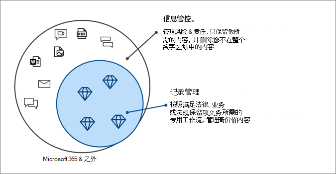

# Microsoft 365 中的 Microsoft 信息治理

>*[Microsoft 365 安全性与合规性许可指南](https://aka.ms/ComplianceSD)。*

使用 Microsoft 信息管理（有时缩写为 MIG）功能来管理数据，以满足合规性或监管要求。

需要保护数据？ 请参阅 [Microsoft 365 中的 Microsoft 信息保护](information-protection.md)。

## 信息管理政策

保留所需要的东西，删除不需要的东西：
 
|功能|它能解决什么问题？|开始行动|
|:------|:------------|:--------------------|:-----------------------------|
|[保留策略和保留标签](retention.md)| 通过策略管理和删除工作流程以保留或删除电子邮件、文档、即时消息等内容。   示例方案：[自动保留应用内容标签](apply-retention-labels-automatically.md) | [开始使用保留策略和保留标签](get-started-with-retention.md)|
|[导入服务](importing-pst-files-to-office-365.md)| 将 PST 文件批量导入到 Exchange Online 邮箱，以保留和搜索电子邮件信息，以满足合规性或法规要求 | [使用网络上传将组织的 PST 文件导入到 Microsoft 365](use-network-upload-to-import-pst-files.md)|
|[存档第三方数据](archiving-third-party-data.md)| 从社交媒体平台、即时通讯平台、文档协作平台导入、归档、应用第三方数据的合规性解决方案。| [第三方连接器](archiving-third-party-data.md#third-party-data-connectors)|
|[非活动邮箱](inactive-mailboxes-in-office-365.md)| 在员工离开组织后保留邮箱内容 | [创建和管理非活动邮箱](create-and-manage-inactive-mailboxes.md)|

## 记录管理

为法律、业务或法规义务管理高价值内容：

|功能|它能解决什么问题？|开始行动|
|:------|:------------|---------------------|:----------------------------|
|[记录管理](records-management.md)| 针对电子邮件和文档的单一解决方案，可将保留计划和要求纳入文件计划中，通过记录声明、保留和处置来支持内容完整生命周期。   示例方案：[记录的处置](disposition.md#disposition-of-records)|[开始进行记录管理](get-started-with-records-management.md) |

