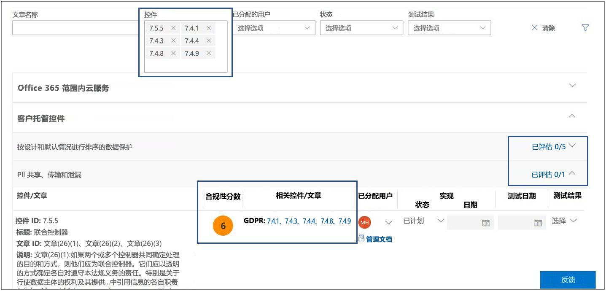
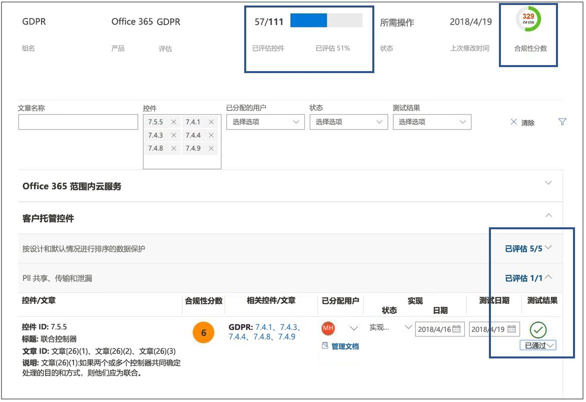
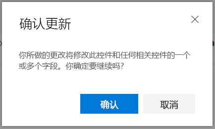
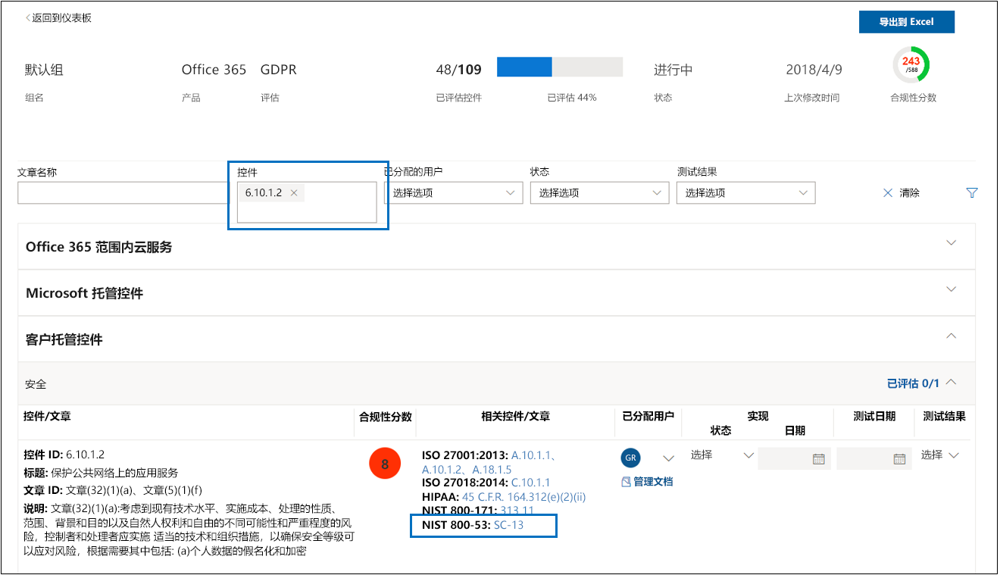
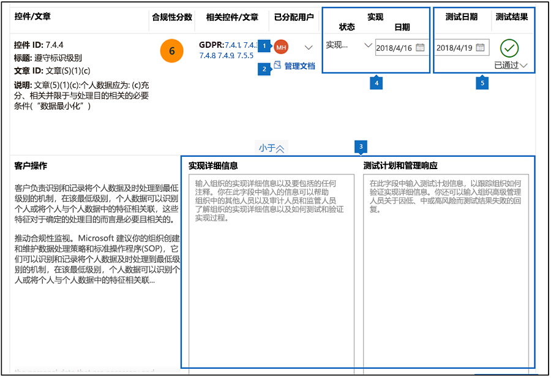
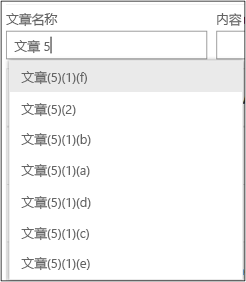

# Microsoft 合规性管理器（经典）

> [!IMPORTANT]
> **合规性管理器现已在 [Microsoft 365 合规中心](https://compliance.microsoft.com/)中公开提供。强烈建议客户停止使用合规性管理器（经典），并移动到新的合规性管理器，从其丰富的用户体验和已更新的控件映射中受益。请参阅我们的 [合规性管理器文档](compliance-manager.md) ，以在 Microsoft 365 合规中心中设置并开始使用新的合规性管理器。**

*由世纪互联运营的 Office 365、Office 365 Germany、Office 365 U.S. Government Community High (GCC High) 或 Office 365 Department of Defense 不提供合规性管理器。*

合规性管理器是 Microsoft [服务信任门户](https://docs.microsoft.com/microsoft-365/compliance/get-started-with-service-trust-portal)中基于工作流的风险评估工具，可跟踪、分配和验证组织的合规性活动，这些活动与 Microsoft 专业服务和 Microsoft 云服务（如 Microsoft Office 365、Microsoft Dynamics 365 和 Microsoft Azure）相关。

合规性管理器：

- 结合使用在根据各种标准（例如，ISO 27001、ISO 27018 和 NIST）对 Microsoft 云服务执行的各种第三方审计过程中 Microsoft 提供给审计和监管人员的详细信息，，以及 Microsoft 为遵守法规（如 HIPAA 和欧盟一般数据保护条例 (GDPR)）在内部汇编的信息，与你自己对组织遵守这些标准和法规情况的自我评估。

- 可便于分配、跟踪和记录合规性活动以及与评估相关的活动，这有助于组织跨越团队障碍，从而实现组织的合规性目标。

- 提供合规性分数，这有助于跟踪进度并确定审核控制措施的优先顺序，从而降低组织的风险暴露程度。

- 提供安全存储库，用于上传和管理与合规性活动相关的证据及其他项目。

- 生成丰富详细的 Microsoft Excel 报告，记录 Microsoft 和组织执行的合规性活动，以提供给审计、监管人员和其他合规性利益干系人。

> [!IMPORTANT]
> 作为仪表板，合规性管理器汇总了数据保护和合规性状态，以及数据保护和合规性改进建议。合规性管理器中的“客户行动”就是建议；在实现前于各自监管环境中评估这些建议的有效性，完全取决于各个组织。不得将合规性管理器中的建议解读为合规性保证。

## 什么是合规性管理器？

合规性管理器是基于工作流的风险评估工具，旨在帮助管理云共同责任模型中的合规性。合规性管理器提供了仪表板视图，汇总了标准、法规和评估，其中包含 Microsoft 的控制措施实现详情和测试结果，以及供组织入门的客户控制措施实现指导和跟踪。合规性管理器提供了认证评估控制措施定义、控制措施实现和测试指导、控制措施风险加权评分、基于角色的访问管理和就地控制措施行动分配工作流，以便跟踪控制措施实现、测试状态和证据管理。合规性管理器可便于客户按逻辑对评估进行分组，并将评估控制措施测试应用于完全相同或相关的控制措施，同时减少了符合不同认证的完全相同控制措施要求所需的重复工作，从而优化了合规性工作负载。

## 合规性管理器中的评估

合规性管理器的核心组件称为 *“评估”*。评估是指根据认证标准或数据保护条例（如 ISO 27001:2013 和 GDPR）对 Microsoft 服务进行评估。评估有助于根据选定 Microsoft 云服务的选定行业标准认清组织的数据保护和合规性态势。评估的完成是通过实现映射到评估依据的认证标准的控制措施。

评估的结构依据为 Microsoft 和组织共同承担的责任，双方负责评估云中的安全性和合规性风险，并实现合规性标准、数据保护标准、法规或法律规定的数据保护安全措施。

评估由多个组件组成，它们分别是：

- **范围内服务** - 每项评估都适用于一组特定的 Microsoft 服务，这些服务在“范围内云服务”部分中列出。

- **Microsoft 管理的控制措施** - 对于每项云服务，Microsoft 都会在合规性流程中实现和管理一组 *控制措施*，以遵守各种标准和法规。这些控制措施分为多个 *控制措施系列*，这些系列与评估要遵守的相应认证或法规中的结构保持一致。对于每项 Microsoft 管理的控制措施，合规性管理器都会详细介绍 Microsoft 是如何实现控制措施的，以及独立的第三方审计如何、何时对实现进行测试和验证。

  下面的示例展示了三项 Microsoft 管理的控制措施，均来自“Office 365 + GDPR”评估中的“**安全**”控制措施系列。

    

  a. 根据映射到 Microsoft 管理的控制措施的认证或法规，指定以下信息。

  - **控制措施 ID** - 控制措施映射到的认证或法规中的节或条款编号。

  - **标题** - 相应认证或法规的标题。

  - **条款 ID** - 仅当为“GDPR”评估时，才会添加此字段，因为它指定了相应 GDPR 条款编号。

  - **说明** - 映射到选定 Microsoft 管理的控制措施的标准或法规文本。

  b. 控制措施的合规性分数，表示与每项 Microsoft 管理的控制措施相关联的风险级别（不合规或无法实现控制措施所带来的风险）。有关详细信息，请参阅[了解合规性分数](#understanding-the-compliance-score)。请注意，合规性分数的评分范围介于 1 和 10 之间，且有颜色标记。黄色表示低风险控制措施，橙色表示中等风险控制措施，红色表示高风险控制措施。

  c. 说明以下信息：控制措施的实现状态、控制措施的测试日期、测试者和测试结果。

  d. 对于每项控制措施，可单击“更多”查看其他信息，包括 Microsoft 的控制措施实现详情，以及独立的第三方审计如何对控制措施进行测试和验证的详细信息。

- **客户管理的控制措施** - 这是由组织管理的一系列控制措施。组织负责在合规性流程中实现这些控制措施，以遵守给定标准或法规。客户管理的控制措施也分为多个映射到相应认证或法规的控制措施系列。客户管理的控制措施用于实现 Microsoft 建议的行动，作为合规性活动的一部分。组织可以在每项客户管理的控制措施中使用说明性指导和建议的客户行动，以管理相应控制措施的实现和评估流程。

  在评估中，客户管理的控制措施还内置有工作流管理功能，可用于管理和跟踪组织的评估完成进度。例如，组织中的合规部主管可以将行动项分配给 IT 管理员，后者有责任且拥有必要权限，可对控制措施执行建议行动。完成工作后，IT 管理员可以先上传实现任务的证据（例如，配置或策略设置的屏幕截图），再将行动项分配回合规部主管，以方便其评估收集到的证据，测试控制措施的实现，并在合规性管理器中记录实现日期和测试结果。有关详细信息，请参阅本文中的[管理评估流程](#managing-the-assessment-process)部分。

## 权限和基于角色的访问控制

合规性管理器使用基于角色的访问控制权限模型。 只有分配了用户角色的用户可访问合规性管理器，并且每位用户允许的操作受到角色类型的限制。

请注意，“**来宾访问**”这一默认角色已不复存在。 必须为每位用户分配一个角色，使其可访问合规性管理器并在其中工作。

下表列出了每种合规性管理器权限及其允许用户执行的行动。此表还指明了每种权限分配到的角色。

|权限|合规性管理器读者|合规性管理器参与者|合规性管理器评估方|合规性管理器管理员|门户管理员|
|---|:---:|:---:|:---:|:---:|:---:|
|**读取数据** - 用户可读取但不能编辑数据。||||||
|**编辑数据** - 用户可编辑除“测试结果”和“测试日期”字段以外的其他所有字段。||||||
|**编辑测试结果** - 用户可编辑“测试结果”和“测试日期”字段。||||||
|**管理评估** - 用户可创建、存档和删除评估。||||||
|**管理用户** - 用户可将组织中的其他用户添加到读者、参与者、评估员和管理员角色。只有组织中拥有全局管理员角色的用户，才能在门户管理员角色中添加或删除用户。||||||
|

## 了解合规性分数

在仪表板上，合规性管理器会在磁贴右上角显示 Office 365 评估的总分数。 这是评估的整体合规性分数，也是评估中标记为“已实施且已测试”的每项控件评估所得到的累计分数。 添加评估时，你将看到合规性分数正在完成中，因为已应用已由 Microsoft 实施且已经过独立第三方测试的 Microsoft 托管控件的得分。

剩余分数来自于成功的客户控制措施评估，也来自于实现和测试客户管理的控制措施，其中每项控制措施都有特定的分值累积到总合规性分数中。

每项评估都会显示基于风险的合规性分数，帮助评估与“评估”中每个控件（包括 Microsoft 托管控件和客户托管控件）相关联的风险（因不合规或控件故障所致）级别。 每个客户托管控件都分配了介于 1 和 10 之间的点数（称为*严重度排名）；控件发生故障的风险因子越高，控件点数越高；风险越低，点数越低。

例如，下面所示的“用户访问管理”评估控制措施的严重性风险级别非常高，分配到的值为 10。

 相比之下，下面的“信息备份”评估控制措施的严重性风险级别较低，分配到的值为 3。

合规性管理器向每项控制措施分配默认的严重程度。风险级别是根据以下条件计算得出：

- 控件是防止事件发生（排名最高）、检测已发生的事件，还是更正事件造成的影响（排名最低）。 在严重度排名方面，向防止威胁的强制性控件分配最高分数；向检测性或纠正性控件（无论是强制性的还是自主性的）分配最低分数。

- 控制措施（在实现后）是用户无法规避的必需措施（例如，用户必须重置密码，并符合密码长度和字符数要求），还是用户可规避的随意措施（例如，要求用户在计算机无人使用时锁定屏幕的业务规则）。

- 控制措施与数据机密性、完整性和可用性风险的相关程度，这些风险是来自内部威胁还是来自外部威胁，威胁是恶意还是偶发。例如，与防止员工意外错误配置网络路由器设置而导致网络中断的控制措施相比，帮助防止外部攻击者破坏相应网络并访问个人身份信息的控制措施所分配到的分数更高。

- 与法律和外部驱动因素相关的风险，如每项控制措施对应的合同、法规和公开承诺。

控制措施的合规性分数值以通过/不通过为基准（控制措施要么得以实现并通过后续评估测试，要么未实现且未通过测试），被 *整体* 累积到总合规性分数中；不会累积部分实现对应的部分分数。仅当控制措施的“实现状态”设置为“已实现”，或“替换实现”和“测试结果”均设置为“通过”，才会将控制措施分配到的分数计入总合规性分数。

最重要的是，合规性分数可通过在出现与控件相关的故障时指出存在较高潜在风险的控件，帮助用户确定要优先实施的控件。 除了基于风险的优先级排序外，如果评估控件与其他控件相关（在同一评估中或在同一评估组中的其他评估中），那么基于控件测试结果的同步，成功完成单一控件可显著降低相关工作量。

例如，在下图中，“Office 365 - GDPR”评估目前已评估 46%，111 项控制措施评估中已完成 51 项，总合规性分数为 289 分（满分可能为 600 分）。

在评估中，GDPR 控件 7.5.5 与其他 5 个控件（7.4.1、7.4.3、7.4.4、7.4.8 和 7.4.9）相关，每个控件的风险等级均达到中度或重度，分数为 6 或 8。 使用评估筛选器，选择所有这些控件，使它们显示在评估视图中，可在下方看到它们当前都没有被评估。

 由于这 6 项控制措施相互关联，因此完成其中任何一项控制措施，都会跨此评估中的相关控制措施同步这些测试结果（就像跨同一评估分组中评估内的任何相关控制措施同步测试结果一样）。完成实现和测试 GDPR 控制措施 7.5.5 后，控制措施明细区域便会刷新显示，所有这 6 项控制措施均已获评估，已评估控制措施数会相应地增加到 57，变成已评估 51%，并且总合规性分数也会增加超过 40 分。

若要更改相关控制措施的“实现状态”，并且这会影响其他相关控制措施，就会看到下面的确认更新对话框。

> [!NOTE]
> 目前，只有 Office 365 云服务的评估，才有合规性分数。对于 Azure 和 Dynamics 评估，显示的是评估状态。

## 合规性分数计算方法

合规性分数（如 Microsoft 安全功能分数）类似于其他基于行为的评分系统；组织可通过执行与数据保护、隐私和安全性相关的活动，增加合规性分数。

> [!NOTE]
> 合规性分数并不是组织遵守任何特定标准或法规情况的绝对度量。它表示执行控制措施的程度，这些控制措施可降低个人数据和个人隐私面临的风险。任何服务都无法保证遵守标准或法规，不得以任何方式将合规性分数解读为保证。

合规性管理器中的评估以云计算的共同责任模型为依据。在共同责任模型中，Microsoft 和每位客户共同承担保护云中存储的客户数据的责任。

如下方的 Office 365 GDPR 评估所示，Microsoft 和客户各自负责执行一些操作，以便满足所评估标准或法规要求。 为了解释并理解 各种标准和法规所需的操作，合规性管理器将所有标准和法规都视为控制框架。 如此，Microsoft 和客户为每项评估所执行的操作将涉及各种控件的实施和验证。

下面是典型行动的基本工作流：

1. 组织的合规部、风险部、隐私部和/或数据保护部主管将任务分配给组织中的某人，让其实现控制措施。此人可能是：

   - 业务策略所有者

   - IT 实现者

   - 组织中另一个负责执行任务的人员

2. 此人执行实现控制措施所需的任务，将控制措施实现证据上传到合规性管理器，并将与行动相关联的一项或多项控制措施标记为“已实现”。完成这些任务后，此人便会将行动分配给评估员以供验证。评估员可以是：

   - 在组织内部验证控制措施的内部评估员

   - 检查、验证和认证合规性的外部评估员，如审核 Microsoft 云服务的第三方独立组织

3. 评估员验证控制措施并检查证据，然后将一项或多项控制措施标记为“已评估”，并记录评估结果（例如，“通过”）。

当与评估相关联的所有控制措施都已获评估后，便认为评估已完成。

合规性管理器中的每项评估都预加载有信息，详细介绍了 Microsoft 为符合自己负责的控制措施的要求而执行的行动。此类信息详细介绍了 Microsoft 是如何实现每项控制措施的，以及第三方审计是如何、何时评估和验证 Microsoft 实现的控制措施。因此，每项评估的 Microsoft 管理的控制措施都标记为“已评估”，并且评估的合规性分数也反映了这一点。

每项评估都包含以共同责任模型为依据的总合规性分数。Microsoft 对 Office 365 控制措施的实现和测试仅占与“GDPR”评估相关联的可能满分的一部分。随着客户实现和测试每项客户行动，评估的合规性分数会递增控制措施分配到的分数值。

### 基于风险的评分方法

合规性管理器使用基于风险的评分方法，评分范围介于 1 和 10 之间。分数高的控制措施表示，无法实现控制措施或不合规所带来的风险高。合规性分数使用的评分系统以多个关键因素为依据，如：

- 控制措施的本质

- 以威胁种类为依据的控制措施风险级别

- 控制措施的外部驱动因素

### 控制措施的本质

控制措施的本质依据的是，控制措施是必需还是随意控制措施，以及控制措施是预防型、检测型还是纠正型。

### 必需或随意

 *必需控制措施* 是无法规避的控制措施，无论是有意还是无意。常见的必需控制措施示例是，规定必须满足密码长度、复杂程度和到期要求的集中管理密码策略。用户必须遵守这些要求，才能访问系统。

 *随意控制措施* 依赖用户了解策略并采取相应行动。例如，要求用户在离开时锁定计算机的策略就是随意控制措施，因为它依赖用户。

### 预防型、检测型或纠正型

*预防型控制措施* 是指防范特定风险的控制措施。例如，通过加密保护静态信息是抵御攻击、泄露等行为的预防性控制措施。职责分离是管理利益冲突和防范欺诈的预防性控制措施。

*检测型控制措施* 是指主动监视系统以发现异常条件或行为的控制措施，这些异常条件或行为代表风险，或可用于检测入侵或确定是否出现了漏洞。例如，系统访问审核和特权管理行动审核是检测型监视控制措施；合规性审核是用于发现流程问题的检测型控制措施。

*纠正型控制措施* 是指试图将安全事件的负面影响降至最低，采取纠正措施以减少直接影响，并尽可能逆转损失的控制措施。例如，隐私事件响应是纠正型控制措施，用于在出现泄露后止损，并将系统还原到可运行状态。

我们根据这些因素评估每项控制措施，从而确定控制措施的本质，并向它分配与之所代表的风险相关的分数值。

**威胁**：

|控件|强制|自定义|
|---|---|----|
|**预防型**|高风险|中等风险|
|**检测型**|中等风险|低风险|
|**纠正型**|中等风险|低风险|

威胁是指任何对公认的基本安全标准构成风险的要素。这一标准就是所谓数据 CIA 三概念，分别为机密性、完整性和可用性：

- 机密性是指信息只能被受信任的授权方读取和理解。

- 完整性是指信息尚未被未授权方修改或销毁。

- 可用性是指信息可供轻松访问，并能获取优质服务。

不符合其中任一特性都被视为影响整个系统。威胁可能来自内部源，也可能来自外部源；参与者的意图可能是偶发的，也可能是恶意的。威胁矩阵对这些因素进行估计，并为各种方案组合分配高、中等、低威胁级别。

|因素|内部|内部|外部|外部|
|---|---|---|---|----|
||*恶意*|*偶发*|*恶意*|*偶发*|
|**机密性**|（高、中等或低）|（高、中等或低）|（高、中等或低）|（高、中等或低）|
|**完整性**|（高、中等或低）|（高、中等或低）|（高、中等或低）|（高、中等或低）|
|**可用性**|（高、中等或低）|（高、中等或低）|（高、中等或低）|（高、中等或低）|
|

**外部驱动因素**：

|合同|法规|公开承诺|
|---|---|---|
|（高、中等或低）|（高、中等或低）|（高、中等或低）|

适用法规、合同和公开承诺等外部因素可能会影响旨在保护数据和防止数据泄露的控制措施，其中每个因素都分配有风险值，或分配有高、中等、低风险级别。

计算风险权重时也考虑到，在这些高、中等、低风险级别对应的风险值，在“CIA/威胁和法律/外部驱动因素”中介绍的 15 种可能风险方案内估计会出现多少次风险，即在给定值出现风险的可能性和次数，计算控制措施的严重程度时也会将这一点考虑在内。

根据控制措施的严重程度，控制措施分配有合规性分数值（即介于 1（低）和 10（高）之间的数字），分为以下几种风险类别：

|风险级别|控制分数值|
|---|:---:|
|低|1-3|
|中等|6|
|高|8|
|严重|10|

通过按合规性分数值从高到低的顺序确定评估控制措施的优先级，组织可以最高风险项为重点，并相应地获得更高正反馈，即完成的每项控制措施评估累积到评估总合规性分数中的分数更多。

### 评分方法总结

合规性分数是合规性管理器帮助组织了解并管理合规性的核心组件。评估的合规性分数以数字形式展现了公司遵守给定标准或法规的情况，分数越高（满分为评估分配到的最高分数），公司的合规性态势越好。了解合规性评分方法（即向评估控制措施分配介于 1 和 10（从低到高）之间的风险严重程度值），以及完成的控制措施评估的分数如何计入总合规性分数，对组织确定行动优先级至关重要。

## 对评估进行分组

创建新的评估时，系统会提示创建用于将评估分配到其中的组，或将评估分配到现有组。 借助组，可以在具有相同或相关客户托管控件的评估之间逻辑地整理评估，并共享常见信息和工作流任务。

例如，可以按年份或组织内的团队、部门或机构对评估进行分组，也可以按年份进行分组。下面的示例展示了一些组及其中可能包含的评估。

- GDPR 评估 - 2018 年

  - Office 365 + GDPR

  - Azure + GDPR

  - Dynamics + GDPR

- Azure 评估 - 2018 年

  - Azure + GDPR

  - Azure + ISO 27001:2013

  - Azure + ISO 27018:2014

- “数据安全和隐私”评估

  - Office 365 + ISO 27001:2013

  - Office 365 + ISO 27018:2014

  - Azure + ISO 27001:2013

  - Azure + ISO 27018:2014

> [!TIP]
> 建议在添加新评估前，先确定组织的分组策略。

下面介绍了评估分组要求：

- 组名（亦称为“*组 ID”）在组织中必须是唯一的。

- 组可以包含相同认证/法规的评估，但每个组只能包含特定云服务/认证对的一个评估。例如，一个组不能包含 Office 365 和 GDPR 的两个评估。同样，一个组可以包含相同云服务的多个评估，只要每个评估对应的认证/法规不同即可。

将评估添加到评估分组中后，就无法更改分组。 可重命名评估组，这会更改与该组相关的所有评估的评估分组名称。 可以创建评估和新评估组，并从现有评估中复制信息，这会在另一个评估组中创建该评估的有效副本。 对评估进行存档会破坏评估与评估组之间的关系。 对其他相关评估的后续更新将不再反映在已存档的评估中。

如前所述，使用组的关键优势之一是，如果同一组中的两个不同评估共用相同的客户管理的控制措施（因此每项控制措施的客户行动都是一样的），那么一项评估中控制措施的完成实现详情、测试信息和状态就会同步到这一组中其他任何评估内的相同控制措施。 换言之，如果同一组中的评估共用相同的控制措施，那么只需管理一项评估中控制措施的评估流程。 这项控制措施的结果会自动同步到其他评估。 例如，ISO 27001 和 ISO 27018 都有与密码策略相关的控制措施。 如果一项评估中控制措施的“测试状态”设置为“通过”，那么另一项评估中的控制措施也会进行更新（并标记为“通过”），只要两项评估都位于同一个评估组中即可。

例如，假设有两项相关的评估控制措施，分别是“Office 365 — GDPR”评估中的控制措施 6.10.1.2 和“Office 365 — NIST 800-53”评估中的控制措施 SC-13，均与公用网络上的数据加密有关。 这两项相关的评估控制措施位于默认组中的两个不同评估内。 最初，这两项评估都没有完成任何客户控制措施评估，如显示这两项评估的合规性管理器仪表板所示。

单击“**Office 365 — GDPR**”评估，并使用筛选器控件筛选出 GDPR 控制措施 6.10.1.2 后，就会发现 NIST 800-53 控制措施 SC-13 被列为相关控制措施。

 下图说明 GDPR 控制措施 6.10.1.2 的实现和测试已完成。

通过转到已分组评估中的相关控制措施，我们发现 NIST 800-53 SC-13 也已在相同的日期和时间标记为完成，无需执行其他任何实现或测试工作。

返回到仪表板，可以看到每项评估都完成了一项控制措施评估，并且每项评估的总合规性分数增加了 8 分（即共用控制措施分配到的合规性分数值）。

## 管理功能

有一些特定的管理功能只对租户管理员帐户可用，并且只有在以全局管理员身份登录时才可见。

> [!NOTE]
> 使用下拉列表中的“对受限文档的访问权限”，管理员可以向用户授予对 Microsoft 在服务信任门户上共享的受限文档的访问权限。“受限文档”功能暂不可用，但即将推出。

### 向用户分配合规性管理器角色

每个合规性管理器角色的权限略有不同。可查看分配给每个角色的权限，也可查看哪些用户拥有哪些角色，并能通过服务信任门户在相应角色中添加或删除用户，具体方法是依次选择“管理员”菜单项和“设置”。

若要在合规性管理器角色中添加或删除用户，请执行以下操作。

1. 转到 [https://servicetrust.microsoft.com](https://servicetrust.microsoft.com)。

2. 使用 Azure Active Directory 全局管理员帐户登录。

3. 单击服务信任门户顶部菜单栏中的“管理员”，再选择“设置”。

4. 在“选择角色”下拉列表中，单击要管理的角色。

5. “**选择角色**”页上会列出已添加到每个角色的用户。

6. 若要将用户添加到此角色，请单击“添加”。在“添加用户”对话框中，单击用户字段。可滚动浏览可添加用户列表，也可开始键入用户名以按搜索词筛选列表。单击用户字段即可将相应帐户添加到“添加用户”列表中，使其预配有相应角色。若要同时添加多个用户，请先键入用户名以筛选列表，再单击要添加到列表的用户。单击“保存”，以向这些用户预配选定角色。

   

7. 若要从此角色中删除用户，请选择一个或多个用户，然后单击“**删除**”。

   

## 用户隐私设置

一些法规要求，组织必须能够删除用户历史记录数据。为了方便组织遵守这项要求，合规性管理器提供了“用户隐私设置”功能，可便于管理员：

- [搜索用户](#search-for-a-user)

- [导出帐户数据历史记录报告](#export-a-report-of-account-data-history)

- [重新分配行动项](#reassign-action-items)

- [删除用户数据历史记录](#delete-user-data-history)

### 搜索用户

若要搜索用户帐户，请执行以下操作：

1. 键入别名（@ 符号左侧的信息）并通过单击右侧的域后缀列表选择域名，从而输入用户电子邮件地址。 如果此租户注册了多个域，可以双击电子邮件地址域名后缀以确保它的正确性。

2. 正确输入用户名后，单击“搜索”。

3. 如果找不到用户帐户，页面上会显示错误消息“找不到用户”。请检查用户的电子邮件地址信息是否正确。必要时，更正电子邮件地址，并单击“搜索”重试。

4. 如果找到了用户帐户，按钮文本会从“**搜索**”更改为“**清除**”，这表明返回的用户帐户是下方显示的附加功能的操作上下文，运行这些功能会应用于此用户帐户。

5. 若要清除搜索结果并搜索其他用户，请单击“清除”。

### 导出帐户数据历史记录报告

识别用户帐户后，可能要生成与此帐户链接的依赖项报告。 通过此信息，可以重新分配未完成的操作项目，或确保可访问之前上传的证据。

 若要生成并导出报告，请执行以下操作：

1. 单击“**导出**”，生成并下载报告，报告包含当前分配给所返回用户帐户的合规性管理器控制操作项目和该用户上传的文档列表。 如果没有分配的操作或没有上传的文档，则会出现一条错误消息：“没有此用户的数据”。

2. 报告是在活动浏览器窗口的后台进行下载（如果没有看到下载弹出窗口，建议查看浏览器下载历史记录）。

3. 打开文档即可查看报告数据。

> [!NOTE]
> 这并不是保留和显示行动项分配历史记录状态变更的历史记录报告。生成的报告是在报告运行时分配的控制措施行动项的快照（日期和时间戳已写入报告）。例如，如果为同一用户重新生成此报告，任何后续重新分配行动项都会导致生成不同的快照报告数据。

### 重新分配行动项

使用此功能，组织可以删除用户帐户的任何活动或未完成的依赖项，具体方法是将所有行动项所有权（包括活动和已完成的行动项）从已返回用户帐户重新分配到下面选定的新用户。此操作不会更改已返回用户帐户的文档上传历史记录。

 若要向其他用户重新分配行动项，请执行以下操作：

1. 单击输入框，浏览并选择组织内的另一名用户，向其分配已返回用户的行动项。

2. 选择“替换”，将所有控制措施行动项从已返回用户重新分配给新选择的用户。

3. 此时会出现一个确认对话框：“这会将所有控制操作项目从当前用户重新分配至所选用户。 此操作无法撤消。 你确定要继续吗?”

4. 若要继续，请单击“确定”；否则，请单击“取消”。

> [!NOTE]
> 所有行动项（包括活动和已完成的行动项）都会分配给新选定用户。不过，此操作并不影响文档上传历史记录；以前分配的用户上传的任何文档仍会显示日期/时间，以及以前分配的用户的用户名。

若要将文档上传历史记录更改为删除以前分配的用户，必须手动完成。在这种情况下，管理员必须执行以下操作：

1. 打开以前下载的“导出”报告。

2. 标识并转到相应控制措施行动项。

3. 单击“管理文档”，以转到此控制措施的证据存储库。

4. 下载文档。

5. 从证据存储库中删除此文档。

6. 重新上传此文档。此时，这个文档就会显示新上传日期、时间和“上传者:用户名”。

### 删除用户数据历史记录

这会将分配给已返回用户的所有控制措施行动项都设置为“未分配”。此外，这还会将已返回用户上传的所有文档的“上传者”值设置为“已删除用户”。

 若要删除用户帐户行动项和文档上传历史记录，请执行以下操作：

1. 单击“删除”。

    此时，系统会显示确认对话框，提示“这会删除选定用户的所有控制措施行动项分配和文档上传历史记录。此操作无法撤消。确定要继续吗?”

2. 若要继续，请单击“确定”；否则，请单击“取消”。

## 使用合规性管理器

合规性管理器提供了各种工具，可便于分配、跟踪和记录合规性活动以及与评估相关的活动，这有助于组织跨越团队障碍，从而实现组织的合规性目标。

## 访问合规性管理器

合规性管理器是从服务信任门户进行访问。任何拥有 Microsoft 帐户或 Azure Active Directory 组织帐户的人，都可以访问合规性管理器。

1. 转到 [https://servicetrust.microsoft.com](https://servicetrust.microsoft.com/)。

2. 使用 Azure Active Directory (Azure AD) 用户帐户登录。

3. 在服务信任门户中，单击“合规性管理器”。

4. 阅读所显示的保密协议，再单击“同意”以便继续操作。此操作只需执行一次，即可看到合规性管理器仪表板。

   为了帮助你开始使用，我们已默认添加以下评估：

   

5. 单击 “帮助”，以观看合规性管理器的快速导览。

## 查看行动项

合规性管理器为所有已分配的控件评估操作项目提供方便的视图，让用户能够快速轻松地操作这些项目。 可查看所有操作项目，或单击与该评估相关的选项卡来选择与特定认证相对应的操作项目。 例如，在下方图片中，已选中“GDPR”选项卡，显示了与 GDPR 评估相关的控件。

若要查看行动项，请执行以下操作：

1. 转到合规性管理器仪表板

2. 单击“行动项”链接，此时页面刷新为显示已分配给你的行动项。

   默认情况下，所有行动项都会显示。若有多个认证对应的行动项，认证名称就会在评估控制措施之上的选项卡中列出。若要查看特定认证对应的行动项，请单击相应选项卡。

## 添加评估

若要将评估添加到合规性管理器，请执行以下操作：

1. 在合规性管理器仪表板中，单击 “添加评估”。

2. 在“添加评估”窗口中，可新建用于添加评估的组，也可将评估添加到现有组（名为“初始组”的内置组）中。可以键入新组的名称，也可以从下拉列表中选择现有组，具体视选择的选项而定。有关详细信息，请参阅[对评估进行分组](#grouping-assessments)。

   如果创建了组，还可以选择将现有组的信息复制到新的评估中。 这意味着，添加到正在从中进行复制的组中的评估的客户托管控件的“实施详细信息”和“测试计划”和“管理响应”字段中的任何信息都会复制到新评估中的同一（或相关）客户托管控件。 要为现有组添加新的评估，该组中评估的常见信息会复制到新的评估中。 有关详细信息，请参阅[从现有评估复制信息](#copying-information-from-existing-assessments)。

3. 单击“下一步”，再按照以下步骤操作：

   a. 从“**选择产品**”下拉列表选择要评估合规性的 Microsoft 云服务。

   b. 从“**选择认证**”下拉列表选择据以评估所选云服务的认证。

4. 单击“添加到仪表板”以创建评估；此时，新评估会添加到合规性管理器仪表板中，作为现有磁贴列表末尾的新磁贴。

   合规性管理器仪表板中的 **评估磁贴** 显示评估分组、评估名称（自动创建为服务名称和选定认证的组合）、创建日期、上次修改时间和总合规性分数（即所有已实现、测试并通过的已分配控制措施的风险分数总和），并在底部显示指明已评估控制措施数的进度指示器。

5. 单击评估名称即可打开它，并查看评估的详细信息。

6. 单击“**行动**”菜单，可查看已分配的行动项、重命名评估组、导出评估报告或存档评估。

   

## 从现有评估复制信息

如前所述，创建评估组时，可以选择将现有组中评估的信息复制到新组中的新评估。 这使你可以将已完成的评估和测试工作应用到新评估中相同的客户托管控件中。 例如，如果组织中具有所有与 GDPR 相关的评估的组，则向组添加新的评估时，可以从现有评估工作中复制常见信息。

可以将下面的信息从客户复制到新评估：

- 评估用户。评估用户是向其分配控制措施的用户。

- 状态、测试日期和测试结果。

- 实现详情和测试计划信息。

同样地，同一评估组中共享客户托管控件的信息会同步。 并且同一评估中相关客户托管控件的信息也会同步。

## 查看评估

1. 查找与要查看的评估对应的评估磁贴，再单击评估名称以打开它，并查看与评估相关联的 Microsoft 管理和客户管理的控制措施，以及评估的范围内云服务列表。 下面的示例展示了“Office 365 + GDPR”评估。

   

2. 此部分显示了评估摘要信息，包括评估分组名称、产品、评估名称和评估控制措施数

3. 此部分显示了评估筛选器控件。若要详细了解如何使用评估筛选器控件，请参阅[管理评估流程](#managing-the-assessment-process)部分。

4. 此部分显示了评估的各个范围内云服务。

5. 本部分包含 Microsoft 托管控件。 按控件系列整理相关控件。 单击控件系列，即可将其展开并显示单个控件。

6. 本部分包含同样按照控件系列进行整理的客户托管控件。 单击控件系列，即可将其展开并显示单个控件。

7. 显示控件系列中的控件总数，及已评估的控件数。 合规性管理器的关键功能是跟踪组织评估客户托管控件的进度。 有关详细信息，请参阅[了解合规性分数](#understanding-the-compliance-score)一节。

## 管理评估流程

评估的创建者最初是唯一的评估用户。 对于每个客户托管控件，可以将操作项目分配给组织中的某个人，这样该人员成为可执行推荐客户操作并收集和上传证据的评估用户。 分配操作项目时，可以选择向包含推荐客户操作和操作项目优先级等详细信息的人员发送电子邮件。 电子邮件通知包括指向 **操作项目** 仪表板的链接，其中列出了分配给该人员的所有操作项目。

下面列出了使用合规性管理器的工作流功能可以执行的任务。

1. **使用筛选器选项查找特定评估控制措施** - 合规性管理器提供了 **筛选器选项**，可便于选择高度细化的评估控制措施筛选条件，有助于精确定位合规性工作的特定领域。

   单击页面右侧的漏斗图标可显示或隐藏“**筛选器选项**”控件。 这些控件允许指定筛选条件，只有符合这些条件的评估控件才会显示在下方。 

   - **条款** - 筛选条款名称，返回与该条款相关的评估控件。 例如，键入“条款(5)”可返回名称中包含此字符串的条款的选择列表，即条款 (5)(1)(a)、条款 (5)(1)(b)、条款 (5)(1)(c) 等。选择“条款(5)(1)(c)”会返回与条款 (5)(1)(c) 关联的控制措施。 这是使用 OR 运算符的多值多选字段。例如，如果你先选择“条款(5)(1)(a)”，再添加“条款(5)(1)(c)”，筛选器会返回与条款 (5)(1)(a) 或条款 (5)(1)(c) 关联的控制措施。

     

   - **控制措施** - 返回名称符合筛选条件的控制措施列表，即键入“7.3”返回项的选择列表，如 7.3.1、7.3.4、7.3.5 等。这是使用 OR 运算符的多值多选字段。例如，如果你先选择“7.3.1”，再添加“7.3.4”，筛选器会返回与 7.3.1 或 7.3.4 关联的控制措施。

     

   - **已分配用户** - 返回包含已分配选定用户的控制措施列表。

   - **状态** - 返回包含选定状态的控制措施列表。

   - **测试结果** - 返回包含选定测试结果的控制措施列表。

   当你应用筛选条件时，适用的控制措施视图会发生变化，以响应筛选条件。展开控制措施系列部分可在下面显示控制措施详情。

   

2. 如果在选择相应筛选器后没有任何结果显示，表示没有符合指定筛选条件的控制措施。例如，如果先选择“已分配用户”，再选择与分配给此用户的控制措施不对应的“控制措施”名称，页面下方不会显示任何评估。

3. **向用户分配行动项** - 可以向人员分配行动项，让其实现认证/法规要求，或测试、验证和记录组织的实现要求。分配行动项时，可选择向此人发送包含详细信息的电子邮件，包括建议的客户行动和行动项优先级。此外，还可以取消分配行动项，或将行动项重新分配给其他人。

4. **管理文档** - 客户托管控件还提供管理与实施任务的执行、测试和验证任务的执行相关的文档的功能。 有权在合规性管理器中编辑数据的任何人都可以通过单击“**管理文档**”上传文档。 上传文档后，可以单击“**管理文档**”，查看和下载文件。

5. **提供实现和测试详情** - 每项客户管理的控制措施都有一个可编辑字段，便于用户添加实现详情，以记录组织为符合认证/法规要求，以及为验证和记录组织如何符合这些要求所采取的步骤。

6. **设置状态** - 在评估流程中设置各项的状态。可取状态值包括“已实现”、“替换实现”、“已计划”和“不在范围内”。

7. **输入测试日期和测试结果** - 具有合规性管理器评估方角色的人员可以验证是否执行了合适的测试，查看实施详细信息、测试计划、测试结果和上传的任何证据，然后设置“测试日期”和“测试结果”。 可能的测试结果值有“**通过**”、“**失败 - 低风险**”、“**失败 - 中等风险**”和“**失败 - 高风险**”。

## 管理行动项

组织中参与评估过程的人员可以使用合规性管理器检查其作为用户的所有评估中的客户托管控件。 用户登录合规性管理器并打开“**操作项目**”仪表板时，会显示分配给他们的操作项目列表。 根据分配给用户的合规性管理器角色，他们可以提供实施或测试详细信息，更新状态或分配操作项目。

由于认证控制措施通常由一个人来执行，并由另一个人进行测试，因此控制措施行动项可以最初分配给一个人以供实现，此人可在完成后将控制措施行动项重新分配给下一个人，以便测试控制措施并上传证据。这种分配/重新分配控制措施行动可由拥有足够权限的任何合规性管理器角色用户执行，这样就可以集中管理控制措施分配，或相应地从实现者到测试人员分散路由控制措施行动项。

若要分配行动项，请执行以下操作：

1. 在合规性管理器仪表板中，找到要处理的评估的评估磁贴，再单击评估名称，以转到评估详情页。

2. 可单击“筛选器”，并使用筛选器控件查找要分配的特定评估控制措施；或

3. 向下滚动到“客户管理的控制措施”部分，展开控制措施系列，并滚动浏览控制措施列表，直到找到要分配的评估控制措施。

4. 在“已分配用户”列下，单击“分配”。

5. 在“分配行动项”对话框中，单击“分配到”字段，以填充可向其分配行动的用户列表。可滚动浏览列表来查找目标用户，也可开始在字段中键入内容来搜索用户名。

6. 单击用户，以向其分配此行动项。

7. 若要向用户发送电子邮件通知，请务必选中“发送电子邮件通知”复选框。

8. 键入要向此用户显示的任何备注，再单击“分配”。

   用户收到的通知中既包含行动项分配，也包含你提供的任何备注。

与行动项相关联的备注暂留在“备注”部分中，以供下次分配行动项时使用。这些备注并不是只读文本，可由分配行动项的人员编辑、替换或删除。

## 导出评估中的信息

可以将评估导出到 Excel 文件，由组织中的合规性利益干系人审查，并提供给审核人员和监管人员。 本评估报告是报告创建时点的评估快照，其中包含该评估的 Microsoft 托管控件和客户托管控件的详细信息，包括控件实施状态、控件测试日期和测试结果，并提供已上传的证据文档的链接。 建议在对评估进行存档之前先导出评估报告，因为已存档的评估不会保留已上传的文档的链接。

若要导出评估报告，请执行以下操作：

- 在合规性管理器仪表板中要导出的评估的评估磁贴上，单击“行动”，再选择“导出为 Excel”

  或

- 若要查看评估详情页，请单击“**导出为 Excel**”按钮，此按钮位于页面右上角的评估合规性分数上方。

此时，评估报告会在浏览器会话中进行下载。如果未看到弹出窗口提示，建议查看浏览器的“下载内容”文件夹。

## 存档评估

如果已完成评估，且不再需要它来实现合规性目标，可以将它存档。已存档评估会从“评估”仪表板中删除。

> [!NOTE]
> 评估一旦存档，既无法“取消存档”，也无法还原到正在读写状态。请注意，由于已存档评估不会保留指向已上传证据文档的链接，因此强烈建议先导出评估，再存档评估，因为导出的评估报告包含指向证据文档的链接，以便于继续访问它们。

若要存档评估，请执行以下操作：

1. 在相应评估的仪表板磁贴上，单击“行动”。

2. 选择“存档评估”。

   此时，“存档评估”对话框显示，询问是否确认要存档评估。

3. 若要继续存档，请单击“存档”；否则，请单击“取消”。

若要查看已存档评估，请执行以下操作：

1. 在合规性管理器仪表板中，选中“显示已存档评估”复选框。

   此时，已存档评估会显示在其余活动评估下方新显示的部分中，位于标题为“已存档评估”的栏下。

2. 单击要查看的评估的名称。

当你查看已存档评估时，所有通常可编辑的控件（即“实现”和“测试结果”）都处于禁用状态，且看不到“管理文档”按钮。

## 使用搜索

单击页面右上角的放大镜以展开“搜索”输入字段，输入搜索词并按 Enter。此时，“搜索”控件显示，其中搜索窗格输入字段中显示搜索词，下方显示搜索结果。

默认情况下，“搜索”返回“文档”结果，你可以使用“筛选依据”下拉列表来精简所显示的文档列表，或从视图中添加或删除搜索结果。可同时使用多个筛选器特性，将返回的文档范围缩小到特定的云服务、合规性或安全做法类别、世界区域或行业。单击文档名称链接可下载文档。

单击“合规性管理器”链接，以显示合规性管理器评估控件的搜索结果。 列出的搜索结果会显示创建评估的日期、评估分组的名称、适用的云服务，以及该控件由 Microsoft 还是客户管理。

> [!NOTE]
> 服务信任门户报告和文档在发布后的至少 12 个月内或在新版文档发布前都可供下载。

## 本地化支持

使用服务信任门户，可查看不同语言的页面内容。若要更改页面语言，只需单击页面左下角的地球图标，再选择所需语言即可。

## 客户管理的控制措施的更改日志

合规性管理器旨在定期更新，以与法规要求的更改以及我们云服务中的更改保持同步。 这些更新包括对客户托管控件的更改。 并提供更改日志，帮助用户了解这些更改的影响，包括已添加或更改的内容的详细信息以及有关更改对现有评估的影响的指南。 通常有两种类型的更改：

- **主要** 更改是指客户行动的重大更改（如添加或删除控制措施或特定编号的步骤），或更改职责、建议或证据方面的指导。对于主要更改，建议重新评估受影响控制措施的实现和/或评估。

- **次要** 更改是指客户行动的不重要更改，如更正拼写错误或格式化问题，或更新或纠正超链接。次要更改通常不要求重新评估控制措施；但建议查看更新后的客户行动。

### 客户管理的控制措施 - 2018 年 7 月更改日志

|控件 ID|评估|更改类型|更改说明|建议客户进行的操作|
|---|---|---|---|---|---|---|---|---|
|45 C.F.R. § 164.308(a)(7)(ii)(A)|Office 365：HIPAA|主要|向“Office 365 - HIPAA”评估添加了 HITECH 控制措施 |查看添加的控制措施和建议的客户行动|
|45 C.F.R.  164.312(a)(6)(ii)|Office 365：HIPAA|主要|向“Office 365 - HIPAA”评估添加了 HITECH 控制措施|查看添加的控制措施和建议的客户行动|
45 C.F.R. § 164.312(c)(1)| Office 365：HIPAA|主要| 向“Office 365 - HIPAA”评估添加了 HITECH 控制措施 |查看添加的控制措施和建议的客户行动|
45 C.F.R.  § 164.316(b)(2)(iii)| Office 365：HIPAA|主要|向“Office 365 - HIPAA”评估添加了 HITECH 控制措施|查看添加的控制措施和建议的客户行动|
|

### 客户管理的控制措施 - 2018 年 4 月更改日志

|GDPR|HIPAA|ISO 27001|ISO 27018|NIST 800-53|NIST 800-171|更改类型|更改说明|建议客户进行的操作|
|---|---|---|---|---|---|---|---|---|
|6.13.2|||C.16.1.1|||主要|旧编号为 6.12.1.1。 
 添加了有关建议的详细信息。|重新评估控制措施：查看客户行动中的更新后指导，并按照建议步骤来实现和评估控制措施。|
||||||3.1.6|主要|向包括启用审核和搜索审核日志的指导中添加了步骤。|查看客户行动中的更新后建议。|
|6.8.2|||A.10.2|||主要|旧编号为 6.7.2.9。 
 更新了指导，在其中添加了其他建议和行动项。|重新评估控制措施：查看客户行动中的更新后指导，并按照建议步骤来实现和评估控制措施。|
|6.6.4|45 C.F.R. § 164.312(a)(2)(i) 
 45 C.F.R. § 164.312(d)|A.9.4.2||IA-2|3.5.1|主要|旧编号为 6.5.2.3。 
 更新了指导，在其中添加了其他建议和行动项。|重新评估控制措施：查看客户行动中的更新后指导，并按照建议步骤来实现和评估控制措施。|
|6.13.1|45 C.F.R. § 164.308(a)(1)(i)|A.16.1|C.16.1|IR-4(a)|3.6.1|主要|旧编号为 6.12.1。 
 更新了指导，在其中添加了其他建议和行动项。|重新评估控制措施：查看客户行动中的更新后指导，并按照建议步骤来实现和评估控制措施。|
|6.7||||||主要|旧编号为 6.6.1.1。
 更新了指导，在其中添加了其他建议和行动项。|重新评估控制措施：查看客户行动中的更新后指导，并按照建议步骤来实现和评估控制措施。|
|6.6.5|||A.10.8|IA-3|3.5.2|主要|旧编号为 6.5.4.2。 
 更新了指导，在其中添加了其他建议和行动项。|重新评估控制措施：查看客户行动中的更新后指导，并按照建议步骤来实现和评估控制措施。|
|6.15.1||||||主要|旧编号为 6.14.1.3。 
 更新了指导，在其中添加了其他建议和行动项。|重新评估控制措施：查看客户行动中的更新后指导，并按照建议步骤来实现和评估控制措施。|
|||||AC-2(h)(2)||次要|添加了指向“启用审核”边栏选项卡的链接。|无需采取任何行动。|
|||||AC-2(7)(b)||次要|添加了指向“启用审核”边栏选项卡的链接。|无需采取任何行动。|
|||||AC-2(h)(1)||次要|添加了指向“启用审核”边栏选项卡的链接。|无需采取任何行动。|
||45 C.F.R. § 164.308(a)(5)(ii)(C)|||AC-2(g)||次要|添加了指向“启用审核”边栏选项卡的链接。|无需采取任何行动。|
|||||AC-2(12)||次要|添加了指向“启用审核”边栏选项卡的链接。|无需采取任何行动。|
||45 C.F.R. § 164.312(b)|A.12.4.3||AU-2(d)||次要|添加了指向“启用审核”边栏选项卡的链接。|无需采取任何行动。|
|||||AC-2(4)||次要|添加了指向“启用审核”边栏选项卡的链接。|无需采取任何行动。|
||||||3.1.7|次要|添加了指向“启用审核”边栏选项卡的链接。|无需采取任何行动。|
|||A.16.1.7|C.12.4.2，第 2 部分|||次要|添加了指向“启用审核”边栏选项卡的链接。|无需采取任何行动。|
|||||AC-2(h)(3)||次要|添加了指向“启用审核”边栏选项卡的链接。|无需采取任何行动。|
|||A.12.4.2||||次要|添加了指向“启用审核”边栏选项卡的链接。|无需采取任何行动。|
|||A.7.2.8||||次要|添加了指向“内容搜索”边栏选项卡和 DSR 门户的链接。|无需采取任何行动。|
||45 C.F.R. § 164.308(a)(3)(ii)(C)|||||次要|添加了指向“启用审核”边栏选项卡和 Office 365 管理员角色支持主题的链接。|无需采取任何行动。|
|5.2.1||||||次要|旧编号为 5.2.2。 
 在指导中阐明了客户职责。|查看客户行动中的更新后建议。|
|6.11.1|45 C.F.R. § 164.312(e)(2)(ii)|A.10.1.1   A.10.1.2   A.18.1.5|C.10.1.1|SC-13|3.13.11|次要|旧编号为 6.10.1.2。 
 更正了拼写错误。|无需采取任何行动。|
|7.5.1||||||次要|旧编号为 A.7.4.1。 
 更正了拼写错误。|无需采取任何行动。|
|||A.8.2.3|||3.1.3|次要|删除了多余的不必要句子。|无需采取任何行动。|
||45 C.F.R. § 164.308(a)(4)(i)|A.6.1.2||AC-5(a)|3.1.2    3.1.4|次要|更新了指导，在其中添加了其他建议和行动项。|查看客户行动中的更新后建议。|
||45 C.F.R. § 164.308(a)(7)(ii)(E)|||RA-2(a)||次要|已将导入服务帮助主题链接更新为使用 FWLink。|无需采取任何行动。|
|

### GDPR 评估控制措施 ID 更改参考 - 2018 年 2 月更改日志

|旧控件 ID （2017 年 11 月预览版）|新控件 ID （2018 年 2 月正式版）|
|---|---|
|5.2.2|5.2.1|
|5.2.3|5.2.2|
|5.2.4|5.2.3|
|6.1.1.1|6.2|
|6.10.1.2|6.11.1|
|6.10.2.5|6.11.2|
|6.11.1.2|6.12|
|6.12.1|6.13.1|
|6.12.1.1|6.13.2|
|6.12.1.5|6.13.3|
|6.14.1.3|6.15.1|
|6.14.2.1|6.15.2|
|6.14.2.3|6.15.3|
|6.2.1.1|6.3|
|6.3.2.2|6.4|
|6.4.3.1|6.5.2|
|6.4.3.2|6.8.1|
|6.4.3.3|6.5.3|
|6.5.2|6.6.1|
|6.5.2.1|6.6.2|
|6.5.2.2|6.6.3|
|6.5.2.3|6.6.4|
|6.5.4.2|6.6.5|
|6.6.1.1|6.7|
|6.7.2.7|6.8.1|
|6.7.2.9|6.8.2|
|6.8.1.4|6.9.1|
|6.8.4.1|6.9.3|
|6.8.4.2|6.9.4|
|6.9.2.1|6.10.1|
|6.9.2.3|6.10.2|
|A.7.1.1|7.2.1|
|A.7.1.2|7.2.2|
|A.7.1.3|7.2.3|
|A.7.1.4|7.2.4|
|A.7.1.5|7.2.5|
|A.7.1.6|7.2.6|
|A.7.1.7|7.2.7|
|A.7.2.1|7.3.1|
|A.7.2.10|7.3.9|
|A.7.2.11|7.3.10|
|A.7.2.2|7.3.2|
|A.7.2.3|7.3.3|
|A.7.2.4|7.3.4|
|A.7.2.5|7.3.5|
|A.7.2.6|7.3.6|
|A.7.2.7|7.3.7|
|A.7.2.8|7.3.8|
|A.7.3.1|7.4.1|
|A.7.3.10|7.4.10|
|A.7.3.2|7.4.2|
|A.7.3.3|7.4.3|
|A.7.3.4|7.4.4|
|A.7.3.5|7.4.5|
|A.7.3.6|7.4.6|
|A.7.3.7|7.4.7|
|A.7.3.8|7.4.8|
|A.7.3.9|7.4.9|
|A.7.4.1|7.5.1|
|A.7.4.2|7.5.2|
|A.7.4.3|7.5.3|
|A.7.4.4|7.5.4|
|A.7.4.5|7.5.5|
|B.8.1.1|8.2.1|
|B.8.1.2|8.2.2|
|B.8.1.3|8.2.3|
|B.8.1.4|8.2.4|
|B.8.1.5|8.2.5|
|B.8.1.6|8.2.6|
|B.8.2.1|8.3.1|
|B.8.3.1|8.4.1|
|B.8.3.2|8.4.2|
|B.8.3.3|8.4.3|
|B.8.4.1|8.5.1|
|B.8.4.2|8.5.2|
|B.8.4.3|8.5.4|
|B.8.4.4|8.5.5|
|B.8.4.5|8.5.3|
|B.8.4.6|8.5.6|
|B.8.4.7|8.5.7|
|B.8.4.8|8.5.8|
|
