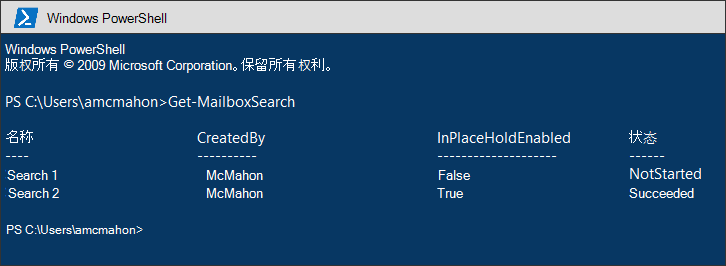
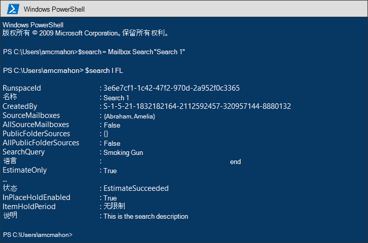
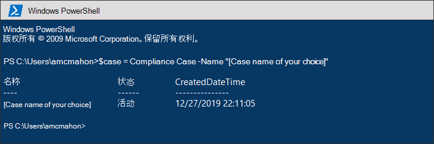
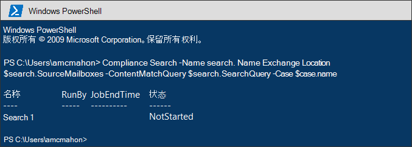

# <a name="migrate-legacy-ediscovery-searches-and-holds-to-the-microsoft-365-compliance-center"></a><span data-ttu-id="97390-102">将旧版电子数据展示搜索和保留迁移到Microsoft 365中心</span><span class="sxs-lookup"><span data-stu-id="97390-102">Migrate legacy eDiscovery searches and holds to the Microsoft 365 compliance center</span></span>

<span data-ttu-id="97390-103">Microsoft 365 合规性中心为电子数据展示的使用提供了改进的体验，包括：更高的可靠性、更好的性能以及针对电子数据展示工作流定制的许多功能，包括按重要方式组织内容的情况、审阅集以审阅内容和分析以帮助剔除数据进行审阅，例如近重复分组、电子邮件线程、主题分析和预测编码。</span><span class="sxs-lookup"><span data-stu-id="97390-103">The Microsoft 365 compliance center provides an improved experience for eDiscovery usage, including: higher reliability, better performance, and many features tailored to eDiscovery workflows including cases to organize your content by matter, review sets to review content and analytics to help cull data for review such as near-duplicate grouping, email threading, themes analysis, and predictive coding.</span></span>

<span data-ttu-id="97390-104">为了帮助客户利用新增和改进的功能，本文提供了有关如何将 In-Place 电子数据展示搜索和保留从 Exchange 管理中心迁移到 Microsoft 365 合规中心的基本指南。</span><span class="sxs-lookup"><span data-stu-id="97390-104">To help customers take advantage of the new and improved functionality, this article provides basic guidance on how to migrate In-Place eDiscovery searches and holds from the Exchange admin center to the Microsoft 365 compliance center.</span></span>

> [!NOTE]
> <span data-ttu-id="97390-105">由于存在许多不同的方案，因此本文提供了在合规性中心将搜索和保留转换到核心电子数据展示Microsoft 365指南。</span><span class="sxs-lookup"><span data-stu-id="97390-105">Because there are many different scenarios, this article provides general guidance to transition searches and holds to a core eDiscovery case in the Microsoft 365 compliance center.</span></span> <span data-ttu-id="97390-106">使用电子数据展示事例并非始终必需，但是它们通过分配权限来控制谁有权访问组织中电子数据展示事例添加了额外的安全层。</span><span class="sxs-lookup"><span data-stu-id="97390-106">Using eDiscovery cases aren't always required, but they add an extra layer of security by letting you assign permissions to control who has access to the eDiscovery cases in your organization.</span></span>

## <a name="before-you-begin"></a><span data-ttu-id="97390-107">准备工作</span><span class="sxs-lookup"><span data-stu-id="97390-107">Before you begin</span></span>

- <span data-ttu-id="97390-108">您必须是安全与合规中心内电子数据展示管理员&组的成员，以运行本文中所述的 PowerShell 命令。</span><span class="sxs-lookup"><span data-stu-id="97390-108">You have to be a member of the eDiscovery Manager role group in the Security & Compliance Center to run the PowerShell commands described in this article.</span></span> <span data-ttu-id="97390-109">还必须是管理中心发现管理角色Exchange的成员。</span><span class="sxs-lookup"><span data-stu-id="97390-109">You also have to be a member of the Discovery Management role group in the Exchange admin center.</span></span>

- <span data-ttu-id="97390-110">本文提供有关如何创建电子数据展示保留的指南。</span><span class="sxs-lookup"><span data-stu-id="97390-110">This article provides guidance on how to create an eDiscovery hold.</span></span> <span data-ttu-id="97390-111">保留策略将应用于通过异步进程的邮箱。</span><span class="sxs-lookup"><span data-stu-id="97390-111">The hold policy will be applied to mailboxes through an asynchronous process.</span></span> <span data-ttu-id="97390-112">创建电子数据展示保留时，必须同时创建 CaseHoldPolicy 和 CaseHoldRule，否则将不会创建保留，并且不会将内容位置置于保留状态。</span><span class="sxs-lookup"><span data-stu-id="97390-112">When creating an eDiscovery hold, you must create both a CaseHoldPolicy and CaseHoldRule, otherwise the hold will not be created and content locations will not be placed on hold.</span></span>

## <a name="step-1-connect-to-exchange-online-powershell-and-security--compliance-center-powershell"></a><span data-ttu-id="97390-113">步骤 1：连接 Exchange Online PowerShell 和安全&合规中心 PowerShell</span><span class="sxs-lookup"><span data-stu-id="97390-113">Step 1: Connect to Exchange Online PowerShell and Security & Compliance Center PowerShell</span></span>

<span data-ttu-id="97390-114">第一步是连接到 Exchange Online PowerShell 和安全&中心 PowerShell。</span><span class="sxs-lookup"><span data-stu-id="97390-114">The first step is to connect to Exchange Online PowerShell and Security & Compliance Center PowerShell.</span></span> <span data-ttu-id="97390-115">你可以复制以下脚本，将其粘贴到 PowerShell 窗口中，然后运行它。</span><span class="sxs-lookup"><span data-stu-id="97390-115">You can copy the following script, paste it into a PowerShell window and then run it.</span></span> <span data-ttu-id="97390-116">系统将提示您输入要连接到的组织凭据。</span><span class="sxs-lookup"><span data-stu-id="97390-116">You'll be prompted for credentials for the organization that you want to connect to.</span></span> 

```powershell
$UserCredential = Get-Credential
$sccSession = New-PSSession -ConfigurationName Microsoft.Exchange -ConnectionUri https://ps.compliance.protection.outlook.com/powershell-liveid -Credential $UserCredential -Authentication Basic -AllowRedirection
Import-PSSession $sccSession -DisableNameChecking
$exoSession = New-PSSession -ConfigurationName Microsoft.Exchange -ConnectionUri https://ps.outlook.com/powershell-liveid/ -Credential $UserCredential -Authentication Basic -AllowRedirection
Import-PSSession $exoSession -AllowClobber -DisableNameChecking
```

<span data-ttu-id="97390-117">您需要在此 PowerShell 会话中运行以下步骤中的命令。</span><span class="sxs-lookup"><span data-stu-id="97390-117">You need to run the commands in the following steps in this PowerShell session.</span></span>

## <a name="step-2-get-a-list-of-in-place-ediscovery-searches-by-using-get-mailboxsearch"></a><span data-ttu-id="97390-118">步骤 2：使用 In-Place获取电子数据展示搜索Get-MailboxSearch</span><span class="sxs-lookup"><span data-stu-id="97390-118">Step 2: Get a list of In-Place eDiscovery searches by using Get-MailboxSearch</span></span>

<span data-ttu-id="97390-119">进行身份验证后，可以通过运行 **Get-MailboxSearch** cmdlet 获取In-Place电子数据展示搜索的列表。</span><span class="sxs-lookup"><span data-stu-id="97390-119">After you've authenticated, you can get a list of In-Place eDiscovery searches by running the **Get-MailboxSearch** cmdlet.</span></span> <span data-ttu-id="97390-120">将以下命令复制并粘贴到 PowerShell 中，然后运行它。</span><span class="sxs-lookup"><span data-stu-id="97390-120">Copy and paste the following command into PowerShell and then run it.</span></span> <span data-ttu-id="97390-121">将列出搜索列表及其名称和任何保留In-Place状态。</span><span class="sxs-lookup"><span data-stu-id="97390-121">A list of searches will be listed with their names and the status of any In-Place Holds.</span></span>

```powershell
Get-MailboxSearch
```

<span data-ttu-id="97390-122">cmdlet 输出将类似于以下内容：</span><span class="sxs-lookup"><span data-stu-id="97390-122">The cmdlet output will be similar to the following:</span></span>



## <a name="step-3-get-information-about-the-in-place-ediscovery-searches-and-in-place-holds-you-want-to-migrate"></a><span data-ttu-id="97390-124">步骤 3：获取有关要In-Place电子数据展示搜索In-Place保留的信息</span><span class="sxs-lookup"><span data-stu-id="97390-124">Step 3: Get information about the In-Place eDiscovery searches and In-Place Holds you want to migrate</span></span>

<span data-ttu-id="97390-125">同样，您将使用 **Get-MailboxSearch** cmdlet，但这次是获取搜索的属性。</span><span class="sxs-lookup"><span data-stu-id="97390-125">Again you will use the **Get-MailboxSearch** cmdlet, but this time to get the properties of the search.</span></span> <span data-ttu-id="97390-126">可以将这些属性存储在变量中，供以后使用。</span><span class="sxs-lookup"><span data-stu-id="97390-126">You can store these properties in a variable for use later.</span></span> <span data-ttu-id="97390-127">以下示例将 **Get-MailboxSearch** cmdlet 的结果存储在变量中，然后显示搜索的属性。</span><span class="sxs-lookup"><span data-stu-id="97390-127">The following example stores the results of the **Get-MailboxSearch** cmdlet in a variable and then displays the properties of the search.</span></span>

```powershell
$search = Get-MailboxSearch -Identity "Search 1"
```

```powershell
$search | FL
```

<span data-ttu-id="97390-128">这两个命令的输出将类似于以下内容：</span><span class="sxs-lookup"><span data-stu-id="97390-128">The output of these two commands will be similar to the following:</span></span>



> [!NOTE]
> <span data-ttu-id="97390-130">The duration of the In-Place Hold in this example is unlimited (*ItemHoldPeriod： Unlimited*) .</span><span class="sxs-lookup"><span data-stu-id="97390-130">The duration of the In-Place Hold in this example is indefinite (*ItemHoldPeriod: Unlimited*).</span></span> <span data-ttu-id="97390-131">这通常适用于电子数据展示和法律调查方案。</span><span class="sxs-lookup"><span data-stu-id="97390-131">This is typical for eDiscovery and legal investigation scenarios.</span></span> <span data-ttu-id="97390-132">如果保留期的值不同于无限期的值，则很可能是因为保留用于保留方案中的内容。</span><span class="sxs-lookup"><span data-stu-id="97390-132">If the hold duration has is different value than indefinite, the reason is likely because the hold is being used to retain content in a retention scenario.</span></span> <span data-ttu-id="97390-133">建议使用 [New-RetentionCompliancePolicy](/powershell/module/exchange/new-retentioncompliancepolicy) 和 [New-RetentionComplianceRule](/powershell/module/exchange/new-retentioncompliancerule) 保留内容，而不是将安全 & 合规中心 PowerShell 中的电子数据展示 cmdlet 用于保留方案。</span><span class="sxs-lookup"><span data-stu-id="97390-133">Instead of using the eDiscovery cmdlets in Security & Compliance Center PowerShell for retention scenarios, we recommend that you use [New-RetentionCompliancePolicy](/powershell/module/exchange/new-retentioncompliancepolicy) and [New-RetentionComplianceRule](/powershell/module/exchange/new-retentioncompliancerule) to retain content.</span></span> <span data-ttu-id="97390-134">使用这些 cmdlet 的结果类似于使用 **New-CaseHoldPolicy** 和 **New-CaseHoldRule，** 但您可以指定保留期和保留操作，例如，在保留期到期后删除内容。</span><span class="sxs-lookup"><span data-stu-id="97390-134">The result of using these cmdlets will be similar to using **New-CaseHoldPolicy** and **New-CaseHoldRule**, but you'll able to specify a retention period and a retention action, such as deleting content after the retention period expires.</span></span> <span data-ttu-id="97390-135">此外，使用保留 cmdlet 不需要您将保留保留与电子数据展示案例关联。</span><span class="sxs-lookup"><span data-stu-id="97390-135">Also, using the retention cmdlets don't require you to associate the retention holds with an eDiscovery case.</span></span>

## <a name="step-4-create-a-case-in-the-microsoft-365-compliance-center"></a><span data-ttu-id="97390-136">步骤 4：在 Microsoft 365 合规中心创建案例</span><span class="sxs-lookup"><span data-stu-id="97390-136">Step 4: Create a case in the Microsoft 365 Compliance center</span></span>

<span data-ttu-id="97390-137">若要创建电子数据展示保留，您必须创建一个电子数据展示案例以将保留与关联。</span><span class="sxs-lookup"><span data-stu-id="97390-137">To create an eDiscovery hold, you have to create an eDiscovery case to associate the hold with.</span></span> <span data-ttu-id="97390-138">以下示例使用你选择的名称创建电子数据展示案例。</span><span class="sxs-lookup"><span data-stu-id="97390-138">The following example creates an eDiscovery case using a name of your choice.</span></span> <span data-ttu-id="97390-139">我们将新案例的属性存储在变量中，供以后使用。</span><span class="sxs-lookup"><span data-stu-id="97390-139">We will store the properties of the new case in a variable for use later.</span></span> <span data-ttu-id="97390-140">您可以在创建案例后运行 `$case | FL` 命令来查看这些属性。</span><span class="sxs-lookup"><span data-stu-id="97390-140">You can view those properties by running the `$case | FL` command after you create the case.</span></span>

```powershell
$case = New-ComplianceCase -Name "[Case name of your choice]"
```


## <a name="step-5-create-the-ediscovery-hold"></a><span data-ttu-id="97390-142">步骤 5：创建电子数据展示保留</span><span class="sxs-lookup"><span data-stu-id="97390-142">Step 5: Create the eDiscovery hold</span></span>

<span data-ttu-id="97390-143">创建案例后，可以创建保留并将其与在上一步骤中创建的案例关联。</span><span class="sxs-lookup"><span data-stu-id="97390-143">After the case is created, you can create the hold and associate it with the case that you created in the previous step.</span></span> <span data-ttu-id="97390-144">必须记住，必须同时创建案例保留策略和案例保留规则。</span><span class="sxs-lookup"><span data-stu-id="97390-144">It's important to remember that you must create both a case hold policy and a case hold rule.</span></span> <span data-ttu-id="97390-145">如果在创建案例保留策略后未创建案例保留规则，将不会创建电子数据展示保留，并且不会将任何内容置于保留状态。</span><span class="sxs-lookup"><span data-stu-id="97390-145">If the case hold rule isn't created after you created case hold policy, the eDiscovery hold will not be created and any content won't be placed on hold.</span></span>

<span data-ttu-id="97390-146">运行以下命令以重新创建要迁移的电子数据展示保留。</span><span class="sxs-lookup"><span data-stu-id="97390-146">Run the following commands to re-create the eDiscovery hold that you want to migrate.</span></span> <span data-ttu-id="97390-147">这些示例使用要迁移In-Place步骤 3 中保留的属性。</span><span class="sxs-lookup"><span data-stu-id="97390-147">These examples use the properties from In-Place Hold from Step 3 that you want to migrate.</span></span> <span data-ttu-id="97390-148">第一个命令创建一个新的案例保留策略，将属性保存到变量中。</span><span class="sxs-lookup"><span data-stu-id="97390-148">The first command creates a new case hold policy and saves the properties to a variable.</span></span> <span data-ttu-id="97390-149">第二个命令创建相应的案例保留规则。</span><span class="sxs-lookup"><span data-stu-id="97390-149">The second command creates the corresponding case hold rule.</span></span>

```powershell
$policy = New-CaseHoldPolicy -Name $search.Name -Case $case.Identity -ExchangeLocation $search.SourceMailboxes
```

```powershell
New-CaseHoldRule -Name $search.Name -Policy $policy.Identity
```


## <a name="step-6-verify-the-ediscovery-hold"></a><span data-ttu-id="97390-151">步骤 6：验证电子数据展示保留</span><span class="sxs-lookup"><span data-stu-id="97390-151">Step 6: Verify the eDiscovery hold</span></span>

<span data-ttu-id="97390-152">若要确保创建保留时没有问题，请务必检查保留分配状态是否成功。</span><span class="sxs-lookup"><span data-stu-id="97390-152">To make sure there were no issues in creating the hold, it's good to check that the hold distribution status is successful.</span></span> <span data-ttu-id="97390-153">分发意味着保留已应用于上一步 *中 ExchangeLocation* 参数中指定的所有内容位置。</span><span class="sxs-lookup"><span data-stu-id="97390-153">Distribution means that the hold has been applied to all the content locations specified in the *ExchangeLocation* parameter in the previous step.</span></span> <span data-ttu-id="97390-154">为此，可以运行 **Get-CaseHoldPolicy** cmdlet。</span><span class="sxs-lookup"><span data-stu-id="97390-154">To do this, you can run the **Get-CaseHoldPolicy** cmdlet.</span></span> <span data-ttu-id="97390-155">由于保存到$policy步骤中创建的变量的属性不会自动更新到变量中，因此您需要重新运行 cmdlet 来验证分发是否成功。</span><span class="sxs-lookup"><span data-stu-id="97390-155">Because the properties saved to the *$policy* variable that you created in the previous step aren't automatically updated in the variable, you need to rerun the cmdlet to verify that distribution is successful.</span></span> <span data-ttu-id="97390-156">可能需要 5 分钟到 24 小时才能成功分发案例保留策略。</span><span class="sxs-lookup"><span data-stu-id="97390-156">It can take between 5 minutes and 24 hours for case hold policies to be successfully distributed.</span></span>

<span data-ttu-id="97390-157">运行以下命令以验证电子数据展示保留已成功分发。</span><span class="sxs-lookup"><span data-stu-id="97390-157">Run the following command to verify that the eDiscovery hold has been successfully distributed.</span></span>

```powershell
Get-CaseHoldPolicy -Identity $policy.Identity | Select name, DistributionStatus
```

<span data-ttu-id="97390-158">*DistributionStatus* 属性的值 **Success** 指示已成功将保留置于内容位置。</span><span class="sxs-lookup"><span data-stu-id="97390-158">The value of **Success** for the *DistributionStatus* property indicates the hold was successfully placed on the content locations.</span></span> <span data-ttu-id="97390-159">如果分发尚未完成，则显示 **Pending** 值。</span><span class="sxs-lookup"><span data-stu-id="97390-159">If the distribution is not yet complete, a value of **Pending** is displayed.</span></span>


## <a name="step-7-create-the-search"></a><span data-ttu-id="97390-161">步骤 7：创建搜索</span><span class="sxs-lookup"><span data-stu-id="97390-161">Step 7: Create the search</span></span>

<span data-ttu-id="97390-162">最后一步是重新创建在步骤 3 中标识的搜索并将其与案例关联。</span><span class="sxs-lookup"><span data-stu-id="97390-162">The last step is to re-create the search that you identified in Step 3 and associate it with the case.</span></span> <span data-ttu-id="97390-163">创建搜索后，可以使用 **Start-ComplianceSearch** cmdlet 运行搜索，或稍后运行。</span><span class="sxs-lookup"><span data-stu-id="97390-163">After you create the search, you can run it by using the **Start-ComplianceSearch** cmdlet or run at a later time.</span></span>

```powershell
New-ComplianceSearch -Name $search.Name -ExchangeLocation $search.SourceMailboxes -ContentMatchQuery $search.SearchQuery -Case $case.name
```



## <a name="step-8-verify-the-case-hold-and-search-in-the-microsoft-365-compliance-center"></a><span data-ttu-id="97390-165">步骤 8：在合规性中心验证Microsoft 365保留和搜索</span><span class="sxs-lookup"><span data-stu-id="97390-165">Step 8: Verify the case, hold, and search in the Microsoft 365 compliance center</span></span>

<span data-ttu-id="97390-166">若要确保所有设置正确，请转到 位于 的 Microsoft 365 合规中心，然后单击" [https://compliance.microsoft.com](https://compliance.microsoft.com) **电子数据展示>核心"。**</span><span class="sxs-lookup"><span data-stu-id="97390-166">To make sure that everything is set up correctly, go to the Microsoft 365 compliance center at [https://compliance.microsoft.com](https://compliance.microsoft.com), and click **eDiscovery > Core**.</span></span>


<span data-ttu-id="97390-168">在步骤 3 中创建的案例在核心电子 **数据** 展示页面上列出。</span><span class="sxs-lookup"><span data-stu-id="97390-168">The case that you created in Step 3 is listed on the **Core eDiscovery** page.</span></span> <span data-ttu-id="97390-169">打开案例，然后注意你在"保留"选项卡上列出的步骤 4 **中创建的** 保留。您可以选择保留以查看飞出页面上的详细信息，包括应用保留的邮箱数和分发状态。</span><span class="sxs-lookup"><span data-stu-id="97390-169">Open the case and then notice the hold that you created in Step 4 in listed on the **Hold** tab. You can select the hold to see details on the flyout page, including the number of mailboxes the hold is applied to and the distribution status.</span></span>


<span data-ttu-id="97390-171">在步骤 7 中创建的搜索在案例的" **搜索** "选项卡上列出。</span><span class="sxs-lookup"><span data-stu-id="97390-171">The search that you created in Step 7 is listed on the **Searches** tab of the case.</span></span>


<span data-ttu-id="97390-173">如果你迁移In-Place电子数据展示搜索，但不将其与电子数据展示案例关联，它将在 Microsoft 365 合规中心的内容搜索页面上列出。</span><span class="sxs-lookup"><span data-stu-id="97390-173">If you migrate an In-Place eDiscovery search but don't associate it with an eDiscovery case, it will be listed on the Content search page in the Microsoft 365 compliance center.</span></span>

## <a name="more-information"></a><span data-ttu-id="97390-174">更多信息</span><span class="sxs-lookup"><span data-stu-id="97390-174">More information</span></span>

- <span data-ttu-id="97390-175">有关管理中心In-Place电子数据&保留Exchange，请参阅：</span><span class="sxs-lookup"><span data-stu-id="97390-175">For more information about In-Place eDiscovery & Holds in the Exchange admin center, see:</span></span>
  
  - [<span data-ttu-id="97390-176">就地电子数据展示</span><span class="sxs-lookup"><span data-stu-id="97390-176">In-Place eDiscovery</span></span>](/exchange/security-and-compliance/in-place-ediscovery/in-place-ediscovery)

  - [<span data-ttu-id="97390-177">就地保留和诉讼保留</span><span class="sxs-lookup"><span data-stu-id="97390-177">In-Place Hold and Litigation Hold</span></span>](/exchange/security-and-compliance/in-place-and-litigation-holds)

- <span data-ttu-id="97390-178">有关本文中使用的 PowerShell cmdlet 详细信息，请参阅：</span><span class="sxs-lookup"><span data-stu-id="97390-178">For more information about the PowerShell cmdlets used in the article, see:</span></span>

  - [<span data-ttu-id="97390-179">Get-MailboxSearch</span><span class="sxs-lookup"><span data-stu-id="97390-179">Get-MailboxSearch</span></span>](/powershell/module/exchange/get-mailboxsearch)
  
  - [<span data-ttu-id="97390-180">New-ComplianceCase</span><span class="sxs-lookup"><span data-stu-id="97390-180">New-ComplianceCase</span></span>](/powershell/module/exchange/new-compliancecase)

  - [<span data-ttu-id="97390-181">New-CaseHoldPolicy</span><span class="sxs-lookup"><span data-stu-id="97390-181">New-CaseHoldPolicy</span></span>](/powershell/module/exchange/new-caseholdpolicy)
  
  - [<span data-ttu-id="97390-182">New-CaseHoldRule</span><span class="sxs-lookup"><span data-stu-id="97390-182">New-CaseHoldRule</span></span>](/powershell/module/exchange/new-caseholdrule)

  - [<span data-ttu-id="97390-183">Get-CaseHoldPolicy</span><span class="sxs-lookup"><span data-stu-id="97390-183">Get-CaseHoldPolicy</span></span>](/powershell/module/exchange/get-caseholdpolicy)
  
  - [<span data-ttu-id="97390-184">New-ComplianceSearch</span><span class="sxs-lookup"><span data-stu-id="97390-184">New-ComplianceSearch</span></span>](/powershell/module/exchange/new-compliancesearch)

  - [<span data-ttu-id="97390-185">Start-ComplianceSearch</span><span class="sxs-lookup"><span data-stu-id="97390-185">Start-ComplianceSearch</span></span>](/powershell/module/exchange/start-compliancesearch)

- <span data-ttu-id="97390-186">有关合规性中心Microsoft 365，请参阅合规性Microsoft 365[概述](microsoft-365-compliance-center.md)。</span><span class="sxs-lookup"><span data-stu-id="97390-186">For more information about the Microsoft 365 compliance center, see [Overview of the Microsoft 365 compliance center](microsoft-365-compliance-center.md).</span></span>