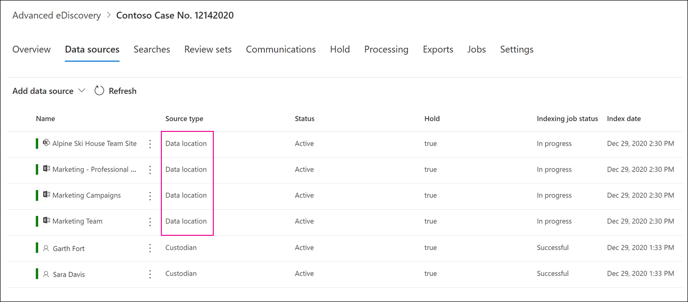

# 将非安全数据源添加到高级电子数据展示案例

在高级电子数据展示情况下，它并不总是满足将 Microsoft 365 数据源与事例中的保管人相关联的需求。 但你可能需要将该数据与案例关联，以便可以搜索数据、将其添加到审阅集，并分析和审阅数据。 高级电子数据展示中的功能称为非安全数据源，允许您向案例添加数据，而无需将其与保管人关联。 它还将相同的高级电子数据展示功能应用于可用于与保管人关联的数据的非监管数据。 可以应用于非数据数据的两个最有用的内容是将其置于保留状态，然后使用高级 [索引处理它](indexing-custodian-data.md)。

## 添加非托管数据源

按照以下步骤在高级电子数据展示案例中添加和管理非安全数据源。

1. 在 **高级电子数据展示** 主页上，单击要将数据添加到的大小写。

2. 单击 **"数据源"** 选项卡，然后单击 **"添加数据源**  >  **"添加数据位置**。

3. 在 **"新建非安全** 数据位置"飞出页上，选择要添加到案例的数据源。 您可以通过展开 **SharePoint** 或 **Exchange** 部分，然后单击"编辑"来添加多个邮箱和 **网站**。

   

   - **SharePoint** - 单击 **"编辑** "添加网站。 在列表中选择网站，或者您可以通过在搜索栏中键入网站的 URL 来搜索网站。 选择要添加为非保管人数据源的网站，然后单击"添加 **"。**

   - **Exchange** - 单击 **"编辑** "添加邮箱。 在邮箱或通讯 (搜索框中键入至少) 个字符的名称或别名。 选择要添加为非保管人数据源的邮箱，然后单击"添加 **"。**

   > [!NOTE]
   > 可以使用 **SharePoint** 和 **Exchange** 部分将与团队或 Yammer 组关联的网站和邮箱添加为非计划数据源。 您必须单独添加与团队或 Yammer 组关联的邮箱和网站。

4. 添加非安全数据源后，可以选择是否保留这些位置。 选中或取消选中数据源旁边的"保留"复选框以将其保留。

5. Click **Add** at the bottom of the **New non-ial data locations** flyout page to add the data sources to the case.

   您添加的每个非安全数据源都列在"数据源 **"页上** 。 非当前数据源由"源类型"列中 **的数据位置****值** 标识。

   

向案例添加非安全数据源后，将创建一个名为 *"重新* 索引非时间数据索引"的作业，并显示在案例的"作业"选项卡上。 创建作业后，将启动高级索引过程，并重新编制数据源索引。

## 管理非托管数据源的保留

将非托管数据源放在保留状态后，将自动创建包含案例的非检测数据源的保留策略。 当您将其他非安全数据源放在保留状态时，它们将被添加到此保留策略中。

1. 打开高级电子数据展示案例并选择"保留 **"** 选项卡。

2. 单击 **NCDSHold-， \<GUID\>** 其中 GUID 值对大小写是唯一的。

   该飞出页显示有关非托管数据源的信息和统计信息。

   

3. 单击 **"** 编辑保留"可查看置于保留状态的非托管数据源并执行以下管理任务：

   - 在 **"位置"** 页上，可以通过从保留中删除非托管数据源来释放该数据源。 释放数据源不会从案例中删除非安全数据源。 它仅删除对数据源的保留。

   - 在 **"查询** "页上，可以编辑保留以创建应用于所有非查询数据源的基于查询的保留。
