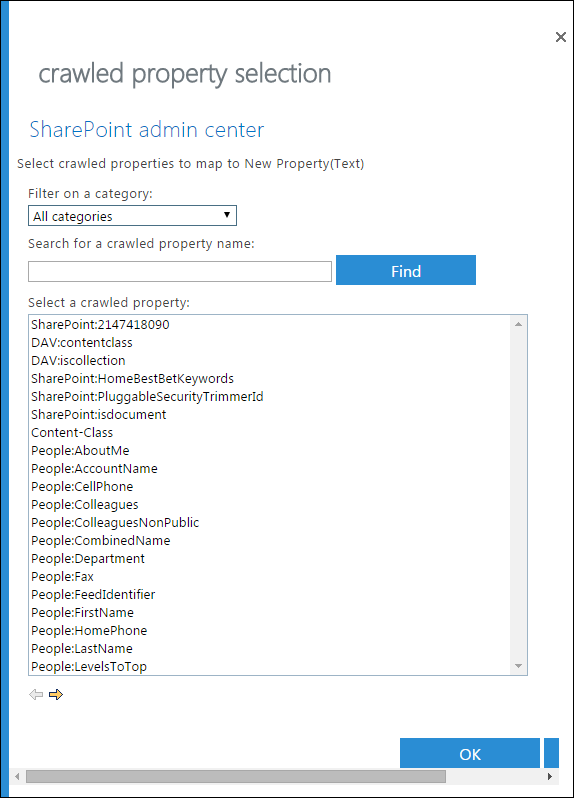

# <a name="create-a-dlp-policy-to-protect-documents-with-fci-or-other-properties"></a>创建 DLP 策略来保护具有 FCI 或其他属性的文档

Microsoft 365 DLP 策略 (数据丢失) 可以使用分类属性或项目属性来标识敏感项目。 例如，可以使用：

- Windows服务器文件分类基础结构 (FCI) 属性
- SharePoint文档属性
- 第三方系统文档属性


例如，您的组织可能使用 Windows Server FCI 来标识具有个人数据（如社会保险号）的项目，然后根据文档中找到的个人数据的类型和发生次数，将"个人身份信息"属性设置为"高、中等、**低**、公开"或"非 **PII"，** 对文档进行分类。 

在Microsoft 365中，您可以创建一个 DLP 策略，用于标识将该属性设置为特定值（如 **High** 和 **Medium）** 的文档，然后执行阻止访问这些文件等操作。 如果将属性设置为“低”，则同一个策略可以使用其他规则来执行不同的操作，如发送电子邮件通知。 这样，DLP 与 Windows Server FCI 集成，并可帮助保护上载Office文档或从基于服务器Microsoft 365 Windows共享的文档。

DLP 策略只需查找特定的属性名称/值对。 可以使用任何文档属性，只要该属性具有 SharePoint 搜索的相应托管属性。 例如，SharePoint 网站集可能使用名为“行程报告”的内容类型，包含名为“客户”的必填字段。 只要有人创建行程报告，就必须输入客户名称。 此属性名称/值对也可在 DLP 策略中使用，例如，如果您希望在"客户"字段包含 **Contoso** 时阻止来宾访问文档的规则。

如果要将 DLP 策略应用于具有特定标签Microsoft 365的内容，则不应按照此处的步骤操作。 相反，了解如何 [使用保留标签作为 DLP 策略中的条件](data-loss-prevention-policies.md#using-a-retention-label-as-a-condition-in-a-dlp-policy)。

## <a name="before-you-create-the-dlp-policy"></a>在创建 DLP 策略之前

您需要在 SharePoint 管理中心中创建托管属性，才能在 DLP 策略中使用 Windows Server FCI 属性或其他属性。 以下是原因。

示例

> [!NOTE]
> 在使用条件创建 DLP 规则时，请确保使用托管属性名称而不是已爬网属性 `ContentPropertyContainsWords` 名称。

这一点很重要，因为 DLP 使用搜索爬网程序来标识和分类您网站的敏感信息，然后将该敏感信息存储在搜索索引的安全部分。 当您将文档上载到 Office 365 时，SharePoint 会自动创建基于文档属性的已爬网属性。 但是，要在 DLP 策略中使用 FCI 或其他属性，该已爬网属性需要映射到托管属性，以便将包含该属性的内容保留在索引中。

有关搜索和托管属性详细信息，请参阅管理[SharePoint Online 中的搜索架构](/sharepoint/manage-search-schema)。

### <a name="step-1-upload-a-document-with-the-needed-property-to-office-365"></a>步骤 1：将包含所需属性的文档上载到 Office 365

首先需要上载包含要在您的 DLP 策略中引用的属性的文档。 Microsoft 365将检测属性，并自动从该属性创建已爬网属性。 下一步，创建托管属性，然后将托管属性映射到此已爬网属性。

### <a name="step-2-create-a-managed-property"></a>步骤 2：创建托管属性

1. 登录 Microsoft 365 管理中心。

2. 在左侧导航栏中，选择"管理 **中心** \> **SharePoint"。** You're now in the SharePoint admin center.

3. 在左侧导航栏中，在"**搜索管理"** \> 页上选择"搜索 **""** \> **管理搜索架构"。**

   

4. 在" **托管属性"** 页上的 \> **"新建托管属性"上**。

   

5. 输入属性的名称和说明。此名称将显示在您的 DLP 策略中。

6. 对于“类型”，选择“文本”。

7. 在“主要特征”下，选择“可查询”和“可检索”。

8. 在 **"到已爬网属性的映射"** \> **下，添加映射**。

9. 在"**已爬网属性** 选择"对话框中，查找并选择与 Windows Server FCI 属性或将在 DLP 策略 OK 中使用的其他属性相对应的已爬网 \> \> **属性**。

   

10. 在页面底部确定 \> 。

## <a name="create-a-dlp-policy-that-uses-an-fci-property-or-other-property"></a>创建使用 FCI 属性或其他属性的 DLP 策略

本示例中，组织在其基于服务器Windows使用 FCI;具体来说，他们使用的是名为"个人身份信息"的 FCI 分类属性，其中可能的值为 **High、Moderate、Low、Public** 和 Not **PII。**    现在，他们希望在 OFFICE 365 中的 DLP 策略中使用其现有 FCI Office 365。

首先，它们按照上述步骤在 SharePoint Online 中创建托管属性，该属性映射到从 FCI 属性自动创建的已爬网属性。

接下来，它们使用两个规则创建 DLP 策略，这两个规则都使用条件 **"文档属性包含以下任一值"：**

- **FCI PII 内容 - 高、中等** 如果 FCI 分类属性"个人身份信息"等于"高"或"中等"，并且文档与组织外部人员共享，则第一个规则将限制对文档的访问。 

- **FCI PII 内容 - 低** 如果 FCI 分类属性"个人身份信息"等于 **"** 低"，并且文档与组织外部人员共享，则第二个规则会向文档所有者发送通知。

### <a name="create-the-dlp-policy-by-using-powershell"></a>使用 PowerShell 创建 DLP 策略

条件 **"文档** 属性包含这些值中的任意值"暂时在安全与合规中心的 UI 中不可用，但您仍可以使用 &amp; PowerShell 使用此条件。 您可以使用 cmdlet 处理 DLP 策略，并使用 cmdlet 和 参数添加条件  `New\Set\Get-DlpCompliancePolicy`  `New\Set\Get-DlpComplianceRule` 文档属性包含这些值  `ContentPropertyContainsWords` **中的任意值**。

有关这些 cmdlet 详细信息，请参阅[安全 &amp; 与合规中心 cmdlet。](/powershell/exchange/exchange-online-powershell)

1. [连接远程 &amp; PowerShell 访问安全与合规中心](/powershell/exchange/connect-to-scc-powershell)

2. 使用 创建策略  `New-DlpCompliancePolicy` 。

此 PowerShell 创建适用于所有位置的 DLP 策略。

   ```powershell
   New-DlpCompliancePolicy -Name FCI_PII_policy -ExchangeLocation All -SharePointLocation All -OneDriveLocation All -Mode Enable
   ```

3. 使用 创建上述两个规则，其中一个规则用于"低"值，另一个规则用于"高"和"中等" `New-DlpComplianceRule` 值。   

   下面是创建这两个规则的 PowerShell 示例。 属性名/值对用引号括起来，而属性名可以指定用逗号分隔的多个值，中间没有空格，如  `"<Property1>:<Value1>,<Value2>","<Property2>:<Value3>,<Value4>"....`

   ```powershell
   New-DlpComplianceRule -Name FCI_PII_content-High,Moderate -Policy FCI_PII_policy -AccessScope NotInOrganization -BlockAccess $true -ContentPropertyContainsWords "Personally Identifiable Information:High,Moderate" -Disabled $falseNew-DlpComplianceRule -Name FCI_PII_content-Low -Policy FCI_PII_policy -AccessScope NotInOrganization -BlockAccess $false -ContentPropertyContainsWords "Personally Identifiable Information:Low" -Disabled $false -NotifyUser Owner
   ```

   Windows服务器 FCI 包括许多内置属性，包括此示例 **中使用的** 个人身份信息。 每个属性的可能值对于每个组织可能不同。 此处 **使用的** **High、Moderate** 和 **Low** 值只是一个示例。 对于组织，可以在基于Windows服务器的文件服务器上查看服务器资源管理器中的 Windows Server FCI 分类属性及其可能值。 有关详细信息，请参阅创建 [分类属性](/previous-versions/windows/it-pro/windows-server-2008-R2-and-2008/dd759215(v=ws.11))。

完成后，您的策略应具有两个新规则，这两个规则都使用 **Document 属性包含这些值中的任意一个** 条件。 此条件不会显示在 UI 中，但将显示其他条件、操作和设置。

一个规则阻止访问其中“个人身份信息”属性等于“高”或“中等”的内容。 第二个规则会发送有关“个人身份信息”属性等于“低”的内容的通知。


## <a name="after-you-create-the-dlp-policy"></a>创建 DLP 策略之后

执行前面部分中的步骤将创建一个 DLP 策略，该策略将快速检测具有该属性的内容，但只有在该内容是新上载的 (以便对内容编制索引) 时，或者如果该内容是旧内容但刚刚编辑过 (以便对内容重新编制索引) 。

若要在任意位置检测包含该属性的内容，您可能需要手动请求对您的库、网站或网站集重新编制索引，以便 DLP 策略识别包含该属性的所有内容。在 SharePoint Online 中，内容基于已定义的爬网计划进行自动爬网。爬网程序选取自上次爬网以来已更改的内容，并更新索引。如果您需要在下一次计划的爬网之前，让您的 DLP 策略保护内容，您可以执行下列步骤。

> [!CAUTION]
> 重新编制网站的索引可能会导致搜索系统上的负荷大量增加。 除非方案绝对需要，否则不要重新编制网站的索引。

有关详细信息，请参阅[Manually request crawling and re-indexing of a site, a library or a list](/sharepoint/crawl-site-content)（手动请求对网站、库或列表进行爬网和重新编制索引）。

### <a name="reindex-a-site-optional"></a>为网站重新索引 (可选) 

1. On the site， choose **设置** (gear icon in upper right) \> **Site 设置**.

2. 在 **"搜索"** 下，**选择"搜索和脱机可用性** \> **重新索引网站"。**

## <a name="more-information"></a>更多信息

- [了解终结点数据丢失防护](dlp-learn-about-dlp.md)

- [从模板创建 DLP 策略](create-a-dlp-policy-from-a-template.md)

- [发送通知，并显示 DLP 策略的策略提示](use-notifications-and-policy-tips.md)

- [DLP 策略模板包含的内容](what-the-dlp-policy-templates-include.md)

- [敏感信息类型属性定义](sensitive-information-type-entity-definitions.md)