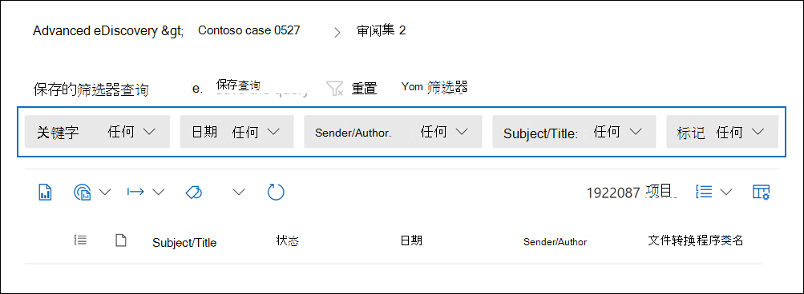
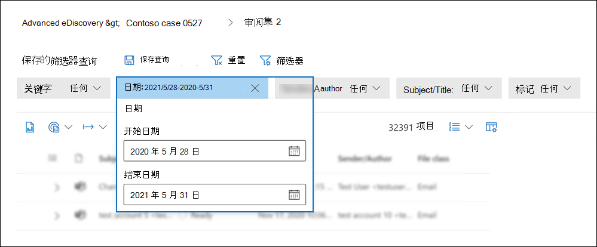
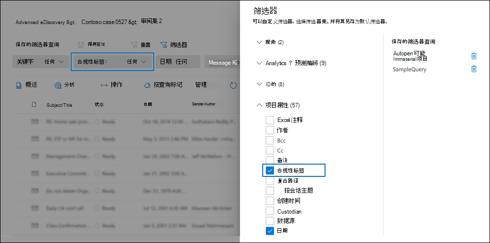
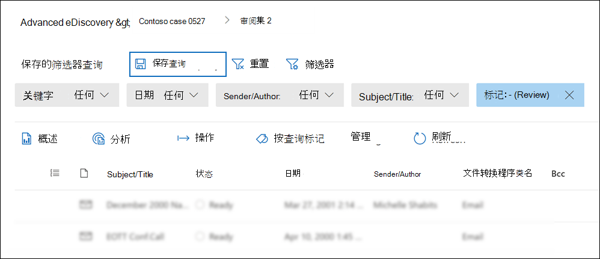
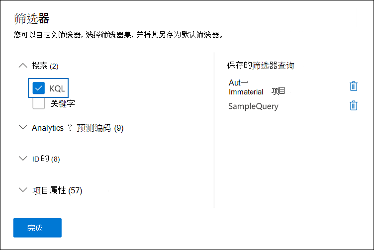
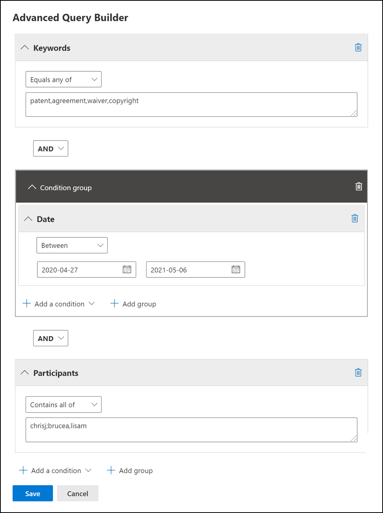

# 查询和筛选审阅集内的内容Query and filter content in a review set

在大多数情况下，深入探究审阅集内的内容并组织该内容以促进更高效的审阅将非常有用。In most cases, it will be useful to dig deeper into the content in a review set and organize it to facilitate a more efficient review. 在审阅集中使用筛选器和查询可帮助您重点关注满足审阅条件的文档的子集。Using filters and queries in a review set helps you focus on a subset of documents that meet the criteria of your review.

## 默认筛选器Default filters

在审阅集内，有五个默认筛选器预加载到审阅集：In a review set, there are five default filters that are pre-loaded in the review set:

- 关键字Keywords
- 日期Date
- 发件人/作者Sender/Author
- 主题/标题Subject/Title
- 标记Tags

单击每个筛选器以展开它并分配一个值。Click each filter to expand it and assign a value. 单击筛选器外部以自动将筛选器应用于审阅集。Click outside the filter to automatically apply the filter to the review set. 以下屏幕截图显示了配置为显示日期范围内的文档的日期筛选器。The following screenshot shows the Date filter configured to show documents within a date range.

## 添加或删除筛选器Add or remove filters

若要添加或删除为审阅集显示的筛选器，请选择"筛选器"以打开显示在飞出页上的筛选器面板。To add or remove filters that are displayed for the review set, select **Filters** to open the filter panel, which is displayed on a flyout page. 

可用筛选器分为四个部分：The available filters are organized in four sections:

- **搜索**：提供不同搜索功能的筛选器。**Search**: Filters that provide different search capabilities.

- **分析&** 编码：运行文档分析作业或使用预测编码模型时生成& **添加到** 文档的属性筛选器。**Analytics & predictive coding**: Filters for properties generated and added to documents when you run the **Document & email analytic** job or use predictive coding models.

- **ID：** 用于筛选文档的所有 ID 属性。**IDs**: Filters for all ID properties of documents.

- **项目属性**：文档属性的筛选器。**Item properties**: Filters for document properties. 

展开每个部分，选择或取消选择筛选器以在筛选器集中添加或删除它们。Expand each section and select or deselect filters to add or remove them in the filter set. 添加筛选器时，筛选器集会显示该筛选器。When you add a filter, it's displayed in the filter set. 

> [!NOTE]
> 展开筛选器面板中的节时，您将注意到已选择默认筛选器类型。When you expand a section in the filter panel, you'll notice that the default filter types are selected. 您可以保持选中状态或取消选择它们，然后从筛选器集中删除它们。You can keep these selected or deselect them and removed them from the filter set. 

## 筛选器类型Filter types

审阅集内每个可搜索字段都有一个对应的筛选器，可用于基于特定字段筛选项目。Every searchable field in a review set has a corresponding filter that you can use for filter items based on a specific field.

筛选器有多种类型：There are multiple types of filters:

- **Freetext：** 将自由文本筛选器应用于文本字段，如"Subject"。**Freetext**: A freetext filter is applied to text fields such as "Subject". 可以通过用逗号分隔多个搜索词来列出这些搜索词。You can list multiple search terms by separating them with a comma.

- **Date**：日期筛选器用于"上次修改日期"等日期字段。**Date**: A date filter is used for date fields such as "Last modified date".

- **搜索选项**：搜索选项筛选器提供一个可能值列表 (每个值都显示一个复选框，你可以为审阅中的特定字段) 复选框。**Search options**: A search options filter provides a list of possible values (each value is displayed with a checkbox that you can select) for particular fields in the review. 此筛选器用于审阅集可能值有限数量的字段，例如"发件人"。This filter is used for fields, such as "Sender", where there is a finite number of possible values in the review set.

- **关键字**：关键字条件是可用于搜索词的 freetext 条件的特定实例。**Keyword**: A keyword condition is a specific instance of freetext condition that you can use to search for terms. 您还可以在此类型的筛选器中使用类似 KQL 的查询语言。You can also use KQL-like query language in this type of filter. 有关详细信息，请参阅本主题中的查询语言和高级查询生成器部分。For more information, see the Query language and Advanced query builder sections in this topic.

## 包含和排除筛选器关系Include and exclude filter relationships

您可以选择更改特定筛选器的包含和排除关系。You have the option to change the include and exclude relationship for a particular filter. 例如，在"标记"筛选器中，可以通过在下拉列表筛选器中选择"等于 **无** "来排除用特定标记标记的项目。For example, in the Tag filter, you can exclude items that are tagged with a particular tag by selecting **Equals none of** in the dropdown filter. 

## 将筛选器另存为查询Save filters as queries

对筛选器感到满意后，可以将筛选器组合另存为筛选器查询。After you are satisfied with your filters, you can save the filter combination as a filter query. 这样，你可以在将来的审阅会话中应用筛选器。This lets you apply the filter in the future review sessions.

若要保存筛选器，请选择 **"保存查询并** 命名它"。To save a filter, select **Save the query** and name it. 您或其他审阅者可以通过选择"保存的筛选器查询"下拉列表并选择要应用于审阅集文档的筛选器查询来运行以前保存的筛选器查询。You or other reviewers can run previously saved filter queries by selecting the **Saved filter queries** dropdown and selecting a filter query to apply to review set documents. 

若要删除筛选器查询，请打开筛选面板并选择查询旁边的回收站图标。To delete a filter query, open the filter panel and select the trashcan icon next to the query.

## 查询语言Query language

除了使用筛选器之外，您还可以使用关键字筛选器中的 KQL 类似查询语言来构建审阅集搜索查询。In addition to using filters, you can also use a KQL-like query language in the Keywords filter to build your review set search query. 审阅集查询的查询语言支持标准布尔运算符，如AND、OR、NOT和 **NEAR**。The query language for review set queries supports standard Boolean operators, such as **AND**, **OR**, **NOT**, and **NEAR**. 它还支持单字符通配符 (？) 和多字符通配符 (\*) 。It also supports a single-character wildcard (?) and a multi-character wildcard (\*).

## 高级查询生成器Advanced query builder

您还可以生成更高级的查询来搜索审阅集内的文档。You can also build more advanced queries to search for documents in a review set.

1. 打开筛选面板，选择" **筛选器"，** 然后展开" **搜索"** 部分。Open the filter panel, select **Filters**, and expand the **Search** section.

  

2. 选择 **KQL 筛选器**，然后单击"**打开查询生成器"。**Select the **KQL** filter and click **Open query builder**.

   在此面板中，您可以使用查询生成器创建复杂的 KQL 查询。In this panel, you can create complex KQL queries by using the query builder. 可以添加条件或添加条件组，这些条件组由 AND 或 **OR** 关系在逻辑上 **连接的多个条件** 组成。You can add conditions or add condition groups that are made up of multiple conditions that are logically connected by **AND** or **OR** relationships.

   
