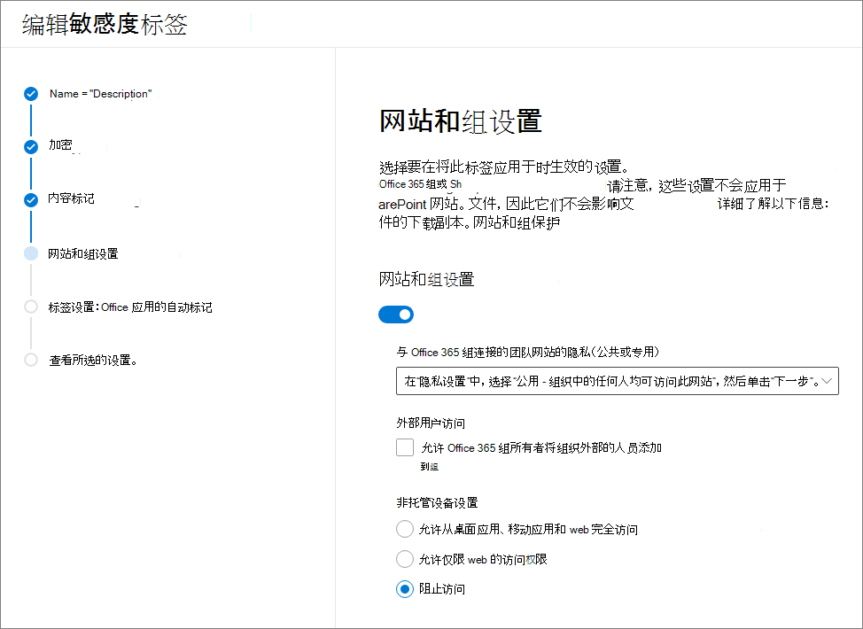

# <a name="use-sensitivity-labels-to-protect-content-in-microsoft-teams-microsoft-365-groups-and-sharepoint-sites-public-preview"></a>使用敏感度标签保护 Microsoft Teams 网站、Microsoft 365 组和 SharePoint 网站中的内容（公共预览版）

>*[Microsoft 365 安全性与合规性许可指南](https://aka.ms/ComplianceSD)。*

现在，在 [Microsoft 365 合规中心](https://protection.office.com/)内创建敏感度标签时，可以将它们应用于以下容器：Microsoft Teams 网站、Microsoft 365 组（以前称为 Office 365 组）和 SharePoint 网站。 使用以下标签设置来帮助保护这些容器中的内容：

- 与 Microsoft 365 组连接的团队网站的隐私（公共或专用）
- 外部用户访问
- 非托管设备的访问 

如果你将此标签应用于受支持的容器，此标签会自动向连接的网站或组应用所配置的选项。 

但是，这些容器中的内容不会为设置继承标签，例如标签名称、视觉标记或加密。 这样，用户可以标记 SharePoint 网站或团队网站中的文档（请参阅[为 SharePoint 和 OneDrive 中的 Office 文件启用敏感度标签](sensitivity-labels-sharepoint-onedrive-files.md)）。

## <a name="about-the-public-preview-for-microsoft-teams-microsoft-365-groups-and-sharepoint-sites"></a>关于 Microsoft Teams、Microsoft 365 组和 SharePoint 网站的公共预览版

适用于 Microsoft Teams 网站、Microsoft 365 组和 SharePoint 网站的敏感度标签正在逐步向租户推出，在最终发布之前可能会有所改变。 此公共预览版不适用于 Office 365 内容交付网络 (CDN)。

在你为新设置启用此预览版和配置敏感度标签之前，用户可在其应用中查看和应用敏感度标签。 例如，在 Word 中：


启用并配置此预览版后，用户还可查看敏感度标签并将其应用于 Microsoft Teams、Microsoft 365 组和 SharePoint 网站。 例如，在从 SharePoint 创建新的团队网站时：


## <a name="enable-this-preview-and-synchronize-labels"></a>启用此预览版并同步标签

1. 由于此功能使用 Azure AD 功能，因此请按照以下 Azure AD 文档中的说明来启用预览版：[在 Azure Active Directory 中向 Microsoft 365 组分配敏感度标签（预览）](https://docs.microsoft.com/azure/active-directory/users-groups-roles/groups-assign-sensitivity-labels)。

2. 立即[连接到 Office 365 安全与合规中心 PowerShell](/powershell/exchange/office-365-scc/connect-to-scc-powershell/connect-to-scc-powershell)。 
    
    例如，在以管理员身份运行的 PowerShell 会话中，使用全局管理员帐户登录：
    
    ```powershell
    Set-ExecutionPolicy RemoteSigned
    $UserCredential = Get-Credential
    $Session = New-PSSession -ConfigurationName Microsoft.Exchange -ConnectionUri https://ps.compliance.protection.outlook.com/powershell-liveid/ -Credential $UserCredential -Authentication Basic -AllowRedirection
    Import-PSSession $Session -DisableNameChecking
    ```

3. 运行以下命令将敏感度标签同步到 Azure AD，使其可与 Microsoft 365 组一起使用：
    
    ```powershell
    Execute-AzureAdLabelSync
    ```

## <a name="how-to-configure-site-and-group-settings-when-you-create-or-edit-sensitivity-labels"></a>如何创建或编辑敏感度标签时设置网站和组设置

你现已可创建或编辑要提供给网站和组使用敏感度标签。 启用预览版后，敏感度标签向导中会显示一个新页面，即“**网站和组设置**”

如果在创建或编辑敏感度标签方面需要帮助，请查看[创建和配置敏感度标签](create-sensitivity-labels.md#create-and-configure-sensitivity-labels)中的说明。

在这个新的“**网站和组设置**”页面中，配置以下设置：

- **与 Office 365 组连接的团队网站的隐私**：默认设置“无 - 让用户选择谁可以访问网站”**** 目前正在逐步向租户推出。 如果需要使用敏感度标签保护容器中的内容，但仍允许用户自行配置隐私设置，请保留此默认设置。
    
    选择“公共”**** 或“私有”**** 可以设置和锁定将此标签应用于容器时的隐私设置。 如果希望组织中的任何人都可以访问应用了此标签的团队网站或组，请选择“公共”****；如果希望仅限组织中已批准的成员访问，请选择“私有”****。 
    
    “公共”**** 或“私有”**** 设置替换之前可能已为团队或组配置的任何隐私设置，并锁定隐私值，因此只有先从容器中删除敏感度标签才能更改它。 在你删除敏感度标签后，标签中的隐私设置仍保留，用户现在可以再次更改它。

- **外部用户访问**：控制组所有者是否可[向组添加来宾](/office365/admin/create-groups/manage-guest-access-in-groups)。

- **未托管的设备**：对于[未托管的设备](/sharepoint/control-access-from-unmanaged-devices)，允许完全访问、仅限 Web 的访问或完全阻止访问。 



> [!IMPORTANT]
> 将标签应用于团队、组或网站时，只有这些网站和组设置会生效。 其他标签设置（例如加密和内容标记）不适用于团队、组或网站中的内容。
> 
> 正在逐步向租户推出：当用户创建团队、组和网站时，只有带有网站和组设置的标签才可供选择。 如果当前可以向容器应用未启用网站和组设置的标签，只有标签名称会应用于容器。

如果尚未发布敏感度标签，现可通过[将其添加到敏感度标签策略](create-sensitivity-labels.md#publish-sensitivity-labels-by-creating-a-label-policy)进行发布。 分配有含有此标签的敏感度标签策略的用户，将能够为网站和组选择。

根据标签策略，在向容器应用此标签时，只有策略设置“默认将此标签应用于文档和电子邮件”**** 适用。 其他策略设置都不会应用，包括强制标记、需要用户理由和自定义帮助页面链接。

## <a name="sensitivity-label-management"></a>敏感度标签管理

> [!WARNING]
> 创建、修改和删除用于 Microsoft Teams、Microsoft 365 组和 SharePoint 网站的敏感度标签时，需要与向用户发布标签策略的操作进行仔细协调。 

使用以下指南，避免可能影响所有用户的网站和组的创建错误。

**创建和发布标签：**

创建并发布敏感度标签后，团队、组和网站中的用户最长可能需要 24 小时才能看到该标签。 使用以下步骤为租户中的所有用户发布标签：

1. 创建敏感度标签，并将其仅发布到租户中的几个用户帐户。

2. 等待 24 小时。

3. 等待 24 小时后，使用在步骤 1 中指定的用户帐户之一，创建具有在步骤 1 中创建的标签的团队、Microsoft 365 组或 SharePoint 网站。

4. 如果在步骤 3 的创建操作过程中没有错误，请为租户中的所有用户发布标签。 如果出现错误，请与 [Microsoft 支持部门](https://docs.microsoft.com/office365/admin/contact-support-for-business-products)联系。

**修改和删除已发布的标签：**

如果修改或删除的敏感度标签已启用网站和组设置，且包含在一个或多个标签策略中，这些操作可能会导致所有团队、组和网站的创建失败。 若要避免这种情况，请使用以下指南：

1. 从包含敏感度标签的所有标签策略中删除该标签。

2. 等待 48 小时。

3. 等待 48 小时后，尝试创建团队、组或网站，并确认标签不再可见。

4. 如果敏感度标签不可见，则现在可以安全地修改或删除该标签。 如果标签仍可见，请与 [Microsoft 支持部门](https://docs.microsoft.com/office365/admin/contact-support-for-business-products)联系。

## <a name="assign-sensitivity-labels-to-microsoft-365-groups"></a>分配敏感度标签至 Microsoft 365 组

你现可将一个或多个敏感度标签应用于 Microsoft 365 组。 请返回到 Azure AD 文档查看说明：

- [在 Azure 门户中为新组分配标签](https://docs.microsoft.com/azure/active-directory/users-groups-roles/groups-assign-sensitivity-labels#assign-a-label-to-a-new-group-in-azure-portal)

-  [为 Azure 门户中的现有组分配标签](https://docs.microsoft.com/azure/active-directory/users-groups-roles/groups-assign-sensitivity-labels#assign-a-label-to-an-existing-group-in-azure-portal)

-  [从 Azure 门户中的现有组中删除标签](https://docs.microsoft.com/azure/active-directory/users-groups-roles/groups-assign-sensitivity-labels#remove-a-label-from-an-existing-group-in-azure-portal)。

## <a name="apply-a-sensitivity-label-to-a-new-team"></a>为新团队应用敏感度标签

在 Microsoft Teams 中创建新团队时，用户可以选择敏感度标签。 如果用户从“敏感度”**** 下拉列表中选择标签，隐私设置可能会更改，以反映标签配置。 根据为标签选择的外部用户访问设置，用户可以或不能将组织外部人员添加到团队中。

[了解有关 Teams 的敏感度标签的详细信息](https://docs.microsoft.com/microsoftteams/sensitivity-labels)


创建团队后，敏感度标签将显示在所有频道的右上角。


该服务会自动将相同的敏感度标签应用于 Microsoft 365 组和连接的 SharePoint 团队网站。

## <a name="apply-a-sensitivity-label-to-a-new-group-in-outlook-on-the-web"></a>应用敏感度标签至 Outlook 网页版的新组

在 Outlook 网页版中，创建新组时可选择或更改已发布的标签的“**敏感度**”选项：


## <a name="apply-a-sensitivity-label-to-a-new-site"></a>为新网站应用敏感度标签

管理员和最终用户可以在[创建新式团队网站和通信网站时](/sharepoint/create-site-collection)选择敏感度标签，并展开“高级设置”****：


下拉列表框显示选择的标签名称，帮助图标显示所有标签名称及其工具提示，这可帮助用户确定要应用的正确标签。

在标签应用后，当用户浏览网站时，可以看到标签名称和所应用的策略。 例如，此网站标记为“机密”****，且隐私设置设为“私有”****：


## <a name="view-sensitivity-labels-in-the-sharepoint-admin-center"></a>在 SharePoint 管理中心中查看敏感度标签

若要查看应用的敏感度标签，请使用新 SharePoint 管理中心中的“**活动网站**”页面。 可能需要先添加“**敏感度**”列：


[了解有关在新 SharePoint 管理中心中管理网站的详细信息](/sharepoint/manage-sites-in-new-admin-center)。

## <a name="change-site-and-group-settings-for-a-label"></a>更改标签的网站和组设置

每当您对标签的网站和组设置进行更改时，您必须运行以下 PowerShell 命令，以便团队、网站和组可以使用新设置。 最佳做法是，在为多个团队、组或网站应用标签后，不要更改敏感度标签的网站和组设置。

1. 首先，[连接到 Office 365 安全与合规中心 PowerShell](/powershell/exchange/office-365-scc/connect-to-scc-powershell/connect-to-scc-powershell)。 
    
    例如，在以管理员身份运行的 PowerShell 会话中，使用全局管理员帐户登录：
    
    ```powershell
    Set-ExecutionPolicy RemoteSigned
    $UserCredential = Get-Credential
    $Session = New-PSSession -ConfigurationName Microsoft.Exchange -ConnectionUri https://ps.compliance.protection.outlook.com/powershell-liveid/ -Credential $UserCredential -Authentication Basic -AllowRedirection
    Import-PSSession $Session -DisableNameChecking
    ```

2. 通过运行 [ Get-Label ](https://docs.microsoft.com/powershell/module/exchange/policy-and-compliance/get-label?view=exchange-ps) cmdlet 获取敏感度标签及 GUID 列表：
    
    ```powershell
    Get-Label |ft Name, Guid
    ```

3. 记下该标签或已更改标签的 GUID。

4. 立即[连接 Exchange Online PowerShell](https://docs.microsoft.com/powershell/exchange/exchange-online/connect-to-exchange-online-powershell/connect-to-exchange-online-powershell?view=exchange-ps)。
    
    例如：
    
    ```powershell
    $UserCredential = Get-Credential
    $Session = New-PSSession -ConfigurationName Microsoft.Exchange -ConnectionUri https://outlook.office365.com/powershell-liveid/ -Credential $UserCredential -Authentication Basic -AllowRedirection
    Import-PSSession $Session
    ```
    
5. 运行 [Get-UnifiedGroup](https://docs.microsoft.com/powershell/module/exchange/users-and-groups/get-unifiedgroup?view=exchange-ps) cmdlet，指定标签 GUID，替代 "e48058ea-98e8-4940-8db0-ba1310fd955e" 的示例 GUID： 
    
    ```powershell
    $Groups= Get-UnifiedGroup | Where {$_.SensitivityLabel  -eq "e48058ea-98e8-4940-8db0-ba1310fd955e"}
    ```

6. 对于每个组，请重新应用灵敏度标签，指定标签 GUID 来替代 "e48058ea-98e8-4940-8db0-ba1310fd955e" 的 GUID 示例：
    
    ```powershell
    foreach ($g in $groups)
    {Set-UnifiedGroup -Identity $g.Identity -SensitivityLabelId "e48058ea-98e8-4940-8db0-ba1310fd955e"}
    ```

## <a name="support-for-the-sensitivity-labels"></a>敏感度标签支持

可将为网站和组设置配置的敏感度标签用于以下应用和服务：

- SharePoint Online
- Teams
- Outlook 网页版
- SharePoint 管理中心
- Azure AD 管理中心

其他当前不可使用你为网站和组设置配置的敏感度标签的应用和服务包括：

- Outlook for Mac
- Outlook Mobile
- 适用于 Windows 的 Outlook 桌面版
- Forms
- Dynamics 365
- Yammer
- Stream
- Planner
- Project
- PowerBI
- Teams 管理中心
- Microsoft 365 管理中心
- Exchange 管理中心


## <a name="classic-azure-ad-group-classification"></a>经典 Azure AD 组分类

启用此预览时，Microsoft 365 不再支持新 Microsoft 365 组和 SharePoint 网站的旧分类。 但是，除进行转换以使用敏感度标签外，否则现有组和网站仍会显示旧分类值。

有关如何使用 SharePoint 的旧组分类的示例，请参阅 [SharePoint “新式”网站分类](https://docs.microsoft.com/sharepoint/dev/solution-guidance/modern-experience-site-classification)。

这些分类通过使用 Azure AD PowerShell 或 PnP Core 库以及定义 `ClassificationList` 设置值来进行配置。 如果租户定义了分类值，则在 [AzureADPreview PowerShell 模块](https://www.powershellgallery.com/packages/AzureADPreview)中运行以下命令时，将显示这些分类值：

```powershell
   ($setting["ClassificationList"])
```

若要将旧分类转换为敏感度标签，请执行下列操作之一：

- 使用现有标签：通过编辑已发布的现有敏感度标签，指定你希望网站和组使用的标签设置。

- 创建新标签：通过创建和发布与你的现有分类名称相同的新的敏感度标签，指定你希望网站和组使用的标签设置。

则： 

1. 使用 PowerShell 将敏感度标签应用至使用名称映射的现有 Microsoft 365 组和 SharePoint 网站。 相关说明，请参见下一节。

2. 删除现有组和网站中的旧分类。

虽然无法阻止用户在尚不支持敏感度标签的应用和服务中创建新组，但可运行定期 PowerShell 标签来查看用户已使用旧分类创建的新组，并转换这些分类以使用敏感度标签。 

#### <a name="use-powershell-to-convert-classifications-for-microsoft-365-groups-to-sensitivity-labels"></a>使用 PowerShell 将 Microsoft 365 组的分类转换为敏感度标签

1. 首先，[连接到 Office 365 安全与合规中心 PowerShell](/powershell/exchange/office-365-scc/connect-to-scc-powershell/connect-to-scc-powershell)。 
    
    例如，在以管理员身份运行的 PowerShell 会话中，使用全局管理员帐户登录：
    
    ```powershell
    Set-ExecutionPolicy RemoteSigned
    $UserCredential = Get-Credential
    $Session = New-PSSession -ConfigurationName Microsoft.Exchange -ConnectionUri https://ps.compliance.protection.outlook.com/powershell-liveid/ -Credential $UserCredential -Authentication Basic -AllowRedirection
    Import-PSSession $Session -DisableNameChecking
    ```

2. 通过运行 [ Get-Label ](https://docs.microsoft.com/powershell/module/exchange/policy-and-compliance/get-label?view=exchange-ps) cmdlet 获取敏感度标签及 GUID 列表：
    
    ```powershell
    Get-Label |ft Name, Guid
    ```

3. 记下你想要应用到 Microsoft 365 组的敏感度标签的 Guid。

4. 立即[连接 Exchange Online PowerShell](https://docs.microsoft.com/powershell/exchange/exchange-online/connect-to-exchange-online-powershell/connect-to-exchange-online-powershell?view=exchange-ps)。
    
    例如：
    
    ```powershell
    $UserCredential = Get-Credential
    $Session = New-PSSession -ConfigurationName Microsoft.Exchange -ConnectionUri https://outlook.office365.com/powershell-liveid/ -Credential $UserCredential -Authentication Basic -AllowRedirection
    Import-PSSession $Session
    ```

5. 以下列命令为例，获取当前具有“常规”分类的组列表：

   ```PowerShell
   $Groups= Get-UnifiedGroup | Where {$_.classification -eq "General"}
   ```

6. 对于每个组，添加新的敏感度标签 GUID。 例如：

    ```PowerShell
    foreach ($g in $groups)
    {Set-UnifiedGroup -Identity $g.Identity -SensitivityLabelId "457fa763-7c59-461c-b402-ad1ac6b703cc"}
    ```

7. 对剩下的组分类重复步骤 5 和 6。

## <a name="auditing-sensitivity-label-activities"></a>审核敏感度标签活动

如果有人将文档上传到受敏感度标签保护的网站上，该文档的敏感度标签的[优先级](sensitivity-labels.md#label-priority-order-matters)比该网站应用的敏感度标签高，且不会阻止此操作。 例如，你向 SharePoint 网站应用了“**常规**”标签，并且有人向此网站上传了一个标记为“**机密**”的文档。 对于优先级更低的内容来说，具有更高优先级的敏感度标签会识别敏感度高于此内容的内容，因此该情况可能会带来安全隐患。

虽然此操作未被阻止，但它会经过审核，因此你可识别存在这种标签优先级不一致情况的文档，并在必要时采取措施。 例如，从网站中删除或移动已上传的文档。 

如果文档的敏感度标签的优先级低于网站应用的敏感度标签，则不会出现安全问题。 例如，标有“**常规**”的文档上传到标有“**机密**”的网站上。 在这种情况中，不生成审核事件。

要搜索此事件的审核日志，请从“**文件和页面活动**”类别中查找“**检测到文档敏感度不匹配**”。 

当有人向网站或组添加敏感度标签或从中删除敏感度标签时，也会审核这些活动。 可在“[敏感度标签活动](search-the-audit-log-in-security-and-compliance.md#sensitivity-label-activities)”类别中找到这些事件。 

有关搜索审核日志的说明，请参阅[在安全与合规中心中搜索审核日志](search-the-audit-log-in-security-and-compliance.md)。

## <a name="troubleshoot-sensitivity-label-deployment"></a>敏感度标签部署疑难解答

对 Microsoft Teams、Microsoft 365 组和 SharePoint 网站的敏感度标签有疑问？ 检查以下内容：

### <a name="labels-not-visible-after-publishing"></a>发布后标签不可见
如果在启用这些设置或修改敏感度标签的名称或工具提示后无法创建网站或 Microsoft 365 组，请在保存标签后等待几小时，然后再次尝试创建团队或组。 有关信息，请参阅[计划在创建或更改敏感度标签后推出](sensitivity-labels-sharepoint-onedrive-files.md#schedule-roll-out-after-you-create-or-change-a-sensitivity-label)。

如果仍无法在 SharePoint Online 中看到新的敏感度标签，请联系 [Microsoft 支持部门](https://docs.microsoft.com/office365/admin/contact-support-for-business-products)。

### <a name="team-group-or-sharepoint-site-creation-errors"></a>团队、组或 SharePoint 网站创建错误
如果在公共预览版期间遇到创建错误，可按照[在 PowerShell 中启用敏感度标签支持](https://docs.microsoft.com/azure/active-directory/users-groups-roles/groups-assign-sensitivity-labels#enable-sensitivity-label-support-in-powershell)中的相同说明操作，为 Microsoft Teams 网站、Microsoft 365 组和 SharePoint 网站禁用敏感度标签。 但是如果要禁用预览，在第 5 步 中使用 `$setting["EnableMIPLabels"] = "False"` 禁用此功能。

## <a name="additional-resources"></a>其他资源

如需有关[通过 Microsoft Teams、O365 组和 SharePoint Online 网站使用敏感度标签](https://techcommunity.microsoft.com/t5/security-privacy-and-compliance/using-sensitivity-labels-with-microsoft-teams-o365-groups-and/ba-p/1221885#M1380)的信息，请参阅网络研讨会的记录和回答的问题。

