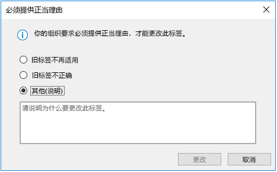
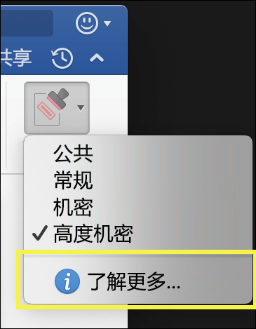
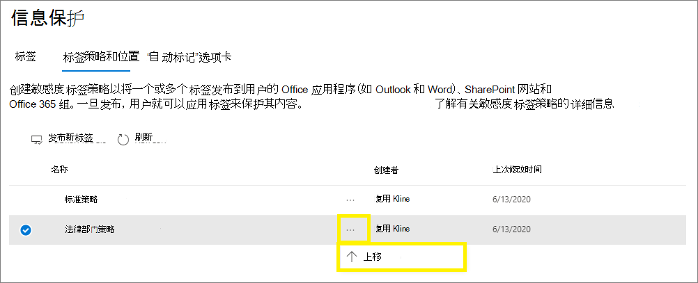

# 了解敏感度标签

>*[Microsoft 365 安全性与合规性许可指南](https://aka.ms/ComplianceSD)。*

组织内人员需要与组织内外的其他人员协作，才能完成工作。也就是说，内容不再一直停留在防火墙后面，而是可跨设备、应用和服务到处漫游。你希望内容的漫游方式不仅安全、受保护，还符合组织的业务和合规性策略。

通过 Microsoft 信息保护框架中的灵敏度标签，可以对组织的数据进行分类和保护，同时确保用户工作效率及其协作能力不受影响。

示例显示了 Excel 中功能区 **Home** 选项卡上可用的灵敏度标签。 在此示例中，状态栏上将显示已应用的标签：

若要应用敏感度标签，用户必须使用其 Microsoft 365 工作或学校帐户登录。

> [!NOTE]
> 对于美国政府（GCC、GCC-H 和 GCC-HC）租户，目前仅支持其Azure信息保护统一标签客户端和扫描仪的敏感性标签。 
> 
> 更多详细信息，请参阅[Azure 信息保护高级政府服务说明](https://docs.microsoft.com/enterprise-mobility-security/solutions/ems-aip-premium-govt-service-description)。

借助敏感度标签，你可以：
  
- **强制执行保护设置，如对已标记内容设置加密或水印。** 例如，用户可以向文档或电子邮件应用“机密”标签，然后此标签便能加密相应内容，并应用“机密”水印。

- **跨不同平台和设备保护 Office 应用中的内容。** 有关受支持的应用的列表，请参阅[在 Office 应用中使用敏感度标签](sensitivity-labels-office-apps.md)。

- 利用 Microsoft 云应用安全性**保护第三方应用和服务中的内容**。 借助 Cloud App Security，可检测、分类、标记和保护第三方服务和应用（如 SalesForce、Box 或 Dropbox）中的内容，即使第三方应用或服务无法读取或不支持敏感度标签也不例外。

- **将灵敏度标签扩展到第三方应用程序和服务。** 借助 Microsoft 信息保护 SDK，第三方应用可读取敏感度标签和应用保护设置。

- **对内容进行分类，无需使用任何保护设置。** 也可以只对内容进行分类（如不干胶标签），只要有人使用和共享内容，此分类就会随内容一起暂留和漫游。 使用此分类，可生成使用情况报告，并查看敏感内容的活动数据。 根据此类信息，稍后随时可以选择应用保护设置。

在所有这些情况下，Office 365 中的敏感度标签都可帮助你针对各个内容采取恰当的操作。 通过敏感度标签，可对整个组织中的数据进行分类，并根据该分类强制执行保护设置。

## 什么是敏感度标签

为文档或电子邮件分配敏感度标签时，它就像是应用于以下内容的标记：

- **可自定义**：可以为组织中不同级别的敏感内容创建类别，如“个人”、“公开”、“常规”、“机密”和“高度机密”。

- **明文。** 由于该标签以明文的方式存储在内容的元数据中，因此第三方应用和服务可以读取它，然后根据需要应用其自己的保护操作。

- **永久。** 将敏感度标签应用于内容后，该标签将保留在该电子邮件或文档的元数据中。 这意味着标签将随内容（包括保护设置）一起漫游，并且此数据将成为应用和强制实施策略的基础。

在 Office 应用中，敏感度标签就像是电子邮件或文档上向用户显示的标记。

每个内容项都可以应用有一个敏感度标签。一个内容项可以同时应用有一个敏感度标签和一个[保留标签](retention.md#retention-labels)。

> [!div class="mx-imgBorder"]
> 

## 敏感度标签有何用途

当电子邮件或文档应用敏感度标签后，系统便会对内容强制执行相应标签的任何已配置保护设置。 敏感度标签可用于：

- 仅**加密**加密电子邮件，或者同时加密电子邮件和文档。 可选择哪些用户或组有权执行哪些操作多长时间。 例如，可选择允许组织外特定组中的用户在标记内容后的 7 天内查看这些内容。 或者，可允许用户在应用标签时分配对内容的权限，而不是管理员分配权限。 
    
    有关创建或编辑敏感度标签时的“**加密**”设置的详细信息，请参阅[使用敏感度标签中的加密限制对内容的访问](encryption-sensitivity-labels.md)。

- 使用 Office 应用时**对内容进行标记**：方法是向已应用标签的电子邮件或文档添加水印、页眉或页脚。 水印可应用于文档，但不能用于电子邮件。 页眉和水印示例：
    
    
    
    需要检查何时应用内容标记？ 请参阅 [Office 应用何时应用内容标记和加密](sensitivity-labels-office-apps.md#when-office-apps-apply-content-marking-and-encryption)。
    
    字符串长度：水印的长度限制为 255 个字符。 页眉和页脚限制为 1024 个字符，但 Excel 中除外。 对于页眉和页脚，Excel 总限制为 255 个字符，但此限制包括不可见的字符，例如格式代码。 如果超出该限制，则你输入的字符串将不会在 Excel 中显示。

- 启用相应功能以[将敏感度标签用于 Microsoft Teams、Microsoft 365 组和 SharePoint 网站](sensitivity-labels-teams-groups-sites.md)时，**可保护网站和组等容器中的内容**。
    
    在启用此功能前，不会显示“**网站和组设置**”的配置选项。 请注意，此标签配置不会导致自动标记文档，而是通过控制对存储文档的容器的访问来保护内容。 这些设置包括隐私级别、Microsoft 365 组所有者可否向组中添加来宾，以及授予非托管设备的访问权限级别。

- 在 Office 应用中自动应用标签，或推荐标签。**** 你可以选择要应用标签的敏感信息类型；标签可以自动应用，或者你可以提示用户应用推荐的标签。 如果你推荐了标签，则在提示中将显示你选择的任何文本。 例如：
    
    
    
    有关创建或编辑敏感度标签时的“**Office 应用的自动标签**”设置的详细信息，请参阅[将敏感度标签自动应用于内容](apply-sensitivity-label-automatically.md)。

### 标签优先级（顺序非常重要）

在管理中心创建敏感度标签时，这些标签会显示在“**标签**”页的“**敏感度**”选项卡的列表中。 此列表中的标签顺序至关重要，因为它反映了标签的优先级。 限制性最高的敏感度标签（如“高度机密”）需显示在此列表的**底部**，限制性最低的敏感度标签（如“公开”）需显示在**顶部**。

一个文档或电子邮件仅可应用一个敏感度标签。 如果设置的选项需要用户提供将标签更改为较低分类的理由，理由可以是此列表的排序，因为它会标识较低分类。 但是，此选项不适用于子标签。

子标签的排序与[自动标签](apply-sensitivity-label-automatically.md)结合使用。 将标签配置为自动应用或推荐时，多个匹配项可能会导致出现多个标签。 要确定要应用或推荐的标签，请使用标签排序：选择最不敏感的标签，如果适用，选择最后一个子标签。

### 子标签（对标签进行分组）

使用子标签，你可以将一个或多个标签分组到用户在 Office 应用程序中看到的父标签下方。 例如，在“机密”下，你的组织可能会为该分类的特定类型使用多个不同的标签。 在此示例中，父标签“机密”仅仅是没有保护设置的文本标签，并且因为它具有子标签，所以它不能应用于内容。 相反，用户必须选择“机密”才能查看子标签，然后他们可以选择要应用于内容的子标签。

子标签只是向逻辑组中的用户显示标签的一种方式。 子标签不会从其父标签继承任何设置。 为用户发布子标签时，该用户可以将该子标签应用于内容，但不能仅应用父标签。

不要选择父标签作为默认标签，也不要将父标签配置为自动应用（或推荐）。 如果执行此操作，则不会将父标签应用于内容。

子标签如何向用户显示的示例：

### 编辑或删除敏感度标签

如果在管理中心内删除敏感度标签，标签并未从内容中删除，并且将继续对已标记内容强制执行所有保护设置。

如果编辑敏感度标签，应用于内容的标签版本就是对相应内容强制执行的标签。

## 标签策略有何用途

创建灵敏度标签后，需要进行发布，以便组织中的人员和服务可以使用它们。 可随后将灵敏度标签应用于文档和电子邮件。 与发布到诸如所有 Exchange 邮箱等位置的保留标签不同，敏感标签发布到用户或组。 灵敏度标签随后将显示在适用于这些用户和组的 Office 应用中。

借助标签策略，你可以：

- **选择可查看标签的用户和组。** 可以将标签发布到任何特定用户或启用电子邮件的安全组、通讯组或 Microsoft 365 组（它们可以在 Azure AD 中具有[动态成员身份](https://docs.microsoft.com/azure/active-directory/users-groups-roles/groups-create-rule)）。

- **将默认标签**应用于标签策略中包含的用户和组创建的所有新文档和电子邮件。 如果已[为 Microsoft Teams、Microsoft 365 组和 SharePoint 网站启用了敏感度标签](sensitivity-labels-teams-groups-sites.md)，则此选项也适用于容器。 如果默认标签不是用户文档或电子邮件的正确标签，则用户始终可以进行更改。 
    
    考虑使用默认标签来设置你想要应用于所有内容的基本级别的保护设置。 但是，如果没有用户培训和其他控件，此设置也会导致标签不准确。 最好不要选择应用加密的标签作为文档的默认标签。 例如，许多组织需要向外部用户发送并与其共享文档，这些用户可能不具有支持加密的应用，或者他们可能未使用可以获得授权的帐户。 有关此方案的详细信息，请参阅[与外部用户共享加密的文档](sensitivity-labels-office-apps.md#sharing-encrypted-documents-with-external-users)。

- **要求提供更改标签的理由。** 如果用户尝试删除标签，或将其替换为有较低订单号的标签，则你可以要求用户提供一个理由来执行此操作。 例如，用户打开一个标记为“机密”（订单号 3）的文档，并将该标签替换为一个名为“公共”（订单号 1）的文档。 目前，未将理由原因发送到[标签分析](label-analytics.md)供管理员查看。 但是，[Azure 信息保护统一标签客户端](https://docs.microsoft.com/azure/information-protection/rms-client/aip-clientv2)将此信息发送到 [Azure 信息保护分析](https://docs.microsoft.com/azure/information-protection/reports-aip)。

    

- **要求用户为其电子邮件和文档应用标签。** 也称为强制标记，你可以要求必须先应用标签，用户才能保存文档和发送电子邮件。 该标签可由用户手动分配，由于您配置的条件或默认分配的条件（如上所述的 "默认标签" 选项）而自动分配。 当用户需要分配一个标签时，Outlook 中显示的示例提示：

    
    
    > [!NOTE]
    > 强制标记目前需要 [Azure 信息保护统一标记客户端](https://docs.microsoft.com/azure/information-protection/rms-client/install-unifiedlabelingclient-app)。 此客户端仅在 Windows 上运行，因此 Mac、iOS 和 Android 上尚不支持此功能。
    
    考虑使用此选项帮助增加标签的覆盖范围。 但是，如果没有用户培训，此设置也会导致标记不准确。 此外，除非你还设置了默认标签，否则强制标记可能会使你的用户因更频繁地收到提示而感到沮丧。 

- **为自定义帮助页面提供帮助链接。** 如果用户不确定敏感度标签的含义或用法，你可以提供在 Office 应用中“**敏感度标签**”菜单底部显示的“了解更多” URL：

    

创建为用户和组分配新敏感度标签的标签策略后，用户在 30 分钟内即可在其 Office 应用中看到这些标签。 但是，最多需要 24 小时才能看到对这些标签的更改。

可创建和发布的敏感度标签的数量没有限制，但有一种例外：如果标签应用了加密，则最多可创建 500 个标签。 但是，最佳做法是减少管理开销并降低用户复杂程度，尽量将标签的数量保持在最低限度。 事实证明，当用户拥有五个以上的主标签或者每个主标签拥有五个以上的子标签时，实际部署的效率就会显著降低。

### 标签策略优先级（顺序非常重要）

你可以通过在敏感度标签策略中发布敏感度标签来向用户提供敏感度标签，该策略显示在“**标签策略**”页的“**敏感度策略**”选项卡的列表中。 正如敏感度标签（参见[标签优先级（顺序非常重要）](#label-priority-order-matters)）一样，敏感度标签策略的顺序很重要，因为它反映了它们的优先级。 优先级最低的标签策略显示在**顶部**，优先级最高的标签策略显示在**底部**。

标签策略包括：

- 一组标签。
- 标签策略的范围，表示策略中包含的用户和组。
- 上述标签策略的设置（默认标签、对齐方式、强制标签和帮助链接）。

可以在多个标签策略中包含某个用户，该用户将看到这些策略中的所有敏感度标签。 但是，用户只能从具有最高优先级的标签策略中看到策略设置。

如果看不到你希望用于用户或组的标签或标签策略设置，并且已等待了 30 分钟，请检查灵敏度标签策略的顺序。 若要重新排序标签策略，请选择某个敏感度标签策略 > 选择右侧的省略号 >“**下移**”或“**上移**”。

如果除了敏感度标签之外还使用保留标签，请务必注意优先级对敏感度标签策略至关重要，而对[保留标签](retention.md#the-principles-of-retention-or-what-takes-precedence)则不重要。

## 敏感度标签和 Azure 信息保护

如果已使用 Azure 信息保护部署了标签，则在开始使用灵敏度标签之前，请参考以下各节的指导。

### Azure 信息保护标签

> [!NOTE]
> Azure 门户中的 Azure 信息保护标签的标签管理将于 **2021 年 3 月 31 日**弃用。 有关详细信息，请参阅官方[弃用通知](https://techcommunity.microsoft.com/t5/azure-information-protection/announcing-timelines-for-sunsetting-label-management-in-the/ba-p/1226179)。

如果由于租户尚未使用[统一标签平台](https://docs.microsoft.com/azure/information-protection/faqs#how-can-i-determine-if-my-tenant-is-on-the-unified-labeling-platform)而使用 Azure 信息保护标签，则建议你避免创建敏感度标签，直到激活统一标签。 在此方案中，Azure 门户中看到的标签是 Azure 信息保护标签，而不是敏感度标签。 这些标签可由 Windows 计算机上的 Azure 信息保护客户端（经典）使用，但无法由运行 macOS、iOS 或 Android 的设备使用。 若要解决此问题，请 [将这些标签迁移](/azure/information-protection/configure-policy-migrate-labels) 到灵敏度标签。 

两组标签应用的元数据是兼容的，因此在迁移完成后，无需重新标记文档和电子邮件。

### Azure 信息保护客户端

在 Windows 计算机上使用 Microsoft 365 企业应用版应用中的敏感度标签时，可选择使用 Azure 信息保护客户端，或使用 Office 内置的标记。

默认情况下，安装 Azure 信息保护客户端时，将关闭这些应用中的内置标记功能。 有关详细信息（包括如何更改此默认行为），请参阅 [Office 内置标签客户端和 Azure 信息保护客户端](sensitivity-labels-office-apps.md#office-built-in-labeling-client-and-the-azure-information-protection-client)。

即使在 Office 应用中使用内置标签时，也可以将 Azure 信息保护统一标签客户端与灵敏度标签配合使用以实现以下目的：

- 扫描仪发现本地存储的敏感信息，然后（可选）为该内容添加标签

- 文件资源管理器中的右键单击选项让用户可将标签应用于所有文件类型

- 查看器显示文本、图像或 PDF 文档的加密文件

- PowerShell 模块发现本地文件中的敏感信息，然后应用或删除这些文件中的标签和加密

如果你不熟悉 Azure 信息保护，或者你是刚迁移标签的现有 Azure 信息保护客户，请参阅 Azure 信息保护文档中的[选择用于 Windows 计算机的标签客户端](https://docs.microsoft.com/azure/information-protection/rms-client/use-client#choose-which-labeling-client-to-use-for-windows-computers)。

## 灵敏度标签和 Microsoft 云应用安全性

使用云应用安全性 (CAS) 可以发现、分类、标记和保护第三方服务和应用（例如 SalesForce、Box 或 Dropbox）中的内容。 

“云应用安全性”适用于 Azure 信息保护标签和灵敏度标签：

- 如果标签管理中心将一个或多个敏感标签[发布](create-sensitivity-labels.md#publish-sensitivity-labels-by-creating-a-label-policy)到至少一个用户：将使用敏感度标签。

- 如果标签管理中心未发布敏感度标签：将使用 Azure 信息保护标签。

有关将 Cloud App Security 与这些标签一起使用的说明，请参阅 [Azure 信息保护集成](https://docs.microsoft.com/cloud-app-security/azip-integration)。

## 敏感度标签和 Microsoft 信息保护 SDK

由于灵敏度标签在文档的元数据中存储为明文，因此第三方应用和服务可以读取和写入此标签元数据，为标签部署提供补充。 此外，软件开发人员可以使用 [Microsoft 信息保护 SDK](https://docs.microsoft.com/information-protection/develop/overview#microsoft-information-protection-sdk) 在多个平台之间全面支持标签和加密功能。 若要了解详细信息，请参阅[技术社区博客上的“正式发布”公告](https://techcommunity.microsoft.com/t5/Microsoft-Information-Protection/Microsoft-Information-Protection-SDK-Now-Generally-Available/ba-p/263144)。 

你还可以了解[与 Microsoft 信息保护集成的合作伙伴解决方案](https://techcommunity.microsoft.com/t5/Azure-Information-Protection/Microsoft-Information-Protection-showcases-integrated-partner/ba-p/262657)。

## 部署指南

请参阅[开始使用敏感度标签](get-started-with-sensitivity-labels.md)。

