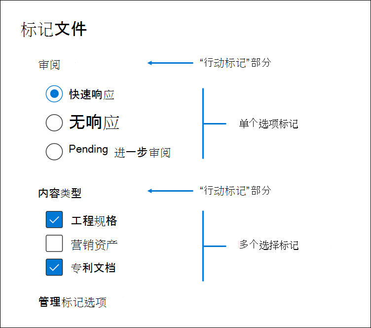

# 标记审阅集内的文档Advanced eDiscoveryTag documents in a review set in Advanced eDiscovery

组织审阅集内的内容对于完成电子数据展示过程中的各种工作流非常重要。Organizing content in a review set is important to complete various workflows in the eDiscovery process. 这包括：This includes:

- 剔除不必要的内容Culling unnecessary content

- 确定相关内容Identifying relevant content
 
- 确定必须由专家或律师审阅的内容Identifying content that must be reviewed by an expert or an attorney

当专家、律师或其他用户审阅审阅集内容时，可以使用标签来捕获他们有关内容的意见。When experts, attorneys, or other users review content in a review set, their opinions related to the content can be captured by using tags. 例如，如果意图是剔除不必要的内容，用户可以使用标记（如"无响应"）标记文档。For example, if the intent is to cull unnecessary content, a user can tag documents with a tag such as "non-responsive". 在审阅和标记内容后，可创建审阅集搜索以排除标记为"无响应"的任何内容，这将从电子数据展示工作流中的下一步骤中清除此内容。After content has been reviewed and tagged, a review set search can be created to exclude any content tagged as "non-responsive", which eliminates this content from the next steps in the eDiscovery workflow. 可以针对每个案例自定义标记面板，以便标记可以支持预期的审阅工作流。The tag panel can be customized for every case so that the tags can support the intended review workflow.

## 标记类型Tag types

Advanced eDiscovery两种类型的标记：Advanced eDiscovery provides two types of tags:

- **单个选项标记** - 限制用户选择组中单个标记。**Single choice tags** - Restricts users to select a single tag within a group. 这可用于确保用户不会选择冲突标记，如"响应"和"无响应"。This can be useful to ensure users don't select conflicting tags such as "responsive" and "non-responsive". 这些按钮将显示为单选按钮。These will appear as radio buttons.

- **多个选择标记** - 允许用户选择一个组内的多个标记。**Multiple choice tags** - Allow users to select multiple tags within a group. 它们将显示为复选框。These will appear as checkboxes.

## 标记结构Tag structure

除了标记类型之外，标记面板中标记组织方式的结构还可用于使标记文档更为直观。In addition to the tag types, the structure of how tags are organized in the tag panel can be used to make tagging documents more intuitive. 标记按节分组。Tags are grouped by sections. 审阅集搜索支持按标记和按标记部分搜索。Review set search supports the ability to search by tag and by tag section. 这意味着您可以创建审阅集搜索来检索用节中的任何标记标记的文档。This means you can create a review set search to retrieve documents tagged with any tag in a section.

可以通过在节中嵌套标记来进一步组织标记。Tags can be further organized by nesting them within a section. 例如，如果目的是标识和标记特权内容，可以使用嵌套来明确用户可以将文档标记为"Privileged"，并检查相应的嵌套标记来选择特权类型。For example, if the intent is to identify and tag privileged content, nesting can be used to make it clear that a user can tag a document as "Privileged" and select the type of privilege by checking the appropriate nested tag.

## 应用标记Applying tags

有几种方法将标记应用于内容。There are several ways to apply a tag to content.

### 标记单个文档Tagging a single document

查看审阅集内的文档时，可以通过单击"标记"面板来显示审阅 **可以使用的标记**。When viewing a document in a review set, you can display the tags that a review can use by clicking **Tagging panel**.

这样，你能够将标记应用于查看器中显示的文档。This will enable you to apply tags to the document displayed in the viewer.

### 批量标记Bulk tagging

可以通过在结果网格中选择多个文件，然后使用标记面板中的标记（类似于标记单个文档）完成批量标记。Bulk tagging can be done by selecting multiple files in the results grid and then using the tags in the **Tagging panel** similar to tagging single documents. 批量取消标记可以通过选择两次标记完成;第一次单击将应用标记，第二次选择将确保已清除所有选定文件的标记。Bulk un-tagging can be done by selecting tags twice; the first click will apply the tag, and the second selection will ensure that tag is cleared for all selected files.

> [!NOTE]
> 批量标记时，标记面板将显示针对面板中每个标记标记的文件计数。When bulk tagging, the tagging panel will display a count of files that are tagged for each tag in the panel.

### 其他审阅面板中的标记Tagging in other review panels

查看文档时，可以使用其他审阅面板查看结果网格中文档的其他特征。When reviewing documents, you can use the other review panels to review other characteristics of documents in the results grid. 这包括查看其他相关文档、电子邮件线程、近重复项和哈希重复项。This includes reviewing other related documents, email threads, near duplicates, and hash duplicates. 例如，在使用文档系列审阅 (查看相关文档时) ，可以通过批量标记相关文档来大大减少审阅时间。For example, when you're reviewing related documents (by using the **Document family** review panel), you can significantly reduce review time by bulk tagging related documents. 例如，如果电子邮件具有多个附件，并且您希望确保整个系列都一致标记。For example, if an email message has several attachments and you want to ensure that the entire family is tagged consistently.

例如，下面介绍在使用文档系列审阅面板时如何 **显示** 标记面板：For example, here's how to display the **Tagging panel** when using the **Document family** review panel:

1. 打开所选文档的审阅面板后 (例如，在"文档系列审阅"面板中显示相关内容的列表，单击文档系列审阅面板下的"标记文档"。With the review panel open for a selected document (for example, displaying the list of related content in the **Document family** review panel, click **Tag documents** under the document family review panel.

   标记面板显示为弹出窗口。The tagging panel is displayed as a pop-up window.

2. 选择一个或多个标记以应用所选文档。Choose one or more tags to apply the selected document. 

3. 若要标记所有文档，请选择"文档系列"面板中的所有文档，单击"标记文档"，然后选择要应用于整个文档系列的标签。To tag all documents, select all documents in the **Document family** panel, click **Tag documents**, and then choose the tags to apply to the entire family of documents.

