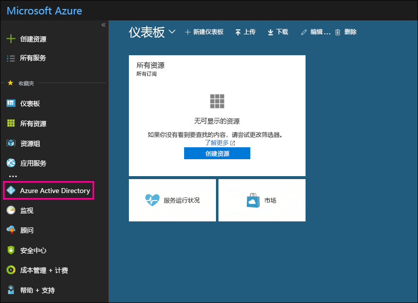

# 使用免费的 Azure Active Directory 订阅Use your free Azure Active Directory subscription

If your organization has a paid subscription to Microsoft 365, Microsoft Dynamics CRM Online, Enterprise Mobility Suite, or other Microsoft services, you have a free subscription to Microsoft Azure Active Directory.If your organization has a paid subscription to Microsoft 365, Microsoft Dynamics CRM Online, Enterprise Mobility Suite, or other Microsoft services, you have a free subscription to Microsoft Azure Active Directory. You and other admins can use Azure AD to create and manage user and group accounts.You and other admins can use Azure AD to create and manage user and group accounts. To use Azure AD, just go to the Azure portal and sign in to your account.To use Azure AD, just go to the Azure portal and sign in to your account.

## 打开专用浏览会话Open a private browsing session

Use a private browsing session (not a regular session) to access the Azure portal (in step 1 below) because this prevents the credentials that you're currently logged on with from being passed to Azure.Use a private browsing session (not a regular session) to access the Azure portal (in step 1 below) because this prevents the credentials that you're currently logged on with from being passed to Azure. To open an private browsing session:To open an private browsing session:

- 在 Microsoft Edge（旧版）、Internet Explorer 或 Mozilla FireFox 中，按下 `CTRL+SHIFT+P`。In Microsoft Edge (legacy version), Internet Explorer, or Mozilla FireFox, press `CTRL+SHIFT+P`.

- 在 Microsoft Edge （最新版本）或 Google Chrome 中，按下 `CTRL+SHIFT+N`。In Microsoft Edge (newest version) or Google Chrome, press `CTRL+SHIFT+N`.

## 访问 Azure Active DirectoryAccess Azure Active Directory

1. 转到 [portal.azure.com](https://portal.azure.com) 并使用工作或学生帐户登录。Go to [portal.azure.com](https://portal.azure.com) and sign in with your work or student account.

2. 在 Azure 门户内的左侧导航窗格中，单击“Azure Active Directory”\*\*\*\*。In the left navigation pane in the Azure portal, click **Azure Active Directory**.

    

    此时，**Azure Active Directory** 管理中心显示。The **Azure Active Directory** admin center is displayed.

## 更多信息More information

- 免费 Azure Active Directory 订阅不包括登录活动报告。A free Azure Active Directory subscription does not include the Sign-ins activity report. 若要记录登录活动（这在数据泄露时可能非常有用），需要 Azure Active Directory Premium 订阅。To record sign-in activity (which can be useful in the event of a data breach), you need an Azure Active Directory Premium subscription. 有关详细信息，请参阅“[Azure AD 存储数据多长时间？](https://docs.microsoft.com/azure/active-directory/reports-monitoring/reference-reports-data-retention#how-long-does-azure-ad-store-the-data)”For more information, see [How long does Azure AD store the data?](https://docs.microsoft.com/azure/active-directory/reports-monitoring/reference-reports-data-retention#how-long-does-azure-ad-store-the-data).

- 也可以从 Microsoft 365 管理中心访问“**Azure Active Directory**”管理中心。You can also access the **Azure Active Directory** admin center from the Microsoft 365 admin center. 在 Microsoft 365 管理中心的左侧导航窗格中，单击“**管理中心**”\>“**Azure Active Directory**”。In the left navigation pane of the Microsoft 365 admin center, click **Admin centers** \> **Azure Active Directory**.

- 若要了解如何管理用户和组，并执行其他目录管理任务，请参阅[管理 Azure AD 目录](https://docs.microsoft.com/azure/active-directory/active-directory-administer)。For information about managing users and groups and performing other directory management tasks, see [Manage your Azure AD directory](https://docs.microsoft.com/azure/active-directory/active-directory-administer).
