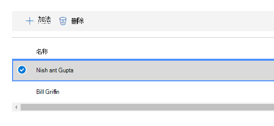
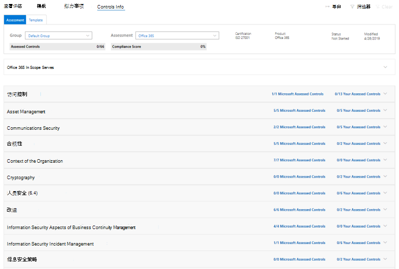

# 使用 Microsoft 合规性管理器（预览）

> [!IMPORTANT]
> Microsoft 合规性管理器是一个仪表板和管理工具，提供了有关数据保护和合规性的摘要 stature 以及改进数据保护和合规性的建议。 合规性管理器中提供的客户操作是建议。 在实现之前，你的组织可以评估这些建议在其各自的法规环境中的有效性。 在合规性管理器中找到的建议不应解释为合规性保证。

## Access 合规性管理器

可从 Microsoft 服务信任门户访问合规性管理器。 拥有 Microsoft 帐户或 Azure Active Directory 组织帐户的任何人都可以访问合规性管理器。

1. 转到 [https://servicetrust.microsoft.com/ComplianceManager/V3](https://servicetrust.microsoft.com/ComplianceManager/V3)。

2. 使用 Microsoft 服务帐户（即 Office 365、Microsoft 365 或 Azure Active Directory （Azure AD）用户帐户）登录。

> [!NOTE]
> 在服务信任门户中，选择 "**合规性管理器**"，它是具有最新功能的预览版本。 请勿选择**合规性管理器（经典）**，其中包含本文档未涵盖的旧版功能。

## 管理

只有全局管理员可以使用特定的管理功能，并且只有在使用全局管理员帐户登录时才可见。 全局管理员可以分配用户权限并打开自动安全得分更新。
  
### 向用户分配合规性管理器角色

一旦管理员将合规性管理器角色分配给其他用户，这些用户就可以在合规性管理器中查看数据，并执行角色所确定的操作。 管理员还可以通过向用户分配[Azure Active Directory （AZURE AD）中的全局读取器角色](https://docs.microsoft.com/azure/active-directory/users-groups-roles/directory-assign-admin-roles#global-reader)，授予对合规性管理器的只读访问权限。

每个合规性管理器角色都具有略有不同的权限。 您可以查看分配给每个角色的权限，查看哪些用户是哪些角色，以及通过服务信任门户在该角色中添加或删除用户。 选择 "**管理**" 菜单项，然后选择 "要查看的**设置**"。
  

  
若要在合规性管理器角色中添加或删除用户，请执行以下操作。
  
1. 转到 [https://servicetrust.microsoft.com](https://servicetrust.microsoft.com)。

2. 使用 Azure Active Directory 全局管理员帐户登录。

3. 在 "服务信任门户" 顶部菜单栏上，选择 "**管理员**"，然后选择 "**设置**"。

4. 在 "**选择角色**" 下拉列表中，选择要管理的角色。

5. “**选择角色**”页上会列出已添加到每个角色的用户。

6. 若要将用户添加到此角色，请选择 "**添加**"。 在 "**添加用户**" 对话框中，选择 "用户" 字段。 您可以在可用用户列表中滚动，也可以开始键入用户名，以根据您的搜索词筛选列表。 选择要将该帐户添加到使用该角色预配的 "**添加用户**" 列表中的用户。 如果要同时添加多个用户，请开始键入用户名以筛选列表，然后选择要添加到列表中的用户。 选择 "**保存**" 将所选角色设置给这些用户。 

    
  
7. 若要从此角色中删除用户，请选择 "用户"，然后选择 "**删除**"。

    

### 控制自动安全得分更新

可以为所有操作自动启用安全分数更新，对所有操作关闭这些更新，或通过执行以下步骤设置单个操作。

1. 使用全局管理员帐户登录到[服务信任门户](https://servicetrust.microsoft.com)。

2. 在服务信任门户顶部菜单栏上的 "**更多**" 下，选择 "**管理员**"，然后选择 "**设置**"。

3. 在 "**安全分数**" 选项卡中，选择相应的按钮以**打开所有操作**、为**所有操作**禁用或设置 "**每个操作"。**

如果选择 **"每个操作设置"，请**执行以下额外步骤，为单个操作打开安全得分更新：

4. 从顶部菜单中选择 "**合规性管理器**" （注意：不要选择 "合规性管理器（经典）"）。

5. 选择屏幕右上角的 "**租户管理**"。

6. 在 "**客户操作**" 窗格上，使用 "**受影响的操作**" 列下的省略号（**...**）查找预期操作。 单击省略号，然后选择 "**编辑"。**

7. 将 "**安全分数连续更新**" 切换开关切换到 **"开"。**

8. 选择 "**保存"。** 现已为该操作启用安全分数连续监控。

**注意：** 只有全局管理员才能打开或关闭所有操作的自动更新。 合规性管理器管理员可以为单个操作启用自动更新，而不是全局执行所有操作。

## Groups

组是允许您组织评估的容器，并在评估之间共享具有相同或相关的客户托管控件的常见信息和工作流任务。

您可以按符合您的方式对评估进行分组，如按年、标准、服务或组织的团队、部门或地理位置。 以下是两个组及其基础评估的示例：
  
- **FFIEC 是评估2020**
  - Office 365 + FFIEC 是
  - Intune + FFIEC 为
- **“数据安全和隐私”评估**
  - Office 365 + ISO 27001:2013
  - Office 365 + ISO 27018:2014

> [!NOTE]
> 我们建议您在添加新评估*之前*为您的组织确定一个分组策略。

若要开始，请为您设置一个包含数据保护基准的**默认**组。 此基准是一组包含常见行业法规和标准（[了解详细信息](compliance-score-methodology.md#initial-score-based-on-microsoft-365-data-protection-baseline)）的控件。

### 如何创建组

不能将组创建为独立实体。 一个组必须始终包含至少一个评估，因此，若要创建一个组，必须首先创建一个评估以放置在该组中。

按照以下步骤创建组：

1. 通过在仪表板顶部附近选择 " **+ 添加评估**" 来创建新的评估。
2. 从 "**评估**" 弹出窗口中，输入评估的标题，然后从下拉菜单中选择一个模板。
3. 在 "**请选择一个组或添加新组**" 中，选择 "**添加新组**"，然后在下面的字段中输入您的组名称。
4. 若要从现有组中复制信息，请切换**是否要从现有组中复制数据？** 切换到 **"开"。** 从下面的下拉菜单中选择要复制的组，并选中要在新组中将其传输到新评估中的任何字段的复选框。
5. 选择“**保存**”。 完成后，浮出控件窗格将关闭，您将在仪表板上看到您的新组。

使用组时需要了解的内容：
  
- 组名（也称为*组 id*）在您的组织中必须是唯一的。
- 组没有任何安全属性。 所有权限都与评估相关联。
- 将评估添加到组后，不能更改分组。 您可以重命名评估组，这将更改与该组关联的所有评估的评估分组的名称。
- 在同一组中的不同评估中的相关评估控件在完成后将自动更新。
- 如果将新评估添加到现有组中，则会将该组中评估的常见信息复制到新评估中。
- 组可以包含对同一认证或法规的评估，但每个组只能包含针对特定产品认证对的一个评估。 例如，组不能包含针对 Office 365 和 NIST CSF 的两个评估。 仅当一个组与同一个产品的对应证书或法规不同时，该组才可以包含对同一产品的多个评估。
- 隐藏评估会破坏该评估与组之间的关系。 其他相关评估的任何进一步更新不再在隐藏评估中反映出来。 （[了解如何隐藏评估。](#hide-a-template-or-an-assessment)）
- 无法删除组。
- 对显示在多个组中的措施项进行更改时，该更改将反映在该措施项的所有实例中。

## 对维度、所有者、& 客户操作的租户管理

**租户管理**界面使您能够管理以下组织范围的设置：

- **维：** 查看可用于为筛选器创建自定义透视的模板、评估和操作项的元数据。
- **所有者：** 填充可与操作关联的责任方列表。
- **客户操作：** 管理合规性管理器（预览版）中包含的操作项的完整列表，并为与安全得分集成的操作启用/禁用安全分数监视。

从屏幕右上角选择 "**租户管理**" 以打开管理界面，并使用以下步骤来管理**维度**、**所有者**和**客户操作**。

### Dimensions

维度是提供有关模板、评估或措施项的信息的元数据的集合。 维度使用键和值的概念，其中维度键表示属性，维度值表示属性的有效值。 例如，在合规性管理器中有三种类型的操作。 它们由**操作目的**的维度键和**预防**、**侦探**和**纠正**的维度值定义。

### 所有者

所有者用于标识负责每个控件的人员。 所有内置控件由 Microsoft、客户或这两者拥有。 您可以创建可用于在组织中指定更精确的职责的所有者的自定义值。 例如，可以创建代表组织中的特定组、团队或业务单位的所有者。

#### 添加所有者

1. 打开 "**租户管理**" 并选择 "**所有者**"。
2. 选择 " **+ 添加所有者**"。
3. 提供所有者的名称和说明，然后选择 "**保存**"。 说明显示在 "所有者" 列中。

#### 编辑所有者

您不能编辑所有者名称，但可以修改 "Owner" 列中显示的说明。

1. 打开 "**租户管理**" 并选择 "**所有者**"。
2. 找到要编辑的所有者，选择其旁边的省略号（...），然后选择 "**编辑**"。
3. 根据需要修改说明，然后选择 "**保存**"。

#### 删除所有者

1. 打开 "**租户管理**" 并选择 "**所有者**"。
2. 找到要删除的所有者，选择其旁边的省略号（...），然后选择 "**删除**"。
3. 当出现确认消息时，选择 "**删除**"。

### 客户操作

"客户操作" 区域显示合规性管理器中所有模板和评估的所有客户操作（预览）。

您可以一目了然地看到操作的标题、所有者、类别、强制和分数，并确定它是否与安全得分集成。 您可以展开操作并选择 "**读取更多**"，以读取操作说明并访问说明中的任何链接。 您还可以使用此接口基于每个操作启用和禁用安全得分集成，并添加自定义操作。 具有安全得分集成功能的操作旁边有一个省略号（...）（请注意，自定义操作旁边还有一个省略号）。

#### 启用或禁用安全分数集成

1. 选择要修改的操作的省略号（...），然后选择 "**编辑**"。
2. 切换交换机以确保安全分数连续更新为 "开" 或 "关"，以通过安全分数启用或禁用连续监控。
3. 选择“**保存**”。

当组织首次部署 Microsoft 365 或 Office 365 时，将需要大约7天的时间来完全收集数据，并将其划分到你的成绩中。 在这段时间内，将安全分数连续更新开关设置为**Off**并手动设置要**实现**的操作，则会将该操作计为成绩。 在最初的七天之后，将安全分数连续更新打开将启用从该点继续进行监视。

安全分数集成不支持的任何操作都可以手动实现。 手动实现将考虑该操作的组的分数。

## 评估

本节介绍如何查看和使用评估，包括如何添加新的评估、导出、复制现有评估中的信息，以及如何通过版本控制对其进行更新。

### 查看评估和操作详细信息
  
在 "**评估**" 仪表板中，选择要打开的评估名称，并查看 "操作项" 和 "控件信息"。

下面的示例展示了 Office 365 和 ISO 27001 的评估。 第一个视图演示合规性管理器（预览版）中的新操作项视图。

操作按字母顺序列出，并为每个操作分配一个分数和一个所有者。 选择 "**阅读更多**" 链接以阅读每个操作的详细信息。

选择 "**查看**" 链接以管理、分配、实现和测试操作。 下面是一个操作示例。

使用以下字段来管理操作工作流：

- **为用户分配：** 选择此字段以选择或输入应为其分配此操作的用户。 您可以在列表中滚动，或键入名称以查找它，然后选择它。
- **管理文档：** 您可以在 Office 文档、图像文件和屏幕截图、CSV 或 TXT 中的 PowerShell 输出以及 Pdf 中上载实现证据。
- **实现状态：** 用于指示操作的当前实现状态。 可能的值尚未实现、实现、替代实施、规划且不在范围内。
- **实施日期：** 执行操作的日期。
- **测试结果：** 用于指示实现验证的结果。 可能的值未评估、传递、失败-低风险、失败-中等风险、失败-高风险以及不在范围内。
- **测试日期：** 验证发生的日期。
- **实现说明：** 输入您的组织的实现详细信息，以及您想要包括的任何注释。
- **测试计划：** 输入此操作的测试计划详细信息，以及要包括的任何注释。
- **其他信息：** 输入有关此操作或在组织中实现此操作的方式的任何其他信息，以及要包括的任何注释。

在 "**控件信息**" 仪表板上，您可以在评估和模板级别查看控件的信息。 下面是用于评估的控件信息仪表板的一个示例。

对于评估，"控制信息" 仪表板将显示以下信息：

- 一个**组**下拉列表，用于选择要查看的组（使用多个组时）。
- 一个**评估**下拉列表，用于选择要查看的评估。
- 有关所选评估的元数据，包括：
    - **评估的控制措施**的进度指示器，其中显示了已评估的控制总数的控制次数。
    - 评估的当前**合规性分数**，显示为百分比。
    - 有关评估中使用的**认证**和**产品**的详细信息。
    - 评估的当前**状态**和上次**修改**日期。
- 用于评估的**范围内的服务**的列表。
- 控件的详细信息，按控件系列分组，并提供指向客户操作和 Microsoft 实现详细信息的链接：
    - **您的操作**将显示您可以执行以满足部分或全部控件要求的客户操作。 许多控件具有与之关联的多个操作，并且与控件关联的所有操作都显示在此处。 此处的操作与操作仪表板中列出的 UI 相同。
    - **Microsoft 操作**显示 microsoft 内部框架中应用于所选证书控制的控件列表。 对于每个内部控件，选择 "已**实施**" 以查看 Microsoft 的实施和测试详细信息，以及测试结果和测试日期，如下所示。

### 添加评估
  
1. 在 "评估" 仪表板中，选择 " **+ 添加评估**"。

2. 当边栏打开时，请输入以下信息：

    - **标题（必需）：** 输入评估的标题
    - **请选择一个模板（必需）：** 选择标准或自定义模板
    - **请选择组或添加新组（必需）：** 选择现有组或选择添加新组，并提供唯一的组名称
    - **是否要复制现有组中的数据？（可选）：** 切换控件以启用组副本，然后执行以下操作：
        - **选择一个组（可选）：** 如果已启用组副本，请选择要复制的组
            - **实现详细信息（可选）：** 选择以将实现详细信息复制到新组
            - **测试计划 & 其他信息（可选）：** 选择以将测试计划和其他信息详细信息复制到新组
            - **文档（可选）：** 选择以将文档复制到新组

3. 选择 "**保存**" 以创建评估。

 新评估显示在评估仪表板上，并显示以下信息：

- 评估的标题。
- 评估的维度，包括认证、环境和应用于评估的产品。
- 创建日期的日期和上次修改日期的日期。
- 评估分数显示为百分比。 此分数自动包含来自 Microsoft 托管控件和安全得分的分数。
- 进度指示器，显示已评估的 Microsoft 托管控件和客户托管的控件的数量。

### 从现有评估复制信息

创建评估时，可以选择从现有组复制信息。 通过复制，您可以将输入到复制的评估中的信息应用于新评估中的相同控件。 例如，如果您的组织中有与 FFIEC 相关的所有评估的组，则可以从现有评估中复制以下信息：

- 实现详细信息
- 测试计划 & 其他信息
- Documents

#### 将信息从现有评估复制到新评估
  
1. 在 "评估" 仪表板中，选择 " **+ 添加评估**"。
    
2. 在 "**添加评估**" 窗口中，填写以下信息

    - **标题（必需）：** 输入评估的标题。
    - **请选择一个模板（必需）：** 选择标准或自定义模板。
    - **请选择组或添加新组（必需）：** 选择 "**添加新组**" 并提供一个唯一的组名称。
    - **是否要复制现有组中的数据？（可选）：** 将控件切换到 "打开" 以启用组副本，然后：-**选择一个组（可选）：** 如果已启用组副本，请从组中选择要复制的组。
            - **实现详细信息（可选）：** 选择将实现详细信息复制到新组。
            - **测试计划 & 其他信息（可选）：** 选择以将测试计划和其他信息详细信息复制到新组。
            - **文档（可选）：** 选择以将文档复制到新组。

3. 选择 "**保存**" 以创建评估。

### 评估更新的版本控制警报

如果有可供评估的更新，则会出现一个警报图标，通知您更新已准备就绪。 当您单击该图标时，将弹出一个窗口，说明更新并提示您接受。 下面是针对评估的版本控制警报的一个示例：

选择警报图标可显示一个弹出窗格，其中介绍了更新并提示您接受：

强烈建议您在收到更新通知时接受所有更新。

### 导出评估

您可以将评估导出到您组织中的合规性利益干系人或外部审计员和主管机构的 Excel 文件。 报告是在创建报告的日期和时间的评估的快照。 该报告包含有关评估、控制实施状态、控制测试日期、测试结果的所有 Microsoft 和客户托管控件的详细信息，并提供了指向已上载证据文档的链接。
  
### 导出评估报告
  
1. 在合规性管理器仪表板中，选择 "**控件信息**" 选项卡。
2. 在要导出的评估的下拉菜单中，选择 "**组**和**评估**"。
3. 选择 "**导出**" 按钮。

在浏览器会话中，会将评估报告作为 Excel 文件下载。 Excel 文件的文件名称默认为评估的标题。

### 隐藏模板或评估

当您完成模板或评估且不再出于合规性目的而需要时，您可以将其从视图中隐藏。 如果模板或评估处于隐藏状态，则会将其从默认视图中删除，并且必须选中 "**包含隐藏**的" 复选框以显示它。

> [!IMPORTANT]
> 隐藏的评估不会保留其到已上载证据文档的链接。 强烈建议您先导出评估，然后再将其隐藏，以保留指向报告中的证据文档的链接。
  
#### 隐藏模板

1. 打开 "**模板**" 仪表板。
2. 找到要隐藏的模板，并在其所在行的省略号处，选择 "**隐藏**"。
3. 当您看到确认消息时，请选择 "**隐藏**"。

#### 隐藏评估

1. 打开 "**评估**" 仪表板。
2. 从下拉列表中选择包含您要隐藏的评估的**组**。
3. 找到要隐藏的评估，然后在省略号上选择 "**隐藏**"。
4. 当您看到确认消息时，请选择 "**隐藏**"。

#### 查看隐藏评估
  
1. 打开 "**评估**仪表板" 选项卡，然后选中 "**包含隐藏**" 复选框。
2. 隐藏评估显示在**隐藏评估**部分中。

#### 取消隐藏评估

1. 在 "**评估**" 选项卡上，选中 "**包含隐藏**" 复选框。
2. 隐藏评估显示在**隐藏评估**部分中。
3. 找到要取消隐藏的评估，然后在省略号上选择 "**取消隐藏**"。
4. 当您看到确认消息时，请选择 "**取消隐藏**"。

## 控件和操作

控件和操作是合规性管理器（预览版）中使用的主要数据透视。 在早期版本的合规性管理器中存在的控制轴已得到增强，可在相同的控制系列中显示 Microsoft 和 customer 控件。 此 "合并" 视图使以每个控件为基础查看完整的共享职责模型变得更加容易。 操作透视是合规性管理器（预览版）中的新操作，旨在提供 Microsoft 建议的所有操作的简化视图。

### 控件

可以从 "控件信息" 仪表板查看控件。 控件表示标准、认证、法规或框架中的要求。 若要跨多个标准、法规等满足这些要求，并将它们与操作相关联，则所有内容都被视为控制框架。 例如，像控制框架一样，法规（如 HIPAA）已按节细分，合规性管理器中的 HIPAA 控件使用与这些节相同的编号方案，如下所示：

有三种类型的控件：

1. **Microsoft 托管控件：** 这些控件只是 microsoft 有责任的控件。 它们显示在 "现成" 模板中，并已添加到 Microsoft 的合规性管理器中。
2. **客户管理的控件：** 这些控件只是客户有责任的控件。 它们显示在 "现成" 模板中，并由客户添加到合规性管理器中。
3. **共享管理控件：** 这些控件是在 Microsoft 和客户之间共享责任的控件。 这些模板显示在 "现成" 模板中，由 Microsoft 添加到合规性管理器中。 客户还可以编辑或禁用 Microsoft 托管的控件。

### Actions 项

操作项目是实施标准或法规要求的建议任务，或者用于测试、验证和记录组织的实现要求的任务。 操作与一个或多个控件相关联。 每个控件都有一个或多个与之关联的操作，并且每个操作都可以与一个或多个控件相关联。 操作是合规性管理器（预览版）中核心工作流的一部分，因为它们是由组织分配、跟踪和验证的对象。

#### 分配操作项
  
1. 在 "**操作项**" 仪表板上，选择包含要分配其操作的评估的**组**。
2. 在 "**评估**" 下拉列表中，选择要为其分配操作的评估，或从下拉列表中选择 "**全部**" 以查看所有可用操作。
3. 找到要分配的操作，并在 "**所有者**" 列中选择要**查看**的链接、* * 已实现或**测试**的链接。
4. 选择 "**分配用户**" 字段，将显示组织中的用户列表。 滚动列表并选择 "用户" 或 "筛选列表" 以通过键入用户的名称来选择用户。
5. 在 "实施说明" 字段中，输入您希望向分配的用户传达的任何注释。
6. 选择 "**保存**" 以分配操作。

#### 重新分配操作项

通过此函数，组织可以通过将操作重新分配给新用户，删除对用户帐户的任何活动的或未完成的依赖项。

1. 在 "**操作项**" 仪表板上，选择包含要重新分配其操作的评估的**组**。
2. 在 "**评估**" 下拉列表中，选择要重新分配其操作的评估，或从下拉列表中选择 "**全部**" 以查看所有可用操作。
3. 找到要重新分配的操作，并在 "**所有者**" 列中选择要**查看**、**实现**或**测试**的链接。
4. 从 "**分配用户**" 字段中删除现有用户，然后从用户列表中选择其他用户，或通过键入用户名称来筛选列表以选择用户。
5. 在 "实施说明" 字段中，输入您希望向用户传达的任何注释。
6. 选择 "**保存**" 以重新分配该操作。

#### 跨组的常见操作项同步状态

如果您的组织具有多个评估组，则会有技术操作的行为（即，影响整个组织的操作）。 所有组中的重复操作现在组合到一个单一操作中。 该单个操作包含所有上载的笔记和来自以前的重复版本的证据。 在一个组或评估中对操作所做的任何更改都将反映在该操作的所有实例中。 "实现**状态**"、"**实施日期**"、"**测试状态**" 和 "**测试日期**" 字段反映了最新的更新。

## 模板

模板是合规性管理器（预览）中与产品和证书（例如，标准、法规、控制框架等）相关联的基本对象。 可以从 "**模板**" 仪表板中查看和添加模板。

 
仪表板将显示每个模板，以及与模板关联的证书和产品、创建模板的日期和上次修改的日期、客户和 Microsoft 托管控件的数量、模板的最大合规性分数以及模板的状态（例如，已批准、待定审批、导入）。

### 创建模板

有三种方法可以使用模板来创建评估：

1. 使用 Microsoft 提供的预先配置的模板之一。
2. 通过扩展过程自定义预先配置的模板以及您自己的操作和控件。
3. 创建您自己的模板并将其导入到合规性管理器中。

#### 使用 Microsoft 预先配置的模板

预配置的模板在**模板**仪表板上可用。 查看当前[模板列表](compliance-manager-overview.md#templates)，该列表会在每次有新模板时更新。

#### 通过扩展过程自定义模板

1. 打开 "**模板**" 仪表板，然后选择 " **+ 添加模板**"。
2. 在 "模板" 浮出控件窗格中，选中 "**从全局模板创建扩展**" 复选框。
3. 从下拉式菜单中选择要扩展的模板。
4. 如果尚未在 Excel 中设置模板数据的格式，请选择浮出控件窗格中的链接以下载 Excel 文件。 根据 "[导入模板数据](#import-template-data-with-excel)" 和下面的 Excel 说明填写电子表格，并将其保存到本地驱动器。
5. 通过选择 "**浏览**" 来上载您的 Excel 文件，以导入自定义模板数据。
6. 选择 "**添加到仪表板**"。 然后，你将看到添加到**模板**仪表板的新模板。

#### 创建您自己的模板并将其导入到合规性管理器

1. 打开 "**模板**" 仪表板，然后选择 " **+ 添加模板**"。
2. 在 "模板" 浮出控件窗格中，选择 "**创建新模板**"。
3. 通过选择 "**浏览**" 以上传包含数据的 Excel 文件（请参阅以下[Excel 中的导入模板数据](#import-template-data-with-excel)）导入模板数据。
4. 选择 "**添加到仪表板**"。 然后，你将看到添加到**模板**仪表板的新模板。

#### 使用 Excel 导入模板数据

若要修改模板或创建自己的模板，您将使用[Excel 电子表格](https://go.microsoft.com/fwlink/?linkid=2124865)来捕获必要数据并将其上载到合规性管理器。 此电子表格模板具有必须使用的特定格式和架构，或者不会将其导入到合规性管理器中。

> [!IMPORTANT]
> 如果之前已在合规性管理器中创建或自定义模板，则**此过程已**作为2020年4月发布的合规性管理器（预览版）的一部分进行了更新。 **请仔细查看此部分。**

电子表格包含四个选项卡，其中三个选项卡是必需的：

1. 模板（必需）
2. ControlFamily （必需）
3. 操作（必需）
4. 维度（可选）

您的电子表格**必须按此顺序包含选项卡**，否则您的数据将无法成功导入到模板中。

##### 模板选项卡

"**模板**" 选项卡是必需的。 此选项卡中的信息提供有关模板的元数据。 有四个必需的列。 列必须保留在 Excel 工作表上的顺序，如下所示。 您可以在四列**之后**添加自己的列，以提供自己的维度。 如果执行此操作，请务必按照[下面的说明](#dimensions-tab)将其添加到 "**维度**" 选项卡。

- **title**：这是模板的标题，它必须是唯一的。 它无法与合规性管理器中的其他模板共享名称，无论它是已创建的模板，还是由 Microsoft 提供的预先配置的模板。

- **产品**：这是必需的维度。 列出与模板关联的产品。

- **证书**：这是您要为模板使用的法规。

- **inScopeServices**：这些服务是此评估解决的产品中的服务（例如，如果您将 Office 365 列为产品，则 Microsoft 团队可能是一个范围内的服务）。 您可以列出用两个分号分隔的多个服务。

> [!NOTE]
> 关于产品和证书：在导入 "**产品**" 和 "**证书**" 单元格中插入的数据无法在导入电子表格以创建或自定义模板之后进行编辑。 此外，组不能包含具有相同的**产品/认证**组合的两个评估。 您可以有多个模板具有相同的产品/认证组合。

##### ControlFamily 选项卡

**ControlFamily**选项卡是必需的。  此选项卡中的必需列（必须遵循示例电子表格中提供的顺序）为：

- **controlName**：这是来自证书、标准或法规的控件名称，通常是某种类型的 ID。 控件名称在模板中必须是唯一的。 电子表格中不能有多个名称相同的控件。

- **controlFamily**：为 controlFamily 提供一个单词或短语，用于标识广泛的控件分组。 ControlFamily 不一定是唯一的;它可以在电子表格中多次列出。 同一个 controlFamily 也可以在多个模板中列出，尽管它们彼此之间没有关系。 每个 controlFamily 必须至少映射到一个控件。

- **controlTitle**：提供控件的标题。 尽管 controlName 是参考代码，但标题是一种通常会在法规中看到的 rtf 格式。

- **controlDescription**：提供控件的说明。

- **controlActionTitle**：这是要与此控件相关的操作的标题。 您可以添加多个操作，方法是用两个分号隔开，中间没有空格。 您列出的每个控件必须至少包含一个操作，并且该操作必须存在（这意味着您可以在同一电子表格的 "**操作**" 选项卡上列出您列出的操作、存在于其他模板中的操作或由 Microsoft 创建的操作）。 不同的控件可以引用相同的操作。

##### 操作选项卡

"**操作**" 选项卡是必需的。  它指定您的组织的操作，而不是 Microsoft 的操作，这些操作在合规性管理器中已存在。 此选项卡必需的列必须遵循示例电子表格中提供的顺序，如下所示：

- **actionTitle**：这是您的操作的标题，是必填字段。 您提供的标题必须是唯一的。 **重要说明**：如果您引用您拥有的已存在的操作（如在另一个模板中），并且在后续列中修改了它的任何元素，则这些更改将传播到其他模板中的同一操作。

- **implementationType**：在此必填字段中，列出以下三种实现类型之一：
    - **操作**-由人员和进程实现以保护组织系统、资产、数据和人员的机密性、完整性和可用性（示例：安全意识和培训）
    - **技术**-通过使用信息系统的硬件、软件或固件组件中包含的技术和机制完成操作，以保护组织系统和数据的机密性、完整性和可用性（示例：多重身份验证）
    - **文档**-通过记录的策略和程序实现的操作：建立和定义保护组织系统、资产、数据和人员的机密性、完整性和可用性所需的控件（示例：信息安全策略）

- **actionScore**：在此必填字段中，为您的操作提供数值分数值。 它必须是介于1到99之间的整数;它不能为0、null 或空。 此数字越大，它在改进合规性状态方面的价值越大。 有关指南，请参阅下文 Microsoft 如何对控件进行评分：

- **actionDescriptionTitle**：这是说明的标题，并且是必需的。 此描述标题允许您在多个模板中执行相同的操作，并在每个模板中显示不同的说明。  此字段可帮助您阐明说明所引用的模板。 在大多数情况下，您可以在此字段中放置正在创建的模板的名称。

- **actionDescription**：提供操作的说明。 您可以应用粗体文本和超链接等格式。 这是必填字段。

- **维度-操作目的**：这是可选字段。 如果包含，则标头必须包含 "dimension-" 前缀。 此处包含的任何维度将用作[符合性分数中的筛选器](compliance-score-setup.md#filtering-your-dashboard-view)，并显示在[合规性分数的 "改进操作详细信息" 页](working-with-compliance-score.md#view-your-improvement-actions)上。

##### 维度选项卡

"**维度**" 选项卡是可选的。 但是，如果在其他位置引用维度，并且在您已创建的模板中或在 Microsoft 模板中不存在该维度，则需要在此处指定它。 下面列出了此选项卡的列：

- **dimensionKey**： list as "product"、"认证"、"操作目的"
- **dimensionValue**：示例： Office 365、HIPPA、预防性、侦探

您可以通过转到 "**租户管理**" 并选择 "**维度**" 选项卡来查看现有维度。此外，无论何时导出现有模板，导出的电子表格都将具有 "**尺寸**" 选项卡，其中列出了模板中使用的所有尺寸。

### 修改现有模板

若要使用上面所述的导入过程对创建或自定义的模板进行更改，请使用相同的过程将这些更改导入到模板中。

> [!NOTE]
> 编辑模板组件时，有几个重要的因素需要注意，因此请仔细查看此部分。

#### 修改模板的常规过程

若要对组织的现有模板之一进行更改，常规过程如下：

1. 从 "**模板**" 仪表板中，选择要修改的模板，该模板将调出显示 "**模板**" 选项卡的 "**控件信息**" 仪表板。
2. 从此处选择 "**导出**"。 将下载包含所有模板数据的 Excel 工作表。
3. 若要编辑、添加或删除操作，请参阅以下各节。
4. 完成对 Excel 文件所做的更改后，通过从仪表板中选择模板并选择 "**导入**"，将文件导入到模板中。 您的模板现在将包含所做的更改。

#### 编辑模板属性

在 "**模板**" 选项卡上，您可以编辑 "**标题**" 列、" **inScopeServices** " 列以及您可能已添加的任何其他列中的任何内容。 但是，不能编辑 "**产品**" 或 "**认证**" 列中的任何内容。

#### 向模板添加操作

1. 转到 "**操作**" 选项卡，并将您的信息添加到现有操作下方的第一个空行中的必填字段中。
2. 转到 " **ControlFamily** " 选项卡。查找包含操作所映射到的控件的行。 将您的新操作添加到该行中的 " **controlActionTitle** " 列（请记住，使用两个分号分隔此字段中的多个操作，中间没有空格）。
3. 将电子表格保存到本地计算机上。

#### 编辑操作的信息

您可以更改*除标题之外*的任何操作的信息。 您可以编辑从 B 之前的列中的任何单元格，并将该文件重新导入到模板中时，该模板中的操作现在将包含更新后的数据。

您无法编辑**actionTitle** （column A），因为如果您这样做，合规性管理器会将其视为一个新操作。 如果要更改操作的名称，请参阅以下直接说明。

#### 更改操作的名称

如果要更改操作的名称，则必须在电子表格中显式指定要将现有名称替换为新名称。 若要更改操作的名称，请按照以下步骤操作：

1. 在电子表格的 "**操作**" 选项卡中，将一个新列添加到 a 列之后的电子表格中。
2. 在此新列（现在是列 B）中，将其标头放在第1行： **oldActionTitle**。
3. 复制 A 列的内容并将其粘贴到 B 列中。这会将现有操作标题（即要更改的内容）放入 B 列中。
4. 在**actionTitle**列中，删除旧名称，并将其替换为您的操作的新名称。

#### 从模板中删除操作

从电子表格的某一行中删除操作**并不会**删除正在编辑的模板中的操作。 相反，请按照下面的过程操作，删除操作：

1. 在 "**操作**" 选项卡上，插入一个新列作为列 a，并在标题行中放置**操作**，该行号为1。
2. 在要删除的操作所在的行上，将**Delete**放入该行的 A 列中。
3. 确保控件不会再引用此操作。 转到 " **ControlFamily** " 选项卡，在第 F 列中查找您的操作的标题，即**controlActionTitle**。
4. 当您找到 " **controlActionTitle** " 列中列出的操作时，请将其删除。
5. 将电子表格保存到本地计算机上。

将电子表格导入回模板时，将从模板中删除您的操作。 从模板中移除操作并不会完全删除该操作。 另一个模板仍可引用该操作。

如果要删除控件引用的最后一个操作，则需要删除该控件。

> [!NOTE]
> 若要删除控件，请执行以下操作：按照上述步骤删除操作。 在 " **ControlFamily** " 选项卡中，添加 "**操作**" 列并将 "**删除**" 放在要删除的控件旁边。

### 模板的更新

每次通过版本控制过程更新评估时，您的自定义评估将继承这些更新并保留您的自定义控件。 [有关评估更新，请参阅版本控制警报](#versioning-alerts-for-assessment-updates)。

### 将模板导出到 JSON

合规性管理器（预览版）支持将模板导出为 JavaScript 对象表示法（JSON）格式。 这使您可以与支持 JSON 的其他系统交换合规性管理器数据。

## 报告

您可以将评估导出到您组织中的合规性利益干系人或外部审计员和主管机构的 Excel 文件。 报告是在导出的日期和时间进行评估的快照。 该报告包含 Microsoft 和客户托管的控件的详细信息，用于评估、控制实施状态、控制测试日期、测试结果以及指向已上载证据文档的链接。 由于隐藏的评估不会保留指向已上载文档的链接，因此应先导出该评估，然后再将其隐藏。

### 导出评估

1. 在合规性管理器仪表板中，选择 "**控件信息**" 选项卡。
2. 在下拉菜单中选择要导出的评估的组和评估。
3. 选择 "导出"。 将评估导出作为 Excel 文件下载。

## 权限

下表介绍了每个合规性管理器权限及其允许用户执行的操作。 该表还指示分配了每个权限的角色。

||**Azure AD 全局读取器**|**合规性管理器读者**|**合规性管理器参与者**|**合规性管理器评估员**|**合规性管理器管理员**|**门户管理员**|
|:-----|:-----|:-----|:-----|:-----|:-----|:-----|
|**读取数据：** 用户可以读取但不能编辑数据（模板数据和租户管理除外）。    | X | X | X | X | X  | X |
|**编辑数据：** 除了 "测试结果" 和 "测试日期" 字段（"模板数据" 和 "租户管理" 除外）之外，用户可以编辑所有字段。    ||| X | X  | X | X |
|**编辑测试结果：** 用户可以编辑 "测试结果" 和 "测试日期" 字段。    |||| X | X | X |
|**管理评估：** 用户可以创建、存档和删除评估。    ||||| X | X |
|**管理主数据：** 用户可以查看、编辑和删除模板数据和租户管理数据。    ||||| X | X |
|**管理用户：** 用户可以将组织中的其他用户添加到 Reader、投稿人、评估员和管理员角色。 只有组织中具有全局管理员角色的用户才可以在门户管理员角色中添加或删除用户。    |||||| X |
