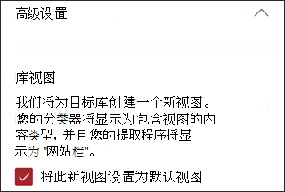
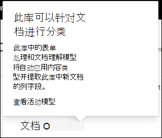

# 在 Microsoft SharePoint 中应用文档理解模型 SyntexApply a document understanding model in Microsoft SharePoint Syntex

本文中的内容适用于 Project Cortex 私人预览。The content in this article is for the the Project Cortex Private Preview. 了解[有关 Project Cortex 的详细信息](https://aka.ms/projectcortex)。[Find out more about Project Cortex](https://aka.ms/projectcortex).

 

> [!VIDEO https://www.microsoft.com/videoplayer/embed/RE4CSoL]

 

发布文档理解模型后，可以将其应用于 Microsoft 365 租户中的 SharePoint 文档库。After publishing your document understanding model, you can apply it to a SharePoint document library in your Microsoft 365 tenant.

> [!NOTE]
> 您只能将模型应用于您有权访问的文档库。You are only able to apply the model to document libraries that you have access to.

## 将模型应用于文档库。Apply your model to a document library.

若要将模型应用到 SharePoint 文档库，请执行以下操作：To apply your model to to a SharePoint document library:

1. 在模型主页中，在 " **将模型应用于库** " 磁贴上，选择 " **发布模型**"。From the model home page, on the **Apply model to libraries** tile, select **Publish model**. 或者，您可以在 "**使用此模型的库**" 部分中选择 " **+ 添加库**"。Or you can select  **+Add Library** in the **Libraries with this model** section.  

     

2. 选择包含要应用模型的文档库的 SharePoint 网站。Select the SharePoint site that contains the document library that you want to apply the model to. 如果网站未显示在列表中，请使用搜索框查找它。If the site does not show in the list, use the search box to find it. 

     

    > [!NOTE]
    > 您必须具有对要向其应用模型的文档库的 " *管理列表* " 权限或 *编辑* 权限。You must have *Manage List* permissions or *Edit* rights to the document library you are applying the model to. 

3. 选择网站后，选择要向其应用模型的文档库。After selecting the site, select the document library to which you want to apply the model. 在该示例中，从*Contoso 个案追踪*网站中选择*文档*文档库。In the sample, select the *Documents* document library from the *Contoso Case Tracking* site. 

     

4. 由于模型与内容类型相关联，因此当您将该模型应用于库时，它会创建内容类型的视图，并将所提取的标签显示为列。Since the model is associated to a content type, when you apply it to the library it creates a view for the content type with the labels you extracted showing as columns. 默认情况下，此视图是库的默认视图，但您可以选择 " **高级设置** " 并取消选择 " **将此新视图设置为默认值**"，以选择不将其作为默认视图。This view is the library's default view by default, but you can optionally choose to not have it be the default view by selecting **Advanced settings** and deselecting **Set this new view as default**. 

     

5. 选择 " **添加** " 将模型应用到库中。Select **Add** to apply the model to the library. 
6. 在模型主页上的 " **使用此模型的库** " 部分中，您应该会看到列出的 SharePoint 网站的 URL。On the model home page, in the **Libraries with this model** section, you should see the URL to the SharePoint site listed. 

     

7. 转到您的文档库，并确保您在模型的文档库视图中。Go to your document library and make sure you are in the model's document library view. 请注意，如果选择文档库名称旁边的 "信息" 按钮，则会出现一条消息，说明您的模型已应用于文档库。Notice that if you select the information button next to the document library name, a message notes that your model has been applied to the document library.

      

将模型应用于文档库后，可以开始将文档上载到网站并查看结果。After applying the model to the document library, you can begin uploading documents to the site and see the results.

模型标识任何具有模型关联的内容类型的文件，并在视图中列出这些文件。The model identifies any files with model’s associated content type and lists them in your view. 如果您的模型具有任何提取程序，则该视图将显示要从每个文件中提取的数据的列。If your model has any extractors, the view displays columns for the data you are extracting from each file.

### 将模型应用于文档库中已有的文件Apply the model to files already in the document library

应用的模型处理在应用后上载到文档库的所有文件，您还可以执行以下操作，以便在应用模型之前，对文档库中已存在的文件运行模型：While an applied model processes all files uploaded to the document library after it is applied, you can also do the following to run the model on files that already exists in the document library prior to the model being applied:

1. 在您的文档库中，选择您想要由模型处理的文件。In your document library, select the files that you want to be processed by your model.
2. 选择文件后，" **分类和提取** " 将显示在 "文档库" 功能区中。After selecting your files, **Classify and extract** will appear in the document library ribbon. 选择 " **分类并提取**"。Select **Classify and extract**.
3. 您选择的文件将被添加到队列中进行处理。The files you selected will be added to the queue to be processed.

        

## 另请参阅See Also
[创建类元Create a classifier](create-a-classifier.md) 
[创建提取程序Create an extractor](create-an-extractor.md) 
[文档理解概述Document Understanding overview](document-understanding-overview.md) 
[创建表单处理模型Create a form processing model](create-a-form-processing-model.md)  
