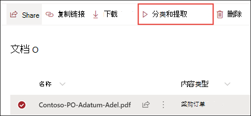

# 应用文档理解模型 (预览) 

> [!Note] 
> 本文中的内容适用于 Project Cortex 私人预览。 了解[有关 Project Cortex 的详细信息](https://aka.ms/projectcortex)。

 

> [!VIDEO https://www.microsoft.com/videoplayer/embed/RE4CSoL]

 

发布文档理解模型后，可以将其应用于 Microsoft 365 租户中的 SharePoint 文档库。

> [!Note]
> 您只能将模型应用于您有权访问的文档库。

## 将模型应用于文档库。

若要将模型应用到 SharePoint 文档库，请执行以下操作：

1. 在模型主页上，在 " **将模型应用于库** " 磁贴上，选择 " **发布模型**"。 或者，您可以在 "**使用此模型的库**" 部分中选择 " **+ 添加库**"。  

     

2. 然后，您可以选择包含要应用模型的文档库的 SharePoint 网站。 如果网站未显示在列表中，请使用搜索框查找它。 

     

    > [!Note]
    > 您必须具有对要向其应用模型的文档库的 " *管理列表* " 权限或 *编辑* 权限。 

3. 选择网站后，需要选择要向其应用模型的文档库。 在此示例中，我们将从*Contoso 个案追踪*网站中选择*文档*文档库。 

     

4. 由于模型与内容类型相关联，因此当您将其应用到库时，它将为内容类型创建一个视图，并将所提取的标签显示为列。 默认情况下，此视图将为库的默认视图，但您可以选择 " **高级设置** " 并取消选择 " **将此新视图设置为默认值**"，以选择不将其作为默认视图。 

     

5. 选择 " **添加** " 将模型应用到库中。 
6. 在模型主页上的 " **使用此模型的库** " 部分中，您将看到列出的 SharePoint 网站的 URL。 

     

7. 转到您的文档库，并确保您在模型的文档库视图中。 您会注意到，如果选择文档库名称旁边的 "信息" 按钮，则会出现一条消息，指出您的模型已应用于文档库。

      

将模型应用于文档库后，可以开始将文档上载到网站并查看结果。

模型将标识任何具有模型关联的内容类型的文件，并将其列在您的视图中。 如果模型具有任何提取程序，则视图将显示要从每个文件中提取的数据的列。

### 将模型应用于文档库中已有的文件

当应用的模型将处理上载到文档库的所有文件后，您还可以执行以下操作，以对文档库中已存在的文件运行模型之前已存在的文件：

1. 在您的文档库中，选择您想要由模型处理的文件。
2. 选择文件后，" **分类和提取** " 将显示在 "文档库" 功能区中。 选择 " **分类并提取**"。
3. 您选择的文件将被添加到队列中进行处理。

        

## 另请参阅
[创建类元](create-a-classifier.md) 
[创建提取程序](create-an-extractor.md) 
[文档理解概述](document-understanding-overview.md) 
[创建表单处理模型](create-a-form-processing-model.md)  

