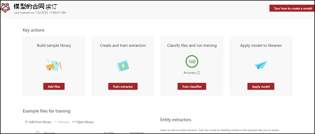

# 创建分类器（预览）

> [!Note] 
> 本文中的内容适用于 Project Cortex 私人预览。 了解[有关 Project Cortex 的详细信息](https://aka.ms/projectcortex)。

 

> [!VIDEO https://www.microsoft.com/videoplayer/embed/RE4CL0R]  

 

分类器是一种自动标识和分类文档类型的模型。 例如，您可能想要确定添加到文档库中的所有*合同续订*文档，如下所示。

创建一个分类器将创建一个新的[SharePoint 内容类型](https://docs.microsoft.com/sharepoint/governance/content-type-and-workflow-planning#content-type-overview)，该类型将与模型相关联。

创建分类器时，您需要创建*说明*，以帮助定义模型，方法是通过对此文档类型的预期持续查找的常用数据进行标注。 

您可以使用文档类型（"示例文件"）的示例来帮助 "培训" 您的模型，以确定具有相同内容类型的文件。

若要创建分类器，需要执行以下操作：
1. 命名模型
2. 添加示例文件
3. 为示例文件添加标签
4. 创建说明
5. 测试模型 

> [!Note]
> 虽然您的模型使用分类符来标识和分类文档类型，但您也可以选择从模型所标识的每个文件中提取特定的信息部分。 为此，请创建要添加到模型中的**提取**程序，这将在[创建提取程序](create-an-extractor.md)中进行说明。

## 命名模型

第一步是在内容中心中创建模型，方法是为其提供名称：

1. 在内容中心中，单击 "**新建**"，然后单击 "**创建模型**"。
2. 在 "**新建文档理解模型**" 窗格中的 "**名称**" 字段中，键入模型的名称。 对于我们的示例，如果我们想要确定合同续订文档，我们可以命名此模型*合同续订*。
3. 单击“**创建**”。 这将为模型创建主页。 

    

创建模型时，将创建新的 SharePoint 内容类型。 SharePoint 内容类型表示具有共同特征的文档类别，并共享该特定内容的一组列或元数据属性。 SharePoint 内容类型通过[内容类型库]()进行管理。 在我们的示例中，创建模型时，我们将创建新的*合同续订*内容类型。

如果要将此模型映射到 SharePoint 内容类型库中的现有内容类型以使用其架构，请选择 "**高级设置**"。 请注意，虽然您可以使用现有内容类型来帮助进行标识和分类，但您仍需要对模型进行训练，以便从它标识的文件提取信息。 

## 添加示例文件

在模型主页上，您可以添加示例文件，您需要这些文件来帮助训练模型以标识您的文档类型。  
 

> [!VIDEO https://www.microsoft.com/videoplayer/embed/RE4D0iX] 

 

> [!Note]
> 对于分类器和[提取器培训](create-an-extractor.md)，应使用相同的文件。 你始终可以选择添加更多的更高版本，但通常应添加完整的示例文件集。 您将标记一些以培训您的模型，并测试其余未标记的模型以评估模型适用性。 

对于你的培训集，你将需要使用正则示例和消极示例：
- 正则示例：表示文档类型的文档。 它们包含的字符串和信息总是在这种类型的文档中。
- 负示例：不代表文档类型的文档。  这些类型的文档中缺少需要的字符串和信息。

你将需要使用至少5个正则示例和一个负示例来培训你的模型。  你将需要其他附加的用户才能在培训后测试你的模型。

添加示例文件：

1. 在模型主页上的 "**生成示例库**" 磁贴中，单击 "**添加文件**"。
2. 在 "**选择模型的示例文件**" 页上，从内容中心的示例文件库中选择示例文件。 如果尚未将其上传到那里，则可以通过单击 "**上载**" 将其移到示例文件库中，选择立即上载。
3. 选择用于培训模型的示例文件后，单击 "**添加**"。

     

## 为示例文件添加标签

添加示例文件后，需要将其标记为正示例或负示例。

1. 在模型主页上的 "对**文件进行分类和运行培训**图块" 中，单击 "**训练分类器**"。
   这将显示 "标签" 页面，其中显示了示例文件的列表，查看器中的第一个文件可见。
2. 在查看器中，第一个示例文件的顶部，您将看到文本，询问您文件是否是您刚创建的模型的示例。 如果是一个正则示例，请选择 **"是"**。 如果它是一个负示例，请选择 "**否**"。
3. 从左侧的 "**标记的示例**" 列表中，选择要用作示例的其他文件，并标记这些文件。 

     

> [!Note]
> 至少为五个正则的示例添加标签和一个负的示例。 

## 创建说明

下一步是在 "培训" 页面上创建一个说明。  解释是一个提示或线索，可帮助模型了解如何识别此文档。 例如，我们的合同续订文档始终包含一个*请求以获取额外的泄露*文本字符串。

> [!Note]
> 在与提取程序一起使用时，使用说明来标识要从文档中提取的字符串。 

若要创建说明：

1. 在模型主页上，单击 "**定型**" 选项卡以转到 "培训" 页面。
2. 在 "培训" 页上的 "**训练有素的文件**" 部分中，您将看到先前已标记的示例文件的列表。 从列表中选择一个正则文件，它将显示在查看器中。
3. 在 "说明" 部分，单击 "**新建**"，然后单击 "**空白**"。
4. 在 "**创建说明**" 页上： 
    a. 键入**名称**（例如，"披露 Block"）。 
    b. 选择 "**类型**"。 对于我们的示例，我们将选择**短语 "列表**"，因为我们要添加文本字符串。 
    c. 在 "**请键入此处**" 框中，键入字符串。  对于我们的示例，我们将添加 "请求其他披露"。 如果字符串需要区分大小写，则可以选择 "区分**大小写**"。 
    d. 单击“**保存**”。

     
    
 
5.  模型现在将检查您创建的解释是否足够好，以确定剩余的标记的示例文件正确无误，如正面和负数示例。 在 "训练有素的文件" 部分中，选中 "完成培训后的**评估**" 列以查看结果。  如果您创建的解释足以匹配已标记为（正数或负数）的内容，则文件将显示**匹配**的值。

     

如果您在标记的文件上收到**不匹配**项，则可能需要创建其他说明，以提供模型以详细了解该文档类型。 您可以单击文件以获取有关为什么发生不匹配的原因的详细信息。

## 测试模型

如果您在标记的示例文件中接收到匹配项，则现在可以在剩余的未标记的示例文件上测试模型。

1. 在模型主页上，单击 "**测试**" 选项卡。 这将在未标记的示例文件上运行模型。
2. 在 "**测试文件**" 列表中，将显示示例文件，并显示该模型是否将它们预测为正数或负数示例。 您可以使用此信息来帮助您确定您的分类程序的有效性，以标识您的文档。

     

## 另请参阅
[创建提取程序](create-an-extractor.md) 
[文档理解概述](document-understanding-overview.md) 
[创建表单处理模型](create-a-form-processing-model.md) 
[应用模型](apply-a-model.md) 

