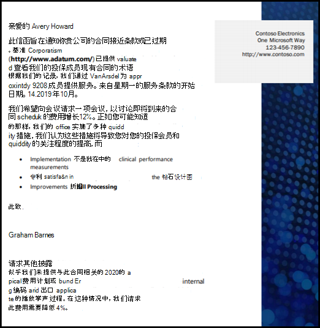
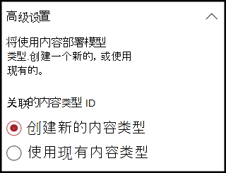

# 在 Microsoft SharePoint Syntex 中创建分类器Create a classifier in Microsoft SharePoint Syntex

 

> [!VIDEO https://www.microsoft.com/videoplayer/embed/RE4CL0R]  

 

分类器是一种模型类型，可用于自动化文档类型的标识和分类。A classifier is a type of model that you can use to automate identification and classification of a document type. 例如，你可能想要标识所有添加到文档库中的“*合同续订*”文档，如下图所示。For example, you may want to identify all *Contract Renewal* documents that are added to your document library, such as is shown in the following illustration.

创建分类器使你能够创建将与模型关联的新 [SharePoint 内容类型](https://docs.microsoft.com/sharepoint/governance/content-type-and-workflow-planning#content-type-overview)。Creating a classifier enables you to create a new [SharePoint Content Type](https://docs.microsoft.com/sharepoint/governance/content-type-and-workflow-planning#content-type-overview) that will be associated to the model.

创建分类器时，需要创建*说明*来定义模型。When creating the classifier, you need to create *explanations* to define the model. 这可以使你记下预期会一贯地找到此文档类型的常见数据。This enables you to note common data that you would expect to consistently find this document type. 

使用文档类型的示例（“示例文件”）来“培训”你的模型，以便识别具有相同内容类型的文件。Use examples of the document type ("example files") to "train" your model to identify files that have the same content type.

若要创建分类器，需要执行以下操作：To create a classifier, you need to:
1. 命名模型。Name your model.
2. 添加示例文件。Add your example files.
3. 标记示例文件。Label your example files.
4. 创建说明。Create an explanation.
5. 测试模型。Test your model.

> [!NOTE]
> 虽然你的模型使用分类器来标识和分类文档类型，但是你也可以选择从模型识别的每个文件中提取特定信息。While your model uses a classifier to identify and classify document types, you can also choose to pull specific pieces of information from each file identified by the model. 可通过创建**提取程序**并添加到模型中来实现此操作。Do this by creating an **extractor** to add to your model. 请参阅“[创建提取程序](create-an-extractor.md)”。See [Create an extractor](create-an-extractor.md).

## 命名模型Name your model

创建模型的第一步是为其命名：The first step to create your model is to give it a name:

1. 从“内容中心”中，选择“**新建**”，然后“**创建模型**”。From the Content Center, select **New**, and then **Create a model**.
2. 在“**新的了解模型文档**”窗格中，在“**名称**”的字段中键入模型的名称。In the **New document understanding model** pane, in the **Name** field type the name of the model. 例如，如果想要标识合同续订文档，可将该模型命名“*合同续订*”。For example, if you want to identify contract renewal documents, you could name the model *Contract Renewal*.
3. 选择 **“创建”**。Choose **Create**. 这将为该模型创建主页。This creates a home page for the model. 

    

创建模型时，也将创建新的网站内容类型。When you create a model, you are also creating a new site content type. 内容类型表示具有共同特征的文档类别，并共享该特定内容的列或元数据属性的集合。A content type represents a category of documents that have common characteristics and share a collection of columns or metadata properties for that particular content. 可通过“[内容类型库](https://support.microsoft.com/office/create-or-customize-a-site-content-type-27eb6551-9867-4201-a819-620c5658a60f)”管理 SharePoint 内容类型。SharePoint Content Types are managed through the [Content types gallery](https://support.microsoft.com/office/create-or-customize-a-site-content-type-27eb6551-9867-4201-a819-620c5658a60f). 在此示例中，创建模型时，将创建新的“*合同续订*”内容类型。For this example, when you create the model, you are creating a new *Contract Renewal* content type.

如果想要将此模型映射到 SharePoint 内容类型库中的现有企业内容类型以使用其架构，请选择“**高级设置**”。Select **Advanced settings** if you want to map this model to an existing enterprise content type in the SharePoint Content types gallery to use its schema. 企业内容类型存储在 SharePoint 管理中心中的内容类型中心中，并与租户中的所有网站联合。Enterprise content types are stored in the Content Type Hub in the SharePoint admin center and are syndicated to all sites in the tenant. 请注意，虽然可使用现有内容类型，利用其架构来帮助标识和分类，但仍需训练模型从识别的文件中提取信息。Note that while you can use an existing content type to leverage its schema to help with identification and classification, you still need to train your model to extract information from files it identifies. 

## 添加示例文件Add your example files

在模型主页上，添加帮助训练模型识别文档类型的示例文件。On the model home page, add your examples files you will need to help train the model to identify your document type.  
 

> [!VIDEO https://www.microsoft.com/videoplayer/embed/RE4D0iX] 

 

> [!NOTE]
> 应为分类器和[提取程序培训](create-an-extractor.md)使用相同的文件。You should use the same files for both classifier and [extractor training](create-an-extractor.md). 你始终可以选择稍后再添加更多，但你通常可以添加完整的示例文件集。You always have the option to add more later, but typically you add a full set of example files. 标记一些文件以培训模型，并测试其余未标记的文件以评估模型适用性。Label some to train your model, and test the remaining unlabeled ones to evaluate model fitness. 

对于你的培训集，你应该要使用正例和反例：For your training set, you want to use both positive and negative examples:
- 正例：表示文档类型的文档。Positive example: Documents that represent the document type. 其中包含始终属于此类型文档内的字符串和信息。These contain strings and information that would always be in this type of document.
- 反例：任何不表示你想要分类的文档的其他文档。Negative example: Any other document that does not represent the document you want to classify. 

请务必使用至少五个正例，以及至少一个反例来培新模型。Be sure to use at least five positive examples and at least one negative example to train your model.  你应该要创建额外示例，以便在培训过程之后测试你的模型。You want to create additional ones to test your model after the training process.

添加示例文件：To add example files:

1. 在模型主页上的“**添加示例文件**”磁贴中，单击“**添加文件**”。On the model home page, in the **Add example files** tile, click **Add files**.
2. 在“**为模型选择示例文件**”页面上，从内容中心的”培训文件”库中选择示例文件。On the **Select example files for your model** page, select your example files from the Training files library in the content center. 如果尚未上传到其中，请单击“**上传**”来选择立即上传它们，以便把它们复制到“培训文件”库中，。If you had not already uploaded them there, choose to upload them now by clicking **Upload** to copy them to the Training files library.
3. 选择用于培训模型的示例文件后，单击“**添加**”。After selecting your example files to use to train the model, click **Add**.

     

## 标记示例文件Label your example files

添加示例文件后，需要将其标记为正例或反例。After adding your example files, you need to label them as either positive or negative examples.

1. 在模型主页的“**分类文件并运行培训**”磁贴中，单击“**训练分类器**”。From the model home page, on the **Classify files and run training** tile, click **Train Classifier**.
   这将显示一个标签页，该页将显示示例文件的列表，第一个文件可见于查看器中。This displays the label page that shows a listing of your example files, with the first file visible in the viewer.
2. 在查看器中第一个示例文件的顶部那里，你会看到询问该文件是否为刚创建模型的示例的文本。In the viewer on the top of the first example file, you should see text asking if the file is an example of the model you just created. 如果是正例，请选择 **“是”**。If it is a positive example, select **Yes**. 如果是反例，请选择 **“否”**。If it is a negative example, select **No**.
3. 在左侧“**已标记示例**”的列表中，选择要用作示例的附加文件，然后为其添加标签。From the **Labeled examples** list on the left, select additional files that you want to use as examples, and label them. 

     

> [!NOTE]
> 标记至少五个正例。Label at least five positive examples. 还必须标记至少一个反例。You must also label at least one negative example. 

## 创建说明Create an explanation

下一步是让你在“培训”页面上创建说明。The next step is for you to create an explanation on the Train page. 说明有助于模型理解如何识别文档。An explanation helps the model understand how to recognize the document. 例如，“合同续订”文档始终包含“*请求附加说明*”的文本字符串。For example, the Contract Renewal documents always contain a *Request for additional disclosure* text string.

> [!Note]
> 与提取程序配合使用时，说明将会识别你想要从文档中提取的字符串。When used with extractors, an explanation identifies the string that you want to extract from the document. 

要创建说明，请执行以下操作：To create an explanation:

1. 在模型主页中，选择“**培训**”选项卡以转到“培训”页面。From the model home page, select the **Train** tab to go to the Train page.
2. 在“培训”页面上的“**已培训文件**”部分中，你应该会看到先前标记的示例文件列表。On the Train page, in the **Trained files** section you should see a list of the sample files that you previously labeled. 从列表中选择其中一个正例文件，然后它将在查看器中显示。Select one of the positive files from the list, and it displays in the viewer.
3. 在“说明”部分中，选择“**新建**”，然后“**空白**”。In the Explanation section, select **New** and then **Blank**.
4. 在“**创建说明**”页面上：On the **Create an explanation** page: 
    a.a. 键入“**名称**”（例如，“说明文本块”）。Type the **Name** (for example, "Disclosure Block"). 
    b.b. 选择“**类型**”。Select the **Type**. 对于示例，请选择“**短语列表**”，因为添加了文本字符串。For the sample, select **Phrase list**, since you add a text string. 
    c.c. 在“**在此处键入**”框中，键入字符串。In the **Type here** box, type the string. 对于示例，请添加“请求附加说明”。For the sample, add "Request for additional disclosure". 如果字符串需要区分大小写，则可以选择“**区分大小写**”。You can select **Case sensitive** if the string needs to be case sensitive. 
    d.d. 单击“**保存**”。Click **Save**.

     
    
 
5. 现在，该模型将检查你创建的说明是否够好，好到可以正确地识别其他已标记的示例文件为正例和反例。The model now checks to see if the explanation you created was good enough to identify the remaining labeled example files correctly, as positive and negative examples. 在“已培训文件”的部分中，训练完成后，检查“**评估**”列以查看结果。In the Trained Files section, check the **Evaluation** column after the training has completed to see the results. 如果你创建的说明足以匹配标记为正例或反例的内容，则文件显示“**匹配**”。The files show a value of **Match**, if the explanations you created was enough to match what you labeled as positive or negative.

     

如果在已标记的文件上收到“**不匹配**”，则可能需要创建额外的说明，以便为模型提供更多标识文档类型的信息。If you receive a **Mismatch** on the labeled files, you may need to create an additional explanation to provide the model more information to identify the document type. 如果发生这种情况，请单击文件以获取更多有关发生不匹配情况的原因详情。If this happens, click on the file to get more information about why the mismatch occurred.

## 测试模型Test your model

如果你在已标记的示例文件上收到“匹配”，则现在可以在其余未标记且模型未见过的示例文件上测试模型。If you received a match on your labeled sample files, you can now  test your model on your remaining unlabeled example files that the model has not seen before.  这是一个可选但很有用的步骤，可在使用模型之前评估其“适用性”和“就绪度”，方法是在该模型之前未见过的文件上对其进行测试。This is optional, but a useful step to evaluate the “fitness” or readiness of the model before using it, by testing it on files the model hasn’t seen before.

1. 在模型主页中，选择“**测试**”选项卡。这将在未标记的示例文件上运行模型。From the model home page, select the **Test** tab.  This runs the model on your unlabeled sample files.
2. 在“**测试文件**”列表中，将列出并显示示例文件（如果模型将其预测为正例或反例的话）。In the **Test files** list, your example files display and shows if the model predicted them to be positive or negative. 使用此信息以帮助确定分类器在文档识别中的有效性。Use this information to help determine the effectiveness of your classifier in identifying your documents.

     

## 另请参阅See Also
[创建提取程序Create an extractor](create-an-extractor.md)

[文档理解概述Document Understanding overview](document-understanding-overview.md)

[说明类型Explanation types](explanation-types-overview.md)

[应用模型Apply a model](apply-a-model.md) 
