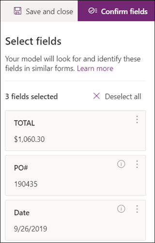

#  (预览中创建表单处理模型) 

> [!Note] 
> 本文中的内容适用于 Project Cortex 私人预览。 了解[有关 Project Cortex 的详细信息](https://aka.ms/projectcortex)。

使用[AI 生成器](https://docs.microsoft.com/ai-builder/overview)-Microsoft PowerApps-Project Cortex 中的一项功能用户可以直接从 SharePoint 文档库创建[表单处理模型](form-processing-overview.md)。 

创建表单处理模型涉及以下内容：
 - 步骤1：创建源处理模型以创建内容类型
 - 步骤2：添加和分析示例文件
 - 步骤3：选择窗体域
 - 步骤4：培训和测试您的模型
 - 步骤5：发布模型
 - 步骤6：使用模型

## Requirements

您只能在启用了它的 SharePoint 文档库中创建表单处理模型。 如果已启用表单处理，您将能够在文档库中的 "**自动**" 菜单下看到 " **AI 生成器**'**创建表单处理模型 '"** 。  如果您需要在文档库上启用处理，请与管理员联系。

  

## 步骤1：创建表单处理模型

创建表单处理模型的第一步是将其命名为 "定义新内容类型" 并为其创建新的文档库视图。

1. 在文档库中，选择 "**自动**" 菜单，选择 " **AI 生成器**"，然后选择 "**创建表单处理模型**"。

     
2. 在 "**新建表单处理模型**" 窗格中的 "**名称**" 字段中，键入模型 (的名称，例如，"*采购订单*) "。

      

3. 创建表单处理模型时，将创建新的 SharePoint 内容类型。 SharePoint 内容类型表示具有共同特征的文档类别，并共享该特定内容的一组列或元数据属性。 SharePoint 内容类型通过[内容类型库]()进行管理。

    如果要将此模型映射到 SharePoint 内容类型库中的现有内容类型以使用其架构，请选择 "**高级设置**"。 

4. 您的模型将为提取的数据在文档库中创建一个新视图。 如果您不想将其显示在默认视图中，取消选择 **"将视图设置为默认值**"。
5. 选择“创建”****。

## 步骤2：添加和分析文档

在创建新的表单处理模型后，浏览器将打开一个新的 PowerApps AI 生成器表单处理模型页面。 在此页面上，您可以添加和分析示例文档。  

> [!Note]
> 在查找要使用的示例文件时，请参阅[表单处理模型输入文档要求和优化提示](https://docs.microsoft.com/ai-builder/form-processing-model-requirements)。 

     
 

1. 单击 "**添加文档**" 开始添加分析的示例文档，以确定可提取的命名值对。 你可以选择 "**从本地存储**、 **SharePoint**或**Azure Blob 存储**上传"。 您至少需要使用5个文件进行培训。
2. 添加文件后，选择 "**分析**" 以检查所有常见信息是否为 "所有文件"。 请注意，这可能需要几分钟的时间才能完成。  
 
      

3. 分析完成后，在 "**选择要保存的表单域**" 页上，单击文件以查看检测到的字段。 

      

## 步骤3：选择窗体域

分析文档中的字段后，现在可以查看找到的字段以及要保存的字段。 保存的字段将在模型的文档库视图中显示为列，并将显示从每个文档中提取的值。

1. 下一页将显示其中一个示例文件，并将突出显示系统自动检测到的所有常见字段。  

      

2. 选择要保存的域，然后选中该复选框以确认您的选择。 例如，在 "采购订单" 模型中，可以选择选择 "*日期*"、"*采购*订单" 和 "*总计*" 字段。  请注意，您还可以选择重命名字段（如果选择）。  

      

3. 如果分析未检测到某个字段，您仍可以选择添加它。 突出显示要提取的信息，并在 "名称" 框中键入要赋予它的名称。 然后选中该复选。 请注意，您需要在其余的示例文件中确认未检测到的字段。
4. 在选择了要保存的字段后，单击 "**确认字段**"。  
 
      
 
5. 在 "**选择要保存的表单域**" 页上，它将显示所选的字段数。 选择“完成”****。

## 步骤4：培训和测试您的模型

在选择了要保存的字段后，"**模型摘要**" 页面将允许您对模型进行定型和测试。

1. 在 "**模型摘要**" 页上，保存的字段将显示在 "**选定的字段**" 部分。 选择 "**训练**" 以开始对示例文件进行训练。 请注意，这可能需要几分钟的时间才能完成。 
      
2. 当您看到 "培训已完成" 通知时，请选择 "**转到详细信息" 页**。 
3. 在 "**模型详细信息**" 页上，可以选择 "**快速测试**" 来测试模型的工作方式。 这样，您就可以将文件拖放到页面中，并查看是否检测到字段。

## 步骤5：发布模型

1. 如果您对模型的结果感到满意，请选择 "**发布**" 以使其可供使用。
2. 发布模型后，选择 "**使用模型**"。 这将创建一个将在 SharePoint 文档库中运行的 PowerAutomate 流，并将提取在模型中标识的字段。 选择 "**创建流**"。  
3. 完成后，您将看到消息**您的流已成功创建**。
 
 
## 步骤6：使用模型

在发布模型并创建它的 PowerAutomate 流后，可以在 SharePoint 文档库中使用您的模型。

1. 发布模型后，选择 "**转到 SharePoint** " 以转到您的文档库。
2. 在您的文档库模型视图中，请注意，您选择的字段现在显示为列。 

      

    另请注意，**文档**旁边的信息链接将会看到，表单处理模型应用于此文档库。

       

3. 将文件上传到您的文档库。 模型标识为其内容类型的任何文件都将在您的视图中列出文件，并将在列中显示提取的数据。 

       

## 另请参阅
  
[电源自动化文档](https://docs.microsoft.com/power-automate/) 
[培训：使用 AI 生成器改进业务绩效](https://docs.microsoft.com/learn/paths/improve-business-performance-ai-builder/?source=learn) 

