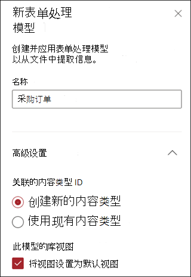
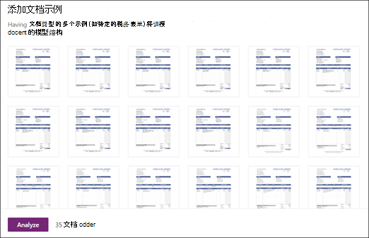
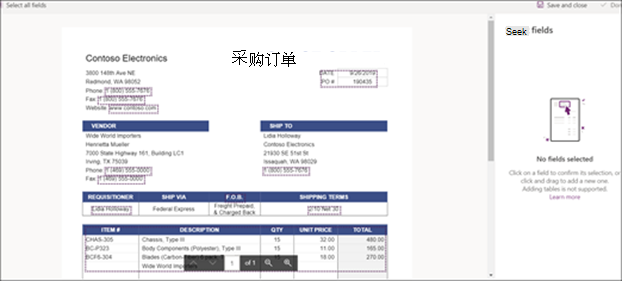
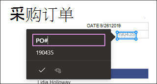

#  (预览中创建表单处理模型) Create a form processing model (Preview)

> [!Note] 
> 本文中的内容适用于 Project Cortex 私人预览。The content in this article is for Project Cortex Private Preview. 了解[有关 Project Cortex 的详细信息](https://aka.ms/projectcortex)。[Find out more about Project Cortex](https://aka.ms/projectcortex).

使用 [AI 生成器](https://docs.microsoft.com/ai-builder/overview) -Microsoft PowerApps-Project Cortex 中的一项功能用户可以直接从 SharePoint 文档库创建 [表单处理模型](form-processing-overview.md) 。Using [AI Builder](https://docs.microsoft.com/ai-builder/overview) - a feature in Microsoft PowerApps - Project Cortex users can create a [form processing model](form-processing-overview.md) directly from a SharePoint document library. 

创建表单处理模型涉及以下内容：Creating a form processing model involves the following:
 - 步骤1：创建源处理模型以创建内容类型Step 1: Create the from processing model to create the content type
 - 步骤2：添加和分析示例文件Step 2: Add and analyze example files
 - 步骤3：选择窗体域Step 3: Select your form fields
 - 步骤4：培训和测试您的模型Step 4: Train and test your model
 - 步骤5：发布模型Step 5: Publish your model
 - 步骤6：使用模型Step 6: Use your model

## RequirementsRequirements

您只能在启用了它的 SharePoint 文档库中创建表单处理模型。You can only create a form processing model in SharePoint document libraries in which it is enabled. 如果已启用表单处理，您将能够在文档库中的 "**自动**" 菜单下看到 " **AI 生成器**'**创建表单处理模型 '"** 。If form processing is enabled, you will be able to see the **AI Builder** **"Create a form processing model'** under the **Automate** menu in your document library.  如果您需要在文档库上启用处理，请与管理员联系。If you need from processing enabled on your document library, contact your admin.

  

## 步骤1：创建表单处理模型Step 1: Create a Form Processing model

创建表单处理模型的第一步是将其命名为 "定义新内容类型" 并为其创建新的文档库视图。The first step in creating a form processing model is to name it to create the define the new content type and create a new document library view for it.

1. 在文档库中，选择 " **自动** " 菜单，选择 " **AI 生成器**"，然后选择 " **创建表单处理模型**"。In your document library, select the **Automate** menu, select **AI Builder**, and then select **Create a Form Processing model**.

     
2. 在 " **新建表单处理模型** " 窗格中的 "  **名称** " 字段中，键入模型 (的名称，例如，" *采购订单*) "。In the **New form processing model** pane, in the  **Name** field, type a name for your model (for example, *Purchase Orders*).

      

3. 创建表单处理模型时，将创建新的 SharePoint 内容类型。When you create a form processing model, you are creating a new SharePoint content type. SharePoint 内容类型表示具有共同特征的文档类别，并共享该特定内容的一组列或元数据属性。A SharePoint content type represents a category of documents that have common characteristics and share a collection of columns or metadata properties for that particular content. SharePoint 内容类型通过 [内容类型库]()进行管理。SharePoint Content Types are managed through the [Content types gallery]().

    如果要将此模型映射到 SharePoint 内容类型库中的现有内容类型以使用其架构，请选择 " **高级设置** "。Select **Advanced settings** if you want to map this model to an existing content type in the SharePoint Content types gallery to use its schema. 

4. 您的模型将为提取的数据在文档库中创建一个新视图。Your model will create a new view in your document library for your extracted data. 如果您不想将其显示在默认视图中，取消选择 **"将视图设置为默认值**"。If you do not want it to the default view, deselect **Set the view as default**.
5. 选择“创建”\*\*\*\*。Select **Create**.

## 步骤2：添加和分析文档Step 2: Add and analyze documents

在创建新的表单处理模型后，浏览器将打开一个新的 PowerApps AI 生成器表单处理模型页面。After you create your new form processing model, your browser will open a new PowerApps AI Builder forms processing model page. 在此页面上，您可以添加和分析示例文档。On this page you can add and analyze your example documents.  

> [!Note]
> 在查找要使用的示例文件时，请参阅 [表单处理模型输入文档要求和优化提示](https://docs.microsoft.com/ai-builder/form-processing-model-requirements)。When looking for example files to use, see the [form processing model input document requirements and optimization tips](https://docs.microsoft.com/ai-builder/form-processing-model-requirements). 

     
 

1. 单击 " **添加文档** " 开始添加分析的示例文档，以确定可提取的命名值对。Click **Add documents** to begin adding example documents that are analyzed to determine what named value pairs can be extracted. 你可以选择 " **从本地存储**、 **SharePoint**或 **Azure Blob 存储**上传"。You can choose either **Upload from local storage**, **SharePoint**, or **Azure Blob storage**. 您至少需要使用5个文件进行培训。You will need to use at least five files for training.
2. 添加文件后，选择 " **分析** " 以检查所有常见信息是否为 "所有文件"。After adding your files, select **Analyze** to check for any information that is common is all files. 请注意，这可能需要几分钟的时间才能完成。Note that this may take several minutes to complete.  
 
      

3. 分析完成后，在 " **选择要保存的表单域** " 页上，单击文件以查看检测到的字段。After they have been analyzed, in the **Select the form fields you want to save** page, click the file to see the fields that were detected. 

      

## 步骤3：选择窗体域Step 3: Select your form fields

分析文档中的字段后，现在可以查看找到的字段以及要保存的字段。After analyzing your documents for fields, you can now see which fields were found, and which ones you want to save. 保存的字段将在模型的文档库视图中显示为列，并将显示从每个文档中提取的值。Saved fields will display as columns in your model's document library view and will show the values extracted from each document.

1. 下一页将显示其中一个示例文件，并将突出显示系统自动检测到的所有常见字段。The next page will display one of your sample files and will highlight all common fields that were automatically detected by the system.  

      

2. 选择要保存的域，然后选中该复选框以确认您的选择。Select the fields you want to save, and select the checkbox to confirm your selection. 例如，在 "采购订单" 模型中，可以选择选择 " *日期*"、" *采购*订单" 和 " *总计* " 字段。For example, in the Purchase Order model, you can choose to select the *Date*, *PO*, and *Total* fields.  请注意，您还可以选择重命名字段（如果选择）。Note that you can also choose to rename a field if you choose.  

      

3. 如果分析未检测到某个字段，您仍可以选择添加它。If a field was not detected by analysis, you can still choose to add it. 突出显示要提取的信息，并在 "名称" 框中键入要赋予它的名称。Highlight the information you want to extract, and in the name box type in the name you want to give it. 然后选中该复选。Then select the check. 请注意，您需要在其余的示例文件中确认未检测到的字段。Note that you will need to confirm undetected fields in your remaining example files.
4. 在选择了要保存的字段后，单击 " **确认字段** "。Click **Confirm fields** after you have selected the fields you want to save.  
 
      
 
5. 在 " **选择要保存的表单域** " 页上，它将显示所选的字段数。On the **Select the form fields you want to save** page, it will show the number of fields you have selected. 选择“完成”\*\*\*\*。Select **Done**.

## 步骤4：培训和测试您的模型Step 4: Train and test your model

在选择了要保存的字段后，" **模型摘要** " 页面将允许您对模型进行定型和测试。After selecting the fields you want to save, the **Model Summary** page will let you train and test your model.

1. 在 " **模型摘要** " 页上，保存的字段将显示在 " **选定的字段** " 部分。On the **Model Summary** page, the saved fields will show in the **Selected fields** section. 选择 " **训练** " 以开始对示例文件进行训练。Select **Train** to begin training on your example files. 请注意，这可能需要几分钟的时间才能完成。Note that this may take a few minutes to complete. 
      
2. 当您看到 "培训已完成" 通知时，请选择 " **转到详细信息" 页**。When you see the notification that training has completed, select **Go to details page**. 
3. 在 " **模型详细信息** " 页上，可以选择 " **快速测试**" 来测试模型的工作方式。On the **Model details** page, you can choose to test how your model works by selecting **Quick test**. 这样，您就可以将文件拖放到页面中，并查看是否检测到字段。This lets you drag and drop files to the page and see if the fields are detected.

## 步骤5：发布模型Step 5: Publish your model

1. 如果您对模型的结果感到满意，请选择 " **发布** " 以使其可供使用。If you are satisfied with the results of your model, select **Publish** to make it available for use.
2. 发布模型后，选择 " **使用模型**"。After the model published, select **Use model**. 这将创建一个将在 SharePoint 文档库中运行的 PowerAutomate 流，并将提取在模型中标识的字段。This creates a PowerAutomate flow that will run in your SharePoint document library and will extract the fields that have been identified in the model. 选择 " **创建流**"。Select **Create Flow**.  
3. 完成后，您将看到消息 **您的流已成功创建**。When completed, you will see the message **Your flow has been successfully created**.
 
 
## 步骤6：使用模型Step 6: Use your model

在发布模型并创建它的 PowerAutomate 流后，可以在 SharePoint 文档库中使用您的模型。After publishing your model and creating it's PowerAutomate flow, you can use your model in your SharePoint document library.

1. 发布模型后，选择 " **转到 SharePoint** " 以转到您的文档库。After publishing your model , select **Go to SharePoint** to go to your document library.
2. 在您的文档库模型视图中，请注意，您选择的字段现在显示为列。On your document library model view, notice that the fields you selected now display as columns. 

      

    另请注意， **文档** 旁边的信息链接将会看到，表单处理模型应用于此文档库。Also notice that the information link next to **Documents** will note that a forms processing model is applied to this document library.

       

3. 将文件上传到您的文档库。Upload files to your document library. 模型标识为其内容类型的任何文件都将在您的视图中列出文件，并将在列中显示提取的数据。Any files that the model identifies as it's content type will list the files in your view, and will display the extracted data in the columns. 

       

## 另请参阅See Also
  
[电源自动化文档Power Automate documentation](https://docs.microsoft.com/power-automate/) 
[培训：使用 AI 生成器改进业务绩效Training: Improve business performance with AI Builder](https://docs.microsoft.com/learn/paths/improve-business-performance-ai-builder/?source=learn) 

