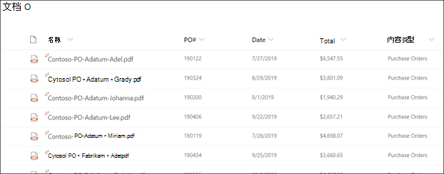

# 在 Microsoft SharePoint Syntex 中创建表单处理模型

 

> [!VIDEO https://www.microsoft.com/videoplayer/embed/RE4GnhN]  

 

使用[AI Builder](https://docs.microsoft.com/ai-builder/overview) - Microsoft PowerApps 中的一项功能 - SharePoint Syntex 用户可以直接从 SharePoint 文档库中创建[表单处理模型](form-processing-overview.md)。 

创建表单处理模型涉及以下操作：
 - 步骤 1：创建表单处理模型以创建内容类型
 - 步骤 2：添加和分析示例文件
 - 步骤 3：选择表单字段
 - 步骤 4：培训并测试你的模型
 - 步骤 5：发布模型
 - 步骤 6：使用模型

## 要求

只能在启用了表单处理的 SharePoint 文档库中创建表单处理模型。 如果已启用表单处理，你可以在文档库中的“**自动化**”菜单下看到 “**AI Buidler**” “**创建表单处理模型**”。  如果需要在文档库中启用处理，则必须联系你的 SharePoint 管理员。

  

## 步骤 1：创建表单处理模型

创建表单处理模型的第一步是将其命名并创建新内容类型的定义，以及为其创建新的文档库视图。

1. 在文档库中，选择 “**自动化**”菜单，选择 “**AI Builder**”，然后选择“**创建表单处理模型**”。

     

2. 在“**新的表单处理模型**”窗格中，在“**名称**”字段中，键入模型的名称（例如，“*采购订单*”）。

      

3. 创建表单处理模型时，将创建新的 SharePoint 内容类型。 SharePoint 内容类型表示具有共同特征的文档类别，并共享该特定内容的列或元数据属性的集合。 可通过“[内容类型库]()”管理 SharePoint 内容类型。

    如果想要将此模型映射到 SharePoint 内容类型库中的现有内容类型以使用其架构，请选择“**高级设置**”。 

4. 你的模型将在文档库中为提取的数据创建一个新视图。 如果不希望其成为默认视图，请取消选择“**将视图设置为默认**”。

5. 选择 **“创建”**。

## 步骤 2：添加和分析文档

创建新的表单处理模型后，浏览器将打开一个新的 PowerApps AI Builder 表单处理模型页面。 在此页面上，你可以添加和分析示例文档。  

> [!NOTE]
> 查找要使用的示例文件时，请参阅[表单处理模型输入文档要求和优化提示](https://docs.microsoft.com/ai-builder/form-processing-model-requirements)。 

     
 
1. 选择“**添加文档**”，开始添加已分析的示例文档，以确定可提取的指名值对。 然后，你可以选择“**从本地存储上传**”、“**SharePoint**”，或“**Azure Blob 存储**”。 至少需要使用五个文件进行培训。

2. 添加文件后，选择“**分析**”，检查所有文件的任何常见信息。 此操作可能需要几分钟才能完成。  
 
      

3. 分析文件后，在“**选择想要保存的表单域**”页面上，选择该文件以查看检测到的字段。 

      

## 步骤 3：选择表单字段

为字段而分析文档后，你现在可以看到找到的字段，并确定要保存的字段。 保存的字段在模型的文档库视图中显示为列，并显示从每个文档中提取的值。

1. 下一页将显示其中一个示例文件，并突出显示系统自动检测到的所有常见字段。  

      

2. 选择要保存的字段，然后选中该复选框以确认选择。 例如，在“采购订单”模型 中，选择选中“*日期*”、“*PO*” 和 “*总数*”字段。  请注意，如果选择的话，你也也可以选择重命名字段。  

      

3. 如果分析未检测到字段，你仍然可以选择添加。 突出显示要提取的信息，然后在名称框中键入所需名称。 然后选中复选框。 请注意，你需要在其余示例文件中确认未检测到的字段。

4. 选择要保存的字段后，单击“**确认字段**”。  
 
      
 
5. 在“**选择想要保存的表单字段**”页面，它将显示所选的字段数量。 选择 **“完成”**。

## 步骤 4：培训并测试你的模型

选择想要保存的字段后，“**模型摘要**”页可用于培训并测试模型。

1. 在“**模型摘要**”页面上，已保存的字段将显示在“**选定字段**”部分。 选择“**培训**”以开始对示例文件进行培训。 请注意，这可能需要几分钟才能完成。 

       

2. 当你看到“已完成培训”的通知时，请选择“**转到详细信息页面**。 

3. 在“**模型详细信息**”页面上，可选择“**快速测试**”来测试模型的工作方式。 这使你可以将文件拖放到页面上，查看是否检测到字段。

      

2. 当你看到“已完成培训”的通知时，请选择“**转到详细信息页面**。 

3. 在“**模型详细信息**”页面上，选择“**快速测试**”来测试模型的工作方式。 这使你可以将文件拖放到页面上，查看是否检测到字段。

## 步骤 5：发布模型

1. 如果你对模型的结果感到满意，请选择“**发布**”，使其可供使用。

2. 发布模型后，选择“**使用模型**”。 这将创建一个可在 SharePoint 文档库中运行的 PowerAutomate 流，它还可以提取已在模型中标识的字段，然后选择“**创建流**”。
  
3. 完成后，你将看到一条消息，“**已成功创建流**”。
 
## 步骤 6：使用模型

发布模型并创建 PowerAutomate 流后，可在 SharePoint 文档库中使用模型。

1. 发布模型后，选择“**转到 SharePoint**”，以便转到文档库。

2. 在文档库模型视图中，注意看，所选字段现在已显示为列。 

      

3. 注意看，**文档** 旁的信息链接提示了表单处理模型已应用于此文档库。

       

4. 将文件上传到文档库。 任何被模型识别为其内容类型的文件都会在视图中列出文件，并且在列中显示提取的数据。 

       

## 另请参阅
  
[Power Automate 文档](https://docs.microsoft.com/power-automate/)

[培训：使用 AI Builder 改善业务绩效](https://docs.microsoft.com/learn/paths/improve-business-performance-ai-builder/?source=learn)
