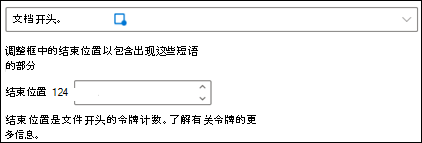
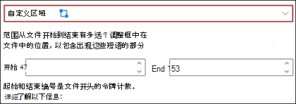

# 说明类型简介

说明用于帮助定义要标记的信息并在 Microsoft SharePoint Syntex 中的文档理解模型里进行提取。 创建说明时，需要选择说明类型。 本文将帮助你了解不同的说明类型以及它们的使用方式。 

    
   
可使用以下说明类型：

- **短语列表**：可在文档中使用的单词、短语、数字或其他字符的列表，或是正在提取的信息。 例如，文本字符串“**咨询医生**”存在于你正在识别的所有“医疗转介”文档中。 

- **模式列表**：列出可用于识别所提取信息的模式的数字、字母或其他字符。 例如，你可以从正在识别的所有“医疗转介”文档中提取咨询医生的“**电话号码**”。 

- **邻近度**：描述两个说明之间有多接近。 例如，*街道号码* 模式列表会先于 *街道名称* 短语列表出现，两者之间不设有令牌（你将在本文后面了解令牌）。 使用邻近度类型要求模型中至少有两个说明，否则将禁用该选项。 
 
## 短语列表

短语列表说明类型通常用于通过模型识别和分类文档。 正如“*咨询医生*”标签示例中所述，它是所标识的文档中一致出现的单词、短语、数字或字符的字符串。

虽然这并不是强制要求，但如果要捕获的短语位于文档中的一致位置，则可以在“说明”上取得更好的成功。 例如，“*咨询医生*”标签可能一直位于文档中的第一段。

如果标识标签时需要区分大小写，使用短语列表类型可以使你在说明中指定这种情况，只需通过选择“**仅完全匹配的大写**”复选框。

    

## 模式列表

当你创建一个从文档中标识和提取信息的说明时，阵列模式类型特别有用。 它通常以不同的格式显示，如日期、电话号码和信用卡号码。 例如，可按多种不同的格式显示日期（1/1/2020、1-1-2020、01/01/20、01/01/2020、2020 年 1 月 1 日等等）。 通过在你尝试标识和提取的数据中捕获任何可能的变体，定义模式列表使你的说明变得更加高效。 

对于“**电话号码** ”示例，从模型识别的所有“医疗转介”文档中提取每个咨询医生的电话号码。 创建说明时，选择”模式列表”类型以便允许返回预期会返回的不同格式。

   

在此示例中，选择“**0 - 9 中的任何数字**”复选框，以将模式列表中使用的“0”值识别为 0 到 9 中的任何数字。

   

同样，如果创建包含文本字符的模式列表，选择“**a-z 中的任何字母**”复选框，以将模式列表中使用的“a”字符识别为“a”到“z”中的任何字符。

例如，如果创建“**日期**”模式列表，并且想确保识别出日期格式（如 *Jan 1, 2020*），则需执行以下操作：
- 将 *aaa 0, 0000* 和 *aaa 00, 0000* 添加到模式列表中。
- 确保也选中了 **a-z 中的任何字母**。

   

此外，如果在模式列表中有大写要求，可选择“**仅完全匹配的大写**”复选框。 对于“日期”示例，如果需要将月份的第一个字母大写，则需要执行以下操作：

- 将 *Aaa 0, 0000* 和 *Aaa 00, 0000* 添加到模式列表中。
- 确保也选中了“**仅完全匹配的大写**”。

   

> [!NOTE]
> 请使用 [说明库](#use-explanation-templates)，以便从常见模式列表中使用模式列表模板，如 *日期*、*电话号码*、*信用卡号码* 等等，而不是手动创建模式列表说明。

## 邻近度 

邻近度说明类型可帮助模型识别数据（通过定义另一份数据与其的接近程度）。 例如，在模型中，你已经定义了两个用于标记客户的“*街道地址编号*”和“*电话号码*”的说明。 

注意客户的电话号码始终出现在街道地址编号的前面。 

Alex Wilburn 
555-555-5555 
One Microsoft Way 
Redmond, WA 98034 

使用邻近度说明来定义电话号码说明的距离，以便更好地识别文档中的街道地址编号。

    

#### 什么是令牌？

为使用邻近度说明类型，需理解令牌的含义，因为令牌数目是邻近度说明测量某个说明与另一个说明距离的方法。 令牌是字母和数字的连续跨度结构（不包含空格或标点）。 

下表显示了一些如何确定短语中令牌数目的示例。

|短语|令牌的数目|说明|
|--|--|--|
|`Dog`|1|单个单词，无标点符号或空格。|
|`RMT33W`|1|记录定位器的编号。 它可能包含数字和字母，但不包含标点符号。|
|`425-555-5555`|5|电话号码。 每个标点符号是一个令牌，因此 `425-555-5555` 是 5 个令牌： `425` `-` `555` `-` `5555` |
|`https://luis.ai`|7|`https` `:` `/` `/` `luis` `.` `ai` |

#### 配置邻近度说明类型

针对示例，请配置邻近度设置，以定义从“*街道地址编号*”说明到“*电话号码*”说明的令牌数量的范围。 注意最小范围是“0”，因为电话号码和街道地址编号之间没有令牌。

但示例文档中的某些电话号码附加了 *(mobile)*。

Nestor Wilke 
111-111-1111 (mobile) 
One Microsoft Way 
Redmond, WA 98034 

*(mobile)* 中有三个令牌：

|短语|令牌计数|
|--|--|
|(|1|
|mobile|2|
|)|3|

配置邻近度设置，以便拥有 0 到 3 的范围。

    

## 配置短语在文档中出现的位置

创建说明时，默认情况下会在整个文档中搜索要提取的短语。 但是，可以使用“<b>这些短语出现的位置</b>”高级设置来帮助隔离文档中出现短语的特定位置。 这适用于文档的其他位置可能出现短语的类似实例，而你希望确保选择正确短语的情况。 以我们的医疗转诊文档为例，文档的第一段中总是会提到 **转诊医生**。 通过“<b>这些短语出现的位置</b>”设置，在本示例中，你可以配置说明以仅在文档开头或可能出现该短语的任何其他位置搜索该短语。

    

可以为此设置选择以下选项：

- 文件中的任何位置：将在整个文档中搜索短语。
- 文件开头：从文档开头开始搜索短语。  
    
在查看器中，可以手动调整选择框以包括出现短语的位置。 <b>结束位置</b>值将更新以显示所选区域包含的令牌数。 请注意，可以更新“结束位置”值并调整所选区域。 
    

- 文件末尾：从文档末尾开始搜索短语。  
    
在查看器中，可以手动调整选择框以包括出现短语的位置。 <b>开始位置</b>值将更新以显示所选区域包含的令牌数。 请注意，可以更新“开始位置”值并调整所选区域。  
    
- 自定义范围：在文档内的指定范围内搜索短语位置。  
    
在查看器中，可以手动调整选择框以包括出现短语的位置。 对于此设置，需要选择一个<b>开始</b>和<b>结束</b>位置。 这些值表示从文档开头开始的令牌数。 尽管可以手动输入这些值，但在查看器中手动调整选择框更容易。  
   
## 使用说明模板

可手动添加各个短语列表值进行解释，但使用解释库中提供模板更为轻松。

例如，可以使用 *Date* 的短语列表模板来手动添加 *Date* 的所有变体，因为它已包含许多短语列表值： 

    
 
解释库包含常用的短语列表说明，包括： 

- 日期 
- 日期（数值） 
- 时间 
- 号码 
- 百分比 
- 电话号码 
- 邮政编码 
- 一句话的第一个词 
- 句末 
- 信用卡 
- 社会安全号码 
- 复选框 
- 货币 
- 电子邮件抄送 
- 电子邮件日期 
- 电子邮件问候语 
- 向电子邮件收件人发送电子邮件 
- 电子邮件发件人 
- 电子邮件主题 

说明库还包含三种自动模板类型，用于处理示例文件中标记的数据：

- 标记后：示例文件中标签后发生的字词或字符。 
- 标签之前：示例文件中标签前发生的字词或字符。 
- 标签：示例文件前 10 个标签。 

为提供自动模板工作方式的示例，以下示例文件中将使用"之前的标签"说明模板，帮助为模型提供更多信息，以获得更准确的匹配。

    

选择"标签之前"说明模板时，它将查找示例文件中标签前显示的第一组字词。 在示例中，第一个示例文件中标识的字词为"截至"。

    

可选择" <b>添加</b> 模板创建解释。  添加更多示例文件时，将在短语列表中标识并添加其他字词。

    
 
#### 若要使用说明库中的模板

1. 从模型的“**培训**”页面的“**说明**”部分中，选择“**新建**”，然后选择“**通过模板**”。 

    

2.  在“**说明模板**”页面上，选择要使用的说明，然后选择“**添加**”。 

        

3. 所选模板的信息显示在“**创建说明**”页面。 如果需要，可编辑解释名称，并从短语列表中添加或删除项目。   

    

4. 完成后，选择“**保存**”。