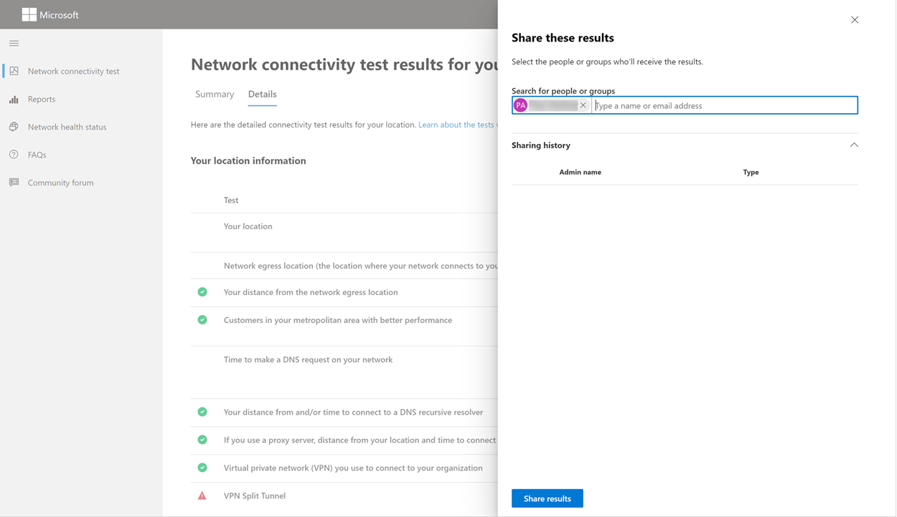

# Microsoft 365 网络连接测试 (预览) 

Microsoft 365 网络连接测试工具位于 <https://connectivity.office.com> 。 它是一种辅助工具，适用于 Microsoft 365 管理中心中的 "网络评估" 和 "网络洞察力" 信息，在 **运行状况 |连接** 菜单。

>[!NOTE]
>网络连接测试工具支持 WW 商业和德国的租户，但不支持 GCC 中、GCC 高级、DoD 或中国的租户。

Microsoft 365 管理中心中的网络见解基于每天进行聚合的 Microsoft 365 租户的定期产品度量。 相比之下，Microsoft 365 网络连接测试中的网络洞察力在本地运行，一次在该工具中运行。 可以在产品中完成的测试是有限的，并且可以通过在用户的本地运行测试来收集更多数据，从而获得更深入的见解。 请考虑，Microsoft 365 管理中心中的网络见解将显示在特定办公地点使用 Microsoft 365 的网络问题。 Microsoft 365 连接测试可帮助确定问题的根本原因，从而导致建议的网络性能改进操作。

我们建议将这些信息结合使用，以便在 Microsoft 365 管理中心中的每个办公室位置评估网络质量状态，并在部署基于 Microsoft 365 连接测试的测试之后找到更多的详细信息。

>[!IMPORTANT]
>网络洞察力、Microsoft 365 管理中心中的性能建议和评估当前处于预览状态，并且仅适用于已在功能预览计划中注册的 Microsoft 365 租户。

## 高级测试客户端应用程序

Microsoft 365 网络连接测试分为两个部分; <https://connectivity.office.com> 运行高级网络连接测试的网站和可下载的 Windows 客户端应用程序。 大多数测试都需要运行应用程序。 它将在运行时将结果重新填充到网页中。

在 web 浏览器测试完成后，系统将提示您从网站下载高级客户端测试应用程序。 在出现提示时打开并运行该文件。

## 共享测试报告

测试报告需要登录 Office 365 帐户。 您的管理员可以选择共享测试报告的方式。

### 与管理员共享你的报告

登录时的所有测试报告都将与管理员共享。

### 与你的 Microsoft 帐户团队、支持或其他人员共享

与 Microsoft 员工共享不含任何个人标识的测试报告。 默认情况下启用此设置，您的管理员可以在 **运行状况 | 中禁用它。** Microsoft 365 管理中心中的 "网络连接" 页面。

### 与登录到同一 Office 365 租户的其他用户共享

您可以选择要与之共享报告的用户，并且默认情况下会启用此功能。 管理员也可以禁用此功能。

### 使用 ReportID 链接与任何人共享

通过提供对 ReportID 链接的访问权限，您可以与任何人共享您的测试报告。 这将生成一个 URL，可以将其发送给某人，以便他们能够在不登录的情况下引入测试报告。 默认情况下，此设置处于禁用状态，必须由管理员启用。

## 网络连接测试结果

结果将显示在 " **摘要** " 和 " **详细信息** " 选项卡中。 "摘要" 选项卡显示检测到的网络外围的地图以及网络评估与附近其他 Office 365 客户的比较。 它还允许共享测试报告。 摘要结果视图的外观如下所示。

下面的示例展示了该工具显示的 "详细信息" 选项卡输出。 在 "详细信息" 选项卡上，如果结果与阈值比较，则显示绿色圆圈复选标记。 如果结果超过了指示网络洞察力的阈值，我们将显示红色三角形感叹号。 以下各节介绍了每个详细信息选项卡结果行，并说明了用于网络洞察力的阈值。

### 您的位置信息

此部分显示与您的位置相关的测试结果。

#### 您的位置

用户在用户 web 浏览器中检测到用户位置，也可以在用户选项中键入该位置。 它用于标识与企业网络周边的特定部分之间的网络距离。 仅此位置检测中的市/县和到其他网络点的距离保存在报告中。

用户办公室位置显示在地图视图中。

#### 网络传出位置 (网络连接到 ISP 的位置) 

我们在服务器端标识网络出口 IP 地址。 位置数据库用于查找网络出口的大概位置。 这些数据库通常具有大约90% 的 IP 地址精度。 如果从网络传出 IP 地址查找的位置不准确，这将导致此测试产生错误结果。 若要验证是否发生了特定 IP 地址的此错误，可以使用可公开访问的网络 IP 地址位置网站与实际位置进行比较。

#### 距网络传出位置的距离

我们确定从该位置到办公室位置之间的距离。 如果距离大于 **500 英里** (800 公里，这会显示为网络洞察力) 因为这可能会导致超过25ms 的延迟，并且可能会影响用户体验。

网络出局位置显示在地图视图中，并连接到用户办公室位置，以指示企业 WAN 中的网络 backhaul。

建议在 Microsoft 365 网络连接中，将本地和直接的网络出口从用户办公室位置实施到 Internet。 对本地和直接出口的改进是解决此网络洞察力的最佳方法。

#### 代理服务器信息

我们) 在本地计算机上配置代理服务器 (s。 我们确定是否在网络路径中配置了这些配置以优化类别 Microsoft 365 网络流量。 我们确定从用户办公室位置到代理服务器的距离。 先通过 ICMP ping 测试距离，如果此操作失败，我们使用 TCP ping 进行测试，如果失败，则在 IP 地址位置数据库中查找代理服务器 IP 地址。 如果代理服务器超过 **500 英里** (800 公里) 远离用户办公室位置，我们将显示网络洞察力。

#### 用于连接到您的组织的虚拟专用网络 (VPN) 

这将检测您是否正在使用 VPN 连接到 Office 365。 如果你没有 VPN，或者你具有 Office 365 的推荐拆分隧道配置的 VPN，则将显示传递结果。

#### VPN 拆分隧道

对 Exchange Online、SharePoint Online 和 Microsoft 团队的每个优化类别路由进行测试，以查看是否在 VPN 上 tunnelled。 拆分工作负载可以完全避免 VPN。 Tunnelled 工作负荷是通过 VPN 发送的。 一个选择性的 tunnelled 工作负荷具有通过 VPN 发送的某些路由，而某些路由已被剥离。如果所有工作负荷被拆分或选择性 tunnelled，则将显示传递结果。

#### 具有更佳性能的大都市区域内的客户

与同一地铁区域中的其他 Microsoft 365 客户相比，Exchange Online 服务前向的用户办公室位置的网络 TCP 延迟。 如果在同一地铁区域中10% 或更多的客户具有更好的性能，则显示网络洞察力。 这意味着，在 Microsoft 365 用户界面中，用户将获得更好的性能。

根据城市中的所有用户都可以访问相同的电信基础结构和与 Internet 电路和 Microsoft 网络的邻近性，生成网络洞察力。

#### 对网络发出 DNS 请求的时间

此示例显示在运行测试的客户端计算机上配置的 DNS 服务器。 它可能是 DNS 递归解析器服务器，但这并不常见。 它更可能是缓存 DNS 结果并将任何未缓存的 DNS 请求转发到另一个 DNS 服务器的 DNS 转发器服务器。

提供此功能仅用于提供信息，并不会影响网络的洞察力。

#### 连接到 DNS 递归冲突解决程序的距离和/或时间

通过发出特定的 DNS 请求，然后向 DNS 名称服务器提供来自收到相同请求的 IP 地址，可以标识使用中的 DNS 递归冲突解决程序。 此 IP 地址是 DNS 递归解析程序，将在 IP 地址位置数据库中查找以找到该位置。 然后计算从用户办公室位置到 DNS 递归解析服务器位置之间的距离。 如果距离大于 **500 英里** (800 公里) ，这会显示为网络洞察力。

从网络传出 IP 地址查找的位置可能不准确，这将导致此测试产生错误结果。 若要验证是否为特定 IP 地址出现此错误，可以使用可公开访问的网络 IP 地址位置网站。

此网络洞察力尤其会影响 Exchange Online 服务前盖的选择。 若要解决此深入了解，本地和直接网络出口应为先决条件，然后 DNS 递归解析器应位于该网络出口附近。

### Exchange Online

此部分显示与 Exchange Online 相关的测试结果。

#### Exchange 服务前盖位置

以 Outlook 执行此功能的相同方式标识使用中的 Exchange 服务前向门，并将网络 TCP 延迟从用户位置测量到它。 显示 TCP 延迟，并将正在使用的 Exchange 服务前向门与当前位置的最佳服务前盖列表进行比较。 如果未使用最佳 Exchange 服务前向 (s) 中的一门，这将显示为网络洞察力。

如果不使用最佳 Exchange 服务前向 (s) 可能是网络 backhaul 在公司网络出口之前导致的，我们建议本地和直接网络出口。 也可能是由于使用远程 DNS 递归冲突解决服务器而导致的，在这种情况下，我们建议您将 DNS 递归解析器服务器与网络出口对齐。

我们计算了对 Exchange 服务前向门 (ms) 的 TCP 延迟的潜在改进。 为此，请查看测试的用户办公室位置网络延迟，并将网络延迟从当前位置减去当前位置，再减去 closets Exchange service 的前向门。 不同之处表示潜在的改进机会。

#### 适用于您的位置 (s) 的最佳 Exchange 服务前盖

这将按城市列出你所在地区的最佳 Exchange 服务前盖位置。

#### 在客户端 DNS 中记录的服务前盖

这将显示定向到的 Exchange 服务前端服务器的 DNS 名称和 IP 地址。 仅提供此信息，没有相关的网络洞察力。

### SharePoint Online

此部分显示与 SharePoint Online 和 OneDrive 相关的测试结果。

#### 服务前盖位置

使用与 OneDrive 客户端相同的方式标识正在使用的 SharePoint 服务前向门，并将网络 TCP 延迟从用户办公室位置测量到它。

#### 下载速度

我们通过 SharePoint 服务的前端衡量15Mb 文件的下载速度。 结果以每秒 mb 为单位显示，以指示可以从 SharePoint 或 OneDrive 中 **一秒**下载的大小文件（以 mb 为单位）。 该号码应类似于每秒最小电路带宽的十分之一。 例如，如果 internet 连接为100mbps，则可能需要每秒 10 mb (10MBps) 。

#### 缓冲区膨胀

在15Mb 下载过程中，我们会将 TCP 延迟测量到 SharePoint 服务的前向门。 这是负载下的延迟，并将与不在负载下时的延迟进行比较。 在负载不足时延迟的增加通常由 (或 bloated) 中加载的消费网络设备缓冲区所归属。 为1000或更多的膨胀显示网络洞察力。

#### 在客户端 DNS 中记录的服务前盖

此示例显示定向到的 SharePoint 服务前端服务器的 DNS 名称和 IP 地址。 仅提供此信息，没有相关的网络洞察力。

### Microsoft Teams

此部分显示与 Microsoft 团队相关的测试结果。

#### 媒体连接 (音频、视频和应用程序共享) 

这将测试与 Microsoft 团队服务前盖的 UDP 连接。 如果阻止此操作，则 Microsoft 团队仍可能使用 TCP，但音频和视频将受到影响。 阅读有关这些 UDP 网络度量的详细信息，这些度量也适用于 Microsoft 团队在 [Skype for Business Online 中的媒体质量和网络连接性能](https://docs.microsoft.com/skypeforbusiness/optimizing-your-network/media-quality-and-network-connectivity-performance)

#### 数据包丢失

显示 UDP 数据包丢失量，以10秒测试音频呼叫从客户端到 Microsoft 团队服务前向门。 对于 pass，这应低于 **1.00%** 。

### 延迟

显示度量的 UDP 延迟，该延迟应低于 **100 毫秒**。

#### 抖动

显示测量的 UDP 抖动，它应低于 **30ms**。

#### 连接

我们测试从用户办公室位置到所有必需的 Microsoft 365 网络终结点的 HTTP 连接。 这些内容是在中发布的 [https://aka.ms/o365ip](https://aka.ms/o365ip) 。 对于任何不能连接到的必需网络终结点，都会显示网络洞察力。

连接 ay 由企业网络外围上的代理服务器、防火墙或其他网络安全设备阻止，或作为云代理使用。

我们会在所需的每个 Microsoft 365 网络终结点（在上定义了）中测试 SSL 证书 [https://aka.ms/o365ip](https://aka.ms/o365ip) 。 如果有任何测试未找到 Microsoft SSL 证书，则已连接的加密网络必须已被中间网络设备截取。 网络洞察力显示在任何截获的加密网络终结点上。

在找不到 Microsoft 提供的 SSL 证书的情况下，我们会显示该测试的 FQDN 以及正在使用的 SSL 证书所有者。 此 SSL 证书所有者可能是代理服务器供应商，也可能是企业自签名证书。

#### 网络路径

本节显示了 ICMP traceroute 对 Exchange Online 服务前向门、SharePoint Online service 前门和 Microsoft 团队服务前盖的结果。 仅提供此信息，没有相关的网络洞察力。 提供了三个 traceroutes。 一个 traceroute 到 _outlook.office365.com_，一个 traceroute 到客户的 SharePoint 前端或 _microsoft.sharepoint.com_ ，如果未提供，则 traceroute 到 _world.tr.teams.microsoft.com_。

## 每个测试步骤中会发生的情况

### 办公室位置标识

当您单击 "运行测试" 按钮时，将显示正在运行的测试页并标识办公室位置。 您可以按城市、省市自治区和国家/地区键入，也可以在 web 浏览器中检测到该位置。 如果检测到此情况，我们会从 web 浏览器请求纬度和经度，并在使用之前将精度限制为 300m 300m。 我们这样做的原因是，与构建网络性能相比，不需要更准确地确定位置。 

### JavaScript 测试

在 office 位置标识之后，我们会在 JavaScript 中运行 TCP 延迟测试，并向服务请求有关正在使用的 Office 365 服务前端服务器和建议的 Office 服务前端服务器的数据。 完成这些操作后，我们会将其显示在地图上和 "详细信息" 选项卡中，在下一步之前可以查看它们。

### 下载高级测试客户端应用程序

接下来，我们将开始下载高级测试客户端应用程序。 我们依赖用户来启动客户端应用程序，并且还必须安装 .NET Core。

### 启动高级测试客户端应用程序

在客户端应用程序启动后，网页将进行更新以显示此数据，并将开始将测试数据接收到网页。 每次接收新数据时，它都会更新，您可以在数据到达时查看数据。

### 高级测试已完成并测试报表上载

完成测试后，网页和高级测试客户端将同时指明这一点，如果测试报告中的用户已登录，则会将其上载到客户租户。

## 连接性报告

登录后，您可以查看以前运行的报告。 您也可以将其共享或从列表中删除。

## 网络运行状况状态

这显示了 Microsoft 全球网络中可能影响 Microsoft 365 客户的任何重大运行状况问题。

## 常见问题解答

以下是一些常见问题的解答。

### 此工具是否已发布并受 Microsoft 支持？

目前它是一个预览，我们计划定期提供更新，直到我们能够从 Microsoft 获得支持的常规可用性发布状态。 请提供反馈以帮助我们改进。 我们打算将更详细的 Office 365 网络加入指南作为此工具的一部分进行发布，此工具可通过其测试结果自定义为组织。

### 运行高级测试客户端需要什么？

高级测试客户端需要 .NET Core 3.1 桌面运行时。 如果在未安装的情况下运行高级测试客户端，则会转到 [.Net Core 3.1 installer 页面](https://dotnet.microsoft.com/download/dotnet-core/3.1)。 请务必安装桌面运行时，而不是 SDK 或 ASP.NET Core Runtime 在页面上的位置。 计算机上的管理员权限是 reuqired，用于安装 .NET Core。 

### 什么是 Microsoft 365 服务的前门？

Microsoft 365 服务的前端是 Microsoft 全球网络的一个入口点，Office 客户端和服务终止其网络连接。 为实现到 Microsoft 365 的最佳网络连接，建议您的网络连接在城市或地铁的最近 Microsoft 365 前向外端终止。

注意： Microsoft 365 服务前向与 azure marketplace 提供的 **Azure 前门服务** 产品没有直接关系。

### 什么是最佳的 Microsoft 365 服务前盖？

最佳的 Microsoft 365 服务前盖 (以前称为最佳服务前盖) 是最接近您的网络出口（通常在您所在的城市或大都市区域中）的一门。 使用 Microsoft 365 网络性能工具来确定正在使用的 Microsoft 365 服务前盖的位置，以及最佳的服务前盖 (s) 。 如果该工具确定您的使用中的前门是最佳的，那么您应该会有连接到 Microsoft 全局网络的完美连接。

### Internet 出口的位置是什么？

Internet 出局位置是网络流量退出企业网络并连接到 Internet 的位置。 这也标识为您的网络地址转换 (NAT) 设备的位置，通常与 Internet 服务提供商 (ISP) 进行连接的位置相同。 如果你发现您的位置和 internet 出局位置之间的距离很长，则这可能会发现重要的 WAN backhaul。

## 相关主题

[Microsoft 365 管理中心中的网络性能建议 (preview) ](office-365-network-mac-perf-overview.md)

[Microsoft 365 网络性能见解 (预览版) ](office-365-network-mac-perf-insights.md)

[Microsoft 365 网络评估 (预览版) ](office-365-network-mac-perf-score.md)

[Microsoft 365 网络连接位置服务 (预览) ](office-365-network-mac-location-services.md)
