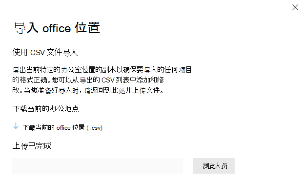

# Microsoft 365 管理中心管理中心网络连接会 (预览) 

现在，Microsoft 365 管理中心包括从 Microsoft 365 租户收集的聚合网络连接指标，并仅可供租户中的管理员用户查看。 **Microsoft** 365 **管理中心的"** 运行状况"下方将显示网络评估和网络 **见解连接**。

当你首次导航到网络连接页面时，你将看到一个概述窗格，其中包含全局网络性能映射、范围设置为整个租户的网络评估和当前问题列表。 从概述中，你可以深入了解特定网络性能指标以及按位置查看问题。 有关详细信息，请参阅 [Microsoft 365 管理中心的网络性能概述](#network-connectivity-overview-in-the-microsoft-365-admin-center)。

## 显示网络连接评估的先决条件

从办公地点获取网络评估有三种方法：

### 1. 启用 Windows Location Services

对于此选项，必须在支持先决条件的每个办公地点运行至少两台计算机。 必须在每台计算机上安装 OneDrive for Windows 版本 19.232 或更高版本。 有关 OneDrive 版本的详细信息，请参阅 [OneDrive 发行说明](https://support.office.com/article/onedrive-release-notes-845dcf18-f921-435e-bf28-4e24b95e5fc0)。 网络测量计划在不随将来添加在其他 Office 365 客户端应用程序中。

必须在计算机上同意 Windows 位置服务。 你可以通过运行地图应用 **并** 定位你自己的来测试它。 它可以通过"设置隐私位置"**启用**  ->  **，**  ->  **Location**其中必须启用"允许应用访问你的位置"的设置隐私位置启用它。 可以使用 MDM 或组策略将 Windows 定向许可部署到电脑，设置_LetAppsAccessLocation。_

无需使用此方法在管理中心添加位置，因为这些位置会自动以城市解决方案进行标识。 你无法使用 Windows 定服务在某个城市内显示多个办公地点。

计算机应具有 WLAN 网络而不是以拉型网网络。 具有以下网电缆的计算机没有准确的位置信息。

度量示例和办公地点应在满足这些先决条件后的 24 小时开始。

### 2. 添加位置并提供 LAN 子网信息

对于此选项，Windows Location Services 和 Wi-Fi 都不需要。 在每个计算器的点处安装以上的适用于 Windows 版本 20.161.0811.0001 或更高版本的 OneDrive。

你还需要在管理中心网络连接页中添加位置或从 CSV 文件导入这些位置。 添加的位置必须包含 Office LAN 子网信息。

因为要添加位置，因此可以在一个城市内定义多个办公。

度量示例和办公地点应在满足这些先决条件后的 24 小时开始。

### 3. 使用 Microsoft 365 网络连接性测试工具手动收集测试报告

对于此选项，你需要在每个位置确定一个人。 让他们在其上拥有 [管理权限的](https://connectivity.office.com) Windows 计算机上将他们访问 Microsoft 365 网络连接测试。 在网站上，他们需要在要查看结果的同一租户中登录自己的 Office 365 帐户。 然后，他们单击"运行测试"。 测试期间会有已下载的连接性测试 EXE。 THey 需要打开和执行该功能。 测试完成后，将测试结果上传到 Microsoft。

如果测试报告是带 LAN 子网信息添加的位置，则将测试报告链接到某个位置;否则这些报告只能显示在城市位置。

测量示例和办公地点应在测试结果完成后 2-3 分钟内开始。

## 如何使用此信息？

**网络见解及其相关的性能**建议和网络评估旨在帮助为办公地点设计网络外围。 每个见解提供用户访问你的租户的每个地理位置的特定常见问题的性能特征的详细信息。 **对每个网络** 见解的性能建议都提供可以进行的特定网络体系结构设计更改，以改善与 Microsoft 365 网络连接相关的用户体验。 网络评估显示网络连接对用户体验的影响，它允许与不同的用户位置网络连接进行比较。

**网络评估** 将许多网络性能指标汇聚为企业网络运行状况快照，表示为从 0 - 100 之间的一个点值表示。 网络评估的范围同时适用于整个租户，且范围针对用户连接到你的租户的每个地理位置，使 Microsoft 365 管理员可以轻松地获取企业网络运行状况的手段，并快速深入了解任何全局办事处位置的详细报告。

具有多个办事处和不加比重网络外围体系结构的复杂企业在初始载入到 Microsoft 365 期间或通过修改使用情况增长发现的网络性能问题都可以从这些信息中受益。 这对于使用 Microsoft 365 的小型企业或者网络连接性简单和直接连接的企业来说通常不是必需的。 用户数超过 500 的企业和多个办事处的企业将受益于最优势。

>[!IMPORTANT]
>Microsoft 365 管理中心中的网络见解、性能建议和评估目前处于预览状态，仅适用于已注册功能预览计划的 Microsoft 365 租户。

## 企业网络连接挑战

许多企业具有网络外围配置，这些配置随时间的推出进行了扩展，并且主要设计为应对员工 Internet 网站进行访问，其中大多数网站提前未知且不受信任。 预先设计和必要的重点是避免这些未知网站的恶意软件和攻击。 本网络配置策略（虽然对安全而有帮助）会导致 Microsoft 365 用户性能降低和用户体验。

## 我们如何解决这些挑战

企业可通过以下 [Office 365](https://aka.ms/pnc) 连接原则和使用 Microsoft 365 管理中心网络连接功能来改进常规用户体验和保护其环境。 在大多数情况下，按照这些常规原则，将对 Microsoft 365 的最终用户延迟、服务可靠性和整体性能产生重大的影响。

有时，Microsoft 要求你调查 Microsoft 365 适用于大型企业客户的网络性能问题，这些通常具有与客户网络出变基础结构相关的根本原因。 发现客户网络外围问题的常见根本原因时我们要确定标识它的简单测试测量。 具有确定特定问题的度量阈值的测试对您来说十分有价值，因为我们可以在任何位置测试相同的度量值，判断此根本原因是否存在，并将其作为网络见解与管理员共享。

某些网络见解仅表示一个需要进一步调查的问题。 网络见解中，我们有足够的测试显示特定修正操作来更正根本原因，作为建议 **操作**。 这些建议基于显示超过预先确定阈值的实时指标，与通用最佳做法建议相比，这些建议比常规最佳实践做法更有价值，因为它们特定于您的环境，并将在做出建议的更改后显示实际改进。

## Microsoft 365 管理中心的网络连接概述

Microsoft 具有来自多个支持 Microsoft 365 操作的 Office 桌面和 Web 客户端的现有网络测量。 这些测试现在用于提供网络体系结构设计见解和 Microsoft 365 管理中心的" **网络** 连接"页面中显示的网络评估。

默认情况下，与网络度量关联的近距离位置信息可确定客户端设备所在的城市。 每个位置的网络评估都用颜色显示，每个位置的用户相对用户数由圆圈的大小表示。

概述页面还将客户的网络评估显示为所有办公地点的加权平均值。

## 特定办公地点网络性能摘要和见解

选择办公地点时，会打开一个位置特定的摘要页面，该页面显示通过该办公地位置的度量中标识的网络出端的详细信息。

Office 位置摘要页还显示位置的网络评估、网络评估历史记录、此位置对同一城市的其他客户的比较，以及在提高网络性能和可靠性时可以执行的特定见解和建议列表。 包含特定建议的位置可能还包括估计的潜在延迟改进。

同一城市的客户之间的比较基于以下结果：所有客户都可同意访问网络服务提供商、电信基础结构和附近的 Microsoft 网络点的现场。

"办公地点"页面上的详细信息选项卡显示用于提供任何见解、建议和网络评估的具体度量结果。 提供此项是为了使网络工程师能够验证其环境中任何限制或特定内容中的建议和规格。

## 适用于 LAN 子网地源位置的 CSV 导入

对于 LAN 子网办公机号，需要提前添加每一种 locaiton。 您无需在"位置"选项卡中添加单独的 **办公位置** ，而是从 CSV 文件导入这些位置。 你可以从已存储的其他位置（例如呼叫质量仪表板或 Active Directory 站点和服务）获取此数据

在 CSV 文件中，发现城市位置标记为 **"城市"，** 手动添加的办公地点标记为 **位置**。

1. 在与 _Microsoft 365 的主连接中，_ 单击"位置 **"** 选项卡。
1. 单击位置 **列表** 上方的导入按钮。 此 **时，将出现** "导入办公地点"浮出控件。

   

1. 单击" **下载当前的办公 (.csv) ** 链接，将当前位置列表导出到 CSV 文件，并将其保存到本地硬盘。 这将为您提供格式正确的 CSV，其中包含可以向其中添加位置的列标题。 可以原来保留现有的导出位置;导入更新的 CSV 时，它们不会复制。 如果希望更改现有位置的地址，会在导入 CSV 时更新该地址。 您无法更改发现的城市的地址。
1. 打开 CSV，并通过针对您要添加的每个位置在新行上填写下列字段来添加位置。 将所有其他字段保留为空;您在其他字段输入的值将被忽略。
   1. **必需** (地址) ：办公室的物理地址
   1. **以下语言 (语言) ：** 从必应地图中填充，如果为空白
   1. **最长 (类型**) ：从必应地图中填充，如果为空白
   1. **IP 地址范围 1-5 (** 可选) ：对于每个范围，请输入后跟一个空格，用空格分隔有效的 IPv4 或 IPv6 CIDR 地址。 这些值用于区分你使用同一 LAN 子网 IP 地址的多个办公地点。
   1. **LanIPs** (所需的) ：列出在此办公地点使用的 LAN 子网范围。
1. 添加办公位置并保存了文件之后，请单击" **上载已** 完成"字段旁 **边的"浏览"** 按钮，然后选择保存的 CSV 文件。
1. 该文件将自动验证。 如果出现验证错误，您将看到导入 _文件中的一些错误。请检查错误，更正导入文件，然后重试。_ 单击链接 **"打开错误"** 链接，以了解特定字段验证错误的列表。

   

1. 如果文件中没有错误，则将看到消息 _"报告已准备就绪"。找到要添加的 x 位置和要更新的 x 位置。_ 单击导入 **按钮** ，上载 CSV。

   

## 常见问题

### 什么是 Microsoft 365 服务前端？

Microsoft 365 服务前端是 Microsoft 全局网络上的入口点，Office 客户端和服务在此网络连接终止其网络连接。 若要建立与 Microsoft 365 的最佳网络连接，建议网络连接终止到最接近的 Microsoft 365 首要执行器中。

>[!NOTE]
>Microsoft 365 服务前端与 Azure 商城中提供的 Azure Front Door 服务产品之间没有直接关系。

### 什么是最佳的 Microsoft 365 服务前一步？

最合理的 Microsoft 365 服务前端是最接近网络出出的面，通常位于你所在城市或微板区域。 使用 [Microsoft 365 连接测试](office-365-network-mac-perf-onboarding-tool.md) 来确定你的就地使用 Microsoft 365 服务前端和最佳服务前端的位置。 如果该工具确定了你的正在使用的前门，那么你最好连接到 Microsoft 的全局网络。

### 什么是 Internet 出出位置？

Internet 出站位置是退出企业网络并连接到 Internet 的位置。 它还被标识为具有网络地址转换 (NAT) 设备的位置，并且通常您与 Internet 服务提供商或 ISP 服务 () 。 如果你的位置和 Internet 出门位置之间看到了长距离，那么这可能表明 WAN Backhaul 是一个很大的 WAN 回报。

## 相关主题

[Microsoft 365 网络见解 (预览) ](office-365-network-mac-perf-insights.md)

[Microsoft 365 网络评估 (预览版) ](office-365-network-mac-perf-score.md)

[M365 管理中心管理中心模型中的 Microsoft 365 连接 (测试) ](office-365-network-mac-perf-onboarding-tool.md)

[Microsoft 365 Network Connectivity Location Services (预览) ](office-365-network-mac-location-services.md)
