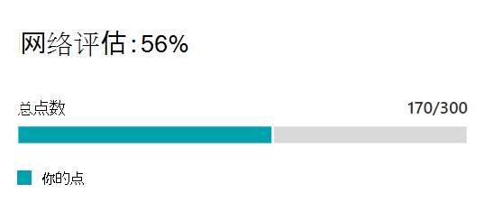

# Microsoft 365网络评估

在Microsoft 365中心的网络连接中，网络评估将许多网络性能指标聚合到企业网络外围运行状况的快照中。 网络评估会告知你客户负责的网络设计对用户体验Office 365的影响。 网络评估的范围既包括整个租户，也包括用户连接到租户的每个地理位置。 评估为Microsoft 365管理员提供了一种简单方法，以便立即了解企业的网络运行状况，并快速深入到任何全局办事处位置的详细报告。

网络评估点值从 0 到 100，是 TCP 延迟、下载速度和 UDP 连接质量指标的平均值。 这些指标每天编译一次。 这些指标中不包括 Microsoft 拥有的网络的性能指标，以确保评估结果明确且特定于企业网络。

> [!div class="mx-imgBorder"]
> 

非常低的网络评估值表明Microsoft 365客户端在连接到租户或维护快速响应用户体验时将遇到严重问题。 较高的值表示配置正确的网络，并且存在一些持续的性能问题。 值 80% 表示正常基线，超过该值时不应因网络性能而收到有关 Microsoft 365 连接或响应的常规用户投诉。 随着迭代网络连接改进，此值将随用户体验一起增加。

| 网络评估 | 预期的用户体验 |
| :----------------- | :----------------------- |
| 100                | 最好                     |
| 80                 | 满足建议    |
| 60                 | 可以接受               |
| 40                 | 用户可能会遇到问题 |
| 20                 | 用户可能抱怨       |
| 0                  | 网络问题是一个常见讨论主题 |

>[!IMPORTANT]
>Microsoft 365 管理中心中的网络见解、性能建议和评估目前处于预览状态，仅适用于已在功能预览计划中注册的 Microsoft 365 租户。

## 网络评估面板

每个网络评估（无论范围是租户还是特定办公地点）都显示一个面板，其中详细介绍了评估。 此面板显示评估的条形图，以百分比和总分表示每个组件工作负荷（包括仅收到测量数据的工作负荷）。 对于办公室位置网络评估，我们还显示与报告与办公地点位于同一城市的数据的每五个Microsoft 365客户百分比的比较。

> [!div class="mx-imgBorder"]
> 

面板 **中的** 评估细分显示每个组件工作负荷的评估。

评估 **历史记录** 显示过去 30 天的评估和基准。 您还可以使用"历史记录"选项卡报告任何办公地点的最多两年的指标历史记录。"历史记录"选项卡允许你选择要报告的属性。 通过选择报告时间范围，可以突出显示网络更新项目的影响，并查看对网络评估的改进。

## 租户网络评估和办公地点网络评估

网络评估衡量 Microsoft 网络办公地点的网络外围设计。 最好在每个办公室位置对网络外围进行改进。

我们在"网络性能概述"页上显示Microsoft 365租户的网络评估值。 此值是所有办公地点的网络评估加权平均值。 对于该位置的摘要页面上的每个检测到的办公地点，还有一个特定的网络评估值。

## Exchange Online

例如Exchange Online，将测量从客户端计算机到 Exchange服务前端的 TCP 延迟。 网络通过客户 LAN 和 WAN 传输的距离会影响此延迟。 它还受网络中介设备或服务的影响，从而延迟连接或导致重新发送数据包。 它受最近的服务Exchange距离的影响。 中值 (前三天的所有度量值) 第 50 个百分点或 P50 度量值。

评估Exchange Online下表进行。 阈值之间的任何 TCP 延迟数在带内以线性方式分配点。

| TCP 延迟   | Points |
| :------------ | :----- |
| 10 毫秒或更少  | 100    |
| 25 毫秒          | 80     |
| 100 毫秒         | 60     |
| 200 毫秒         | 40     |
| 300 毫秒         | 20     |
| 350 毫秒或更长 | 0      |

## SharePoint Online

For SharePoint Online the download speed for a user to access a document from SharePoint or OneDrive is measured. 这受客户端计算机和 Microsoft 网络之间的网络电路上可用带宽的影响。 它通常还受网络拥塞的影响，网络拥塞存在于复杂的网络设备中的瓶颈中，或者网络区域覆盖Wi-Fi不足。 下载速度以兆字节/秒为单位测量，大约为每秒兆位率的电路的十分之一。 每秒的 MbByte 单位非常有用，因为您可以直接查看在 1 秒钟内可以下载的大小文件。 前三天 (测量的第 25) P25 度量值。 此 25 个百分点值有助于降低随时间变化拥塞的影响。

联机SharePoint评估是使用下表进行。 阈值之间的任何下载速度编号在带内以线性方式分配点。

| 下载速度 | Points |
| :------------- | :----- |
| 20MBps 或更多 | 100    |
| 14MBps         | 80     |
| 8MBps          | 60     |
| 4MBps          | 40     |
| 2MBps          | 20     |
| 0MBps          | 0      |

## Microsoft Teams

例如Microsoft Teams网络质量测量为 UDP 延迟、UDP 抖动和 UDP 数据包丢失。 UDP 用于呼叫和会议音频和视频媒体连接，Microsoft Teams。 除了网络 UDP 支持中的连接差异外，这受延迟和下载速度的相同因素影响，因为 UDP 单独配置为更常见的 TCP 协议。 中值 (前三天的所有度量值) 第 50 个百分点或 P50 度量值。 

我们计算这些 UDP 度量中从 1 到 5 的一个平均意见得分。 然后，我们将该范围映射到 0-100 点范围，用于Microsoft Teams评估。  总体好于 87.5 点，整体坏值低于 50 点。

## 相关主题

[Microsoft 365 管理中心 (预览) ](office-365-network-mac-perf-overview.md)

[Microsoft 365预览版 (网络性能) ](office-365-network-mac-perf-insights.md)

[Microsoft 365预览版 (网络连接测试) ](office-365-network-mac-perf-onboarding-tool.md)

[Microsoft 365网络连接位置服务 (预览) ](office-365-network-mac-location-services.md)
