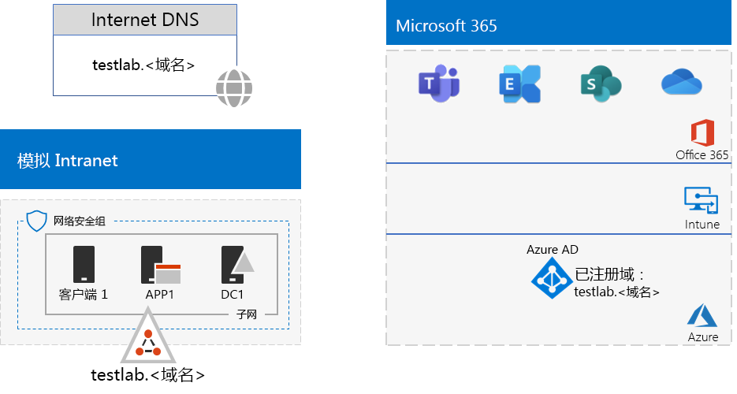

# <a name="password-hash-synchronization-for-your-microsoft-365-test-environment"></a>Microsoft 365 测试环境的密码哈希同步

*本测试实验室指南可用于 Microsoft 365 企业版和 Office 365 企业版测试环境。*

许多组织使用 Azure AD Connect 和密码哈希同步来同步他们内部部署的 Active Directory 域服务 (AD DS) 林帐户集与 Microsoft 365 订阅的 Azure AD 租户帐户集。 本文介绍了如何添加密码哈希同步至 Microsoft 365 测试环境，从而生成以下配置：
  

  
此测试环境的设置分为以下两个阶段：
  
1. 创建 Microsoft 365 模拟企业测试环境。
2. 在 APP1 上安装和配置 Azure AD Connect。
    
> [!TIP]
> 单击[此处](../media/m365-enterprise-test-lab-guides/Microsoft365EnterpriseTLGStack.pdf)，即可获得 Microsoft 365 企业版测试实验室指南堆栈中所有文章的直观目录图。
  
## <a name="phase-1-create-the-microsoft-365-simulated-enterprise-test-environment"></a>第 1 阶段：创建 Microsoft 365 模拟企业测试环境

请按照[适用于 Microsoft 365 的模拟企业基础配置](simulated-ent-base-configuration-microsoft-365-enterprise.md)中的说明操作。生成的配置如下。
  

  
此配置包括： 
  
- Microsoft 365 E5 或 Office 365 E5 试用版或付费版订阅。
- 连接到 Internet 的简化的组织 Intranet，包含 Azure 虚拟网络中的 DC1、APP1 和 CLIENT1 虚拟机。 DC1 是 testlab.\<你的公共域名 > AD DS 域的域控制器。 第 2 阶段：创建和注册 testlab 域

## <a name="phase-2-create-and-register-the-testlab-domain"></a>在这一阶段，将公共 DNS 域添加到订阅中。

First, work with your public DNS registration provider to create a new public DNS domain name based on your current domain name and add it to your subscription.

首先，使用公共 DNS 注册提供程序，根据当前域名新建一个公共 DNS 域名，并将它添加到订阅中。建议命名为 **testlab.**\<公共域名>。例如，如果公共域名是 **<span>contoso</span>.com**，请添加公共域名 **<span>testlab</span>.contoso.com**。
  
这包括添加其他 DNS 记录到**testlab.**\<公共域 > 域。 有关详细信息，请参阅[添加域到 Office 365](https://docs.microsoft.com/office365/admin/setup/add-domain)。 下面是生成的配置。 注册 testlab 域名 此配置包括： 

包含已注册 DNS 域 testlab.\<你的域名> 的 Microsoft 365 E5 或 Office 365 E5 试用订阅或付费订阅。
  

  
请注意，现在 testlab.\<你的公共域名>：

- 受公共 DNS 记录支持。 已在 Microsoft 365 订阅中注册。
- 是模拟 Intranet 上的 AD DS 域。

当系统提示输入用户名和密码时，指定 <strong>user1@testlab.</strong>\<你的公共域名> 和 User1 密码。应该能以 User1 身份成功登录。

- 首先，在 APP1 上安装和配置 Azure AD Connect。
- 在 [Azure 门户](https://portal.azure.com)中，使用全局管理员帐户进行登录，再使用 TESTLAB\\User1 帐户连接到 APP1。
- 在 APP1 的桌面中，打开管理员级 Windows PowerShell 命令提示符，然后运行下面这些命令来禁用 Internet Explorer 增强安全：
     
## <a name="phase-3-install-azure-ad-connect-on-app1"></a>从任务栏中单击 **Internet Explorer**，然后转到 [https://aka.ms/aadconnect](https://aka.ms/aadconnect)。

在“Microsoft Azure Active Directory Connect”页上，单击“下载”****，然后单击“运行”****。
  
在“欢迎使用 Azure AD Connect”**** 页上，单击“我同意”****，然后单击“继续”****。

1. 在“快速设置”**** 页上，单击“使用快速设置”****。
    
2. 在“连接到 Azure AD”**** 页上，在“用户名”**** 中键入全局管理员帐户名称，在“密码”**** 中键入其密码，然后单击“下一步”****。
    
   ```powershell
   Set-ItemProperty -Path "HKLM:\SOFTWARE\Microsoft\Active Setup\Installed Components\{A509B1A7-37EF-4b3f-8CFC-4F3A74704073}" -Name "IsInstalled" -Value 0
   Set-ItemProperty -Path "HKLM:\SOFTWARE\Microsoft\Active Setup\Installed Components\{A509B1A8-37EF-4b3f-8CFC-4F3A74704073}" -Name "IsInstalled" -Value 0
   Stop-Process -Name Explorer -Force
   ```

3. 在“连接到 AD DS”**** 页上，在“用户名”**** 中键入“TESTLAB\\User1”****，在“密码”**** 中键入密码，再单击“下一步”****。
    
4. 单击“配置就绪”**** 页上的“安装”****。
    
5. 在“配置完成”**** 页上，单击“退出”****。
    
6. 在 Internet Explorer 中，转到 Microsoft 365 管理中心 ([https://portal.microsoft.com](https://portal.microsoft.com))。
    
7. 在左侧导航窗格中，单击“**用户 > 活动用户**”。
    
8. 请注意，该帐户名为**用户 1**。
    
9. 此帐户来自 TESTLAB AD DS 域，证明目录同步已正常工作。
    
10. 依次单击“User1”**** 帐户和“许可证和应用”****。
    
11. 在“产品许可证”**** 中，选择你的位置（如果需要），禁用“Office 365 E5”**** 许可证，然后启用“Microsoft 365 E5”**** 许可证。
    
12. 依次单击页面底部的“保存”和“关闭”********。
    
    接下来，使用 User1 帐户的用户名“<strong>user1@testlab.</strong>\<域名>”，测试能否登录订阅。 在 APP1 中，注销，再重新登录，这次指定不同的帐户。
    
13. When prompted for a user name and password, specify <strong>user1@testlab.</strong>\<your domain name> and the User1 password.
    
14. You should successfully sign in as User1. 

15. 请注意，虽然 User1 具有 TESTLAB AD DS 域的域管理员权限，但它不是全局管理员。
    
因此，不会看到作为一个选项的**管理员**图标。 下面是生成的配置。

1. 使用密码哈希同步的测试环境的模拟企业配置

2. 此配置包括： 包含已注册 DNS 域 TESTLAB.\<你的域名> 的 Microsoft 365 E5 或 Office 365 E5 试用订阅或付费订阅。 连接到 Internet 的简化的组织 Intranet，包含 Azure 虚拟网络子网中的 DC1、APP1 和 CLIENT1 虚拟机。 
 
在 APP1 上运行的 Azure AD Connect，用于将 TESTLAB AD DS 域定期同步到 Microsoft 365 订阅的 Azure AD 租户。 TESTLAB  AD DS 域中的 User1 帐户已与 Azure AD 租户同步。 

后续步骤

特性和功能。](../media/password-hash-sync-m365-ent-test-environment/Phase3.png)

另请参阅 
  
- [Microsoft 365 企业版测试实验室指南](m365-enterprise-test-lab-guides.md) [部署 Microsoft 365 企业版](deploy-microsoft-365-enterprise.md)
- [Microsoft 365 企业版文档](https://docs.microsoft.com/microsoft-365-enterprise/) Azure AD Connect runs on APP1 to synchronize the TESTLAB AD DS domain to the Azure AD tenant of your Microsoft 365 subscription periodically.
- The User1 account in the TESTLAB  AD DS domain has been synchronized with the Azure AD tenant.

## <a name="next-step"></a>Next step

Explore additional <bpt id="p1">[</bpt>identity<ept id="p1">](m365-enterprise-test-lab-guides.md#identity)</ept> features and capabilities in your test environment.

## <a name="see-also"></a>See also

<bpt id="p1">[</bpt>Microsoft 365 Enterprise Test Lab Guides<ept id="p1">](m365-enterprise-test-lab-guides.md)</ept>

<bpt id="p1">[</bpt>Deploy Microsoft 365 Enterprise<ept id="p1">](deploy-microsoft-365-enterprise.md)</ept>

<bpt id="p1">[</bpt>Microsoft 365 Enterprise documentation<ept id="p1">](https://docs.microsoft.com/microsoft-365-enterprise/)</ept>


