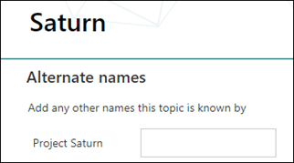

# 编辑现有主题Edit an existing topic 

 

> [!VIDEO https://www.microsoft.com/videoplayer/embed/RE4LA4n]  

 

在 Viva 主题中，可以编辑现有主题。In Viva Topics, you can edit an existing topic. 如果要更正或向现有主题页面添加其他信息，可能需要这样做。You may need to do this if you want to correct or add additional information to an existing topic page. 

> [!Note] 
> 虽然 AI 收集的主题信息经过安全修整，但请注意，编辑现有主题时手动添加的信息对有权查看主题的所有用户可见。While information in a topic that is gathered by AI is [security trimmed](topic-experiences-security-trimming.md), note that information that you manually add when editing an existing topic is visible to all users who have permissions to view topics. 

## 要求Requirements

若要编辑现有主题，需要：To edit an existing topic, you need to:
- 拥有 Viva 主题许可证。Have a Viva Topics license.
- 对可以创建或编辑主题的 Who [**具有权限**](https://docs.microsoft.com/microsoft-365/knowledge/topic-experiences-user-permissions)。Have permissions to [**Who can create or edit topics**](https://docs.microsoft.com/microsoft-365/knowledge/topic-experiences-user-permissions). 知识管理员可以在 Viva 主题权限设置中授予用户此权限。Knowledge admins can give users this permission in the Viva Topics topic permissions settings. 

> [!Note] 
> 具有在主题中心管理主题的权限的用户 (知识) 已拥有创建和编辑主题的权限。Users who have permission to manage topics in the Topic center (knowledge managers) already have permissions to create and edit topics.

## 如何编辑主题页How to edit a topic page

具有"可以创建或编辑主题"权限的用户可以通过从主题突出显示中打开主题页面，然后选择主题页面右上方的"编辑"按钮来<b></b>编辑主题。Users who have the **Who can create or edit topics** permission can edit a topic by opening the topic page from a topic highlight, and then selecting the <b>Edit</b> button on the top right of the topic page. 还可以从主题中心主页打开主题页面，您可以在其中找到已连接到的所有主题。The topic page can also be opened from the topic center home page where you can find all the topics that you have a connection to.

      

知识管理员还可以直接从"管理主题"页编辑主题，选择主题，然后在工具栏中选择 <b>"编辑</b> "。Knowledge managers can also edit topics directly from the Manage Topics page by selecting the topic, and then selecting <b>Edit</b> in the toolbar.

      

### 编辑主题页To edit a topic page

1. 在主题页面上，选择"编辑 **"。**On the topic page, select **Edit**. 这样，您能够根据对主题页的需要进行更改。This allows you to make changes as you need to the topic page.

       

2. 在 <b>"备用</b> 名称"部分，键入本主题可能引用的其他任何名称。In the <b>Alternate Names</b> section, type any other names that the topic might be referred to. 

       
3. 在 <b>"说明</b> "部分，键入几个描述该主题的句子。In the <b>Description</b> section, type a couple of sentences that describes the topic. 或者，如果说明已存在，请根据需要进行更新。Or if a description already exists, update it if needed.

     

4. 在 <b>"固定人员</b> "部分，你可以"固定"某人以主题专家为主题专家。In the <b>Pinned people</b> section, you can "pin" a person to show them as a subject matter expert on the topic. 首先在"添加新用户"框中键入其姓名或<b></b>电子邮件地址，然后从搜索结果中选择要添加的用户。Begin by typing their name or email address in the <b>Add a new user</b> box, and then selecting the user you want to add from the search results. 您还可以通过选择用户卡片上的"从列表中删除" <b>图标来"</b> 取消固定"它们。You can also "unpin" them by selecting the <b>Remove from list</b> icon on the user card.
 
     

    " <b>建议的人"</b> 部分向用户显示 AI 认为他们可能是主题主题专家（从他们连接到有关该主题的资源）。The <b>Suggested people</b> section shows users that AI thinks might be subject matter experts on the topic from their connection to resources about the topic. 可以通过选择用户卡上的固定图标，将其状态从"建议"更改为"固定"。You can change their status from Suggested to Pinned by selecting the pin icon on the user card.

    

5. 在 <b>"固定的文件</b> 和页面"部分，可以添加或"固定"与主题关联的文件或 SharePoint 网站页。In the <b>Pinned files and pages</b> section, you can add or "pin" a file or SharePoint site page that is associated to the topic.

    
 
    若要添加新文件，请选择"添加<b></b>"，从"常用"或"关注的网站"中选择 SharePoint 网站，然后从网站的文档库中选择该文件。To add a new file, select <b>Add</b>, select the SharePoint site from your Frequent or Followed sites, and then select the file from the site's document library.

    您还可以使用"从 <b>链接"</b> 选项通过提供 URL 来添加文件或页面。You can also use the <b>From a link</b> option to add a file or page by providing the URL. 

6. " <b>建议的文件和页面"</b> 部分显示 AI 建议与主题关联的文件和页面。The <b>Suggested files and pages</b> section shows files and pages that AI suggests to be associated to the topic.

    

    通过选择固定的图标，可以将建议的文件或页面制作到固定文件或页面。You can make a suggested file or page to a pinned file or page by selecting the pinned icon.

7.  " <b>相关网站</b> "部分显示包含有关主题的信息的网站。The <b>Related sites</b> section shows sites that have information about the topic. 

     

    您可以通过选择"添加"，然后搜索<b></b>该网站，或从"常用"或"最近访问"列表中选择来添加相关网站。You can add a related site by selecting <b>Add</b> and then either searching for the site, or selecting it from your list of Frequent or Recent sites. 
    
     

8. " <b>相关主题</b> "部分显示主题之间存在的连接。The <b>Related topics</b> section shows connections that exists between topics. 可以通过选择"连接到相关主题"按钮，然后键入相关<b></b>主题的名称，然后从搜索结果中选择该名称，将连接添加到其他主题。You can add a connection to a different topic by selecting the <b>Connect to a related topic</b> button, and then typing the name of the related topic, and selecting it from the search results. 

      

    然后，你可以对主题的相关情况进行说明，然后选择"更新<b>"。</b>You can then give a description of how the topics are related, and select <b>Update</b>. 

     

   添加的相关主题将显示为已连接的主题。The related topic you added will display as a connected topic.

     

9. 您还可以通过选择画布图标（可在简短说明下方找到该图标）将静态项目（如文本、图像或链接）添加到页面。You can also add static items to the page — such as text, images, or links - by selecting the canvas icon, which you can find below the short description. 选择它将打开 SharePoint 工具箱，您可以从中选择要添加到页面的项。Selecting it will open the SharePoint toolbox from which you can choose the item you want to add to the page.

     

10. 选择 **"** 发布 **"或"重新发布** "保存更改。Select **Publish** or **Republish** to save your changes. **如果主题** 之前已发布，则重新发布将是你的可用选项。**Republish** will be your available option if the topic has been published previously.

## 另请参阅See also

  

