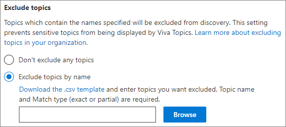

# 设置 Microsoft Viva 主题Set up Microsoft Viva Topics

可以使用 Microsoft 365 管理中心来设置和配置 [主题](topic-experiences-overview.md)。You can use the Microsoft 365 admin center to set up and configure [Topics](topic-experiences-overview.md). 

规划在环境中设置和配置主题的最佳方法非常重要。It is important to plan the best way to set up and configure topics in your environment. 在开始本文中的过程之前，请务必阅读 Plan [for Microsoft Viva](plan-topic-experiences.md) Topics。Be sure to read [Plan for Microsoft Viva Topics](plan-topic-experiences.md) before you begin the procedures in this article.

您必须订阅 [Viva 主题](https://www.microsoft.com/microsoft-viva/topics) ，并且必须是全局管理员或 SharePoint 管理员才能访问 Microsoft 365 管理中心并设置主题。You must be [subscribed to Viva Topics](https://www.microsoft.com/microsoft-viva/topics) and be a global administrator or SharePoint administrator to access the Microsoft 365 admin center and set up Topics.

如果已配置 SharePoint 以 [需要托管设备](/sharepoint/control-access-from-unmanaged-devices)，请确保从托管设备设置主题。If you have configured SharePoint to [require managed devices](/sharepoint/control-access-from-unmanaged-devices), be sure to set up Topics from a managed device.

## 视频演示Video demonstration

此视频演示在 Microsoft 365 中设置主题的过程。This video shows the process for setting up Topics in Microsoft 365.

 

> [!VIDEO https://www.microsoft.com/videoplayer/embed/RE4Li0E]  

 

## 分配许可证Assign licenses

必须为使用主题的用户分配许可证。You must assign licenses for the users who will be using Topics. 只有具有许可证的用户才能查看有关主题的信息，包括突出显示、主题卡片、主题页面和主题中心。Only users with a license can see information on topics including highlights, topic cards, topic pages and the topic center. 

以分配许可证：To assign licenses:

1. 在Microsoft 365 管理中心中，在 **用户** 下，点击 **活动用户**。In the Microsoft 365 admin center, under **Users**, click **Active users**.

2. 选择要许可的用户，然后单击"许可证 **和应用"。**Select the users that you want to license, and click **Licenses and apps**.

3. 在 **"许可证"** 下，**选择"Viva 主题"。**Under **Licenses**, select **Viva Topics**.

4. 在 **"应用"** 下，确保已选中"带索引 (**的 Graph** 连接器搜索") "Viva 主题"和 **"Viva** 主题"。Under **Apps**, make sure **Graph Connectors Search with Index (Viva Topics)** and **Viva Topics** are both selected.

   > [!div class="mx-imgBorder"]
   > 

5. 单击“**保存更改**”。Click **Save changes**.

分配许可证后，用户可能需要一小时才能访问主题。It may take up to an hour for users to get access to Topics after the licenses are assigned.

## 设置主题Set up Topics

设置主题To set up Topics

1. 在 [Microsoft 365 管理中心](https://admin.microsoft.com)中，选择" **设置"，** 然后查看" **文件和内容"** 部分。In the [Microsoft 365 admin center](https://admin.microsoft.com), select **Setup**, and then view the **Files and content** section.
2. 在"**文件和内容"部分**，单击"**将人员连接到知识"。**In the **Files and content** section, click **Connect people to knowledge**.

     

3. 在" **将人员连接到知识"页上** ， **单击"** 开始"以完成设置过程。On the **Connect people to knowledge** page, click **Get started** to walk you through the setup process.

     

4. 在" **选择 Viva 主题如何查找** 主题"页上，您将配置主题发现。On the **Choose how Viva Topics can find topics** page, you will configure topic discovery. 在" **选择 SharePoint 主题源** "部分，选择要在发现期间作为主题源对哪些 SharePoint 网站进行爬网。In the **Select SharePoint topic sources** section, select which SharePoint sites will be crawled as sources for your topics during discovery. 从以下项中进行选择：Choose from:
    - **所有网站**：组织的所有 SharePoint 网站。**All sites**: All SharePoint sites in your organization. 这包括当前网站和未来网站。This includes current and future sites.
    - **全部，所选网站除外**：键入要排除的网站的名称。**All, except selected sites**: Type the names of the sites you want to exclude.  还可以上载想要从发现中退出的网站列表。You can also upload a list of sites that you want to opt out from discovery. 将来创建的网站将包含为主题发现源。Sites created in future will be included as sources for topic discovery. 
    - **仅选定网站**：键入要包含的网站的名称。**Only selected sites**: Type the names of the sites you want to include. 您还可以上载网站列表。You can also upload a list of sites. 将来创建的网站不会作为主题发现源包含在内。Sites created in the future will not be included as sources for topic discovery.
    - **无网站**：不包括任何 SharePoint 网站。**No sites**: Do not include any SharePoint sites.

     
   
5. 在" **按名称排除** 主题"部分，可以添加要从主题发现中排除的主题的名称。In the **Exclude topics by name** section, you can add names of topics you want to exclude from topic discovery. 使用此设置可防止敏感信息作为主题包含在内。Use this setting to prevent sensitive information from being included as topics. 选项包括：The options are:
    - **不排除任何主题****Don't exclude any topics** 
    - **按名称排除主题****Exclude topics by name**

     

     (发现之后，知识管理员还可以排除主题中心) (Knowledge managers can also exclude topics in the topic center after discovery.)

    #### 如何按名称排除主题How to exclude topics by name    

    如果需要排除主题，在选择"按名称排除主题"后，下载 .csv 模板，然后使用要从发现结果中排除的主题列表更新它。If you need to exclude topics, after selecting **Exclude topics by name**, download the .csv template and update it with the list of topics that you want to exclude from your discovery results.

     

    在 CSV 模板中，输入有关要排除的主题的以下信息：In the CSV template, enter the following information about the topics you want to exclude:

    - **名称**：键入要排除的主题的名称。**Name**: Type the name of the topic you want to exclude. 可通过 2 种方法执行此操作：There are two ways to do this:
        - 完全匹配：可以包含确切的名称或缩写词 (例如 *Contoso* 或 *ATL*) 。Exact match: You can include the exact name or acronym (for example, *Contoso* or *ATL*).
        - 部分匹配：可以排除其中包含特定单词的所有主题。Partial match: You can exclude all topics that have a specific word in it.  例如 *，arc 将* 排除包含单词 *arc* 的所有主题，如弧 *形圆*、*弧* 形圆或 *培训弧*。请注意，它将不会排除将文本作为单词的一部分包含的主题，例如体系结构 *。*For example, *arc* will exclude all topics with the word *arc* in it, such as *Arc circle*, *Plasma arc welding*, or *Training arc*. Note that it will not exclude topics in which the text is included as part of a word, such as *Architecture*.
    - **代表 (可选**) ：如果要排除首字母缩写词，请键入首字母缩写词代表的单词。**Stands for (optional)**: If you want to exclude an acronym, type the words the acronym stands for.
    - **MatchType-Exact/Partial**：键入您输入 *的名称是精确* 匹配类型还是 *部分* 匹配类型。**MatchType-Exact/Partial**: Type whether the name you entered was an *exact* or *partial* match type.

    完成并保存 .csv 文件后， **选择"浏览** "找到并选择它。After you've completed and saved your .csv file, select **Browse** to locate and select it.
    
    选择“**下一步**”。Select **Next**.

6. 在 **"谁可以看到主题以及** 他们在哪里可以看到主题"页面上，你将配置主题可见性。On the **Who can see topics and where can they see them** page, you will configure topic visibility. 在" **谁可以看到** 主题"设置中，选择谁有权访问主题详细信息，例如突出显示的主题、主题卡片、搜索中的主题答案和主题页面。In the **Who can see topics** setting, you choose who will have access to topic details, such as highlighted topics, topic cards, topic answers in search, and topic pages. 可以选择：You can select:
    - **我的组织中的每个人****Everyone in my organization**
    - **仅选定人员或安全组****Only selected people or security groups**
    - **没人****No one**

      

    > [!Note] 
    > 虽然此设置允许你选择组织的任何用户，但只有分配了主题体验许可证的用户才能查看主题。While this setting allows you to select any user in your organization, only users who have Topic Experiences licenses assigned to them will be able to view topics.

7. 在" **主题管理的权限** "页中，选择能够创建、编辑或管理主题的用户。In the **Permissions for topic management** page, you choose who will be able to create, edit, or manage topics. 在" **谁可以创建和编辑主题** "部分，可以选择：In the **Who can create and edit topics** section, you can select:
    - **我的组织中的每个人****Everyone in my organization**
    - **仅选定人员或安全组****Only selected people or security groups**
    - **没人****No one**

     

8. 在" **谁可以管理主题** "部分，可以选择：In the **Who can manage topics** section, you can select:
    - **我的组织中的每个人****Everyone in my organization**
    - **仅选定人员或安全组****Only selected people or security groups**

     

    选择“**下一步**”。Select **Next**.

9. 在 **"创建主题中心** "页上，您可以创建主题中心网站，可在其中查看主题页面并管理主题。On the **Create topic center** page, you can create your topic center site in which topic pages can be viewed and topics can be managed. 在" **网站名称"** 框中，键入主题中心的名称。In the **Site name** box, type a name for your topic center. 可以选择在"说明"框中键入 **简短** 说明。You can optionally type a short description in the **Description** box. 

   选择“**下一步**”。Select **Next**.

     

10. 在 **审查并完成** 页面上，可查看所选设置并选择进行更改。On the **Review and finish** page, you can look at your selected setting and choose to make changes. 如果对你的选择感到满意，请选择 **激活**。If you are satisfied with your selections, select **Activate**.

11. 将显示 **"Viva 主题已激活** "页，确认系统现在开始分析所选主题网站并创建主题中心网站。The **Viva Topics activated** page will display, confirming that the system will now start analyzing your selected sites for topics and creating the topic center site. 选择“**完成**”。Select **Done**.

12. 你将返回到"将人员连接到 **知识"** 页面。You'll be returned to your **Connect people to knowledge** page. 在此页面中，可选择 **管理**，对配置设置进行任何更改。From this page, you can select **Manage** to make any changes to your configuration settings. 

        

请注意，首次启用主题发现时，所有建议的主题最多可能需要两周时间才能显示在"管理主题"视图中。Note that the first time topic discovery is enabled, it may take up to two weeks for all suggested topics to appear in the Manage Topics view. 主题发现将在新内容或内容更新时继续。Topic discovery continues as new content or updates to content are made. 在 Viva 主题评估新信息时，组织中的建议主题数量通常有波动。It is normal to have fluctuations in the number of suggested topics in your organization as Viva Topics evaluates new information.

## 管理主题体验Manage topic experiences

设置主题后，可以在 [Microsoft 365](https://admin.microsoft.com/AdminPortal#/featureexplorer/csi/KnowledgeManagement)管理中心中更改在设置期间选择的设置。Once you have set up Topics, you can change the settings that you chose during setup in the [Microsoft 365 admin center](https://admin.microsoft.com/AdminPortal#/featureexplorer/csi/KnowledgeManagement). 请参阅以下参考：See the following references:

- [在 Microsoft Viva 主题中管理主题发现Manage topic discovery in Microsoft Viva Topics](topic-experiences-discovery.md)
- [在 Microsoft Viva 主题中管理主题可见性Manage topic visibility in Microsoft Viva Topics](topic-experiences-knowledge-rules.md)
- [在 Microsoft Viva 主题中管理主题权限Manage topic permissions in Microsoft Viva Topics](topic-experiences-user-permissions.md)
- [在 Microsoft Viva 主题中更改主题中心的名称Change the name of the topic center in Microsoft Viva Topics](topic-experiences-administration.md)

## 另请参阅See also

[主题体验概述Topic Experiences Overview](topic-experiences-overview.md)
