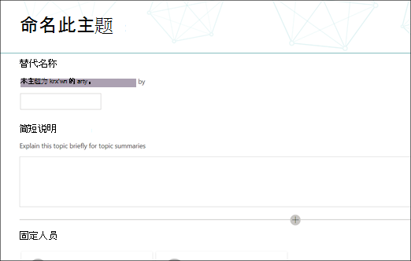

# 使用主题 center (Preview 中的主题) 

> [!Note] 
> 本文中的内容适用于 Project Cortex 私人预览。 [了解更多关于 Project Cortex的信息](https://aka.ms/projectcortex)。

在主题中心中，知识管理者可以查看已在您指定的 SharePoint 源位置中挖掘和发现的主题，并可以确认或拒绝这些主题。 如果未在主题发现中找到新的主题页面，还可以创建和发布新的主题页面，或者在需要更新时对现有主题页面进行编辑。

## Requirements

若要在主题中心中工作，您需要具有所需的权限。 你的管理员可以在 [知识管理安装](set-up-knowledge-network.md)过程中添加你，也可以在 [以后添加](give-user-permissions-to-the-topic-center.md)新用户。

可以向主题中心用户授予两组权限：

- 创建和编辑主题：创建新的主题或更新主题内容，如说明、文档和相关人员。

- 管理主题：使用主题管理仪表板查看整个组织中的主题。 用户可以执行 "确认" 和 "拒绝" 主题等操作。

## 查看建议的主题

在主题中心主页上，在指定的 SharePoint 源位置中发现的主题将在 " **建议** " 选项卡中列出。具有管理主题权限的用户可以查看未确认的主题，并选择确认或拒绝这些主题。

查看建议的主题：

1. 在 " **建议** " 选项卡上，选择要打开主题页面的主题。 

2. 在 "主题" 页上，查看主题页面，如果需要对页面进行任何更改，请选择 " **编辑** "。

3. 在知识中心主页上，对于选定的主题，您可以执行以下操作：

    1. 选择 "检查" 以确认您要保留该主题。
    
    1. 如果要拒绝主题，请选择 **x** 。

    已确认的主题将从未 **确认** 的列表中删除，现在将显示在 "已 **确认** " 选项卡中。

    已拒绝的主题将从未 **确认** 列表中删除，现在将显示在 "已 **拒绝" 或** "已排除" 选项卡中。

## 查看已确认的主题

在主题中心主页上，在指定的 SharePoint 源位置中发现的主题以及由2个或更多人通过卡片反馈机制确认的知识管理器或 crowdsourced，将在 "已 **确认** " 选项卡中列出。具有管理主题权限的用户可以查看已确认的主题并选择拒绝这些主题。

查看确认的主题：

1. 在 "已 **确认** " 选项卡上，选择要打开主题页面的主题。 

2. 在 "主题" 页上，查看主题页面，如果需要对页面进行任何更改，请选择 " **编辑** "。

3. 你也可以拒绝它

## 查看已发布的主题
已发布的主题已进行了编辑，以便 speific 信息将始终显示在页面的 encountrs。 手动创建的主题显示在此处。

   
## 新建主题

具有 "创建" 或 "编辑" 主题权限的用户如果需要，可以创建一个新主题。 如果找不到通过发现发现的主题，或者如果 AI 技术没有找到足够的证据来将其设置为主题，则可能需要执行此操作。

若要创建新主题，请执行以下操作：

1. 在 "主题中心" 页上，选择 " **新建** "，然后选择 " **主题页** "。

    

2. 在 "新建主题" 页上，您可以填写新的主题模板上的信息：

    1. 在 " **此主题的名称** " 部分中，键入新主题的名称。
    
    1. 在 " **备用名称** " 部分中，键入也用于引用主题的名称或首字母缩写词。
    
    1. 在 " **简短说明** " 部分中，键入主题的一个或两个句子说明。 此文本将用于关联的主题卡。
    
    1. 在 " **人员** " 部分中，键入主题的主题专家的姓名。
    
    1. 在 " **文件和页面** " 部分中，选择 " **添加** "，然后在下一页上选择 "关联的 OneDrive 文件" 或 "SharePoint Online 页面"。
    
    1. 在 " **网站** " 部分，选择 " **添加** "。 在显示的 "  **网站** " 窗格中，选择与该主题相关联的网站。

    
    
3. 如果需要将其他组件添加到页面中，如 text、images、webpart、links 等，请选择页面中间的画布图标以查找和添加它们。

    

4. 完成后，请选择 " **发布** " 以发布主题页面。 已发布的主题页面将显示在 " **页面** " 选项卡中。

> [!Note] 
> 新的主题页面由具有 *知识网络意识* 的 web 部件组成。 这意味着，作为 AI 收集有关主题的详细信息，这些 web 部件中的信息将会更新，以使页面对用户更有用。

## 编辑现有的主题页面

现有的主题页面可在 " **页面** " 页面中找到。 

1. 在 "主题中心" 页上，选择 " **页面** "。

2. 在 " **页面** " 页面上，您将看到主题页面的列表。 使用搜索框查找要更新的主题页面。 单击要编辑的主题页面的名称。

3. 在 "主题" 页上，选择 " **编辑** "。

4. 对页面进行所需的更改。 这包括对以下字段的更新：

    1. 替代名称
    1. 说明
    1. 人员
    1. 文件和页面
    1. 网站
    1. 您还可以通过选择画布图标将静态项添加到页面（如文本、图像或链接）。

5. 选择 "重新 **发布** " 以保存所做的更改。

<!--## See also-->

