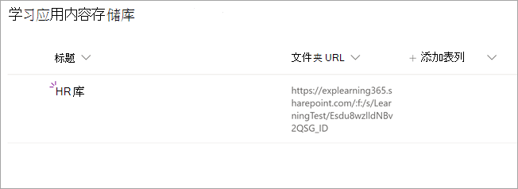

# 即将推出：SharePoint Microsoft Viva Learning (Preview) 

> [!NOTE]
> 本文中的信息与在商业发行之前可能会进行重大修改的预览产品相关。 

你可以将SharePoint配置为学习内容源，使组织自己的内容在 Viva Learning (Preview) 。

## 概述

知识管理员 (或全局管理员) 提供了一个网站 URL，学习服务可在其中创建一个空的集中位置（学习应用程序内容存储库）以结构化 SharePoint 列表的形式。 组织可以使用此列表来存储指向包含学习内容的跨公司SharePoint的链接。 管理员负责收集并创建文件夹的 URL 列表。 这些文件夹应仅包含可在 Viva Learning (Preview) 中提供的内容。

Viva Learning (Preview) 支持以下文档类型：

- Word、PowerPoint、Excel、PDF
- Audio (.m4a) 
- 视频 (.mov、.mp4、.avi) 

有关详细信息，请参阅SharePoint[限制](/office365/servicedescriptions/sharepoint-online-service-description/sharepoint-online-limits?redirectSourcePath=%252farticle%252fSharePoint-Online-limits-8f34ff47-b749-408b-abc0-b605e1f6d498)。 

## 权限

可以从组织的任何网站收集SharePoint文件夹 URL。 Viva Learning (Preview) 遵循所有现有内容权限。 因此，只有用户有权访问的内容才能在 Viva Learning (Preview) 中搜索和) 。 这些文件夹中的任何内容都可以搜索，但只能使用单个员工具有权限的内容。

目前不支持从组织存储库中删除内容。

若要删除无意中显示的内容，请按照以下步骤操作：

1.  若要限制对文档库的访问，请选择"**显示操作**"选项，然后选择"**管理访问"。**
     
     

2.  删除文档库中的原始文档。

有关详细信息，请参阅[新式体验中的共享SharePoint权限](/sharepoint/modern-experience-sharing-permissions)。 

## 学习服务

学习服务使用提供的文件夹 URL 从存储在这些文件夹中的所有内容获取元数据。 在集中式存储库中提供文件夹 URL 的 24 小时内，员工可以在 Viva Learning (Preview) 中搜索和使用组织的内容。 对内容的所有更改（包括更新的元数据和权限）也将在 24 小时内应用到学习服务中。

## 将SharePoint配置为源

您必须是全局Microsoft 365管理员、SharePoint管理员或知识管理员才能执行这些任务。

若要将 SharePoint配置为 Viva Learning (Preview) 中的学习内容源，请按照以下步骤操作：

1.  在管理中心左侧导航Microsoft 365，**转到"设置**  >  **组织设置"。**
 
2.  在"**组织设置"** 页上的"服务 **"选项卡上**，选择 **"Viva Learning (Preview) "。**

     

3.  在 **Viva Learning (Preview)** 面板的 SharePoint 下，提供希望 Viva Learning (Preview) 创建集中式存储库的 SharePoint 网站的网站 URL。

     

4.  将在SharePoint网站中自动创建SharePoint列表。

     

     在网站左侧导航栏中 **，SharePoint"网站内容**  >  **""学习应用程序内容存储库"。** 

      

5. 在"**学习应用程序内容** 存储库"页上，使用SharePoint内容文件夹的 URL 填充列表。

   1. 选择 **"新建** "以查看 **"新建项目"** 面板。 

       
 
   2. 在 **"新建项目** "面板的" **标题** "字段中，添加你选择的目录名称。 在 **"文件夹 URL"** 字段中，将 URL 添加到学习内容文件夹。 选择 **保存**。

       

   3. " **学习应用程序内容存储库"** 页使用新的学习内容进行更新。

       

> [!NOTE]
> 为了允许更广泛的访问"学习应用程序内容存储库"，即将在 Viva Learning (Preview) 界面中提供指向列表的链接，用户可以在这里请求访问并最终帮助填充列表。 网站所有者和全局管理员需要授予对列表的访问权限。 访问权限仅特定于列表，不适用于存储列表的网站。 有关详细信息，请参阅本文稍后 [介绍的提供您自己的](#provide-your-own-organizations-content) 组织的内容。

### 文件夹 URL 文档库库的库

Graph Microsoft (API 会自动将默认元数据（如修改日期、创建者、文档名称、内容类型和组织名称) ）拉入 Viva Learning (Preview) 中。
 
若要改进内容的总体发现和搜索相关性，建议添加"说明 **"** 列。

若要将 **"说明"** 列添加到文档库页面，请按照以下步骤操作：

1.  在"**文档"** 页上，选择"**添加列"。**

2. 选择"**显示操作**"选项，然后选择"**单行文本"。**

     

3. 在 **"创建列"面板** 的"名称 **"字段中，** 添加列的描述性名称。 选择 **保存**。

     
 
4. 在" **文档** "页上的" **说明** "列中，添加每个项目的自定义说明。 如果未提供任何说明，Viva Learning (Preview) 将提供一条默认消息，突出显示内容来自您自己的 SharePoint 库。 

     
 
### 提供你自己组织的内容

知识管理员可以在 SharePoint 中访问其组织的"学习应用内容存储库"，他们可以在这里提供对跨组织文档库的引用。 然后，这些库中的内容将在 Viva Learning (Preview) 中显示。

1. 在 Viva Learning (Preview) 中，选择"更多 **选项** (**...) "，** 然后选择 **"设置"。**

     
     
2. 在 **"设置"** 下，选择 **"权限"。**

     

3. 选择 **"检查** 访问权限"以连接到组织的集中式库。
     
