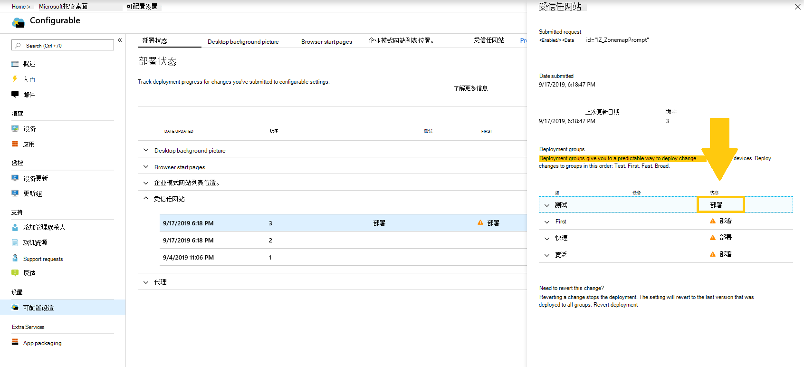

# 部署和跟踪可配置设置 - Microsoft 托管桌面Deploy and track configurable settings - Microsoft Managed Desktop

对设置类别进行更改并部署后，"部署状态"页允许您开始将设置部署到组。After you make changes to your setting categories and stage a deployment, the Deployment status page allows you to begin deploying your settings to groups. 此页面显示每个可配置设置的摘要。This page shows a summary of each configurable setting. 通过打开设置类别，可以将设置部署到组并跟踪这些部署的进度。By opening a setting category you can deploy settings to groups and track the progress of these deployments.

## 部署状态Deployment statuses 

这些状态将针对每个部署显示。These are the statuses you’ll see for each deployment.

状态Status  | 说明Explanation 
--- | --- 
部署Deploy | 您的更改正在等待部署到此组。Your change is waiting to be deployed to this group.
正在进行In progress | 更改将应用于此组的活动设备。The change is being applied to active devices in this group. 
完成Complete | 此组中所有活动设备上完成更改。The change completed on all active devices in this group. 
已失败Failed | 更改在组中 10% 的活动设备上失败，因此部署已停止。The change failed on a 10 percent of active devices in the group, so the deployment was stopped.   将自动使用 Microsoft 托管桌面操作打开支持请求，以对部署进行疑难解答。A support request will be automatically opened with Microsoft Managed Desktop operations to troubleshoot the deployment. 
已还原Reverted | 更改已还原为已成功部署到所有部署组的最后一个更改。The change was reverted to the last change that was successfully deployed to all deployment groups.

## 部署更改Deploy changes

我们将在这些说明中显示桌面背景图片。We’ll show Desktop background picture in these instructions. 在部署阶段后，从"部署状态"页部署更改。After you’ve staged a deployment, you deploy changes from the Deployment status page. 

**部署更改****To deploy changes**

1. 登录到 [Microsoft Endpoint Manager](https://endpoint.microsoft.com/) 并导航到 **"设备"** 菜单Sign in to [Microsoft Endpoint Manager](https://endpoint.microsoft.com/) and navigate to the **Devices** menu
2. 查找"Microsoft 托管桌面"部分，选择"设置 **"。**Look for the Microsoft Managed Desktop section, select **Settings**.
3. 在 **"部署** 状态工作区"中，选择要部署的设置，然后选择要部署的分步部署。In **Deployment status** workspace, select the setting you want to deploy, and then select the staged deployment to deploy.
4. 选择 **"** 部署"将更改部署到其中一个部署组。Select **Deploy** to deploy the change to one of the deployment groups.

> [!NOTE] 
> 橙色警告图标表示有上一个组可供部署，建议按顺序排列。The orange caution icon indicates there is a previous group available for deployment as it’s recommended to roll out in order. 

<!-- Needs picture updated to show MEM  -->

我们建议按此顺序部署到部署组：Test、First、Fast 和 Broad。We recommend deploying to deployment groups in this order: Test, First, Fast, and then Broad. 

在每个组中完成更改后，状态将更改为 **"完成"。**When changes complete in each group, the status changes to **Complete**.

<!-- Needs picture updated to show MEM  -->

## 还原部署Revert deployment

部署更改后，可以从部署状态 **还原**。After you’ve deployed a change, you can revert from **Deployment status**. 当还原为"正在进行"或"已完成 **"** 更改时，当前部署将停止。 When you revert a change that is **In progress** or **Complete**, the current deployment stops. 该设置将恢复为部署到所有组的上一版本。The setting will revert to the last version that was deployed to all groups. 

我们将以桌面背景图片为例，显示还原更改的步骤。We’ll show the steps to revert a change using the Desktop background picture as an example. 

**还原更改****To revert a change**
1. 登录到 [Microsoft Endpoint Manager](https://endpoint.microsoft.com/) 并导航到 **"设备"** 菜单Sign in to [Microsoft Endpoint Manager](https://endpoint.microsoft.com/) and navigate to the **Devices** menu
2. 查找"Microsoft 托管桌面"部分，选择"设置 **"。**Look for the Microsoft Managed Desktop section, select **Settings**.
3. 在 **"部署** 状态工作区"中，选择要还原的设置，然后选择要还原的分步部署。In **Deployment status** workspace, select the setting you want to revert, and then select the staged deployment to revert.
4. 在 **"需要还原此更改？"下，** 选择"**还原部署"。**Under **Need to revert this change?**, select **Revert deployment**.

<!-- Needs picture updated to show MEM  -->

## 其他资源Additional resources
- [可配置的设置概述Configurable settings overview](config-setting-overview.md)
- [可配置设置参考Configurable settings reference](config-setting-ref.md) 
