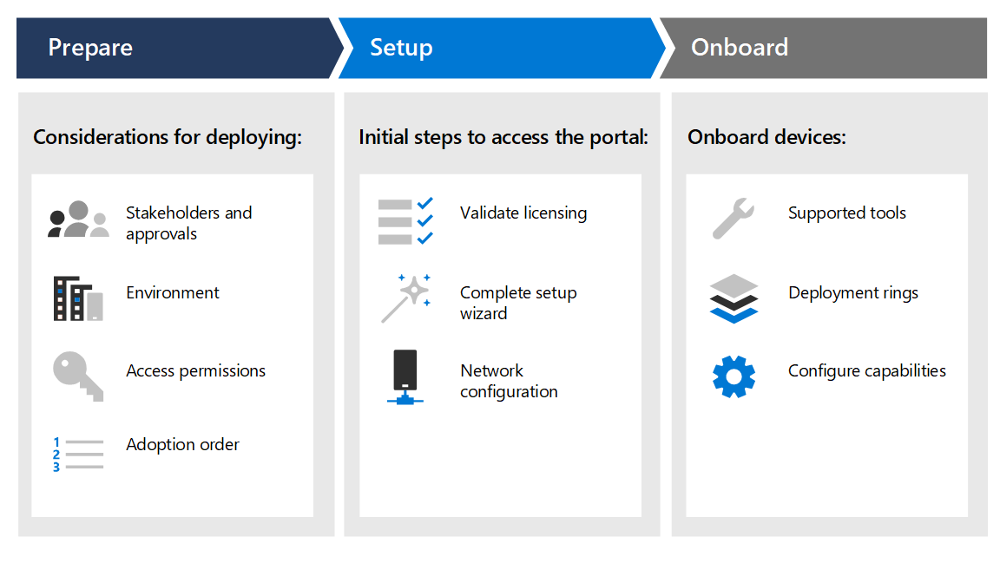

# 部署阶段Deployment phases

[!INCLUDE [Microsoft 365 Defender rebranding](../../includes/microsoft-defender.md)]

**适用于：****Applies to:**
- [Microsoft Defender for EndpointMicrosoft Defender for Endpoint](https://go.microsoft.com/fwlink/p/?linkid=2154037)
- [Microsoft 365 DefenderMicrosoft 365 Defender](https://go.microsoft.com/fwlink/?linkid=2118804)

>想要体验适用于终结点的 Defender？Want to experience Defender for Endpoint? [注册免费试用版。Sign up for a free trial.](https://www.microsoft.com/microsoft-365/windows/microsoft-defender-atp?ocid=docs-wdatp-assignaccess-abovefoldlink)

了解如何部署 Microsoft Defender for Endpoint，以便企业可以利用预防性保护、攻破后检测、自动调查和响应。Learn how to deploy Microsoft Defender for Endpoint so that your enterprise can take advantage of preventative protection, post-breach detection, automated investigation, and response. 

本指南可帮助你跨利益干系人一起准备环境，然后以有条理的方式载入设备，从评估到有意义的试点，到完全部署。This guide helps you work across stakeholders to prepare your environment and then onboard devices in a methodical way, moving from evaluation, to a meaningful pilot, to full deployment.

每个部分对应于此解决方案中的一篇单独的文章。Each section corresponds to a separate article in this solution.

|阶段Phase | 说明Description | 
|:-------|:-----|
| [阶段 1：准备Phase 1: Prepare](prepare-deployment.md)| 了解部署适用于终结点的 Defender 时需要考虑的问题，例如利益干系人审批、环境注意事项、访问权限和功能采用顺序。Learn about what you need to consider when deploying Defender for Endpoint such as stakeholder approvals, environment considerations, access permissions, and adoption order of capabilities. 
| [阶段 2：设置Phase 2: Setup](production-deployment.md)|  获取有关需要执行的初始步骤的指导，以便你可以访问门户，例如验证许可、完成安装向导和网络配置。Get guidance on the initial steps you need to take so that you can access the portal such as validating licensing, completing the setup wizard, and network configuration. 
| [阶段 3：开始使用Phase 3: Onboard](onboarding.md) | 了解如何使用部署圈、基于终结点类型支持的载入工具以及配置可用功能。Learn how to make use of deployment rings, supported onboarding tools based on the type of endpoint, and configuring available capabilities. 

完成本指南后，你将使用正确的访问权限进行设置，你的终结点将载入，并且向服务报告传感器数据，并且下一代保护和攻击面减少等功能将就位。After you've completed this guide, you'll be setup with the right access permissions, your endpoints will be onboarded and reporting sensor data to the service, and capabilities such as next-generation protection and attack surface reduction will be in place.

无论选择的环境体系结构和部署方法如何，规划部署指南中概述，本指南都将在载入终结点方面支持你。Regardless of the environment architecture and method of deployment you choose outlined in the [Plan deployment](deployment-strategy.md) guidance, this guide is going to support you in onboarding endpoints. 

## 关键功能Key capabilities

虽然 Microsoft Defender for Endpoint 提供了许多功能，但此部署指南的主要目的是通过载入设备入门。While Microsoft Defender for Endpoint provides many capabilities, the primary purpose of this deployment guide is to get you started by onboarding devices. 除了载入之外，本指南还让你开始使用以下功能。In addition to onboarding, this guidance gets you started with the following capabilities.

功能Capability | 说明Description 
:---|:---
终结点检测和响应Endpoint detection and response | 终结点检测和响应功能已到位，以检测、调查和响应入侵尝试和主动泄露。Endpoint detection and response capabilities are put in place to detect, investigate, and respond to intrusion attempts and active breaches.
下一代保护Next-generation protection | 为了进一步强化网络的安全外围，Microsoft Defender for Endpoint 使用旨在捕获所有类型的新兴威胁的下一代保护。To further reinforce the security perimeter of your network, Microsoft Defender for Endpoint uses next-generation protection designed to catch all types of emerging threats.
攻击面减少Attack surface reduction |  在堆栈中提供第一道防线。Provide the first line of defense in the stack. 通过确保正确设置配置设置并应用攻击缓解技术，这些功能集可抵御攻击和利用。By ensuring configuration settings are properly set and exploit mitigation techniques are applied, these set of capabilities resist attacks and exploitation.

所有这些功能都适用于适用于终结点许可证持有者的 Microsoft Defender。All these capabilities are available for Microsoft Defender for Endpoint license holders. 有关详细信息，请参阅 [许可要求](minimum-requirements.md#licensing-requirements)。For more information, see [Licensing requirements](minimum-requirements.md#licensing-requirements).

## 范围Scope

### 在作用域内In scope

-   使用 Microsoft Endpoint Manager 和 Microsoft Endpoint Manager将终结点载入服务并配置功能Use of Microsoft Endpoint Manager and Microsoft Endpoint Manager to onboard endpoints into the service and configure capabilities

-   启用 Defender 终结点检测和响应 (EDR) 功能Enabling Defender for Endpoint endpoint detection and response (EDR)  capabilities

-   启用适用于终结点保护平台的 Defender (EPP) 功能Enabling Defender for Endpoint endpoint protection platform (EPP) capabilities

    -   下一代保护Next-generation protection

    -   攻击面减少Attack surface reduction

### 超出范围Out of scope

以下超出了此部署指南的范围：The following are out of scope of this deployment guide:

-   可能与 Defender for Endpoint 集成的第三方解决方案的配置Configuration of third-party solutions that might integrate with Defender for Endpoint

-   生产环境中的渗透测试Penetration testing in production environment

## 另请参阅See also
- [阶段 1：准备Phase 1: Prepare](prepare-deployment.md)
- [阶段 2：设置Phase 2: Set up](production-deployment.md)
- [阶段 3：开始使用Phase 3: Onboard](onboarding.md)
- [计划部署Plan deployment](deployment-strategy.md)