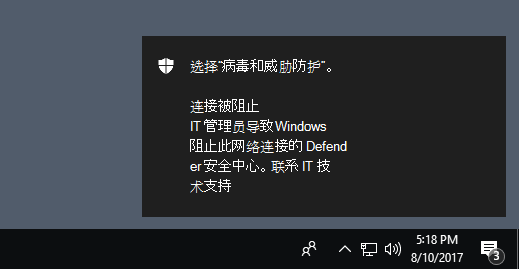

# <a name="evaluate-network-protection"></a><span data-ttu-id="8c7cd-104">网络保护功能评估</span><span class="sxs-lookup"><span data-stu-id="8c7cd-104">Evaluate network protection</span></span>

[!INCLUDE [Microsoft 365 Defender rebranding](../../includes/microsoft-defender.md)]

<span data-ttu-id="8c7cd-105">**适用于：**</span><span class="sxs-lookup"><span data-stu-id="8c7cd-105">**Applies to:**</span></span>
- [<span data-ttu-id="8c7cd-106">Microsoft Defender for Endpoint</span><span class="sxs-lookup"><span data-stu-id="8c7cd-106">Microsoft Defender for Endpoint</span></span>](https://go.microsoft.com/fwlink/?linkid=2154037)
- - [<span data-ttu-id="8c7cd-107">Microsoft 365 Defender</span><span class="sxs-lookup"><span data-stu-id="8c7cd-107">Microsoft 365 Defender</span></span>](https://go.microsoft.com/fwlink/?linkid=2118804)

<span data-ttu-id="8c7cd-108">[网络](network-protection.md) 保护有助于防止员工使用任意应用程序访问可能承载网络钓鱼欺诈、攻击和 Internet 上的其他恶意内容危险域。</span><span class="sxs-lookup"><span data-stu-id="8c7cd-108">[Network protection](network-protection.md) helps prevent employees from using any application to access dangerous domains that may host phishing scams, exploits, and other malicious content on the Internet.</span></span>

<span data-ttu-id="8c7cd-109">本文通过启用该功能并引导您访问测试站点，帮助你评估网络保护。</span><span class="sxs-lookup"><span data-stu-id="8c7cd-109">This article helps you evaluate network protection by enabling the feature and guiding you to a testing site.</span></span> <span data-ttu-id="8c7cd-110">此评估文章中的网站并非恶意网站。</span><span class="sxs-lookup"><span data-stu-id="8c7cd-110">The sites in this evaluation article aren't malicious.</span></span> <span data-ttu-id="8c7cd-111">它们是专门创建的网站，冒充恶意网站。</span><span class="sxs-lookup"><span data-stu-id="8c7cd-111">They're specially created websites that pretend to be malicious.</span></span> <span data-ttu-id="8c7cd-112">网站将复制用户访问恶意站点或域时将发生的行为。</span><span class="sxs-lookup"><span data-stu-id="8c7cd-112">The site will replicate the behavior that would happen if a user visited a malicious site or domain.</span></span>

> [!TIP]
> <span data-ttu-id="8c7cd-113">还可以访问 Microsoft Defender Testground 网站 [，demo.wd.microsoft.com](https://demo.wd.microsoft.com?ocid=cx-wddocs-testground) 了解其他保护功能如何工作。</span><span class="sxs-lookup"><span data-stu-id="8c7cd-113">You can also visit the Microsoft Defender Testground website at [demo.wd.microsoft.com](https://demo.wd.microsoft.com?ocid=cx-wddocs-testground) to see how other protection features work.</span></span>

## <a name="enable-network-protection-in-audit-mode"></a><span data-ttu-id="8c7cd-114">在审核模式下启用网络保护</span><span class="sxs-lookup"><span data-stu-id="8c7cd-114">Enable network protection in audit mode</span></span>

<span data-ttu-id="8c7cd-115">在审核模式下启用网络保护以查看哪些 IP 地址和域已被阻止。</span><span class="sxs-lookup"><span data-stu-id="8c7cd-115">Enable network protection in audit mode to see which IP addresses and domains would have been blocked.</span></span> <span data-ttu-id="8c7cd-116">你可以确保它不会影响业务线应用，或了解阻止出现频繁发生的情况。</span><span class="sxs-lookup"><span data-stu-id="8c7cd-116">You can make sure it doesn't affect line-of-business apps, or get an idea of how often blocks occur.</span></span>

1. <span data-ttu-id="8c7cd-117">在 **"管理"中"开始"菜单 powershell，** 右键单击"Windows PowerShell并选择"以 **管理员角色运行"**</span><span class="sxs-lookup"><span data-stu-id="8c7cd-117">Type **powershell** in the Start menu, right-click **Windows PowerShell** and select **Run as administrator**</span></span>
2. <span data-ttu-id="8c7cd-118">输入以下 cmdlet：</span><span class="sxs-lookup"><span data-stu-id="8c7cd-118">Enter the following cmdlet:</span></span>

    ```PowerShell
    Set-MpPreference -EnableNetworkProtection AuditMode
    ```

### <a name="visit-a-fake-malicious-domain"></a><span data-ttu-id="8c7cd-119">访问一个 (恶意) 的假密码</span><span class="sxs-lookup"><span data-stu-id="8c7cd-119">Visit a (fake) malicious domain</span></span>

1. <span data-ttu-id="8c7cd-120">打开Internet Explorer浏览器、Google Chrome 或你选择的其他浏览器。</span><span class="sxs-lookup"><span data-stu-id="8c7cd-120">Open Internet Explorer, Google Chrome, or any other browser of your choice.</span></span>

1. <span data-ttu-id="8c7cd-121">转到 [https://smartscreentestratings2.net](https://smartscreentestratings2.net)。</span><span class="sxs-lookup"><span data-stu-id="8c7cd-121">Go to [https://smartscreentestratings2.net](https://smartscreentestratings2.net).</span></span>

<span data-ttu-id="8c7cd-122">将允许网络连接，并显示测试消息。</span><span class="sxs-lookup"><span data-stu-id="8c7cd-122">The network connection will be allowed and a test message will be displayed.</span></span>



## <a name="review-network-protection-events-in-windows-event-viewer"></a><span data-ttu-id="8c7cd-125">在事件查看器中查看Windows保护事件</span><span class="sxs-lookup"><span data-stu-id="8c7cd-125">Review network protection events in Windows Event Viewer</span></span>

<span data-ttu-id="8c7cd-126">若要查看已阻止的应用，请打开事件查看器，并筛选 Microsoft-Windows-Windows-Defender/Operational 日志中的事件 ID 1125。</span><span class="sxs-lookup"><span data-stu-id="8c7cd-126">To review apps that would have been blocked, open Event Viewer and filter for Event ID 1125 in the Microsoft-Windows-Windows-Defender/Operational log.</span></span> <span data-ttu-id="8c7cd-127">下表列出了所有网络保护事件。</span><span class="sxs-lookup"><span data-stu-id="8c7cd-127">The following table lists all network protection events.</span></span>

| <span data-ttu-id="8c7cd-128">事件 ID</span><span class="sxs-lookup"><span data-stu-id="8c7cd-128">Event ID</span></span> | <span data-ttu-id="8c7cd-129">提供/源</span><span class="sxs-lookup"><span data-stu-id="8c7cd-129">Provide/Source</span></span> | <span data-ttu-id="8c7cd-130">说明</span><span class="sxs-lookup"><span data-stu-id="8c7cd-130">Description</span></span> |
|-|-|-|
|<span data-ttu-id="8c7cd-131">5007</span><span class="sxs-lookup"><span data-stu-id="8c7cd-131">5007</span></span> | <span data-ttu-id="8c7cd-132">Windows Defender (操作) </span><span class="sxs-lookup"><span data-stu-id="8c7cd-132">Windows Defender (Operational)</span></span> | <span data-ttu-id="8c7cd-133">更改设置时的事件</span><span class="sxs-lookup"><span data-stu-id="8c7cd-133">Event when settings are changed</span></span> |
|<span data-ttu-id="8c7cd-134">1125</span><span class="sxs-lookup"><span data-stu-id="8c7cd-134">1125</span></span> | <span data-ttu-id="8c7cd-135">Windows Defender (操作) </span><span class="sxs-lookup"><span data-stu-id="8c7cd-135">Windows Defender (Operational)</span></span> | <span data-ttu-id="8c7cd-136">审核网络连接时的事件</span><span class="sxs-lookup"><span data-stu-id="8c7cd-136">Event when a network connection is audited</span></span> |
|<span data-ttu-id="8c7cd-137">1126</span><span class="sxs-lookup"><span data-stu-id="8c7cd-137">1126</span></span> | <span data-ttu-id="8c7cd-138">Windows Defender (操作) </span><span class="sxs-lookup"><span data-stu-id="8c7cd-138">Windows Defender (Operational)</span></span> | <span data-ttu-id="8c7cd-139">网络连接被阻止时的事件</span><span class="sxs-lookup"><span data-stu-id="8c7cd-139">Event when a network connection is blocked</span></span> |

## <a name="see-also"></a><span data-ttu-id="8c7cd-140">另请参阅</span><span class="sxs-lookup"><span data-stu-id="8c7cd-140">See also</span></span>

* [<span data-ttu-id="8c7cd-141">网络保护</span><span class="sxs-lookup"><span data-stu-id="8c7cd-141">Network protection</span></span>](network-protection.md)
* [<span data-ttu-id="8c7cd-142">启用网络保护</span><span class="sxs-lookup"><span data-stu-id="8c7cd-142">Enable network protection</span></span>](enable-network-protection.md)
* [<span data-ttu-id="8c7cd-143">网络保护疑难解答</span><span class="sxs-lookup"><span data-stu-id="8c7cd-143">Troubleshoot network protection</span></span>](troubleshoot-np.md)
