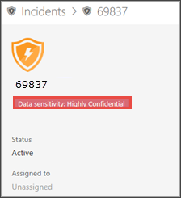

# 使用敏感度标签确定事件响应的优先级Use sensitivity labels to prioritize incident response  

[!INCLUDE [Microsoft 365 Defender rebranding](../../includes/microsoft-defender.md)]

**适用于：****Applies to:**
- [Microsoft Defender for EndpointMicrosoft Defender for Endpoint](https://go.microsoft.com/fwlink/p/?linkid=2154037)
- [Microsoft 365 DefenderMicrosoft 365 Defender](https://go.microsoft.com/fwlink/?linkid=2118804)

> 想要体验适用于终结点的 Defender？Want to experience Defender for Endpoint? [注册免费试用版。Sign up for a free trial.](https://www.microsoft.com/microsoft-365/windows/microsoft-defender-atp?ocid=docs-wdatp-exposedapis-abovefoldlink) 

典型的高级永久性威胁生命周期涉及数据外接。A typical advanced persistent threat lifecycle involves data exfiltration. 在安全事件中，必须能够优先考虑敏感文件可能受到威胁的调查，以便保护公司数据和信息。In a security incident, it's important to have the ability to prioritize investigations where sensitive files may be jeopardy so that corporate data and information are protected.

Defender for Endpoint 使用敏感度标签可帮助简化安全事件的优先顺序。Defender for Endpoint helps to make the prioritization of security incidents much simpler with the use of sensitivity labels. 敏感度标签可快速识别可能涉及包含敏感信息（如机密信息）的设备的事件。Sensitivity labels quickly identify incidents that may involve devices with sensitive information such as confidential information. 

## 调查涉及敏感数据的事件Investigate incidents that involve sensitive data
了解如何使用数据敏感度标签确定事件调查的优先级。Learn how to use data sensitivity labels to prioritize incident investigation.

>[!NOTE]
>检测到 Windows 10 版本 1809 或更高版本的标签。Labels are detected for Windows 10, version 1809 or later.

1. 在 Microsoft Defender 安全中心中，选择 **"事件"。**In Microsoft Defender Security Center, select **Incidents**. 

2. 滚动到右侧以查看" **数据敏感度"** 列。Scroll to the right to see the **Data sensitivity** column. 此列反映与事件相关的设备上观察到的敏感度标签，用于指示敏感文件是否受事件影响。This column reflects sensitivity labels that have been observed on devices related to the incidents providing an indication of whether sensitive files may be impacted by the incident.

    

    还可以根据数据敏感度 **进行筛选**You can also filter based on **Data sensitivity** 

    

3. 打开事件页面以进一步调查。Open the incident page to further investigate.

    

4. 选择 **"设备"** 选项卡以标识使用敏感度标签存储文件的设备。Select the **Devices** tab to identify devices storing files with sensitivity labels.

    
   

5. 选择存储敏感数据的设备，并搜索时间线以确定哪些文件可能会受到影响，然后采取相应的措施以确保数据受到保护。Select the devices that store sensitive data and search through the timeline to identify which files may be impacted then take appropriate action to ensure that data is protected. 

   可以通过搜索数据敏感度标签来缩小设备时间线上显示的事件范围。You can narrow down the events shown on the device timeline by searching for data sensitivity labels. 执行此操作将只显示与已说出标签名称的文件关联的事件。Doing this will show only events associated with files that have said label name.

    

>[!TIP]
>这些数据点还通过高级搜寻中的"DeviceFileEvents"公开，从而允许高级查询和计划检测考虑敏感度标签和文件保护状态。These data points are also exposed through the ‘DeviceFileEvents’ in advanced hunting, allowing advanced queries and schedule detection to take into account sensitivity labels and file protection status. 
