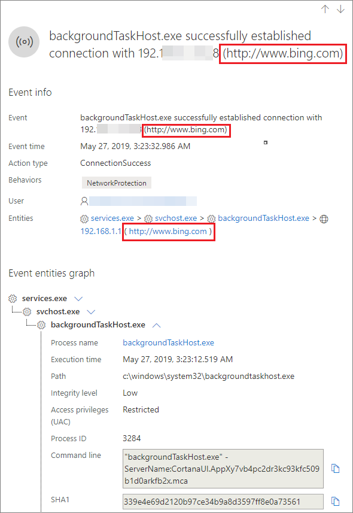

# <a name="investigate-connection-events-that-occur-behind-forward-proxies"></a>调查在转发代理之后发生的连接事件

[!INCLUDE [Microsoft 365 Defender rebranding](../../includes/microsoft-defender.md)]

**适用于：**
- [Microsoft Defender for Endpoint](https://go.microsoft.com/fwlink/p/?linkid=2154037)
- [Microsoft 365 Defender](https://go.microsoft.com/fwlink/?linkid=2118804)

> 想要体验适用于终结点的 Defender？ [注册免费试用版。](https://www.microsoft.com/microsoft-365/windows/microsoft-defender-atp?ocid=docs-wdatp-investigatemachines-abovefoldlink)

Defender for Endpoint 支持来自不同级别的网络堆栈的网络连接监视。 一个难题是，当网络使用转发代理作为 Internet 网关时。

代理的作用就像它是目标终结点一样。  在这些情况下，简单的网络连接监视器将审核与代理的连接，该代理是正确的，但调查值较低。 

Defender for Endpoint 通过网络保护支持高级 HTTP 级别监视。 打开后，将显示新的事件类型，以公开真实目标域名。

## <a name="use-network-protection-to-monitor-network-connection-behind-a-firewall"></a>使用网络保护监视防火墙后的网络连接
由于源自网络保护的其他网络事件，可以监视转发代理后面的网络连接。 若要在设备时间线上查看它们，请至少 (在审核模式下打开网络) 。 

可以使用以下模式控制网络保护：

- **阻止** <br> 将阻止用户或应用连接到危险域。 你将能够在 Microsoft Defender 安全中心看到此活动。
- **审核** <br> 不会阻止用户或应用连接到危险域。 但是，你仍将在 Microsoft Defender 安全中心看到此活动。


如果关闭网络保护，将不会阻止用户或应用连接到危险域。 你将在 Microsoft Defender 安全中心中看不到任何网络活动。

如果未配置它，则默认情况下将关闭网络阻止。

有关详细信息，请参阅启用 [网络保护](enable-network-protection.md)。

## <a name="investigation-impact"></a>调查影响
当网络保护打开时，你将看到，在设备的时间线上，IP 地址将一直表示代理，而真实目标地址将显示。


网络保护层触发的其他事件现在甚至可以在代理后面显示真实域名。

事件的信息：




## <a name="hunt-for-connection-events-using-advanced-hunting"></a>使用高级搜寻搜寻连接事件 
所有新的连接事件都可供你通过高级搜寻进行搜寻。 由于这些事件是连接事件，因此可以在操作类型下的 DeviceNetworkEvents 表 `ConnecionSuccess` 下找到它们。

使用此简单查询将显示所有相关事件：

```
DeviceNetworkEvents
| where ActionType == "ConnectionSuccess" 
| take 10
```


还可以筛选掉与与代理本身连接相关的事件。 

使用以下查询筛选出与代理的连接：

```
DeviceNetworkEvents
| where ActionType == "ConnectionSuccess" and RemoteIP != "ProxyIP"  
| take 10
```


## <a name="related-topics"></a>相关主题
- [通过 GP 应用网络保护 - 策略 CSP](https://docs.microsoft.com/windows/client-management/mdm/policy-csp-defender#defender-enablenetworkprotection)
