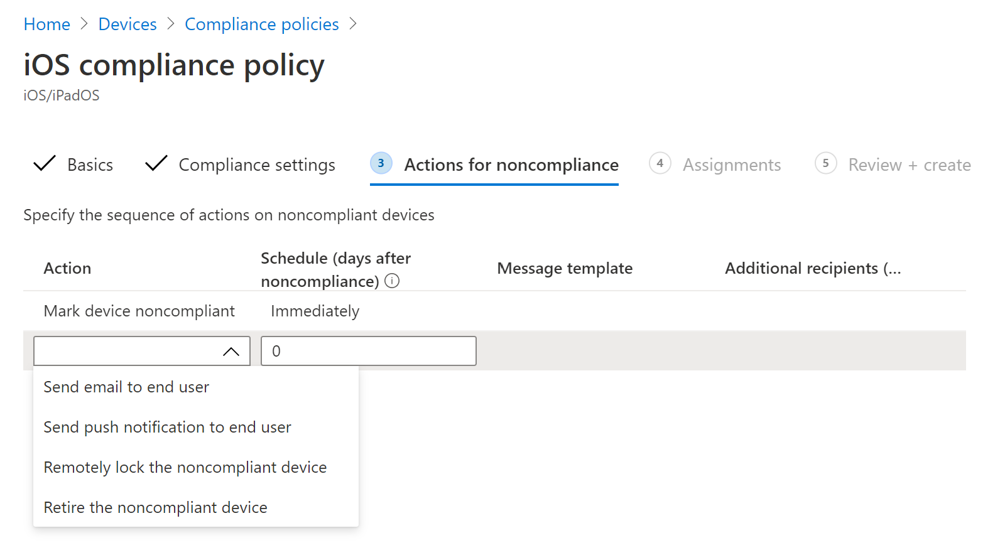

# 在 iOS 功能上配置 Microsoft Defender for Endpoint

[!INCLUDE [Microsoft 365 Defender rebranding](../../includes/microsoft-defender.md)]

**适用于：**
- [Microsoft Defender for Endpoint](https://go.microsoft.com/fwlink/p/?linkid=2154037)
- [Microsoft 365 Defender](https://go.microsoft.com/fwlink/?linkid=2118804)

> 想要体验适用于终结点的 Defender？ [注册免费试用版。](https://www.microsoft.com/microsoft-365/windows/microsoft-defender-atp?ocid=docs-wdatp-exposedapis-abovefoldlink) 

> [!NOTE]
> 适用于 iOS 的终结点的 Defender 将使用 VPN 来提供 Web 保护功能。 这不是常规 VPN，它是不接受设备外流量的本地/自循环 VPN。

## 使用适用于 iOS 的 Defender 终结点的条件访问  
iOS 上的 Microsoft Defender for Endpoint 以及 Microsoft Intune 和 Azure Active Directory 支持根据设备风险级别强制执行设备合规性和条件访问策略。 Defender for Endpoint 是移动威胁防护 (MTD) 解决方案，你可以部署该解决方案以通过 Intune 利用此功能。

若要详细了解如何使用适用于 iOS 的 Defender for Endpoint 设置条件访问，请参阅[Defender for Endpoint 和 Intune。](https://docs.microsoft.com/mem/intune/protect/advanced-threat-protection)

## Web 保护和 VPN

默认情况下，适用于 iOS 的 Defender for Endpoint 包括并启用 Web 保护功能。 [Web](web-protection-overview.md) 保护有助于保护设备免受 Web 威胁，并保护用户免受网络钓鱼攻击。 适用于 iOS 的终结点的 Defender 使用 VPN 来提供此保护。 请注意，这是本地 VPN，与传统 VPN 不同，网络流量不会在设备外部发送。

虽然默认启用，但在某些情况下可能需要你禁用 VPN。 例如，你想要运行一些在配置 VPN 时不起作用的应用。 在这种情况下，你可以选择按照以下步骤在设备上禁用应用中的 VPN：

1. 在 iOS 设备上，打开"设置 **"** 应用，单击或点击"**常规**"，然后单击 **"VPN"。**
1. 单击或点击 Microsoft Defender ATP 的"i"按钮。
1. 关闭" **按需连接"** 以禁用 VPN。

    > [!div class="mx-imgBorder"]
    > 

> [!NOTE]
> 禁用 VPN 后，Web 保护将不可用。 若要重新启用 Web 保护，请在设备上打开 Microsoft Defender for Endpoint 应用，然后单击或点击"启动 **VPN"。**

## 多个 VPN 配置文件共存

Apple iOS 不支持多个设备范围的 VPN 同时处于活动状态。 虽然设备上可以存在多个 VPN 配置文件，但一次只能有一个 VPN 处于活动状态。

## 针对越狱设备配置合规性策略

若要防止在已越狱的 iOS 设备上访问公司数据，我们建议在 Intune 上设置以下合规性策略。

> [!NOTE]
> 目前，iOS 上的 Microsoft Defender for Endpoint 不提供针对越狱情形的保护。 如果在已越狱设备上使用，那么在应用程序使用的特定方案中的数据（如公司电子邮件 ID 和公司个人资料图片） (如果可用) 可在本地公开

按照以下步骤创建针对已越狱设备的合规性策略。

1. 在 [Microsoft Endpoint Manager 管理中心中](https://go.microsoft.com/fwlink/?linkid=2109431)，转到 **"设备**  ->  **合规性策略**  ->  **""创建策略"。** 选择"iOS/iPadOS"作为平台，然后单击"创建 **"。**

    > [!div class="mx-imgBorder"]
    > 

2. 指定策略的名称，例如"越狱合规性策略"。
3. 在合规性设置页中，单击展开 **"设备运行状况"** 部分，**然后单击"阻止****越狱设备"** 字段。

    > [!div class="mx-imgBorder"]
    > 

4. 在"*针对不相容性* 的操作"部分，根据你的要求选择操作，然后选择"下一 **步"。**

    > [!div class="mx-imgBorder"]
    > 

5. 在 *"分配*"部分，选择要为此策略包含的用户组，然后选择"下一步 **"。**
6. 在"**审阅+创建**"部分，验证输入的所有信息是否正确，然后选择"创建 **"。**

## 配置自定义指示器

适用于 iOS 的终结点的 Defender 使管理员能够在 iOS 设备上配置自定义指示器。 若要详细了解如何配置自定义指示器，请参阅管理 [指示器](https://docs.microsoft.com/microsoft-365/security/defender-endpoint/manage-indicators)。

> [!NOTE]
> 适用于 iOS 的终结点的 Defender 仅支持为 IP 地址和 URL/域创建自定义指示器。

## 报告不安全网站

网络钓鱼网站会模拟可信赖的网站，以获取你的个人或财务信息。 如果要 [报告可能是网络钓鱼](https://www.microsoft.com/wdsi/filesubmission/exploitguard/networkprotection) 网站的网站，请访问提供有关网络保护的反馈页面。

## 安装 Microsoft Defender for Endpoint 时 iOS 上的电池消耗问题

应用的电池使用情况由 Apple 根据大量因素（包括 CPU 和网络使用情况）计算。 Microsoft Defender for Endpoint 在后台使用本地/环回 VPN 来检查任何恶意网站或连接的 Web 流量。 来自任何应用的网络数据包都经过此检查，这会导致 Microsoft Defender for Endpoint 的电池使用情况计算不准确。 这会给用户留下假印象。 Microsoft Defender for Endpoint 的实际电池消耗低于设备上"电池设置"页上显示的内容。 这是基于在 Microsoft Defender for Endpoint 应用上执行的测试，以了解电池消耗。

此外，使用的 VPN 是本地 VPN，与传统 VPN 不同，网络流量不会在设备外部发送。
