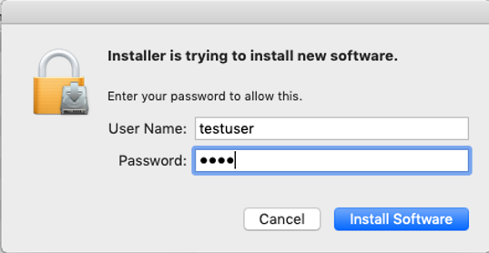
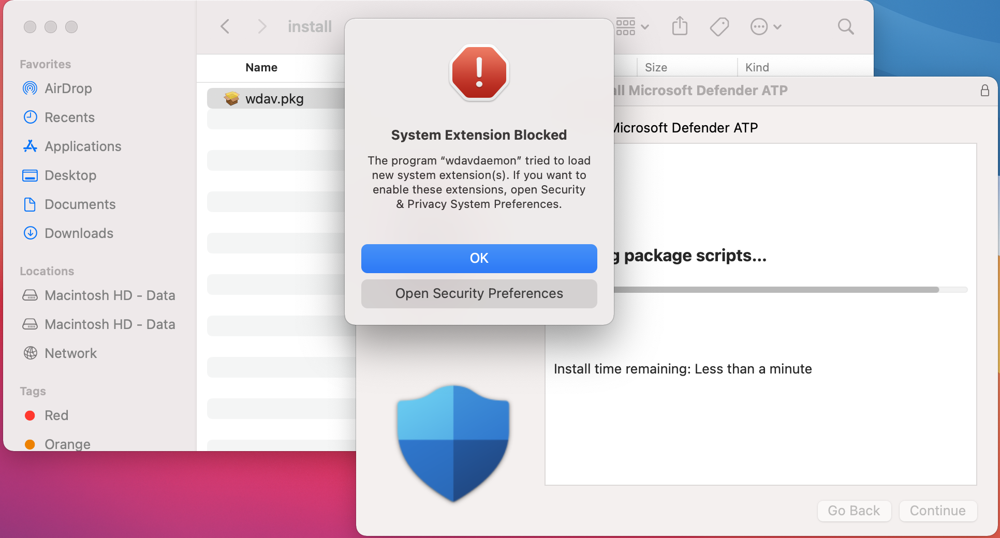

# <a name="manual-deployment-for-microsoft-defender-for-endpoint-for-macos"></a><span data-ttu-id="b2c29-104">适用于 macOS 的 Microsoft Defender 终结点的手动部署</span><span class="sxs-lookup"><span data-stu-id="b2c29-104">Manual deployment for Microsoft Defender for Endpoint for macOS</span></span>

[!INCLUDE [Microsoft 365 Defender rebranding](../../includes/microsoft-defender.md)]

<span data-ttu-id="b2c29-105">**适用于：**</span><span class="sxs-lookup"><span data-stu-id="b2c29-105">**Applies to:**</span></span>
- [<span data-ttu-id="b2c29-106">Microsoft Defender for Endpoint</span><span class="sxs-lookup"><span data-stu-id="b2c29-106">Microsoft Defender for Endpoint</span></span>](https://go.microsoft.com/fwlink/p/?linkid=2154037)
- [<span data-ttu-id="b2c29-107">Microsoft 365 Defender</span><span class="sxs-lookup"><span data-stu-id="b2c29-107">Microsoft 365 Defender</span></span>](https://go.microsoft.com/fwlink/?linkid=2118804)

> <span data-ttu-id="b2c29-108">想要体验适用于终结点的 Defender？</span><span class="sxs-lookup"><span data-stu-id="b2c29-108">Want to experience Defender for Endpoint?</span></span> [<span data-ttu-id="b2c29-109">注册免费试用版。</span><span class="sxs-lookup"><span data-stu-id="b2c29-109">Sign up for a free trial.</span></span>](https://www.microsoft.com/microsoft-365/windows/microsoft-defender-atp?ocid=docs-wdatp-investigateip-abovefoldlink)

<span data-ttu-id="b2c29-110">本主题介绍如何手动部署适用于 macOS 的 Microsoft Defender for Endpoint。</span><span class="sxs-lookup"><span data-stu-id="b2c29-110">This topic describes how to deploy Microsoft Defender for Endpoint for macOS manually.</span></span> <span data-ttu-id="b2c29-111">要成功部署，需要完成以下所有步骤：</span><span class="sxs-lookup"><span data-stu-id="b2c29-111">A successful deployment requires the completion of all of the following steps:</span></span>
- [<span data-ttu-id="b2c29-112">下载安装和载入程序包</span><span class="sxs-lookup"><span data-stu-id="b2c29-112">Download installation and onboarding packages</span></span>](#download-installation-and-onboarding-packages)
- [<span data-ttu-id="b2c29-113">macOS (10.15 及早期版本的应用程序安装) </span><span class="sxs-lookup"><span data-stu-id="b2c29-113">Application installation (macOS 10.15 and older versions)</span></span>](#application-installation-macos-1015-and-older-versions)
- [<span data-ttu-id="b2c29-114">macOS 11 (更高版本的应用程序安装) </span><span class="sxs-lookup"><span data-stu-id="b2c29-114">Application installation (macOS 11 and newer versions)</span></span>](#application-installation-macos-11-and-newer-versions)
- [<span data-ttu-id="b2c29-115">客户端配置</span><span class="sxs-lookup"><span data-stu-id="b2c29-115">Client configuration</span></span>](#client-configuration)

## <a name="prerequisites-and-system-requirements"></a><span data-ttu-id="b2c29-116">先决条件和系统要求</span><span class="sxs-lookup"><span data-stu-id="b2c29-116">Prerequisites and system requirements</span></span>

<span data-ttu-id="b2c29-117">在开始使用之前，请参阅 [主 Microsoft Defender for Endpoint for macOS](microsoft-defender-endpoint-mac.md) 页面，了解当前软件版本的先决条件和系统要求。</span><span class="sxs-lookup"><span data-stu-id="b2c29-117">Before you get started, see [the main Microsoft Defender for Endpoint for macOS page](microsoft-defender-endpoint-mac.md) for a description of prerequisites and system requirements for the current software version.</span></span>

## <a name="download-installation-and-onboarding-packages"></a><span data-ttu-id="b2c29-118">下载安装和载入程序包</span><span class="sxs-lookup"><span data-stu-id="b2c29-118">Download installation and onboarding packages</span></span>

<span data-ttu-id="b2c29-119">从 Microsoft Defender 安全中心下载安装和载入程序包：</span><span class="sxs-lookup"><span data-stu-id="b2c29-119">Download the installation and onboarding packages from Microsoft Defender Security Center:</span></span>

1. <span data-ttu-id="b2c29-120">在 Microsoft Defender 安全中心中，转到"设备>**设置>载入"。**</span><span class="sxs-lookup"><span data-stu-id="b2c29-120">In Microsoft Defender Security Center, go to **Settings > Device Management > Onboarding**.</span></span>
2. <span data-ttu-id="b2c29-121">在页面的第 1 部分中，将操作系统设置为 **macOS，** 将 Deployment 方法设置为 **本地脚本**。</span><span class="sxs-lookup"><span data-stu-id="b2c29-121">In Section 1 of the page, set operating system to **macOS** and Deployment method to **Local script**.</span></span>
3. <span data-ttu-id="b2c29-122">在页面的第 2 部分中，选择 **下载安装程序包**。</span><span class="sxs-lookup"><span data-stu-id="b2c29-122">In Section 2 of the page, select **Download installation package**.</span></span> <span data-ttu-id="b2c29-123">将其另存为 wdav.pkg 到本地目录。</span><span class="sxs-lookup"><span data-stu-id="b2c29-123">Save it as wdav.pkg to a local directory.</span></span>
4. <span data-ttu-id="b2c29-124">在页面的第 2 部分中，选择 **下载载入程序包**。</span><span class="sxs-lookup"><span data-stu-id="b2c29-124">In Section 2 of the page, select **Download onboarding package**.</span></span> <span data-ttu-id="b2c29-125">将其另存WindowsDefenderATPOnboardingPackage.zip同一目录。</span><span class="sxs-lookup"><span data-stu-id="b2c29-125">Save it as WindowsDefenderATPOnboardingPackage.zip to the same directory.</span></span>

    

5. <span data-ttu-id="b2c29-127">在命令提示符下，验证您是否具有这两个文件。</span><span class="sxs-lookup"><span data-stu-id="b2c29-127">From a command prompt, verify that you have the two files.</span></span>
    
## <a name="application-installation-macos-1015-and-older-versions"></a><span data-ttu-id="b2c29-128">macOS (10.15 及早期版本的应用程序安装) </span><span class="sxs-lookup"><span data-stu-id="b2c29-128">Application installation (macOS 10.15 and older versions)</span></span>

<span data-ttu-id="b2c29-129">若要完成此过程，你必须在设备上拥有管理员权限。</span><span class="sxs-lookup"><span data-stu-id="b2c29-129">To complete this process, you must have admin privileges on the device.</span></span>

1. <span data-ttu-id="b2c29-130">导航到 Finder 中下载的 wdav.pkg 并打开它。</span><span class="sxs-lookup"><span data-stu-id="b2c29-130">Navigate to the downloaded wdav.pkg in Finder and open it.</span></span>

    

2. <span data-ttu-id="b2c29-132">选择 **"继续**"，同意许可条款，在系统提示时输入密码。</span><span class="sxs-lookup"><span data-stu-id="b2c29-132">Select **Continue**, agree with the License terms, and enter the password when prompted.</span></span>

    

   > [!IMPORTANT]
   > <span data-ttu-id="b2c29-134">系统将提示你允许从 Microsoft 安装驱动程序， ("系统扩展被阻止"或"安装已保留"或两者同时安装。</span><span class="sxs-lookup"><span data-stu-id="b2c29-134">You will be prompted to allow a driver from Microsoft to be installed (either "System Extension Blocked" or "Installation is on hold" or both.</span></span> <span data-ttu-id="b2c29-135">必须允许安装驱动程序。</span><span class="sxs-lookup"><span data-stu-id="b2c29-135">The driver must be allowed to be installed.</span></span>

   

3. <span data-ttu-id="b2c29-137">选择 **"打开安全首选项"** 或"打开系统首选项 **>安全&隐私"。**</span><span class="sxs-lookup"><span data-stu-id="b2c29-137">Select **Open Security Preferences** or **Open System Preferences > Security & Privacy**.</span></span> <span data-ttu-id="b2c29-138">选择 **"允许"：**</span><span class="sxs-lookup"><span data-stu-id="b2c29-138">Select **Allow**:</span></span>

    

   <span data-ttu-id="b2c29-140">继续安装。</span><span class="sxs-lookup"><span data-stu-id="b2c29-140">The installation proceeds.</span></span>

   > [!CAUTION]
   > <span data-ttu-id="b2c29-141">如果未选择"允许 **"，** 则安装将在 5 分钟后继续。</span><span class="sxs-lookup"><span data-stu-id="b2c29-141">If you don't select **Allow**, the installation will proceed after 5 minutes.</span></span> <span data-ttu-id="b2c29-142">Microsoft Defender for Endpoint 将加载，但某些功能（如实时保护）将被禁用。</span><span class="sxs-lookup"><span data-stu-id="b2c29-142">Microsoft Defender for Endpoint will be loaded, but some features, such as real-time protection, will be disabled.</span></span> <span data-ttu-id="b2c29-143">请参阅 [内核扩展问题](mac-support-kext.md) 疑难解答，了解如何解决此问题。</span><span class="sxs-lookup"><span data-stu-id="b2c29-143">See [Troubleshoot kernel extension issues](mac-support-kext.md) for information on how to resolve this.</span></span>

> [!NOTE]
> <span data-ttu-id="b2c29-144">macOS 可能会请求在首次安装 Microsoft Defender for Endpoint 时重新启动设备。</span><span class="sxs-lookup"><span data-stu-id="b2c29-144">macOS may request to reboot the device upon the first installation of Microsoft Defender for Endpoint.</span></span> <span data-ttu-id="b2c29-145">在重新启动设备之前，实时保护将不可用。</span><span class="sxs-lookup"><span data-stu-id="b2c29-145">Real-time protection will not be available until the device is rebooted.</span></span>

## <a name="application-installation-macos-11-and-newer-versions"></a><span data-ttu-id="b2c29-146">macOS 11 (更高版本的应用程序安装) </span><span class="sxs-lookup"><span data-stu-id="b2c29-146">Application installation (macOS 11 and newer versions)</span></span>

<span data-ttu-id="b2c29-147">若要完成此过程，你必须在设备上拥有管理员权限。</span><span class="sxs-lookup"><span data-stu-id="b2c29-147">To complete this process, you must have admin privileges on the device.</span></span>

1. <span data-ttu-id="b2c29-148">导航到 Finder 中下载的 wdav.pkg 并打开它。</span><span class="sxs-lookup"><span data-stu-id="b2c29-148">Navigate to the downloaded wdav.pkg in Finder and open it.</span></span>

    

2. <span data-ttu-id="b2c29-150">选择 **"继续**"，同意许可条款，在系统提示时输入密码。</span><span class="sxs-lookup"><span data-stu-id="b2c29-150">Select **Continue**, agree with the License terms, and enter the password when prompted.</span></span>

3. <span data-ttu-id="b2c29-151">在安装过程结束时，你将被提升为批准产品使用的系统扩展。</span><span class="sxs-lookup"><span data-stu-id="b2c29-151">At the end of the installation process, you'll be promoted to approve the system extensions used by the product.</span></span> <span data-ttu-id="b2c29-152">选择 **"打开安全首选项"。**</span><span class="sxs-lookup"><span data-stu-id="b2c29-152">Select **Open Security Preferences**.</span></span>

    

4. <span data-ttu-id="b2c29-154">从"**安全&隐私"** 窗口中，选择"允许 **"。**</span><span class="sxs-lookup"><span data-stu-id="b2c29-154">From the **Security & Privacy** window, select **Allow**.</span></span>

    

5. <span data-ttu-id="b2c29-156">对随 Microsoft Defender for Endpoint for Mac 分发的所有系统扩展重复步骤 3 & 4。</span><span class="sxs-lookup"><span data-stu-id="b2c29-156">Repeat steps 3 & 4 for all system extensions distributed with Microsoft Defender for Endpoint for Mac.</span></span>

6. <span data-ttu-id="b2c29-157">作为终结点检测和响应功能的一部分，Microsoft Defender for Mac 终结点会检查套接字流量，将此信息报告给 Microsoft Defender 安全中心门户。</span><span class="sxs-lookup"><span data-stu-id="b2c29-157">As part of the Endpoint Detection and Response capabilities, Microsoft Defender for Endpoint for Mac inspects socket traffic and reports this information to the Microsoft Defender Security Center portal.</span></span> <span data-ttu-id="b2c29-158">当系统提示授予 Microsoft Defender 终结点权限以筛选网络流量时，请选择"允许 **"。**</span><span class="sxs-lookup"><span data-stu-id="b2c29-158">When prompted to grant Microsoft Defender for Endpoint permissions to filter network traffic, select **Allow**.</span></span>

    

7. <span data-ttu-id="b2c29-160">打开 **"系统** 首选项&隐私"并导航到"隐私"选项卡。授予 Microsoft Defender ATP 和 Microsoft Defender ATP 终结点安全扩展的"完全磁盘  >  **访问权限"。**   </span><span class="sxs-lookup"><span data-stu-id="b2c29-160">Open **System Preferences** > **Security & Privacy** and navigate to the **Privacy** tab. Grant **Full Disk Access** permission to **Microsoft Defender ATP** and **Microsoft Defender ATP Endpoint Security Extension**.</span></span>

    

## <a name="client-configuration"></a><span data-ttu-id="b2c29-162">客户端配置</span><span class="sxs-lookup"><span data-stu-id="b2c29-162">Client configuration</span></span>

1. <span data-ttu-id="b2c29-163">将 wdav.pkg 和 MicrosoftDefenderATPOnboardingMacOs.py 复制到你部署适用于 macOS 的终结点的 Microsoft Defender 的设备。</span><span class="sxs-lookup"><span data-stu-id="b2c29-163">Copy wdav.pkg and MicrosoftDefenderATPOnboardingMacOs.py to the device where you deploy Microsoft Defender for Endpoint for macOS.</span></span>

    <span data-ttu-id="b2c29-164">客户端设备不与 orgId 关联。</span><span class="sxs-lookup"><span data-stu-id="b2c29-164">The client device isn't associated with orgId.</span></span> <span data-ttu-id="b2c29-165">请注意 *，orgId* 属性为空。</span><span class="sxs-lookup"><span data-stu-id="b2c29-165">Note that the *orgId* attribute is blank.</span></span>

    ```bash
    mdatp health --field org_id
    ```

2. <span data-ttu-id="b2c29-166">运行 Python 脚本以安装配置文件：</span><span class="sxs-lookup"><span data-stu-id="b2c29-166">Run the Python script to install the configuration file:</span></span>

    ```bash
    /usr/bin/python MicrosoftDefenderATPOnboardingMacOs.py
    ```

3. <span data-ttu-id="b2c29-167">验证设备现在是否与组织关联，并报告有效的 *orgId：*</span><span class="sxs-lookup"><span data-stu-id="b2c29-167">Verify that the device is now associated with your organization and reports a valid *orgId*:</span></span>

    ```bash
    mdatp health --field org_id
    ```

<span data-ttu-id="b2c29-168">安装后，你将在右上角的 macOS 状态栏中看到 Microsoft Defender 图标。</span><span class="sxs-lookup"><span data-stu-id="b2c29-168">After installation, you'll see the Microsoft Defender icon in the macOS status bar in the top-right corner.</span></span>

   
   

## <a name="how-to-allow-full-disk-access"></a><span data-ttu-id="b2c29-170">如何：允许完全磁盘访问</span><span class="sxs-lookup"><span data-stu-id="b2c29-170">How to Allow Full Disk Access</span></span>

> [!CAUTION]
> <span data-ttu-id="b2c29-171">macOS 10.15 (Catalina) 新增了安全和隐私增强功能。</span><span class="sxs-lookup"><span data-stu-id="b2c29-171">macOS 10.15 (Catalina) contains new security and privacy enhancements.</span></span> <span data-ttu-id="b2c29-172">从此版本开始，默认情况下，应用程序无法访问磁盘上的某些位置 (如文档、下载、桌面等) 未经明确同意。</span><span class="sxs-lookup"><span data-stu-id="b2c29-172">Beginning with this version, by default, applications are not able to access certain locations on disk (such as Documents, Downloads, Desktop, etc.) without explicit consent.</span></span> <span data-ttu-id="b2c29-173">如果没有此同意，Microsoft Defender for Endpoint 将无法完全保护你的设备。</span><span class="sxs-lookup"><span data-stu-id="b2c29-173">In the absence of this consent, Microsoft Defender for Endpoint is not able to fully protect your device.</span></span>

<span data-ttu-id="b2c29-174">若要授予同意，请打开系统首选项 -> 安全&隐私 ->隐私 ->完全磁盘访问。</span><span class="sxs-lookup"><span data-stu-id="b2c29-174">To grant consent, open System Preferences -> Security & Privacy -> Privacy -> Full Disk Access.</span></span> <span data-ttu-id="b2c29-175">单击锁定图标以在 (对话框底部进行更改) 。</span><span class="sxs-lookup"><span data-stu-id="b2c29-175">Click the lock icon to make changes (bottom of the dialog box).</span></span> <span data-ttu-id="b2c29-176">选择"适用于终结点的 Microsoft Defender"。</span><span class="sxs-lookup"><span data-stu-id="b2c29-176">Select Microsoft Defender for Endpoint.</span></span>

## <a name="logging-installation-issues"></a><span data-ttu-id="b2c29-177">记录安装问题</span><span class="sxs-lookup"><span data-stu-id="b2c29-177">Logging installation issues</span></span>

<span data-ttu-id="b2c29-178">请参阅 [记录](mac-resources.md#logging-installation-issues) 安装问题，详细了解如何在发生错误时查找安装程序创建的自动生成的日志。</span><span class="sxs-lookup"><span data-stu-id="b2c29-178">See [Logging installation issues](mac-resources.md#logging-installation-issues) for more information on how to find the automatically generated log that is created by the installer when an error occurs.</span></span>

## <a name="uninstallation"></a><span data-ttu-id="b2c29-179">卸载</span><span class="sxs-lookup"><span data-stu-id="b2c29-179">Uninstallation</span></span>

<span data-ttu-id="b2c29-180">请参阅 [卸载](mac-resources.md#uninstalling) ，了解有关如何从客户端设备中删除适用于 macOS 的 Microsoft Defender for Endpoint 的详细信息。</span><span class="sxs-lookup"><span data-stu-id="b2c29-180">See [Uninstalling](mac-resources.md#uninstalling) for details on how to remove Microsoft Defender for Endpoint for macOS from client devices.</span></span>
