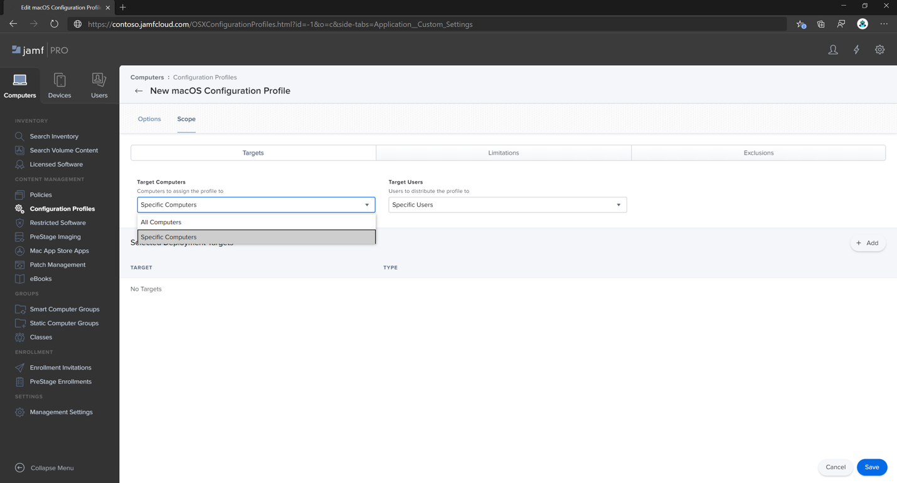
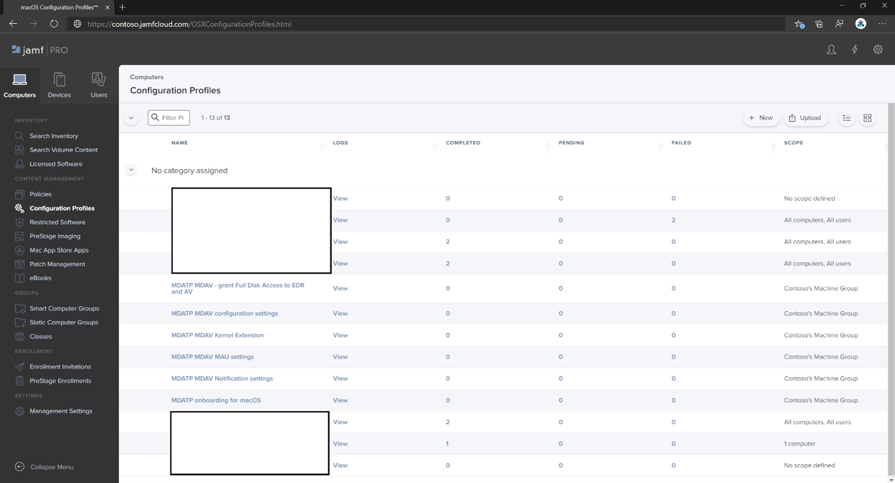
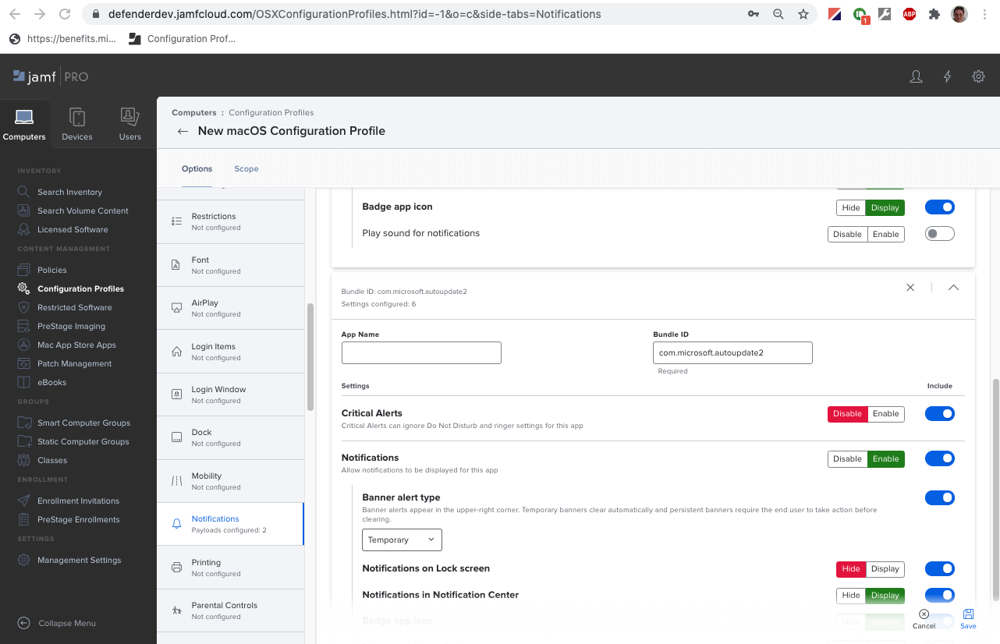

# <a name="set-up-the-microsoft-defender-for-endpoint-on-macos-policies-in-jamf-pro"></a>在 Jamf Pro 中设置 macOS 上的 Microsoft Defender for Endpoint 策略

[!INCLUDE [Microsoft 365 Defender rebranding](../../includes/microsoft-defender.md)]


**适用于：**

- [Mac 上的 Defender for Endpoint](microsoft-defender-endpoint-mac.md)

此页面将指导你完成在 Jamf Pro 中设置 macOS 策略所需的步骤。

需要执行以下步骤：

1. [获取适用于终结点的 Microsoft Defender 载入程序包](#step-1-get-the-microsoft-defender-for-endpoint-onboarding-package)

2. [使用载入程序包在 Jamf Pro 中创建配置文件](#step-2-create-a-configuration-profile-in-jamf-pro-using-the-onboarding-package)

3. [为终结点设置配置 Microsoft Defender](#step-3-configure-microsoft-defender-for-endpoint-settings)

4. [为终结点通知设置配置 Microsoft Defender](#step-4-configure-notifications-settings)

5. [配置 Microsoft AutoUpdate (MAU) ](#step-5-configure-microsoft-autoupdate-mau)

6. [授予对 Microsoft Defender for Endpoint 的完全磁盘访问权限](#step-6-grant-full-disk-access-to-microsoft-defender-for-endpoint)

7. [批准适用于终结点的 Microsoft Defender 内核扩展](#step-7-approve-kernel-extension-for-microsoft-defender-for-endpoint)

8. [批准适用于终结点的 Microsoft Defender 的系统扩展](#step-8-approve-system-extensions-for-microsoft-defender-for-endpoint)

9. [配置网络扩展](#step-9-configure-network-extension)

10. [在 macOS 上使用 Microsoft Defender for Endpoint 计划扫描](https://docs.microsoft.com/windows/security/threat-protection/microsoft-defender-atp/mac-schedule-scan-atp)

11. [在 macOS 上部署 Microsoft Defender for Endpoint](#step-11-deploy-microsoft-defender-for-endpoint-on-macos)


## <a name="step-1-get-the-microsoft-defender-for-endpoint-onboarding-package"></a>步骤 1：获取适用于终结点的 Microsoft Defender 载入程序包

1. 在 [Microsoft Defender 安全中心](https://securitycenter.microsoft.com )中，导航到">**载入"。** 

2. 选择 macOS 作为操作系统，选择移动设备管理/Microsoft Intune 作为部署方法。

    

3. 选择 **下载载入程序包 (WindowsDefenderATPOnboardingPackage.zip) 。**

4. 提取 `WindowsDefenderATPOnboardingPackage.zip` 。

5. 将文件复制到首选位置。 例如，`C:\Users\JaneDoe_or_JohnDoe.contoso\Downloads\WindowsDefenderATPOnboardingPackage_macOS_MDM_contoso\jamf\WindowsDefenderATPOnboarding.plist`。


## <a name="step-2-create-a-configuration-profile-in-jamf-pro-using-the-onboarding-package"></a>步骤 2：使用载入程序包在 Jamf Pro 中创建配置文件

1. 找到上 `WindowsDefenderATPOnboarding.plist` 一部分中的文件。

   

 
2. 在 Jamf Pro 仪表板中，选择"新建 **"。**

    

3. 输入以下详细信息：

   **常规**
   - 名称：macOS 的 MDATP 载入
   - 说明：适用于 macOS 的 MDATP EDR 载入
   - 类别：无
   - 分发方法：自动安装
   - 级别：计算机级别

4. 在 **"应用程序&自定义设置"中选择**"配置 **"。**

    

5. 选择 **"将文件 (PLIST 文件**) ，然后在首选项 **域中输入** `com.microsoft.wdav.atp` ：。 

    

    

7. 选择 **"** 打开"并选择载入文件。

    

8. 选择 **"上载"。** 

    


9. 选择" **范围"** 选项卡。

    

10. 选择目标计算机。

    

     

11. 选择“**保存**”。

    

    

12. 选择“**完成**”。

    

    

## <a name="step-3-configure-microsoft-defender-for-endpoint-settings"></a>步骤 3：为终结点设置配置 Microsoft Defender

1.  使用以下 Microsoft Defender for Endpoint 配置设置：

    - enableRealTimeProtection
    - passiveMode
    
    >[!NOTE]
    >默认情况下未打开，如果计划运行适用于 macOS 的第三方 AV，请将其设置为 `true` 。

    - 排除项
    - excludedPath
    - excludedFileExtension
    - excludedFileName
    - exclusionsMergePolicy
    - allowedThreats
    
    >[!NOTE]
    >EICAR 位于示例中，如果你要通过概念证明，请删除它，尤其是在你测试 EICAR 时。
        
    - disallowedThreatActions
    - potentially_unwanted_application
    - archive_bomb
    - cloudService
    - automaticSampleSubmission
    - tags
    - hideStatusMenuIcon
    
     有关信息，请参阅 [Jamf 配置文件的属性列表](mac-preferences.md#property-list-for-jamf-configuration-profile)。

     ```XML
     <?xml version="1.0" encoding="UTF-8"?>
     <!DOCTYPE plist PUBLIC "-//Apple//DTD PLIST 1.0//EN" "http://www.apple.com/DTDs/PropertyList-1.0.dtd">
     <plist version="1.0">
     <dict>
         <key>antivirusEngine</key>
         <dict>
             <key>enableRealTimeProtection</key>
             <true/>
             <key>passiveMode</key>
             <false/>
             <key>exclusions</key>
             <array>
                 <dict>
                     <key>$type</key>
                     <string>excludedPath</string>
                     <key>isDirectory</key>
                     <false/>
                     <key>path</key>
                     <string>/var/log/system.log</string>
                 </dict>
                 <dict>
                     <key>$type</key>
                     <string>excludedPath</string>
                     <key>isDirectory</key>
                     <true/>
                     <key>path</key>
                     <string>/home</string>
                 </dict>
                 <dict>
                     <key>$type</key>
                     <string>excludedFileExtension</string>
                     <key>extension</key>
                     <string>pdf</string>
                 </dict>
                 <dict>
                     <key>$type</key>
                     <string>excludedFileName</string>
                     <key>name</key>
                     <string>cat</string>
                 </dict>
             </array>
             <key>exclusionsMergePolicy</key>
             <string>merge</string>
             <key>allowedThreats</key>
             <array>
                 <string>EICAR-Test-File (not a virus)</string>
             </array>
             <key>disallowedThreatActions</key>
             <array>
                 <string>allow</string>
                 <string>restore</string>
             </array>
             <key>threatTypeSettings</key>
             <array>
                 <dict>
                     <key>key</key>
                     <string>potentially_unwanted_application</string>
                     <key>value</key>
                     <string>block</string>
                 </dict>
                 <dict>
                     <key>key</key>
                     <string>archive_bomb</string>
                     <key>value</key>
                     <string>audit</string>
                 </dict>
             </array>
             <key>threatTypeSettingsMergePolicy</key>
             <string>merge</string>
         </dict>
         <key>cloudService</key>
         <dict>
             <key>enabled</key>
             <true/>
             <key>diagnosticLevel</key>
             <string>optional</string>
             <key>automaticSampleSubmission</key>
             <true/>
         </dict>
         <key>edr</key>
         <dict>
             <key>tags</key>
             <array>
                 <dict>
                     <key>key</key>
                     <string>GROUP</string>
                     <key>value</key>
                     <string>ExampleTag</string>
                 </dict>
             </array>
         </dict>
         <key>userInterface</key>
         <dict>
             <key>hideStatusMenuIcon</key>
             <false/>
         </dict>
     </dict>
     </plist>
     ```

2. 将文件另存为 `MDATP_MDAV_configuration_settings.plist` 。


3.  在 Jamf Pro 仪表板中，选择"常规 **"。**

    

4. 输入以下详细信息：

    **常规**
    
    - 名称：MDATP MDAV 配置设置
    - 说明：\<blank\>
    - 类别：默认 (无) 
    - 分发方法：使用默认 (自动) 
    - 级别：计算机级别 (默认) 

    

5. 在 **"应用程序&自定义设置"中选择**"配置 **"。**

    

6. 选择 **"将文件 (PLIST 文件) "。**

    

7. 在 **首选项域中，** 输入 `com.microsoft.wdav` ，然后选择上载  **PLIST 文件**。

    

8. 选择 **"选择文件"。**

    

9. 选择 **"MDATP_MDAV_configuration_settings.plist"，** 然后选择"打开 **"。**

    

10. 选择 **"上载"。**

    

    

    >[!NOTE]
    >如果你发生上载 Intune 文件的情况，你将看到以下错误：<br>
    >


11. 选择“**保存**”。 

    

12. 文件已上载。

    

    

13. 选择" **范围"** 选项卡。

    

14. 选择 **Contoso 的机器组**。 

15. 选择 **"添加"，** 然后选择"**保存"。**

    

    

16. 选择“**完成**”。 你将看到新的 **配置配置文件**。

    


## <a name="step-4-configure-notifications-settings"></a>步骤 4：配置通知设置

这些步骤适用于加泰罗尼亚语或 (macOS 10.15) macOS 10.15。

1. 在 Jamf Pro 仪表板中，选择"**计算机"，** 然后选择"**配置文件"。**

2. 单击 **"新建**"，然后为"选项"输入以下 **详细信息**：
    
    - 常规 **选项卡**： 
        - **名称**：MDATP MDAV 通知设置
        - **说明**：macOS 10.15 (加泰罗尼亚语) 或更高版本
        - **类别**： *默认 (无)*
        - **分发方法**：使用默认 *(自动)*
        - **级别**：计算机级别 *(默认)*

        

    - Tab **Notifications**， click **Add**， and enter the following values：
        - **捆绑包 ID**： `com.microsoft.wdav.tray`
        - **严重警报：单击**" **禁用"**
        - **通知**：单击" **启用"**
        - **横幅警报类型**：选择 **"包含**"*和"临时 (默认)*
        - **锁屏界面上的通知：** 单击" **隐藏"**
        - **通知中心中的通知**： **单击显示**
        - **锁屏提醒应用图标**：单击 **显示**

        

    - 选项卡 **通知**，单击 **"再** 添加一次"，向下滚动到" **新建通知设置"**
        - **捆绑包 ID**： `com.microsoft.autoupdate2`
        - 将其余设置配置为与上述值相同的值

        

        请注意，现在你有两个包含通知配置的"表"，一个针对捆绑包 **ID：com.microsoft.wdav.tray，** 另一个针对捆绑包 **ID：com.microsoft.autoupdate2**。 尽管你可以根据你的要求配置警报设置，但是捆绑包的 ID 必须和之前描述的完全相同，并且 **Include** 开关必须为 **通知的打开**。

3. 选择"**范围"** 选项卡，然后选择"添加 **"。**

    

4. 选择 **Contoso 的机器组**。 

5. 选择 **"添加"，** 然后选择"**保存"。**
    
    
    
    

6. 选择“**完成**”。 你将看到新的 **配置配置文件**。
    

## <a name="step-5-configure-microsoft-autoupdate-mau"></a>步骤 5：配置 Microsoft AutoUpdate (MAU) 

1. 使用以下 Microsoft Defender for Endpoint 配置设置：

      ```XML
   <?xml version="1.0" encoding="UTF-8"?>
   <!DOCTYPE plist PUBLIC "-//Apple//DTD PLIST 1.0//EN" "http://www.apple.com/DTDs/PropertyList-1.0.dtd">
   <plist version="1.0">
   <dict>
    <key>ChannelName</key>
    <string>Current</string>
    <key>HowToCheck</key>
    <string>AutomaticDownload</string>
    <key>EnableCheckForUpdatesButton</key>
    <true/>
    <key>DisableInsiderCheckbox</key>
    <false/>
    <key>SendAllTelemetryEnabled</key>
    <true/>
   </dict>
   </plist>
   ```

2. 将其另存为 `MDATP_MDAV_MAU_settings.plist` 。

3. 在 Jamf Pro 仪表板中，选择"常规 **"。** 

    

4. 输入以下详细信息：

    **常规** 
    
    - 名称：MDATP MDAV MAU 设置
    - 说明：适用于 macOS 的 MDATP 的 Microsoft AutoUpdate 设置
    - 类别：默认 (无) 
    - 分发方法：使用默认 (自动) 
    - 级别：计算机级别 (默认) 

5. 在 **"应用程序&自定义设置"中选择**"配置 **"。**

    

6. 选择 **"将文件 (PLIST 文件) "。**

      

7. In **Preference Domain** enter： ， then select Upload `com.microsoft.autoupdate2` **PLIST File**.

    

8. 选择 **"选择文件"。**

    

9. 选择 **"MDATP_MDAV_MAU_settings.plist"。**

    

10. 选择 **"上载"。**
    

    

11. 选择“**保存**”。

    

12. 选择" **范围"** 选项卡。
   
     

13. 选择“**添加**”。
    
    

    

    

14. 选择“**完成**”。
    
    

## <a name="step-6-grant-full-disk-access-to-microsoft-defender-for-endpoint"></a>步骤 6：向 Microsoft Defender for Endpoint 授予完全磁盘访问权限

1. 在 Jamf Pro 仪表板中，选择 **"配置文件"。**

    

2. 选择 **+ 新建**。 

3. 输入以下详细信息：

    **常规** 
    - 名称：MDATP MDAV - 授予对 EDR 和 AV 的完全磁盘访问权限
    - 说明：在 macOS 加泰罗尼亚语或更高版本上，新的隐私首选项策略控制
    - 类别：无
    - 分发方法：自动安装
    - 级别：计算机级别


    

4. 在 **"配置隐私首选项策略控制"中，选择**"**配置"。**

    

5. 在 **"隐私首选项策略控制"中**，输入以下详细信息：

    - 标识符： `com.microsoft.wdav`
    - 标识符类型：捆绑包 ID
    - 代码要求： `identifier "com.microsoft.wdav" and anchor apple generic and certificate 1[field.1.2.840.113635.100.6.2.6] /* exists */ and certificate leaf[field.1.2.840.113635.100.6.1.13] /* exists */ and certificate leaf[subject.OU] = UBF8T346G9`


    

6. 选择“+ 添加”。

    

    - 在"应用或服务：设置为 **SystemPolicyAllFiles" 下**

    - 在"访问"下：设置为 **"允许"**

7. 选择 **" (** 不是右下角的) 。

    

8. 单击 `+` "应用访问" **旁边的** 符号添加新条目。

    

9. 输入以下详细信息：

    - 标识符： `com.microsoft.wdav.epsext`
    - 标识符类型：捆绑包 ID
    - 代码要求： `identifier "com.microsoft.wdav.epsext" and anchor apple generic and certificate 1[field.1.2.840.113635.100.6.2.6] /* exists */ and certificate leaf[field.1.2.840.113635.100.6.1.13] /* exists */ and certificate leaf[subject.OU] = UBF8T346G9`

10. 选择“+ 添加”。

    

    - 在"应用或服务：设置为 **SystemPolicyAllFiles" 下**

    - 在"访问"下：设置为 **"允许"**

11. 选择 **" (** 不是右下角的) 。

    

12. 选择" **范围"** 选项卡。

    

13. 选择“+ 添加”。

    

14. Select **Computer Groups** > under Group Name **>** select **Contoso's MachineGroup**. 

    

15. 选择“**添加**”。 

16. 选择“**保存**”。 
    
17. 选择“**完成**”。
    
    
    
    

或者，你可以下载 [fulldisk.mobileconfig](https://github.com/microsoft/mdatp-xplat/blob/master/macos/mobileconfig/profiles/fulldisk.mobileconfig) 并将其上载到 JAMF 配置文件，如使用 Jamf Pro 部署自定义配置文件中所述 [|方法 2：将配置文件上载到 Jamf Pro](https://www.jamf.com/jamf-nation/articles/648/deploying-custom-configuration-profiles-using-jamf-pro)。

## <a name="step-7-approve-kernel-extension-for-microsoft-defender-for-endpoint"></a>步骤 7：批准适用于终结点的 Microsoft Defender 内核扩展

> [!CAUTION]
> Apple 芯片 (M1) 设备不支持 KEXT。 在这些设备上安装包含 KEXT 策略的配置文件将失败。

1. 在"**配置文件"中**，选择 **"+ 新建"。**

    

2. 输入以下详细信息：

    **常规** 
    
    - 名称：MDATP MDAV 内核扩展
    - 说明：kext (MDATP 内核) 
    - 类别：无
    - 分发方法：自动安装
    - 级别：计算机级别

    

3. 在 **"配置批准的内核扩展"中，选择**"**配置"。**

    

   
4. 在 **"已批准内核扩展"** 中 输入以下详细信息：

    - 显示名称：Microsoft Corp.
    - 团队 ID：UBF8T346G9

    

5. 选择" **范围"** 选项卡。

    

6. 选择“+ 添加”。

7. Select **Computer Groups** > under Group Name **>** select **Contoso's Machine Group**.

8. 选择“+ 添加”。

    

9. 选择“**保存**”。

    

10. 选择“**完成**”。

    

或者，你可以下载 [kext.mobileconfig](https://github.com/microsoft/mdatp-xplat/blob/master/macos/mobileconfig/profiles/kext.mobileconfig) 并将其上载到 JAMF 配置文件，如使用 Jamf Pro 部署自定义配置文件中所述 [|方法 2：将配置文件上载到 Jamf Pro](https://www.jamf.com/jamf-nation/articles/648/deploying-custom-configuration-profiles-using-jamf-pro)。

## <a name="step-8-approve-system-extensions-for-microsoft-defender-for-endpoint"></a>步骤 8：批准适用于终结点的 Microsoft Defender 的系统扩展

1. 在"**配置文件"中**，选择 **"+ 新建"。**

    

2. 输入以下详细信息：

    **常规**
    
    - 名称：MDATP MDAV 系统扩展
    - 说明：MDATP 系统扩展
    - 类别：无
    - 分发方法：自动安装
    - 级别：计算机级别

    

3. 在 **"系统扩展"中，** 选择"**配置"。**

   

4. 在 **"系统扩展"** 中，输入以下详细信息：

   - 显示名称：Microsoft Corp. 系统扩展
   - 系统扩展类型：允许的系统扩展
   - 团队标识符：UBF8T346G9
   - 允许的系统扩展：
     - **com.microsoft.wdav.epsext**
     - **com.microsoft.wdav.netext**

    

5. 选择" **范围"** 选项卡。

    

6. 选择“+ 添加”。

7. Select **Computer Groups** > under Group Name **>** select **Contoso's Machine Group**.

8. 选择“+ 添加”。

   

9. 选择“**保存**”。

   

10. 选择“**完成**”。

    

## <a name="step-9-configure-network-extension"></a>步骤 9：配置网络扩展

作为终结点检测和响应功能的一部分，macOS 上的 Microsoft Defender for Endpoint 会检查套接字流量，将此信息报告给 Microsoft Defender 安全中心门户。 以下策略允许网络扩展执行此功能。

这些步骤适用于加泰罗尼亚语或 (macOS 10.15) macOS 10.15。

1. 在 Jamf Pro 仪表板中，选择"**计算机"，** 然后选择"**配置文件"。**

2. 单击 **"新建**"，然后为"选项"输入以下 **详细信息**：

    - 常规 **选项卡**： 
        - **名称**：Microsoft Defender ATP 网络扩展
        - **说明**：macOS 10.15 (加泰罗尼亚语) 或更高版本
        - **类别**： *默认 (无)*
        - **分发方法**：使用默认 *(自动)*
        - **级别**：计算机级别 *(默认)*

    - 选项卡 **内容筛选器**：
        - **筛选器名称**：Microsoft Defender ATP 内容筛选器
        - **标识符**： `com.microsoft.wdav`
        - 将 **服务地址****、组织、****用户名**、**密码**、**证书** 留空 (**包括***未* 选中) 
        - **筛选顺序**：检查器
        - **套接字筛选器**： `com.microsoft.wdav.netext`
        - **套接字筛选器指定要求**： `identifier "com.microsoft.wdav.netext" and anchor apple generic and certificate 1[field.1.2.840.113635.100.6.2.6] /* exists */ and certificate leaf[field.1.2.840.113635.100.6.1.13] /* exists */ and certificate leaf[subject.OU] = UBF8T346G9`
        - 如果 **"包含"** 未 **(，则"** 网络筛选器 *"* 字段留空) 

        请注意，**上述标识符****、套接字** 筛选器 **和套接字筛选器指定要求** 的确切值。

        

3. 选择" **范围"** 选项卡。

   

4. 选择“+ 添加”。

5. Select **Computer Groups** > under Group Name **>** select **Contoso's Machine Group**.

6. 选择“+ 添加”。

    

7. 选择“**保存**”。

    

8. 选择“**完成**”。

    

或者，你可以下载 [netfilter.mobileconfig](https://github.com/microsoft/mdatp-xplat/blob/master/macos/mobileconfig/profiles/netfilter.mobileconfig) 并将其上载到 JAMF 配置文件，如使用 Jamf Pro 部署自定义配置文件中所述 [|方法 2：将配置文件上载到 Jamf Pro](https://www.jamf.com/jamf-nation/articles/648/deploying-custom-configuration-profiles-using-jamf-pro)。


## <a name="step-10-schedule-scans-with-microsoft-defender-for-endpoint-on-macos"></a>步骤 10：在 macOS 上使用 Microsoft Defender for Endpoint 计划扫描
按照在 [macOS 上使用 Microsoft Defender for Endpoint 计划扫描的说明操作](https://docs.microsoft.com/windows/security/threat-protection/microsoft-defender-atp/mac-schedule-scan-atp)。


## <a name="step-11-deploy-microsoft-defender-for-endpoint-on-macos"></a>步骤 11：在 macOS 上部署 Microsoft Defender for Endpoint

1. 导航到保存的位置 `wdav.pkg` 。

    

2. 将其重命名为 `wdav_MDM_Contoso_200329.pkg` 。

    

3. 打开 Jamf Pro 仪表板。

    

4. 选择您的计算机，然后单击顶部的齿轮图标，然后选择计算机 **管理**。

    

5. 在 **"程序包"** 中，选择 **"+ 新建"。** 
    

6. 在 **"新建程序包"** 中 输入以下详细信息：

    **"常规"选项卡**
    - 显示名称：现在保留为空。 因为它将在你选择 pkg 时重置。
    - 类别：默认 (无) 
    - 文件名：选择"文件"

    

    打开 文件，并指向 `wdav.pkg` 或 `wdav_MDM_Contoso_200329.pkg` 。
    
    

7. 选择 **“打开”**。 将显示 **名称设置为** **Microsoft Defender 高级威胁防护和 Microsoft Defender 防病毒**。

    **清单文件** 不是必需的。 Microsoft Defender 高级威胁防护在没有清单文件的情况下工作。
    
    **选项选项卡**<br> 保留默认值。

    **"限制"选项卡**<br> 保留默认值。
    
     
   
8. 选择“**保存**”。 该程序包将上载到 Jamf Pro。 

   

   可能需要几分钟时间，程序包才能可用于部署。
   
   

9. 导航到" **策略"** 页。

    

10. 选择 **+ 新建** 以创建新策略。

    


11. 在 **"常规** "中 输入以下详细信息：

    - 显示名称：MDATP 载入 Contoso 200329 v100.86.92 或更高版本

    

12. 选择 **"定期签入"。** 
    
    

  
13. 选择“**保存**”。 
 
14. 选择 **">配置"。**
 
    

15. 选择 Microsoft Defender **高级** 威胁防护和 Microsoft Defender 防病毒 旁边的 **"添加"按钮**。

    

16. 选择“**保存**”。

    

17. 选择" **范围"** 选项卡。  

    

18. 选择目标计算机。

    

    **Scope**
    
    选择“**添加**”。
    
    

    

    **自助服务**
    
    

19. 选择“**完成**”。 

    

    


