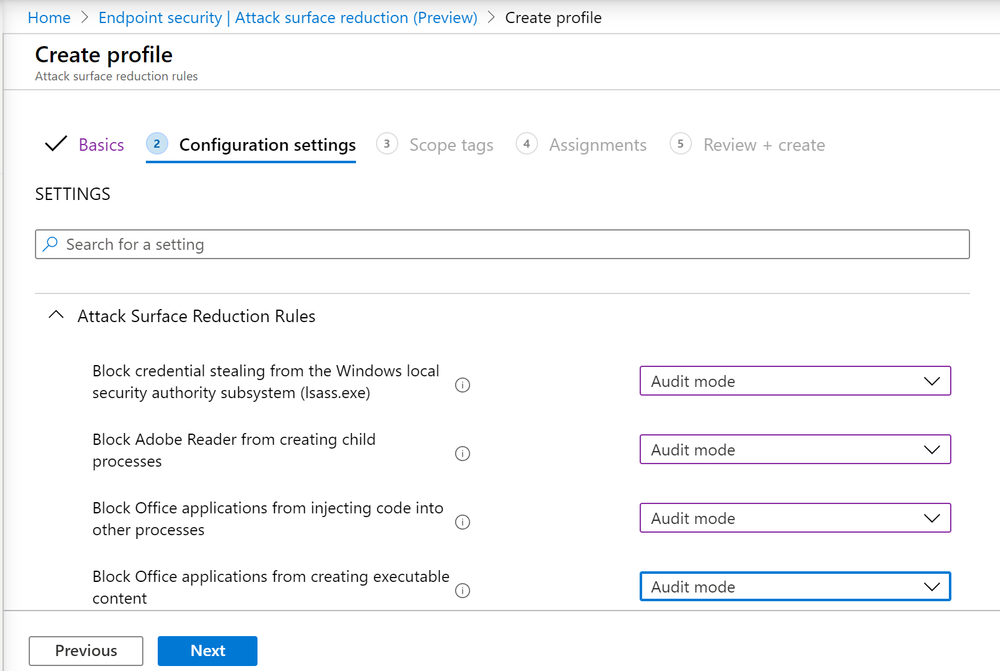

# 使用 Microsoft Endpoint Manager 载入

[!INCLUDE [Microsoft 365 Defender rebranding](../../includes/microsoft-defender.md)]

**适用于：**
- [Microsoft Defender for Endpoint](https://go.microsoft.com/fwlink/p/?linkid=2154037)
- [Microsoft 365 Defender](https://go.microsoft.com/fwlink/?linkid=2118804)

> 想要体验 Microsoft Defender for Endpoint？ [注册免费试用版。](https://www.microsoft.com/microsoft-365/windows/microsoft-defender-atp?ocid=docs-wdatp-exposedapis-abovefoldlink)

本文是部署指南的一部分，并作为示例载入方法。 

在 [规划主题](deployment-strategy.md) 中，提供了多种方法将设备载入服务。 本主题介绍云本机体系结构。 

 *环境体系结构关系图*

尽管 Defender for Endpoint 支持载入各种终结点和工具，但本文并未涵盖它们。 有关使用其他受支持的部署工具和方法进行常规载入的信息，请参阅 [载入概述](onboarding.md)。

[Microsoft Endpoint Manager](https://docs.microsoft.com/mem/endpoint-manager-overview) 是统一多个服务的解决方案平台。 它包括[用于基于云的设备管理的 Microsoft Intune。](https://docs.microsoft.com/mem/intune/fundamentals/what-is-intune)

本主题指导用户：
- 步骤 1：在 Microsoft Endpoint Manager 和 MEM (创建组，将设备载入) 分配配置
- 步骤 2：使用 Microsoft Endpoint Manager 为终结点功能配置 Defender

此载入指南将指导你完成使用 Microsoft Endpoint Manager 时需要执行以下基本步骤：

-   [标识目标设备或用户](#identify-target-devices-or-users)

    -   创建 Azure Active Directory 组 (用户或设备) 

-   [创建配置文件](#step-2-create-configuration-policies-to-configure-microsoft-defender-for-endpoint-capabilities)

    -   在 Microsoft Endpoint Manager 中，我们将指导你为每种功能创建单独的策略。

## 资源

以下是此过程的其余部分所需的链接：

-   [MEM 门户](https://aka.ms/memac)

-   [安全中心](https://securitycenter.windows.com/)

-   [Intune 安全基线](https://docs.microsoft.com/mem/intune/protect/security-baseline-settings-defender-atp#microsoft-defender)

有关 Microsoft Endpoint Manager 详细信息，请查看以下资源：
- [Microsoft Endpoint Manager 页面](https://docs.microsoft.com/mem/)
- [有关 Intune 和 ConfigMgr 聚合的博客文章](https://www.microsoft.com/microsoft-365/blog/2019/11/04/use-the-power-of-cloud-intelligence-to-simplify-and-accelerate-it-and-the-move-to-a-modern-workplace/)
- [MEM 简介视频](https://www.microsoft.com/microsoft-365/blog/2019/11/04/use-the-power-of-cloud-intelligence-to-simplify-and-accelerate-it-and-the-move-to-a-modern-workplace)

## 步骤 1：在 MEM 中创建组以在上分配配置来载入设备
### 确定目标设备或用户
在此部分中，我们将创建一个测试组来分配配置。

>[!NOTE]
>Intune 使用 Azure Active Directory (Azure AD) 组来管理设备和用户。 作为 Intune 管理员，你可以设置组以满足你的组织需求。 
有关详细信息，请参阅添加 [组以组织用户和设备](https://docs.microsoft.com/mem/intune/fundamentals/groups-add)。

### 创建群组

1.  打开 MEM 门户。

2.  打开 **"组>新建组"。**

    > [!div class="mx-imgBorder"]
    > 

3.  输入详细信息并创建新组。

    > [!div class="mx-imgBorder"]
    > 

4.  添加测试用户或设备。

5.  从" **组>所有组"窗格中** ，打开新组。

6.  选择 **"成员>添加成员"。**

7.  查找测试用户或设备并选择它。

    > [!div class="mx-imgBorder"]
    > 

8.  你的测试组现在具有要测试的成员。

## 步骤 2：创建配置策略以配置 Microsoft Defender 的终结点功能
下一节将创建多个配置策略。

首先，配置策略用于选择哪些用户组或设备将载入到适用于终结点的 Defender：

- [终结点检测和响应](#endpoint-detection-and-response) 

然后，继续创建几种不同类型的终结点安全策略：

- [下一代保护](#next-generation-protection)
- [攻击面减少](#attack-surface-reduction--attack-surface-reduction-rules)

### 终结点检测和响应

1.  打开 MEM 门户。

2.  导航到 **终结点安全>终结点检测和响应**。 单击"**创建配置文件"。**

    > [!div class="mx-imgBorder"]
    > 

3.  在 **平台下，选择 Windows 10 和更高版本，配置文件 - 终结点检测和响应>创建**。

4.  输入名称和说明，然后选择"下一 **步"。**

    > [!div class="mx-imgBorder"]
    > 

5.  按要求选择设置，然后选择"下一 **步"。**

    > [!div class="mx-imgBorder"]
    > 

    > [!NOTE]
    > 在此实例中，已自动填充，因为 Defender for Endpoint 已与 Intune 集成。 有关集成详细信息，请参阅在 Intune 中启用[Microsoft Defender for Endpoint。](https://docs.microsoft.com/mem/intune/protect/advanced-threat-protection-configure#to-enable-microsoft-defender-atp)
    > 
    > 下图是当 Microsoft Defender for Endpoint 未与 Intune 集成时你将看到的示例：
    >
    > 

6.  如有必要，添加范围标记，然后选择下一  **步**。

    > [!div class="mx-imgBorder"]
    > 

7.  通过单击"选择要包含的 **组**"并选择你的组来添加测试组，然后选择"下一步 **"。**

    > [!div class="mx-imgBorder"]
    > 

8.  查看并接受，  **然后选择创建**。

    > [!div class="mx-imgBorder"]
    > 

9.  可以查看已完成的策略。

    > [!div class="mx-imgBorder"]
    > 

### 下一代保护

1.  打开 MEM 门户。

2.  导航到 **终结点安全>防病毒>创建策略。**

    > [!div class="mx-imgBorder"]
    > 

3.  选择 **平台 - Windows 10 和更高版本 - Windows 和配置文件 – Microsoft Defender 防病毒>创建**。

4.  输入名称和说明，然后选择下一  **步**。

    > [!div class="mx-imgBorder"]
    > 

5.  在" **配置设置"页**：设置 Microsoft Defender 防病毒 (云保护、排除、Real-Time保护和修正) 。

    > [!div class="mx-imgBorder"]
    > 

6.  如有必要，添加范围标记，然后选择下一  **步**。

    > [!div class="mx-imgBorder"]
    > 

7.  选择要包含的组，分配给你的测试组，然后选择下一  **步**。

    > [!div class="mx-imgBorder"]
    > 

8.  查看并创建，然后选择"创建 **"。**

    > [!div class="mx-imgBorder"]
    > 

9.  你将看到你创建的配置策略。

    > [!div class="mx-imgBorder"]
    > 

### 攻击面减少 – 攻击面减少规则

1.  打开 MEM 门户。

2.  导航到 **终结点安全>攻击面减少**。

3.  选择 **"创建策略"。**

4.  选择 **平台 - Windows 10 和更高版本 – 配置文件 - 攻击面减少规则>创建**。

    > [!div class="mx-imgBorder"]
    > 

5.  输入名称和说明，然后选择"下一 **步"。**

    > [!div class="mx-imgBorder"]
    > 

6.  在"**配置设置"页**：设置攻击面减少规则需要的配置，然后选择"下一 **步"。**

    > [!NOTE]
    > 我们将配置所有攻击面减少规则以审核。
    > 
    > 有关详细信息，请参阅攻击 [面减少规则](attack-surface-reduction.md)。

    > [!div class="mx-imgBorder"]
    > 

7.  根据需要添加范围标记，然后选择"下一 **步"。**

    > [!div class="mx-imgBorder"]
    > 

8.  选择要包含并分配给测试组的组，然后选择"下一 **步"。**

    > [!div class="mx-imgBorder"]
    > 

9. 查看详细信息，然后选择"创建 **"。**

    > [!div class="mx-imgBorder"]
    > 

10. 查看策略。

    > [!div class="mx-imgBorder"]
    > 

### 攻击面减少 – Web 保护

1.  打开 MEM 门户。

2.  导航到 **终结点安全>攻击面减少**。

3.  选择 **"创建策略"。**

4.  选择 **"Windows 10 和更高版本 – Web >创建"。**

    > [!div class="mx-imgBorder"]
    > 

5.  输入名称和说明，然后选择"下一 **步"。**

    > [!div class="mx-imgBorder"]
    > 

6.  在"**配置设置"页**：设置 Web 保护需要的配置，然后选择"下一步 **"。**

    > [!NOTE]
    > 我们正在将 Web 保护配置为阻止。
    > 
    > 有关详细信息，请参阅[Web Protection。](web-protection-overview.md)

    > [!div class="mx-imgBorder"]
    > 

7.  根据需要 **在 Next 中添加>标记**。

    > [!div class="mx-imgBorder"]
    > 

8.  选择 **"分配到测试组>下一步"。**

    > [!div class="mx-imgBorder"]
    > 

9.  选择 **"审阅并创建>创建"。**

    > [!div class="mx-imgBorder"]
    > 

10. 查看策略。

    > [!div class="mx-imgBorder"]
    > 

## 验证配置设置

### 确认已应用策略

分配配置策略后，需要一些时间应用。

有关计时的信息，请参阅 [Intune 配置信息](https://docs.microsoft.com/mem/intune/configuration/device-profile-troubleshoot#how-long-does-it-take-for-devices-to-get-a-policy-profile-or-app-after-they-are-assigned)。

若要确认配置策略已应用于测试设备，请针对每个配置策略执行以下过程。

1.  打开 MEM 门户并导航到相关策略，如上述步骤所示。 以下示例显示了下一代保护设置。

    > [!div class="mx-imgBorder"]
    > 

2.  选择 **配置策略** 以查看策略状态。

    > [!div class="mx-imgBorder"]
    > 

3.  选择  **"设备状态** "以查看状态。

    > [!div class="mx-imgBorder"]
    > 

4.  选择  **"用户状态** "以查看状态。

    > [!div class="mx-imgBorder"]
    > 

5.  选择  **"每设置状态** "以查看状态。

    >[!TIP]
    >此视图对于标识与另一个策略冲突的任何设置非常有用。

    > [!div class="mx-imgBorder"]
    > 

### 终结点检测和响应

1.  在应用配置之前，不应启动 Defender for Endpoint Protection 服务。

    > [!div class="mx-imgBorder"]
    > 

2.  应用配置后，应启动 Defender for Endpoint Protection Service。

    > [!div class="mx-imgBorder"]
    > 

3.  在设备上运行服务后，设备将显示在 Microsoft Defender 安全中心中。

    > [!div class="mx-imgBorder"]
    > 

### 下一代保护

1.  在测试设备上应用策略之前，你应该能够手动管理设置，如下所示。

    > [!div class="mx-imgBorder"]
    > 

2.  应用策略后，你将无法手动管理设置。

    > [!NOTE]
    > 在下图中 **，"启用云提供的** 保护"和 **"** 启用实时保护"将显示为托管保护。

    > [!div class="mx-imgBorder"]
    > 

### 攻击面减少 – 攻击面减少规则

1.  在测试设备上应用该策略之前，笔使用 PowerShell 窗口并键入 `Get-MpPreference` 。

2.  此响应应包含以下行，无内容：

    > AttackSurfaceReductionOnlyExclusions：
    > 
    > AttackSurfaceReductionRules_Actions：
    > 
    > AttackSurfaceReductionRules_Ids：

    

3.  在测试设备上应用该策略后，打开 PowerShell Windows 并键入 `Get-MpPreference` 。

4.  这应该会以以下行作为响应，内容如下所示：

    

### 攻击面减少 – Web 保护

1.  在测试设备上，打开 PowerShell Windows 并键入 `(Get-MpPreference).EnableNetworkProtection` 。

2.  这应该会以 0 作为响应，如下所示。

    

3.  应用策略后，打开 PowerShell Windows 并键入 `(Get-MpPreference).EnableNetworkProtection` 。

4.  这应该会以 1 作为响应，如下所示。

    
