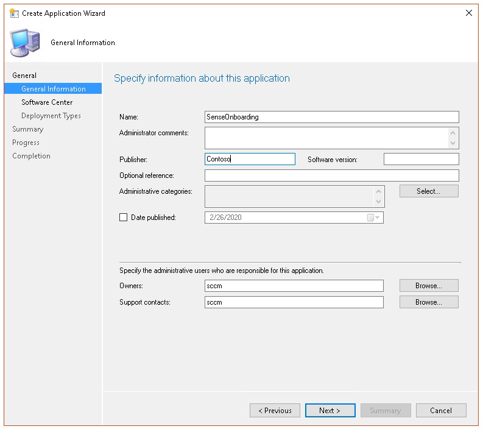
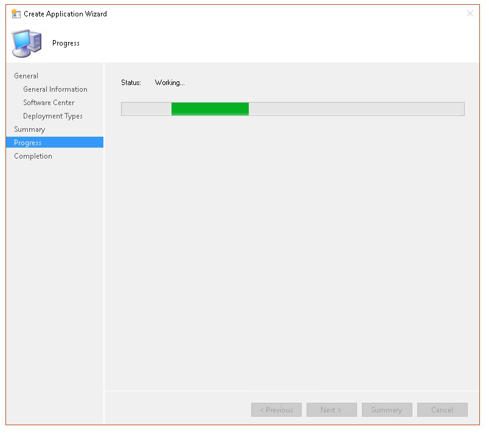

# <a name="troubleshoot-microsoft-defender-for-endpoint-onboarding-issues"></a>Microsoft Defender 终结点载入问题疑难解答

[!INCLUDE [Microsoft 365 Defender rebranding](../../includes/microsoft-defender.md)]


**适用于：**

- [Microsoft Defender for Endpoint](https://go.microsoft.com/fwlink/?linkid=2154037)
- Windows Server 2012 R2
- Windows Server 2016
- [Microsoft 365 Defender](https://go.microsoft.com/fwlink/?linkid=2118804)

> 想要体验适用于终结点的 Defender？ [注册免费试用版。](https://www.microsoft.com/microsoft-365/windows/microsoft-defender-atp?ocid=docs-wdatp-pullalerts-abovefoldlink) 

如果遇到问题，可能需要解决 Microsoft Defender 终结点载入过程的问题。
此页提供了解决在使用部署工具之一进行部署时可能会发生的载入问题以及设备上可能会发生的常见错误的详细步骤。

## <a name="troubleshoot-issues-with-onboarding-tools"></a>载入工具问题疑难解答

如果你已完成载入过程，但一小时后在"设备"列表中看不到设备，这可能表示[](investigate-machines.md)存在载入或连接问题。

### <a name="troubleshoot-onboarding-when-deploying-with-group-policy"></a>使用组策略进行部署时载入疑难解答

使用组策略部署通过运行设备上载入脚本完成。 组策略控制台不会指示部署是否成功。

如果你已完成载入过程，一小时后在"设备"列表中看不到设备，你可以检查设备上[](investigate-machines.md)脚本的输出。 有关详细信息，请参阅使用脚本进行 [部署时载入疑难解答](#troubleshoot-onboarding-when-deploying-with-a-script)。

如果脚本成功完成，请参阅解决设备上载入问题 [，](#troubleshoot-onboarding-issues-on-the-device) 了解可能会发生的其他错误。

### <a name="troubleshoot-onboarding-issues-when-deploying-with-microsoft-endpoint-configuration-manager"></a>在使用部署时解决载入Microsoft Endpoint Configuration Manager

使用以下版本的 Configuration Manager 载入设备时：

- Microsoft Endpoint Configuration Manager
- System Center 2012 配置管理器
- 系统中心 2012 R2 配置管理器

使用上述版本的 Configuration Manager 进行部署是在设备上运行载入脚本完成。 可以在 Configuration Manager 控制台中跟踪部署。

如果部署失败，你可以检查设备上脚本的输出。

如果载入成功完成，但设备未在一小时后显示在"设备"列表中，请参阅解决设备上载入问题，了解可能会发生的其他[](#troubleshoot-onboarding-issues-on-the-device)错误。

### <a name="troubleshoot-onboarding-when-deploying-with-a-script"></a>使用脚本进行部署时载入疑难解答

**检查设备上脚本的结果：**

1. 单击 **"开始**"，**键入事件查看器**，然后按 **Enter。**

2. 转到 **"Windows日志**  >  **应用程序"。**

3. 从 **WDATPOnboarding 事件源查找** 事件。

如果脚本失败并且事件是错误，您可以检查下表中的事件 ID，以帮助您解决问题。

> [!NOTE]
> 以下事件 ID 仅特定于载入脚本。

事件 ID | 错误类型 | 解决方案步骤
:---:|:---|:---
 `5` | 已找到但无法删除载出数据 | 检查注册表上的权限，特别是<br> `HKLM\SOFTWARE\Policies\Microsoft\Windows Advanced Threat Protection`.
`10` | 载入数据无法写入注册表 |  检查注册表上的权限，特别是<br> `HKLM\SOFTWARE\Policies\Microsoft\Windows Advanced Threat Protection`.<br>验证脚本是否以管理员身份运行。
`15` |  无法启动 SENSE 服务 |检查服务运行状况 (`sc query sense` 命令) 。 请确保它未在中间状态 ("Pending_Stopped"，"Pending_Running") 并尝试使用管理员权限 (再次运行) 。  <br> <br> 如果设备在运行Windows 10版本 1607 并运行 `sc query sense` 命令，则 `START_PENDING` 重新启动设备。 如果重新启动设备无法解决问题，请升级到 KB4015217 并再次尝试载入。
`15` | 无法启动 SENSE 服务 | 如果错误的消息是：系统错误 577 或错误 1058 已发生，你需要启用 Microsoft Defender 防病毒 ELAM 驱动程序，请参阅确保[策略](#ensure-that-microsoft-defender-antivirus-is-not-disabled-by-a-policy)未禁用 Microsoft Defender 防病毒，了解说明。
`30` |  脚本未能等待服务开始运行 | 该服务可能有更多的时间来启动或在尝试启动时遇到错误。 有关与 SENSE 相关的事件和错误的详细信息，请参阅使用事件查看器查看 [事件和错误](event-error-codes.md)。
`35` |  脚本未能找到所需的载入状态注册表值 | 当 SENSE 服务首次启动时，它会将载入状态写入注册表位置<br>`HKLM\SOFTWARE\Microsoft\Windows Advanced Threat Protection\Status`.<br> 脚本在几秒钟后未能找到它。 你可以手动测试它并检查它是否在那里。 有关与 SENSE 相关的事件和错误的详细信息，请参阅使用事件查看器查看 [事件和错误](event-error-codes.md)。
`40` | SENSE 服务载入状态未设置为 **1** | SENSE 服务未能正确载入。 有关与 SENSE 相关的事件和错误的详细信息，请参阅使用事件查看器查看 [事件和错误](event-error-codes.md)。
`65` | 权限不足| 使用管理员权限再次运行脚本。

### <a name="troubleshoot-onboarding-issues-using-microsoft-intune"></a>使用工具解决载入Microsoft Intune

您可以使用Microsoft Intune检查错误代码并尝试对问题的原因进行故障排除。

如果你在 Intune 中配置了策略，并且这些策略未在设备上传播，你可能需要配置自动 MDM 注册。

使用下表了解载入时可能出现的问题原因：

- Microsoft Intune错误代码和OMA-URIs表
- 非合规性表的已知问题
- 移动设备管理 (MDM) 事件日志表

如果任何事件日志和疑难解答步骤都不起作用，请从门户的" **设备** 管理"部分下载本地脚本，在提升的命令提示符中运行它。

#### <a name="microsoft-intune-error-codes-and-oma-uris"></a>Microsoft Intune错误代码和OMA-URIs

错误代码十六进制 | 错误代码 Dec | Error Description | OMA-URI | 可能的原因和疑难解答步骤
:---:|:---|:---|:---|:---
0x87D1FDE8 | -2016281112 | 修正失败 | 载入 <br> 载出 | **可能的原因：** 载入或载出在错误的 blob 上失败：签名错误或缺少 PreviousOrgIds 字段。 <br><br> **疑难解答步骤：** <br> 在"查看设备事件日志中的代理载入错误"部分检查[事件 ID。](#view-agent-onboarding-errors-in-the-device-event-log) <br><br> 检查下表中的 MDM 事件日志或按照诊断 MDM 故障中的说明操作[Windows 10。](/windows/client-management/mdm/diagnose-mdm-failures-in-windows-10)
 | | | | 载入 <br> 载出 <br> SampleSharing | **可能的原因：** Microsoft Defender for Endpoint Policy 注册表项不存在，或者 OMA DM 客户端没有写入它的权限。 <br><br> **疑难解答步骤：** 确保存在以下注册表项： `HKEY_LOCAL_MACHINE\SOFTWARE\Policies\Microsoft\Windows Advanced Threat Protection` <br> <br> 如果不存在，请打开提升的命令并添加密钥。
 | | | | SenseIsRunning <br> OnboardingState <br> OrgId |  **可能的原因：** 尝试通过只读属性修正。 载入失败。 <br><br> **疑难解答步骤：** 查看解决设备上载入 [问题中的疑难解答步骤](#troubleshoot-onboarding-issues-on-the-device)。 <br><br> 检查下表中的 MDM 事件日志或按照诊断 MDM 故障中的说明操作[Windows 10。](/windows/client-management/mdm/diagnose-mdm-failures-in-windows-10)
 | | | | 全部 | **可能的原因：** 尝试在不支持的 SKU/平台上部署 Microsoft Defender for Endpoint，尤其是全息 SKU。 <br><br> 当前支持的平台：<br> Enterprise、教育以及Professional。<br> 不支持服务器。
 0x87D101A9 | -2016345687 |SyncML (425) ：请求的命令失败，因为发件人没有足够的访问控制权限 (对收件人) ACL 权限。 | 全部 |  **可能的原因：** 尝试在不支持的 SKU/平台上部署 Microsoft Defender for Endpoint，尤其是全息 SKU。<br><br> 当前支持的平台：<br>  Enterprise、教育以及Professional。

#### <a name="known-issues-with-non-compliance"></a>不合规的已知问题

下表提供了有关不合规问题以及如何解决这些问题的信息。

情况 | 症状 | 可能的原因和疑难解答步骤
:---:|:---|:---
 `1` | 设备符合 SenseIsRunning OMA-URI。 但不符合 OrgId、Onboarding 和 OnboardingState OMA-URI。 | **可能的原因：** 检查用户在安装或升级后Windows OOBE。 在 OOBE 载入期间无法完成，但 SENSE 已在运行。<br><br> **疑难解答步骤：** 等待 OOBE 完成。
 `2` |  设备符合 OrgId、Onboarding 和 OnboardingState OMA-URI，但不符合 SenseIsRunning OMA-URI。 |  **可能的原因：** Sense 服务的启动类型设置为"延迟启动"。 有时，当系统Microsoft Intune DM 会话时，这会导致服务器将设备报告为不符合 SenseIsRunning。 <br><br> **疑难解答步骤：** 该问题应在 24 小时内自动修复。
 `3` | 设备不兼容 | **疑难解答步骤：** 确保未在同一设备上同时部署载入和载出策略。

#### <a name="mobile-device-management-mdm-event-logs"></a>移动设备管理 (MDM) 事件日志

查看 MDM 事件日志，解决载入期间可能出现的问题：

日志名称：Microsoft\Windows\DeviceManagement-EnterpriseDiagnostics-Provider

频道名称：管理员

ID | 严重性 | 事件描述 | 故障排除步骤
:---|:---|:---|:---
1819 | 错误 | 适用于终结点 CSP 的 Microsoft Defender：未能设置节点的值。 NodeId： (%1) ，TokenName： (%2) ，结果： (%3) 。 | 下载[1607 年 Windows 10 累积更新](https://go.microsoft.com/fwlink/?linkid=829760)。

## <a name="troubleshoot-onboarding-issues-on-the-device"></a>解决设备上载入问题

如果使用的部署工具未指示载入过程中的错误，但设备在一小时内仍不显示在设备列表中，请浏览以下验证主题，检查 Microsoft Defender for Endpoint 代理是否发生了错误。

- [查看设备事件日志中的代理载入错误](#view-agent-onboarding-errors-in-the-device-event-log)
- [确保诊断数据服务已启用](#ensure-the-diagnostics-service-is-enabled)
- [确保服务设置为启动](#ensure-the-service-is-set-to-start)
- [确保设备具有 Internet 连接](#ensure-the-device-has-an-internet-connection)
- [确保Microsoft Defender 防病毒策略未禁用此策略](#ensure-that-microsoft-defender-antivirus-is-not-disabled-by-a-policy)

### <a name="view-agent-onboarding-errors-in-the-device-event-log"></a>查看设备事件日志中的代理载入错误

1. 单击 **"开始**"，**键入事件查看器**，然后按 **Enter。**

2. 在事件 **查看器 (本地)** 窗格中，展开应用程序 **和服务** 日志 Microsoft Windows  >    >    >  **SENSE**。

   > [!NOTE]
   > SENSE 是内部名称，用于引用支持 Microsoft Defender for Endpoint 的行为传感器。

3. 选择 **"操作** "以加载日志。

4. 在"**操作"窗格中**，单击"**筛选当前日志"。**

5. 在"**筛选器"** 选项卡上的"**事件级别：** 选择 **严重**、**警告** 和 **错误**"下，然后单击"确定 **"。**

   

6. 可指示问题的事件将显示在"操作" **窗格中** 。 您可以尝试根据下表中的解决方案进行疑难解答：

事件 ID | 邮件 | 解决方案步骤
:---:|:---|:---
 `5` | Microsoft Defender for Endpoint 服务无法连接到位于 _variable 的服务器_ | [确保设备可以访问 Internet。](#ensure-the-device-has-an-internet-connection)
 `6` | Microsoft Defender for Endpoint 服务未载入，并且未找到任何载入参数。 失败代码： _变量_ | [再次运行载入脚本](configure-endpoints-script.md)。
 `7` | Microsoft Defender for Endpoint 服务无法读取载入参数。 失败代码： _变量_ | [确保设备可以访问 Internet，](#ensure-the-device-has-an-internet-connection)然后再次运行整个载入过程。
 `9` | Microsoft Defender for Endpoint 服务未能更改其启动类型。 失败代码：变量 | 如果事件在载入期间发生，请重新启动并重新尝试运行载入脚本。 有关详细信息，请参阅再次 [运行载入脚本](configure-endpoints-script.md)。 <br><br>如果事件在载出期间发生，请联系支持人员。
`10` | Microsoft Defender for Endpoint 服务无法保留载入信息。 失败代码：变量 | 如果事件在载入期间发生，请重新尝试运行载入脚本。 有关详细信息，请参阅再次 [运行载入脚本](configure-endpoints-script.md)。 <br><br>如果问题仍然存在，请联系支持人员。
`15` | Microsoft Defender for Endpoint 无法使用 URL 启动命令 _通道：变量_ | [确保设备可以访问 Internet。](#ensure-the-device-has-an-internet-connection)
`17` | Microsoft Defender for Endpoint 服务未能更改连接用户体验和遥测服务位置。 失败代码：变量 | [再次运行载入脚本](configure-endpoints-script.md)。 如果问题仍然存在，请联系支持人员。
`25` | Microsoft Defender for Endpoint 服务无法重置注册表中的运行状况状态。 失败代码： _变量_ | 请联系支持人员。
`27` | 未能在终结点模式下启用 Microsoft Defender Windows Defender。 载入过程失败。 失败代码：变量 | 请联系支持人员。
`29` | 未能读取 offboarding参数。 错误类型：%1，错误代码：%2，说明：%3 | 确保设备可以访问 Internet，然后再次运行整个载出过程。
`30` | 在 Microsoft Defender for Endpoint (禁用 $ build.sense.productDisplayName) 模式失败。 失败代码：%1 | 请联系支持人员。
`32` | $ (build.sense.productDisplayName) 服务在板载过程后无法请求自行停止。 失败代码：%1 | 验证服务启动类型是手动的，然后重新启动设备。
`55` | 未能创建安全 ETW 自动记录器。 失败代码：%1 | 重新启动设备。
`63` | 更新外部服务的启动类型。 名称：%1，实际开始类型：%2，预期开始类型：%3，退出代码：%4 | 确定导致上述服务启动类型发生更改的原因。 如果退出代码不为 0，请手动将启动类型修复为预期的开始类型。
`64` | 启动已停止的外部服务。 名称：%1，退出代码：%2 | 如果事件一直重新显示，请联系支持人员。
`68` | 服务的启动类型是意外的。 服务名称：%1，实际启动类型：%2，预期启动类型：%3 | 确定导致开始类型更改的原因。 修复了提及的服务启动类型。
`69` | 服务已停止。 服务名称：%1 | 启动提及的服务。 如果仍然存在，请联系支持人员。

<br />

设备上还有 Microsoft Defender for Endpoint 代理正常运行所依赖的其他组件。 如果 Microsoft Defender for Endpoint 代理事件日志中没有载入相关错误，请继续执行以下步骤，以确保正确配置其他组件。

<span id="ensure-the-diagnostics-service-is-enabled" />

### <a name="ensure-the-diagnostic-data-service-is-enabled"></a>确保诊断数据服务已启用

如果设备未正确报告，你可能需要检查Windows 10数据服务是否设置为自动启动并且正在设备上运行。 该服务可能已被其他程序或用户配置更改禁用。

首先，应检查服务是否设置为在 Windows 启动时自动启动，然后应检查服务当前是否正在运行 (如果未运行该服务，则启动) 。

### <a name="ensure-the-service-is-set-to-start"></a>确保服务设置为启动

**使用命令行检查诊断Windows 10服务启动类型**：

1. 在设备上打开提升的命令行提示符：

   a. 单击 **"开始**"，键入 **cmd**，然后按 **Enter。**

   b. 右键单击“**命令提示符**”，然后选择“**以管理员身份运行**”。

2. 输入以下命令，然后按 **Enter：**

   ```text
   sc qc diagtrack
   ```

   如果服务已启用，则结果应如以下屏幕截图所示：

   

   如果未设置为 ，则需要将服务设置为 `START_TYPE` `AUTO_START` 自动启动。

**使用命令行将 Windows 10数据服务设置为自动启动：**

1. 在设备上打开提升的命令行提示符：

   a. 单击 **"开始**"，键入 **cmd**，然后按 **Enter。**

   b. 右键单击“**命令提示符**”，然后选择“**以管理员身份运行**”。

2. 输入以下命令，然后按 **Enter：**

   ```text
   sc config diagtrack start=auto
   ```

3. 将显示成功消息。 通过输入以下命令验证更改，然后按 **Enter：**

   ```text
   sc qc diagtrack
   ```

4. 启动服务。

   a. 在命令提示符中，键入以下命令并按 **Enter：**

   ```text
   sc start diagtrack
   ```

### <a name="ensure-the-device-has-an-internet-connection"></a>确保设备具有 Internet 连接

Microsoft Defender for Endpoint 感官方案需要 Microsoft Windows HTTP （WinHTTP） 报告感官数据，并与 Microsoft Defender for Endpoint 服务进行通信。

WinHTTP 独立于 Internet 浏览代理设置和其他用户上下文应用程序，必须能够检测特定环境中可用的代理服务器。

若要确保传感器具有服务连接，请按照验证客户端与 Microsoft [Defender for Endpoint 服务 URL](configure-proxy-internet.md#verify-client-connectivity-to-microsoft-defender-for-endpoint-service-urls) 的连接主题中所述的步骤操作。

如果验证失败，并且您的环境正在使用代理连接到 Internet，请按照配置代理和 Internet 连接设置主题 [中所述](configure-proxy-internet.md) 的步骤操作。

### <a name="ensure-that-microsoft-defender-antivirus-is-not-disabled-by-a-policy"></a>确保Microsoft Defender 防病毒策略未禁用此策略

> [!IMPORTANT]
> 以下仅适用于尚未收到 2020年 8 月 (版本 4.18.2007.8) 更新的设备Microsoft Defender 防病毒。
>
> 更新可确保Microsoft Defender 防病毒策略在客户端设备上关闭此配置。

**问题**：载入后 Microsoft Defender for Endpoint 服务未启动。

**症状**：载入成功完成，但在尝试启动服务时看到错误 577 或错误 1058。

**解决方案**：如果你的设备正在运行第三方反恶意软件客户端，Microsoft Defender for Endpoint 代理需要启用"提前启动反恶意软件 (ELAM) 驱动程序。 必须确保系统策略未将其关闭。

- 根据用于实现策略的工具，需要验证是否清除以下Windows Defender策略：

  - DisableAntiSpyware
  - DisableAntiVirus

  例如，在组策略中，应该没有诸如以下值这样的条目：

  - `<Key Path="SOFTWARE\Policies\Microsoft\Windows Defender"><KeyValue Value="0" ValueKind="DWord" Name="DisableAntiSpyware"/></Key>`
  - `<Key Path="SOFTWARE\Policies\Microsoft\Windows Defender"><KeyValue Value="0" ValueKind="DWord" Name="DisableAntiVirus"/></Key>`

> [!IMPORTANT]
> 从 2020 年 8 月 (版本 4.18.2007.8 开始，该设置将停止使用，并且将在所有客户端设备上) 更新到 `disableAntiSpyware` Microsoft Defender 防病毒。

- 清除策略后，再次运行载入步骤。

- 您还可以通过打开注册表项来检查以前的注册表项值，以验证策略是否被禁用 `HKEY_LOCAL_MACHINE\SOFTWARE\Policies\Microsoft\Windows Defender` 。

    

   > [!NOTE]
   > Windows Defender wdboot (wdboot、wdfilter、wdnisdrv、wdnissvc 和 windefend) 所有服务都应在默认状态下。 更改这些服务的启动不受支持，可能会强制你重新映像系统。
   >
   > WdBoot 和 WdFilter 的默认配置示例：
   > - `<Key Path="SYSTEM\CurrentControlSet\Services\WdBoot"><KeyValue Value="0" ValueKind="DWord" Name="Start"/></Key>`
   > - `<Key Path="SYSTEM\CurrentControlSet\Services\WdFilter"><KeyValue Value="0" ValueKind="DWord" Name="Start"/></Key>`

## <a name="troubleshoot-onboarding-issues-on-a-server"></a>在服务器上载入问题疑难解答

如果在载入服务器时遇到问题，请执行以下验证步骤来解决可能的问题。

- [确保Microsoft Monitoring Agent (MMA) 并配置为向服务报告传感器数据](configure-server-endpoints.md)
- [确保正确配置服务器代理和 Internet 连接设置](configure-server-endpoints.md)

您可能还需要检查以下内容：

- 检查在任务管理器 的"进程"选项卡中是否正在运行适用于 Endpoint Service 的 Microsoft **Defender。** 例如：

    

- 检查 **事件**  >  **查看器应用程序和服务日志**  >  **操作管理器**，以查看是否有错误。

- 在 **"** 服务"**中，Microsoft Monitoring Agent** 服务器是否在服务器上运行。 例如：

    

- In **Microsoft Monitoring Agent**  >  **Azure Log Analytics (OMS) ，** check the Workspaces and verify that the status is running.

    

- 检查设备是否反映在门户中的 **"设备"** 列表中。

## <a name="confirming-onboarding-of-newly-built-devices"></a>确认新构建设备的载入

在新构建的设备上部署载入时，可能会存在一些实例，但未完成。

以下步骤为以下方案提供指导：

- 载入包部署到新构建的设备
- 传感器未启动，因为尚未完成 (OOBE) 或第一个用户登录
- 在最终用户执行第一次登录之前，设备已关闭或重新启动
- 在此方案中，SENSE 服务不会自动启动，即使已部署载入包

> [!NOTE]
> 以下步骤仅在使用 Microsoft Endpoint Configuration Manager 时Microsoft Endpoint Configuration Manager。 有关使用应用载入的Microsoft Endpoint Configuration Manager，请参阅[Microsoft Defender for Endpoint](/mem/configmgr/protect/deploy-use/windows-defender-advanced-threat-protection)。

1. 在应用程序中创建Microsoft Endpoint Configuration Manager。

    

2. 选择 **"手动指定应用程序信息"。**

    

3. 指定有关应用程序的信息，然后选择"下一 **步"。**

    

4. 指定有关软件中心的信息，然后选择"下一 **步"。**

    

5. 在 **"部署类型"中，** 选择"**添加"。**

    

6. 选择 **"手动指定部署类型信息"，** 然后选择"下一 **步"。**

    

7. 指定有关部署类型的信息，然后选择"下一 **步"。**

    

8. 在 **内容**  >  **安装程序中**，指定命令 `net start sense` ：。

    

9. 在 **检测方法** 中，**选择"配置规则以检测此部署类型是否存在"，** 然后选择"**添加子句"。**

    

10. 指定以下检测规则详细信息，然后选择"确定 **"：**

    

11. 在 **"检测方法"中，** 选择"下 **一步"。**

    

12. 在 **"用户体验"** 中，指定以下信息，然后选择"下一 **步"：**

    

13. 在 **"要求"** 中，选择"下 **一步"。**

    

14. 在 **"依赖项"中**，选择"下 **一步"。**

    

15. 在 **"摘要"中**，选择"下一 **步"。**

    

16. 在 **"完成"** 中，选择"**关闭"。**

    

17. 在 **"部署类型"中**，选择"下 **一步"。**

    

18. 在 **"摘要"中**，选择"下一 **步"。**

    

    然后显示状态： 

19. 在 **"完成"** 中，选择"**关闭"。**

    

20. 现在，可以通过右键单击应用并选择部署 来部署 **应用程序**。

    

21. 在 **"常规****"中，选择"自动分配依赖项的内容"和"****浏览"。**

    

22. 在 **"内容"中**，选择"下一 **步"。**

    

23. 在 **"部署设置"中**，选择"下 **一步"。**

    

24. 在 **"计划"** 中 **，选择"在可用时间后尽快"，** 然后选择"下一 **步"。**

    

25. 在 **用户体验中，** 选择"在截止时间或维护时段内提交更改 (需要重新启动) ，然后选择"下 **一****步"。**

    

26. 在 **警报中选择下** 一 **步**。

    

27. 在 **"摘要"中**，选择"下一 **步"。**

    

    然后显示状态"配置 

28. 在 **"完成"** 中，选择"**关闭"。**

    


## <a name="related-topics"></a>相关主题

- [Microsoft Defender for Endpoint 疑难解答](troubleshoot-mdatp.md)
- [载入设备](onboard-configure.md)
- [配置设备代理和 Internet 连接设置](configure-proxy-internet.md)
