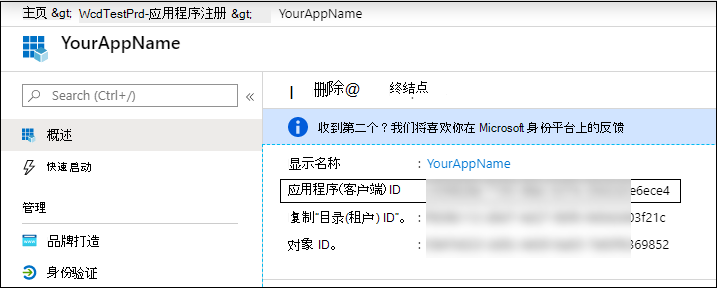

# <a name="partner-access-through-microsoft-threat-protection-apis"></a>通过 Microsoft 威胁防护 Api 的合作伙伴访问

[!INCLUDE [Microsoft 365 Defender rebranding](../includes/microsoft-defender.md)]


**适用于：**
- Microsoft 威胁防护

>[!IMPORTANT] 
>一些信息与 prereleased 产品相关，在正式发布之前可能会对其进行重大修改。 Microsoft makes no warranties, express or implied, with respect to the information provided here.


本页面介绍如何创建 AAD 应用程序，以获取代表客户对 Microsoft 威胁保护的编程访问权限。

Microsoft 威胁防护通过一组编程 Api 公开其大部分数据和操作。 这些 Api 将帮助您基于 Microsoft 威胁防护功能自动执行工作流和创新。 API 访问需要 OAuth 2.0 身份验证。 有关详细信息，请参阅 [OAuth 2.0 授权代码流](https://docs.microsoft.com/azure/active-directory/develop/active-directory-v2-protocols-oauth-code)。

一般情况下，您需要执行以下步骤来使用 Api：
- 创建 **多租户** AAD 应用程序。
- 向你的应用程序授予授权 (同意) 你的应用程序访问 Microsoft 所需的威胁保护资源。
- 使用此应用程序获取访问令牌。
- 使用令牌访问 Microsoft 威胁防护 API。

以下步骤介绍了如何创建 AAD 应用程序，获取对 Microsoft 威胁防护的访问令牌，并验证令牌。

## <a name="create-the-multi-tenant-app"></a>创建多租户应用程序

1. 使用具有**全局管理员**角色的用户登录到你的[Azure 租户](https://portal.azure.com)。

2. 导航到**Azure Active Directory**  >  **应用注册**  >  **新注册**。 

   

3. 在 "注册" 表单中：

    - 为您的应用程序选择一个名称。

    - 受支持的帐户类型-任何组织目录中的帐户。

    - 重定向 URI-类型： Web，URI： https://portal.azure.com

    


4. 允许应用程序访问 Microsoft 威胁防护，并为其分配完成集成所需的最少权限集。

   - 在应用程序页上，单击 " **API 权限**  >  **Add permission**  >  **" "添加我的组织使用的权限 api" > "** 键入**microsoft 威胁防护**"，然后单击 " **microsoft 威胁防护**"。

   >[!NOTE]
   >Microsoft 威胁防护不会出现在原始列表中。 您需要先在文本框中写入其名称，才能看到它的显示。

   
   
   ### <a name="request-api-permissions"></a>请求 API 权限

   若要确定所需的权限，请查看您想要调用的 API 中的 " **权限** " 部分。 

   在下面的示例中，我们将使用 **"读取所有事件"** 权限：

   选择 "**应用程序权限**  >  **事件"。读取。所有**> 单击 "**添加权限**"

   


5. 单击 "**授予同意**"

    >[!NOTE]
    >每次添加权限时，都必须单击 " **授予许可** " 以使新权限生效。

    

6. 向应用程序添加密码。

    - 单击 " **证书 & 密码**"，将 "说明" 添加到密码，然后单击 " **添加**"。

    >[!IMPORTANT]
    > 选择 " **添加**" 后， **复制生成的机密值**。 你不能在离开后检索！

    

7. 记下应用程序 ID：

   - 在应用程序页上，转到 " **概述** " 并复制以下内容：

   

8. 将应用程序添加到客户的租户。

    您需要在要使用的每个客户租户中批准您的应用程序。 这是因为您的应用代表客户与 Microsoft 威胁防护应用程序进行交互。

    具有客户租户的 **全局管理员** 的用户需要单击许可链接并批准您的应用程序。

    许可链接的形式为：

    ```
    https://login.microsoftonline.com/common/oauth2/authorize?prompt=consent&client_id=00000000-0000-0000-0000-000000000000&response_type=code&sso_reload=true
    ```

    其中00000000-0000-0000-0000-000000000000 应替换为您的应用程序 ID

    单击 "同意" 链接后，请使用客户租户的全局管理员登录，并同意该应用程序。

    

    此外，还需要向客户咨询其租户 ID，并将其保存以供将来在获取令牌时使用。

- **为了!** 已成功注册应用程序！ 
- 有关令牌获取和验证，请参阅下面的示例。

## <a name="get-an-access-token-examples"></a>获取访问令牌示例：

>[!NOTE]
> 若要代表客户获取访问令牌，请在以下令牌收购中使用客户的租户 ID。

<br>有关 AAD 令牌的更多详细信息，请参阅 [AAD 教程](https://docs.microsoft.com/azure/active-directory/develop/active-directory-v2-protocols-oauth-client-creds)

### <a name="using-powershell"></a>使用 PowerShell

```
# That code gets the App Context Token and save it to a file named "Latest-token.txt" under the current directory
# Paste below your Tenant ID, App ID and App Secret (App key).

$tenantId = '' ### Paste your tenant ID here
$appId = '' ### Paste your Application ID here
$appSecret = '' ### Paste your Application key here

$resourceAppIdUri = 'https://api.security.microsoft.com'
$oAuthUri = "https://login.windows.net/$TenantId/oauth2/token"
$authBody = [Ordered] @{
    resource = "$resourceAppIdUri"
    client_id = "$appId"
    client_secret = "$appSecret"
    grant_type = 'client_credentials'
}
$authResponse = Invoke-RestMethod -Method Post -Uri $oAuthUri -Body $authBody -ErrorAction Stop
$token = $authResponse.access_token
Out-File -FilePath "./Latest-token.txt" -InputObject $token
return $token
```

### <a name="using-c"></a>使用 c #：

>下面的代码使用 Nuget Microsoft.identitymodel.dll 进行了测试

- 创建新的控制台应用程序
- 安装 Nuget [microsoft.identitymodel.dll](https://www.nuget.org/packages/Microsoft.IdentityModel.Clients.ActiveDirectory/) 。
- 使用添加下面的

    ```
    using Microsoft.IdentityModel.Clients.ActiveDirectory;
    ```

- 将下面的代码复制/粘贴到您的应用程序中 (不要忘记更新3个变量： ```tenantId, appId, appSecret```) 

    ```
    string tenantId = "00000000-0000-0000-0000-000000000000"; // Paste your own tenant ID here
    string appId = "11111111-1111-1111-1111-111111111111"; // Paste your own app ID here
    string appSecret = "22222222-2222-2222-2222-222222222222"; // Paste your own app secret here for a test, and then store it in a safe place! 

    const string authority = "https://login.windows.net";
    const string mtpResourceId = "https://api.security.microsoft.com";

    AuthenticationContext auth = new AuthenticationContext($"{authority}/{tenantId}/");
    ClientCredential clientCredential = new ClientCredential(appId, appSecret);
    AuthenticationResult authenticationResult = auth.AcquireTokenAsync(mtpResourceId, clientCredential).GetAwaiter().GetResult();
    string token = authenticationResult.AccessToken;
    ```


### <a name="using-curl"></a>使用卷

> [!NOTE]
> 以下过程应卷曲 Windows 已安装在您的计算机上

- 打开命令窗口
- 将 CLIENT_ID 设置为你的 Azure 应用程序 ID
- 将 CLIENT_SECRET 设置为你的 Azure 应用程序密码
- 将 TENANT_ID 设置为希望使用您的应用程序访问 Microsoft 威胁防护应用程序的客户的 Azure 租户 ID
- 运行以下命令：

```
curl -i -X POST -H "Content-Type:application/x-www-form-urlencoded" -d "grant_type=client_credentials" -d "client_id=%CLIENT_ID%" -d "scope=https://api.security.microsoft.com.default" -d "client_secret=%CLIENT_SECRET%" "https://login.microsoftonline.com/%TENANT_ID%/oauth2/v2.0/token" -k
```

您将获得表单的答案：

```
{"token_type":"Bearer","expires_in":3599,"ext_expires_in":0,"access_token":"eyJ0eXAiOiJKV1QiLCJhbGciOiJSUzI1NiIsIn <truncated> aWReH7P0s0tjTBX8wGWqJUdDA"}
```

## <a name="validate-the-token"></a>验证令牌

健全性检查以确保获得正确的令牌：

- 将上一步中获取的令牌复制/粘贴到 [JWT](https://jwt.ms) ，以便对其进行解码
- 验证是否获取了具有所需权限的 "roles" 声明
- 在下面的屏幕截图中，你可以看到从应用程序获取的解码令牌，其中包含多个对 Microsoft 威胁防护的权限：
- "Tid" 声明是令牌所属的租户 ID。


## <a name="use-the-token-to-access-microsoft-threat-protection-api"></a>使用令牌访问 Microsoft 威胁防护 API

- 选择要使用的 API。有关详细信息，请参阅 [支持的 Microsoft 威胁防护 api](api-supported.md)
- 在发送到 "持有者 {令牌}" 的 Http 请求中设置授权标头 (持有者是授权方案) 
- 令牌的过期时间为1小时 (您可以使用同一令牌发送多个请求) 

- **使用 c #** 发送获取事件列表的请求的示例 
    ```
    var httpClient = new HttpClient();

    var request = new HttpRequestMessage(HttpMethod.Get, "https://api.security.microsoft.com/api/incidents");

    request.Headers.Authorization = new AuthenticationHeaderValue("Bearer", token);

    var response = httpClient.SendAsync(request).GetAwaiter().GetResult();

    // Do something useful with the response
    ```

## <a name="related-topics"></a>相关主题 

- [访问 Microsoft 威胁防护 Api](api-access.md)
- [使用应用程序上下文访问 Microsoft 威胁防护](api-create-app-web.md)
- [使用用户上下文访问 Microsoft 威胁防护](api-create-app-user-context.md)
