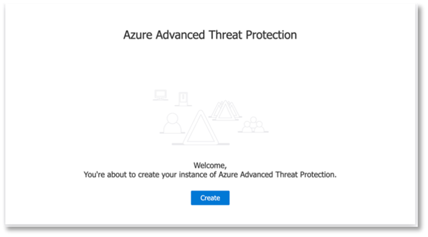

# 为试用版实验室环境配置 Microsoft 威胁防护支柱

**适用于：**
- Microsoft 威胁防护

创建 Microsoft 威胁 Protection 试用实验室环境并部署它的过程分为三个阶段：

 
<table border="0" width="100%" align="center">
  <tr style="text-align:center;">
    <td align="center" style="width:25%; border:0;" >
      <a href= "https://docs.microsoft.com/microsoft-365/security/mtp/prepare-mtpeval?view=o365-worldwide"> 
        
       第1阶段：准备</a> 
    </td>
     <td align="center">
      <a href="https://docs.microsoft.com/microsoft-365/security/mtp/setup-mtpeval?view=o365-worldwide">
        
       阶段2：安装程序</a> 
    </td>
    <td align="center" bgcolor="#d5f5e3">
      <a href="https://docs.microsoft.com/microsoft-365/security/mtp/config-mtpeval?view=o365-worldwide">
        
       第3阶段： Configure & 板载</a> 
</td>

  </tr>
</table>

你当前正在配置阶段。

准备工作是任何成功部署的关键。 在本文中，您将指导您在准备部署 Microsoft Defender ATP 时需要考虑的事项。

## Microsoft 威胁防护支柱
Microsoft 威胁防护由四个支柱组成。 尽管一个支柱可以为你的网络组织的安全性提供价值，但启用四个 Microsoft 威胁防护支柱将为你的组织提供最大价值。

  

本部分将指导您配置：
-   Office 365 高级威胁防护
-   Azure 高级威胁防护 
-   Microsoft Cloud App Security
-   Microsoft Defender 高级威胁防护

## 配置 Office 365 高级威胁防护
>[!NOTE]
>如果已启用 Office 365 高级威胁防护，请跳过此步骤。 

有一个称为*Office 365 高级威胁防护建议配置分析器（ORCA）* 的 PowerShell 模块可帮助确定其中一些设置。 在租户中以管理员身份运行时，ORCAReport 将帮助生成反垃圾邮件、反网络钓鱼和其他邮件清洁设置的评估。 您可以从下载此模块 https://www.powershellgallery.com/packages/ORCA/ 。 

1. 导航到[Office 365 Security & 合规性中心](https://protection.office.com/homepage)  >  **威胁管理**  >  **策略**。
  
 
2. 单击 " **ATP 反网络钓鱼**"，选择 "**创建**并填写策略名称和说明"。 单击“**下一步**”。
  

>[!NOTE]
>编辑高级 ATP 反网络钓鱼策略。 将**高级网络钓鱼阈值**更改为**2-主动**。
 

3. 单击 "**添加条件**" 下拉菜单，并选择您的域作为 "收件人域"。 单击“**下一步**”。
  
 
4. 查看您的设置。 单击 "**创建此策略**" 以确认。 
  
 
5. 选择 " **ATP 安全附件**"，然后选择 "**启用 SharePoint、OneDrive 和 MICROSOFT 团队的 atp** " 选项。  
  

6. 单击 "+" 图标创建新的 "安全附件策略"，将其作为 "收件人域" 应用到域。 单击“保存”****。
  
 
7. 接下来，选择**ATP 安全链接**策略，然后单击铅笔图标以编辑默认策略。

8. 请确保未选中 "**如果用户单击安全链接时不进行跟踪**" 选项，而其余选项则处于选中状态。 有关详细信息，请参阅[安全链接设置](https://docs.microsoft.com/microsoft-365/security/office-365-security/recommended-settings-for-eop-and-office365-atp?view=o365-worldwide)。 单击“保存”****。 
  

9. 接下来，选择**反恶意软件**策略，选择默认设置，然后选择 "铅笔" 图标。

10. 单击 "**设置**" 并选择 **"是"，并使用默认通知文本**启用**恶意软件检测响应**。 打开**常用附件类型筛选器**。 单击“保存”****。
   
  
11. 导航到[Office 365 安全 & 合规性中心](https://protection.office.com/homepage)  >  **搜索**  >  **审核日志搜索**，然后启用审核。  
  

12. 将 Office 365 ATP 与 Microsoft Defender ATP 集成。 导航到[Office 365 Security & 合规性中心](https://protection.office.com/homepage)  >  "**威胁管理**  >  **资源管理器**，然后选择屏幕右上角的" **WDATP 设置**"。 在 "Microsoft Defender ATP 连接" 对话框中，启用 "**连接到 WINDOWS ATP**"。
  

## 配置 Azure 高级威胁防护
>[!NOTE]
>如果已启用 Azure 高级威胁防护，请跳过此步骤

1. 导航到[Microsoft 365 安全中心](https://security.microsoft.com/info)> 选择**更多资源**  >  **Azure 高级威胁防护**。
  

2. 单击 "**创建**" 以启动 Azure 高级威胁防护向导。 
   

3. 选择 "**提供用户名和密码" 以连接到你的 Active Directory 林**。  
  

4. 输入你的 Active Directory 本地凭据。 可以是具有 Active Directory 的读访问权限的任何用户帐户。
  

5. 接下来，选择 "**下载传感器设置**并将文件传输到域控制器"。 
  

6. 执行 Azure ATP 传感器设置并开始遵循向导。
   
 
7. 在传感器部署类型中，单击 "**下一步**"。
   
 
8. 复制访问密钥，因为在向导的下一步需要输入访问密钥。
  
 
9. 将访问键复制到向导中，然后单击 "**安装**"。 
   

10. 恭喜，你已在域控制器上成功配置了 Azure 高级威胁防护。
  
 
11. 在 " [Azure AZURE ATP](https://go.microsoft.com/fwlink/?linkid=2040449)设置" 部分下，选择 " **Windows Defender atp**"，然后打开 "开启"。 单击“保存”****。 
  

>[!NOTE]
>Windows Defender ATP 已被 rebranded 为 Microsoft Defender ATP。 所有门户的重塑更改都是为了实现一致性而推出的。

## 配置 Microsoft 云应用安全
>[!NOTE]
>如果已启用 Microsoft 云应用安全性，请跳过此步骤。 

1. 导航到[microsoft](https://security.microsoft.com/info)  >  **More Resources**  >  **云应用安全性**的 microsoft 365 安全中心更多资源。
  

2. 在信息提示符下集成 Azure ATP 时，选择 "**启用 AZURE atp 数据集成**"。 
   

>[!NOTE]
>如果你未看到此提示，则可能意味着你的 Azure ATP 数据集成已启用。 但是，如果你不确定，请联系你的 IT 管理员进行确认。 

3. 转到 "**设置**"，将**Azure ATP 集成**切换为打开，然后单击 "**保存**"。 
  
>[!NOTE]
>对于新的 Azure ATP 实例，此集成切换将自动打开。 在继续下一步之前，请确认已启用 Azure ATP 集成。
 
4. 在 "云发现设置" 下，选择 " **Microsoft DEFENDER ATP 集成**"，然后启用集成。 单击“保存”****。
  

5. 在 "云发现设置" 下，选择 "**用户扩充**"，然后启用与 Azure Active Directory 的集成。
  

## 配置 Microsoft Defender 高级威胁防护
>[!NOTE]
>如果已启用 Microsoft Defender 高级威胁防护，请跳过此步骤。

1. 导航到 microsoft Defender 安全中心的[microsoft 365 安全中心](https://security.microsoft.com/info)  >  **更多资源**  >  **Microsoft Defender Security Center**。 单击“打开”****。
   
 
2. 遵循 Microsoft Defender 高级威胁防护向导。 单击“**下一步**”。 
   

3. 选择 "基于您的首选数据存储位置"、"数据保留策略"、"组织大小" 和 "选择性加入预览" 功能。 
   
>[!NOTE]
>之后，您无法更改某些设置，如数据存储位置。 
 

单击“**下一步**”。 

4. 单击 "**继续**"，它将预配你的 MICROSOFT Defender ATP 租户。
   

5. 通过组策略、Microsoft 终结点管理器或通过运行本地脚本到 Microsoft Defender ATP 来集成你的终结点。 为简单起见，本指南使用本地脚本。

6. 单击 "**下载包**"，并将载入脚本复制到终结点。  
   

7. 在终结点上，以管理员身份运行载入脚本，然后选择 "Y"。
   

8. 恭喜，你已载入你的第一个终结点。  
   

9. 从 Microsoft Defender ATP 向导复制并粘贴检测测试。
   

10. 将 PowerShell 脚本复制到提升的命令提示符，然后运行它。 
   

11. 从向导中选择 "**开始使用 Microsoft DEFENDER ATP** "。
   
 
12. 访问[Microsoft Defender 安全中心](https://securitycenter.windows.com/)。 转到 "**设置**"，然后选择 "**高级功能**"。 
   

13. 启用与**Azure 高级威胁防护**的集成。  
   

14. 启用与**Office 365 威胁智能**的集成。
   

15. 启用与**Microsoft 云应用安全性**的集成。
   

16. 向下滚动，然后单击 "**保存首选项**" 以确认新的集成。
   

## 启动 Microsoft 威胁防护服务
>[!NOTE]
>从2020年6月1日开始，Microsoft 自动为所有符合条件的租户启用 Microsoft 威胁防护功能。 有关详细信息，请参阅本[Microsoft 技术社区文章关于许可证资格](https://techcommunity.microsoft.com/t5/security-privacy-and-compliance/microsoft-threat-protection-will-automatically-turn-on-for/ba-p/1345426)。 
 

转到[Microsoft 365 安全中心](https://security.microsoft.com/homepage)。 导航到 "**设置**"，然后选择 " **Microsoft 威胁防护**"。
   

有关更全面的指导，请参阅[启用 Microsoft 威胁防护](mtp-enable.md)。 

恭喜！ 你刚刚创建了 Microsoft 威胁防护试用实验室环境！ 您现在可以模拟攻击，并查看跨产品功能如何检测、创建警报以及自动响应对终结点的 fileless 攻击。

## 后续步骤
[生成测试警报](generate-test-alert.md)。
