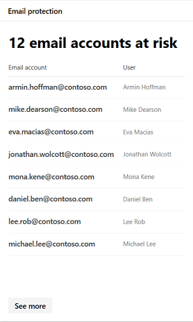

# Microsoft 365 安全中心中的应用程序监控和报告App monitoring and reporting in the Microsoft 365 security center

[!INCLUDE [Microsoft 365 Defender rebranding](../includes/microsoft-defender.md)]

这些报告可更深入地了解在您的组织中使用云应用程序的方式。These reports provide more insight into how cloud apps are being used in your organization. 包括不同类型的应用程序、风险级别和警报。Includes different kinds of apps, their level of risk, and alerts.

## 监视有风险的电子邮件帐户Monitor email accounts at risk

**电子邮件保护** 显示有风险的电子邮件帐户。**Email protection** shows email accounts at risk. 你可以选择要在 Microsoft Defender 安全中心中进一步调查的帐户。You can select an account to investigate further in Microsoft Defender Security Center.

## 监视用户授予的应用程序权限Monitor app permissions granted by users

**云应用安全-OAuth 应用** 列出由用户授予权限的云应用安全发现的应用程序。**Cloud App Security - OAuth apps** lists apps discovered by Cloud App Security that have been granted permissions by users. 云应用安全性风险目录包含16000个以上使用超过70个风险因素评估的应用程序。Cloud App Security's risk catalog includes over 16,000 apps that are assessed using over 70 risk factors.

风险因素从一般信息（如应用程序发布者）开始。The risk factors start from general information, such as the app publisher. 然后，它将移动到安全措施和控件，例如，应用程序是否支持静态加密或提供用户活动的审核日志。It then moves to security measures and controls, such as whether the app supports encryption at rest or provides an audit log of user activity.

## 监视云应用程序用户帐户Monitor cloud app user accounts

**适用于审阅的云应用帐户** 列表可能需要注意的帐户。**Cloud app accounts for review** lists accounts that may require attention.

## 了解使用的是哪些云应用程序Understand which cloud apps are used

\*\*发现的云应用 (类别) \*\* 显示您的组织中使用的应用程序类型。**Discovered cloud apps (categories)** show what kinds of apps are being used in your organization. 它链接到 Cloud App Security 中的云发现仪表板。It links to the Cloud Discovery dashboard in Cloud App Security. 有关详细信息，请参阅 [快速入门：使用已发现的应用](https://docs.microsoft.com/cloud-app-security/discovered-apps)。For more information, see [Quickstart: Work with discovered apps](https://docs.microsoft.com/cloud-app-security/discovered-apps).  

## 监视用户访问云应用程序的位置Monitor where users access cloud apps

**云应用活动位置** 显示用户在访问云应用程序的位置。**Cloud app activity locations** show where users are accessing cloud apps.

## 监视基础架构工作负载的运行状况Monitor health for infrastructure workloads

**基础结构运行状况** 在 Azure 安全中心中显示基础结构工作负荷的运行状况状态警报。**Infrastructure health** shows health status alerts for infrastructure workloads in Azure Security Center.

Azure 安全中心在内部部署和云工作负载中提供统一的安全管理和高级威胁保护。Azure Security Center provides unified security management and advanced threat protection across on-premises and cloud workloads. 您可以从不同的源中收集、搜索和分析安全数据，包括防火墙和其他合作伙伴解决方案。You can collect, search, and analyze security data from different sources, including firewalls and other partner solutions.

有关详细信息，请参阅 [Azure 安全中心文档](https://docs.microsoft.com/azure/security-center/)。For more information, see [Azure Security Center Documentation](https://docs.microsoft.com/azure/security-center/).

