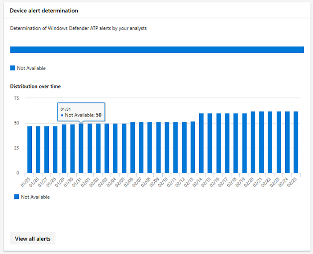

# <a name="device-monitoring-and-reporting-in-the-microsoft-365-security-center"></a>Microsoft 365 安全中心中的设备监视和报告

[!INCLUDE [Microsoft 365 Defender rebranding](../includes/microsoft-defender.md)]


确保设备安全、最新，并发现 Microsoft 365 安全中心中的潜在威胁。

## <a name="view-device-alerts"></a>查看设备警报

从适用于终结点的 Microsoft Defender (获取有关你的设备上泄露活动和其他威胁) 。 Microsoft 365 安全中心使用你的首选工作流有效地在高级别监视这些警报。

### <a name="monitor-high-impact-alerts"></a>监视高影响警报

每个 Microsoft Defender for Endpoint 警报都有一个对应的严重性 (高、中、低或信息) 。 如果无人值守，则表明对网络的潜在影响。  

使用 **"设备警报严重性** "卡专门关注更严重且可能需要立即响应的警报。 通过此卡，可以查看 Microsoft Defender 安全中心门户上更多信息。


### <a name="understand-sources-of-alerts"></a>了解警报源

Microsoft Defender for Endpoint 利用来自各种安全传感器和智能源的数据来生成警报。 例如，它可以使用来自 Microsoft Defender 防病毒和第三方反恶意软件的检测信息。 它还可以使用通过 Web 服务 API 提供的你自己的自定义威胁情报。

设备 **警报检测** 源卡按源显示警报的分布。 跟踪与特定源（尤其是自定义源）相关的活动。 您还可以使用该卡重点关注来自未配置为自动阻止恶意活动或组件的传感器的警报。


通过此卡，可以查看 Microsoft Defender 安全中心门户上的信息。

### <a name="understand-the-types-of-threats-that-trigger-alerts"></a>了解触发警报的威胁类型

Microsoft Defender for Endpoint 将每个警报分类为表示攻击链中的特定阶段或威胁组件类型的类别。 例如，检测到的威胁活动可能归类为"横向移动"，以指示已尝试访问网络的其他设备。 活动可能在攻击者获得初始页脚之后发生。 检测到威胁组件时，可能会将威胁组件大致分类为恶意软件或特定威胁类型。 具体包括勒索软件、凭据窃取或其他类型的恶意或不需要的软件。

设备 **威胁类别** 卡片显示警报分布到这些类别。 使用此信息可标识通常比社交工程尝试影响更高的威胁活动，如凭据盗窃尝试。 还可以监视勒索软件等潜在破坏性威胁。


### <a name="monitor-active-alerts"></a>监视活动警报

设备 **警报状态** 卡指示尚未解决并可能需要注意的警报数。 通过此卡，可以查看 Microsoft Defender 安全中心门户上更多信息。


### <a name="monitor-classification-of-resolved-alerts"></a>监视已解决警报的分类

解决 Microsoft Defender for Endpoint 警报时，安全人员可以指定警报是否已验证为：

* 标识实际泄露活动或威胁组件的真实警报
* 错误检测到正常活动的假警报

设备 **警报分类** 卡显示已解决的警报是否已分类为 true 或 false 警报。 通过此卡，可以查看 Microsoft Defender 安全中心门户上的信息。

注意：在某些情况下，分类信息对某些警报不可用。


### <a name="monitor-determination-of-resolved-alerts"></a>监视已解决警报的确定

除了在解决过程中对警报进行分类外，安全人员还可以确定警报是真还是假。 确定指示在验证警报时找到的正常或恶意活动的类型。

设备 **警报确定** 卡片显示针对每个警报提供的决定。

* **APT**： 高级永久性威胁，指示检测到的活动或威胁组件是复杂漏洞的一部分，旨在在受影响的网络中取得位置  
* **恶意软件**：恶意文件或代码
* **安全人员**：安全人员执行的正常活动
* **安全测试**：旨在模拟实际威胁并预期触发安全传感器并生成警报的活动或组件
* **不需要的软件**：不被视为恶意但违反策略或可接受使用标准的应用和其他软件
* **其他**：任何不属于提供类型下的其他确定

在此卡中，可以在 Microsoft Defender 安全中心查看详细信息。



### <a name="understand-which-devices-are-at-risk"></a>了解哪些设备存在风险

**设备** 保护显示设备的风险级别。 风险级别基于诸如设备上警报的类型和严重性等因素。


## <a name="monitor-and-report-status-of-intune-managed-devices"></a>监视并报告 Intune 托管设备的状态

以下报告包含 Intune 中注册的设备的数据。 不包括来自注销设备的数据。 只有全局管理员可以查看这些卡片。

Intune 注册的设备数据包括：

* 设备合规性
* 具有活动恶意软件的设备
* 设备上恶意软件的类型
* 设备上恶意软件
* 具有恶意软件检测的设备
* 具有恶意软件检测的用户

### <a name="monitor-device-compliance"></a>监视设备合规性

**设备** 合规性显示 Intune 中注册的符合配置策略的设备数。


### <a name="discover-devices-with-malware-detections"></a>发现具有恶意软件检测的设备

**设备恶意软件检测** 提供 Intune 注册的具有尚未完全解决的恶意软件的设备的数量。 缺少解决方案可能是由于挂起的操作、重新启动、完全扫描、手动用户操作或修正操作未成功完成。


### <a name="understand-the-types-of-malware-detected"></a>了解检测到的恶意软件类型

**设备上恶意软件的类型** 显示已在 Intune 中注册的设备上检测到的不同类型的恶意软件。 你可以调查 Microsoft 365 安全中心中的每种类型。


### <a name="understand-the-specific-malware-detected-on-your-devices"></a>了解在设备上检测到的特定恶意软件

**设备上恶意软件** 提供在设备上检测到的特定恶意软件的列表。


### <a name="understand-which-devices-have-the-most-malware"></a>了解恶意软件最多的设备

**具有恶意软件检测的设备** 显示哪些设备具有最多的恶意软件检测。 在 Microsoft 365 安全中心中，你可以调查恶意软件是否处于活动状态、使用设备的人以及 Intune 中的管理状态。


### <a name="understand-which-users-have-devices-with-the-most-malware"></a>了解哪些用户使用恶意软件最多的设备

**具有恶意软件检测的用户** 向具有最多恶意软件检测的设备的用户显示。 在 Microsoft 365 安全中心中，你可以查看分配给每个用户的设备数，以及有关每台设备和恶意软件类型详细信息。


## <a name="monitor-and-manage-attack-surface-reduction-rule-deployment-and-detections"></a>监视和管理攻击面减少规则部署和检测

[攻击面 (ASR) ](https://docs.microsoft.com/windows/security/threat-protection/microsoft-defender-atp/attack-surface-reduction) 规则有助于防止寻找攻击的恶意软件感染设备通常使用的操作和应用。 这些规则控制何时以及如何运行可执行文件。 例如，可阻止 JavaScript 或 VBScript 启动下载的可执行文件，阻止来自 Office 宏的 Win32 API 调用，或者阻止通过 USB 驱动器运行的进程。


**攻击面减少规则** 卡提供了有关跨设备部署规则的概述。

卡上的顶栏显示了处于以下部署模式的总设备数：

* **阻止模式**：至少配置了一个规则以阻止检测到的活动的设备
* **审核模式**：未设置阻止检测到的活动的规则的设备，但至少有一规则集审核检测到的活动  
* **关闭**：所有 ASR 规则均已关闭的设备

此卡的下半部分按规则显示各设备的设置。 每个栏指示设置为阻止、审核检测或已完全关闭规则的设备数量。

### <a name="view-asr-detections"></a>查看 ASR 检测

若要查看有关网络中 ASR 规则检测的详细信息，请选择"攻击面减少规则卡上的查看 **检测**"。 详细 **报告页** 中的"检测"选项卡将打开。


页面顶部的图表显示随着时间的推移堆栈检测被阻止或审核的检测。 底部的表中列出了最近的检测项。 使用表中的以下信息了解检测的性质：

* **检测到的文件**：文件，通常为脚本或文档，其内容触发了可疑的攻击活动
* **规则**：描述规则旨在捕获的攻击活动的名称。 阅读现有 ASR 规则
* **源应用**：加载或执行触发可疑攻击活动的内容的应用程序。 它可以是合法应用程序，如 Web 浏览器、Office 应用程序或 PowerShell 等系统工具
* **发布者**：发布源应用的供应商

### <a name="review-device-asr-rule-settings"></a>查看设备 ASR 规则设置

在" **攻击面减少规则** 报告"页中，转到"配置 **"选项卡查看** 单个设备的规则设置。 选择设备可获取有关每个规则是位于阻止模式、审核模式还是完全关闭状态的详细信息。


Microsoft Intune 为 ASR 规则提供管理功能。 如果要更新设置，请在选项卡中的"配置设备"下选择"开始使用"，以在 Intune 上打开设备管理。

### <a name="exclude-files-from-asr-rules"></a>从 ASR 规则中排除文件

Microsoft 365 安全中心收集你可能希望通过[](https://docs.microsoft.com/windows/security/threat-protection/microsoft-defender-atp/enable-attack-surface-reduction#exclude-files-and-folders-from-asr-rules)攻击面减少规则从检测中排除的文件的名称。 通过排除文件，你可以减少误报检测，并更放心地在阻止模式下部署攻击面减少规则。

排除项在 Microsoft Intune 上管理，但 Microsoft 365 安全中心提供了分析工具来帮助你了解文件。 若要开始收集要排除的文件，请转到攻击面减少规则报告页中的"添加排除项 **"** 选项卡。

>[!NOTE]  
>该工具分析所有攻击面减少规则的检测，但只有一 [些规则支持排除项](https://docs.microsoft.com/windows/security/threat-protection/microsoft-defender-atp/troubleshoot-asr)。


该表列出了攻击面减少规则检测到的所有文件名。 可以选择文件，查看排除这些文件的影响：

* 检测次数减少
* 报告检测的设备数量减少

若要获取具有排除的完整路径的选定文件的列表，请选择 **"获取排除路径"。**

ASR 规则阻止从 Windows 本地安全机构子系统 **(lsass.exe** 中窃取凭据) 捕获源应用 **lsass.exe。** 它是正常的系统文件，但捕获为检测到的文件。 因此，生成的排除路径列表将包含此文件。 若要排除触发此规则的文件，而不是lsass.exe，请使用源应用的路径，而不是检测到的文件。

若要找到源应用，请为此特定规则[](https://docs.microsoft.com/windows/security/threat-protection/microsoft-defender-atp/advanced-hunting)运行以下高级搜寻查询 (规则 ID 9e6c4e1f-7d60-472f-ba1a-a39ef669e4b2) ：

```kusto
DeviceEvents
| where Timestamp > ago(7d)
| where ActionType startswith "Asr"
| where AdditionalFields contains "9e6c4e1f-7d60-472f-ba1a-a39ef669e4b2"
| project InitiatingProcessFolderPath, InitiatingProcessFileName
```

#### <a name="check-files-for-exclusion"></a>检查文件是否排除

在从 ASR 中排除文件之前，建议您检查该文件以确定该文件是否确实不是恶意文件。

若要查看文件，请使用 Microsoft Defender 安全中心 [上的](https://docs.microsoft.com/windows/security/threat-protection/microsoft-defender-atp/investigate-files) 文件信息页。 该页面提供普遍程度信息和 VirusTotal 防病毒检测比率。 您还可以使用该页面提交文件进行深入分析。

若要在 Microsoft Defender 安全中心中查找检测到的文件，请通过以下高级搜寻查询搜索所有 ASR 检测：

```kusto
MiscEvents
| where EventTime > ago(7d)
| where ActionType startswith "Asr"
| project FolderPath, FileName, SHA1, InitiatingProcessFolderPath, InitiatingProcessFileName, InitiatingProcessSHA1
```

使用 **结果中的 SHA1** 或 **InitiatingProcessSHA1，** 使用 Microsoft Defender 安全中心中的通用搜索栏搜索文件。
