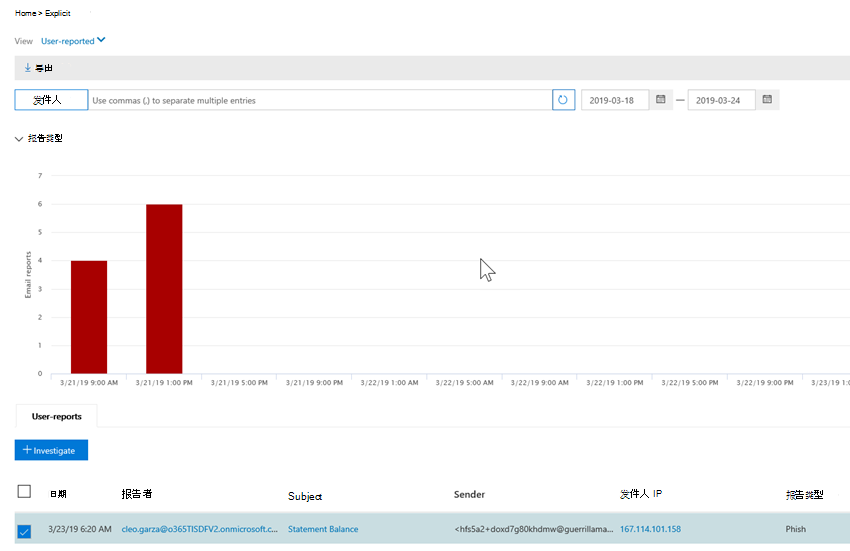

# Office 365 中的自动化调查和响应（空气）

自动化调查和响应（空中）功能使您能够运行自动化的调查过程，以应对目前存在的已知威胁。 空中可帮助您的安全操作团队更高效地运行。
- 若要了解空气的工作原理，请使用本文。
- 若要开始使用 AIR，请参阅[在 Office 365 中自动调查和响应威胁](office-365-air.md)。

> [!TIP]
> 你的 Microsoft 365 E5 或 Microsoft 365 E3 是否具有身份和威胁防护？ 考虑尝试使用 [Microsoft 威胁防护](../mtp/microsoft-threat-protection.md)。

## 空气的整体流动

从较高的层次来看，空气流的工作原理如下所示：

|阶段  |涉及的内容  |
|---------|---------|
|1      |一个[警报](#alerts)由 Office 事件触发，[安全行动手册](#security-playbooks)启动对选定警报的自动调查。   或者，安全分析员可以手动从[浏览器](threat-explorer.md)的电子邮件[开始进行自动调查](#example-a-security-administrator-triggers-an-investigation-from-threat-explorer)。        |
|2      |自动调查运行时，它会收集有关电子邮件和与该电子邮件相关的实体的其他数据–文件、Url 和收件人。  由于触发了新的相关警报，调查的范围可能会增加。         |
|3      |在自动调查期间和之后，可以查看[详细信息和结果](#investigation-graph)。 结果包括[建议的操作](#recommended-actions)，可采取这些操作来响应和修正发现的任何威胁。 此外，还可以使用[行动手册日志](#playbook-log)来跟踪所有调查活动。  如果您的组织使用的是自定义报告解决方案或第三方解决方案，则可以[使用 Office 365 管理活动 API](office-365-air.md#use-the-office-365-management-activity-api-for-custom-or-third-party-reporting-solutions)来查看有关自动调查和威胁的信息。         |
|4      |您的安全操作团队将检查调查结果和建议，并批准修正操作。 在 Office 365 中，仅在组织的安全团队批准时才采取更正措施。         |

以下各节提供了有关空中的更多详细信息，包括有关警报、安全行动手册和调查详细信息的详细信息。 此外，本文还介绍了如何提供空中工作的两个示例。 若要开始使用 AIR，请参阅[在 Office 365 中自动调查和响应威胁](office-365-air.md)。

## 警报

[警报](../../compliance/alert-policies.md#viewing-alerts)表示用于事件响应的安全操作团队工作流的触发器。 确定要调查的正确通知集的优先级，同时确保没有威胁是 unaddressed 的挑战。 在手动对通知进行调查时，安全操作团队必须在威胁的风险下对实体（如内容、设备和用户）进行寻找和关联。 此类任务和工作流可能非常耗时，并涉及多个工具和系统。 通过让关键安全和威胁管理警报自动触发安全响应行动手册，Office 365 安全事件的空中、调查和响应是自动化的。 

目前，对于气流，从下列类型的警报策略生成的警报将自动调查：  

- 检测到潜在的恶意 URL 单击
- 用户报告为网络钓鱼的电子邮件 *
- 包含在传递后删除的恶意软件的电子邮件 *
- 包含在传递后删除的网络钓鱼 Url 的电子邮件 *
- 检测到可疑的电子邮件发送模式#
- 限制用户发送电子邮件#

> [!NOTE]
> 以星号（*）标记的警报在安全 & 合规性中心（电子邮件通知已关闭）的相应警报策略中被分配了一个*信息性*严重性。 可以通过[报警策略配置](../../compliance/alert-policies.md#alert-policy-settings)启用电子邮件通知。 使用哈希（#）标记的警报通常是与公共预览版行动手册相关联的警报。

若要查看警报，请在安全 & 合规性中心中，选择 "**通知** > " "**查看警报**"。 选择一个警报以查看其详细信息，然后在那里使用 "**查看调查**" 链接转到相应的[调查](#investigation-graph)。  

> [!NOTE]
> 默认情况下，通知视图中隐藏信息警报。 若要查看它们，请更改警报筛选以包含信息警报。

如果您的组织通过警报管理系统、服务管理系统或安全信息和事件管理（SIEM）系统管理安全警报，则可以通过电子邮件通知或通过[Office 365 管理活动 API](https://docs.microsoft.com/office/office-365-management-api/office-365-management-activity-api-reference)将 Office 365 警报发送到该系统。 通过电子邮件或 API 的调查通知通知包括访问安全 & 合规性中心中的警报的链接，使分配的安全管理员能够快速导航到调查。

 

## 安全行动手册

安全行动手册是在 Office 高级威胁防护和 Microsoft 威胁防护中实现自动化的后端策略。 空中提供的安全行动手册基于常见的实际安全方案，并根据安全操作团队的反馈进行开发。 当您的组织中触发特定警报时，将自动启动安全行动手册。 通知触发后，相关的行动手册将由自动调查和响应（航空）系统运行。 调查根据特定警报的操作手册分析预警的步骤，查看所有关联的元数据（包括电子邮件、用户、主题、发件人等）。 根据调查行动手册的发现，AIR 推荐了组织的安全团队可采取的一组操作来控制和缓解威胁。 

你将使用空中获取的安全行动手册旨在解决组织在当今的电子邮件中遇到的最常见威胁。 它们基于安全操作和事件响应团队的输入，包括帮助保护 Microsoft 和客户资产的人员。

### 安全行动手册在几个阶段推出

作为空气的一部分，安全行动手册将分阶段推出。 第1阶段现已推出，其中包含多个行动手册，这些操作提供了安全管理员可以查看和批准的操作建议：
- 用户报告的网络钓鱼邮件
- URL 单击 "判定更改"
- 恶意软件检测到送达后（恶意软件 ZAP）
- 网络钓鱼检测到传递后的 ZAP （网络钓鱼 ZAP）

第1阶段还包括对管理员触发的电子邮件调查（使用[威胁资源管理器](threat-explorer.md)）的支持。

第2阶段现在与**公共预览版**中的以下行动手册结合在一起，为操作和 aiding 安全管理员提供调查问题的建议：
- 用户报告为 "已损坏" （公用预览）

在完成后，将立即发布后续行动手册。 访问[Microsoft 365 路线图](https://www.microsoft.com/microsoft-365/roadmap)以查看计划和即将推出的其他内容。

### 行动手册包括调查和建议

在空中，每个安全行动手册包括： 
- 对电子邮件实体（文件、Url、收件人、IP 地址等）的根调查
- 对组织收到的类似电子邮件的进一步搜寻 
- 确定并关联其他潜在威胁所需的步骤，以及 
- 建议的威胁补救措施。

每个高级步骤都包含多个执行的子步骤，以提供对威胁的深入、详细和详尽的响应。

## 自动调查

"自动调查" 页面显示您的组织的调查及其当前状态。

 
  
可执行下列操作：
- 直接导航到调查（选择**调查 ID**）。
- 应用筛选器。 从**调查类型**、**时间范围**、**状态**或这些情况的组合中进行选择。
- 将数据导出到 .csv 文件。

调查状态指示分析和操作的进度。 在调查运行时，状态更改以指示是否发现威胁，以及是否已批准操作。 

|状态  |含义  |
|---------|---------|
|即将开始 | 调查已排入队列，以便尽快开始 |
|正在运行 | 调查已开始，正在进行分析 |
|找不到威胁 | 调查已完成其分析，未发现任何威胁 |
|已由系统终止 | 调查未关闭并在7天后过期 |
|挂起的操作 | 调查发现了与建议的操作有关的威胁。  调查在发现最初的威胁和推荐的操作后继续运行，因此您应该在批准操作之前检查日志，以查看分析器是否仍在进行中。 |
|发现威胁 | 调查发现威胁，但威胁没有在空中可用的操作。  这些是无方向无线操作的用户操作。 |
|已修正 | 调查已完成且已完全修正（已批准所有操作） |
|部分修正 | 调查已完成，某些建议的操作已获得批准 |
|已由用户终止 | 管理员终止了调查 |
|Failed | 调查过程中发生错误，阻止它达到威胁的结论 |
|按限制排队 | 由于系统处理限制，调查正在等待分析（以保护服务性能） |
|已通过限制终止 | 由于调查卷和系统处理限制，无法在足够的时间内完成调查。 您可以通过在资源管理器中选择电子邮件并选择调查操作来 retrigger 调查。 |

### 调查图形

当您打开特定调查时，您将看到 "调查图形" 页。 此页面显示所有不同的实体：电子邮件、用户（及其活动）以及自动调查为触发的警报一部分的设备。

可执行下列操作：
- 获取当前调查的直观概述。
- 查看调查持续时间的摘要。
- 在可视化中选择一个节点以查看该节点的详细信息。
- 在顶部选择一个选项卡以查看该选项卡的详细信息。

### 通知调查

在调查的 "**通知**" 选项卡上，您可以查看与调查相关的警报。 详细信息包括触发调查的警报以及与调查相关的其他关联警报（如有风险的登录、DLP 策略冲突等）。 在此页面中，安全分析员还可以查看各个通知的其他详细信息。

可执行下列操作：
- 获取当前触发警报和任何关联警报的直观概述。
- 在列表中选择一个警报，打开显示完整警报详细信息的飞出页面。

### 电子邮件调查

在调查的 "**电子邮件**" 选项卡上，您可以查看原始电子邮件和在调查过程中标识的类似电子邮件的群集。 

由于组织中的用户发送和接收的电子邮件量巨大，以及电子邮件通信和攻击的多用户性质，因此 
- 根据邮件头、正文、URL 和附件中的类似属性对电子邮件进行群集化; 
- 将恶意电子邮件与优质电子邮件分开;并 
- 对恶意电子邮件采取操作 

可能需要很长时间。 现在，AIR 可以自动执行此过程，从而节省了贵组织的安全团队的时间和精力。 

电子邮件分析步骤中可能会标识两种不同类型的电子邮件群集：相似性群集和指示器群集。 
- 相似性群集是通过搜寻具有类似发件人和内容属性的电子邮件来标识的电子邮件。 根据原始检测结果评估这些群集中的恶意内容。 包含足够恶意电子邮件检测的电子邮件群集被视为恶意电子邮件。
- 指示器群集是通过搜寻来自原始电子邮件的相同指示器实体（文件哈希或 URL）标识的电子邮件。 将原始文件/URL 实体标识为恶意时，AIR 会将指示器判定为包含该实体的电子邮件的整个群集。 被标识为恶意软件的文件意味着包含该文件的电子邮件群集将被视为恶意软件电子邮件。

群集的目标是查找和查找与攻击或市场活动中的同一发件人发送的其他相关电子邮件。  在某些情况下，合法的电子邮件可能会触发调查（例如，用户报告营销电子邮件）。  在这些方案中，电子邮件群集应确定电子邮件群集不是恶意的–如果它相应地执行此操作，则不会表示威胁，也**不**会建议删除电子邮件。

"**电子邮件**" 选项卡还显示与调查相关的电子邮件项目，例如用户报告的电子邮件详细信息、报告的原始电子邮件、电子邮件 zapped （由于恶意软件/网络钓鱼诈骗等）。

"电子邮件" 选项卡上标识的电子邮件计数当前代表 "**电子邮件**" 选项卡上显示的所有电子邮件的总数。由于电子邮件存在于多个群集中，因此标识的电子邮件的实际总数（并受修正操作影响）是所有群集和原始收件人的电子邮件中显示的唯一电子邮件的计数。 

由于每个收件人的安全 verdicts、操作和传递位置各不相同，因此每个收件人的资源管理器和空中计数电子邮件都会有所不同。 因此，发送给三个用户的原始电子邮件总共计为三封电子邮件，而不是一封电子邮件。 注释可能会出现两次或多次计数电子邮件的情况，因为电子邮件可能会对其进行多个操作，并且在发生所有操作后，可能会有多个电子邮件副本。 例如，在传递时检测到的恶意软件电子邮件可能会导致阻止（隔离）的电子邮件和替换的电子邮件（受警告文件替换的威胁文件，然后传递到用户的邮箱）。 由于系统中的电子邮件有两个副本，这两个副本可能会在群集计数中进行计数。 

电子邮件计数是在调查时计算的，当您打开调查 flyouts 时（基于基础查询），一些计数也会进行重新计算。 "电子邮件" 选项卡上显示的电子邮件群集的电子邮件数量和在 "群集" 浮出控件中显示的电子邮件数量值在调查时进行计算且不会发生变化。 在电子邮件群集浮出控件的 "电子邮件" 选项卡底部显示的电子邮件计数，资源管理器中显示的电子邮件计数反映在调查的初始分析之后收到的电子邮件。 因此，显示原始数量10封电子邮件的电子邮件群集将在调查分析阶段和管理员审查调查之间到达5封以上的电子邮件列表中显示全部15封电子邮件。  与资源管理器查询相比，旧调查可能会开始更大的计数，因为在30天后 ATP P2 将到期数据，而付费许可证则为30天。  在不同视图中显示计数历史和当前计数已完成，以指示调查时的电子邮件影响和当前影响，直到运行补救时间为止。

例如，请考虑以下方案。 三封电子邮件的第一个群集被认为是网络钓鱼。 找到具有相同 IP 和主题的类似邮件的另一个群集，并被视为恶意邮件，因为在初始检测过程中将其部分标识为网络钓鱼。 

可执行下列操作：
- 获取当前群集结果和发现的威胁的直观概述。
- 单击 "群集" 实体或威胁列表打开显示完整警报详细信息的弹出页面。
- 单击 "电子邮件群集详细信息" 选项卡顶部的 "在资源管理器中打开" 链接进一步调查电子邮件群集

> [!NOTE]
> 在电子邮件上下文中，您可能会在调查过程中看到一个卷异常威胁曲面。 卷异常表明调查事件时间与之前的时间框架相比，与调查事件的类似电子邮件中的峰值。 这种具有类似特征（例如，subject 和发件人域、正文相似性和发件人 IP）的电子邮件通信的峰值是电子邮件宣传活动或攻击的典型启动。 但是，批量、垃圾邮件和合法电子邮件活动通常共享这些特征。 由于使用反病毒引擎、沙箱或恶意信誉识别的恶意软件或网络钓鱼威胁相比，大量异常会带来潜在的威胁，因此可能会降低严重程度。

### 用户调查

在 "**用户**" 选项卡上，您可以看到标识为调查的一部分的所有用户。 当存在事件或指示这些用户帐户可能受到影响或受到威胁时，用户帐户将出现在调查中。

例如，在下图中，空气根据创建的新收件箱规则确定了安全指标和异常情况。 可通过此选项卡中的详细视图查看调查的其他详细信息（证据）。损坏的迹象和异常也可能包含来自[Microsoft 云应用安全性](https://docs.microsoft.com/cloud-app-security)的异常检测。

可执行下列操作：
- 获取已确定的用户结果和发现的风险的直观概述。
- 选择用户以打开显示完整警报详细信息的飞出页面。

### 机器调查

在 "**计算机**" 选项卡上，您可以看到标识为调查的一部分的所有计算机。 

作为一些行动手册的一部分，空中将电子邮件威胁与设备（例如 Zapped 恶意软件）相关联。 例如，调查会将恶意文件哈希传递到[Microsoft DEFENDER ATP](https://docs.microsoft.com/windows/security/threat-protection/microsoft-defender-atp/microsoft-defender-advanced-threat-protection
)以进行调查。 这样，就可以为您的用户自动调查相关的计算机，以帮助确保在云中和终结点上解决威胁。 

可执行下列操作：
- 获取发现的当前计算机和威胁的直观概述。
- 选择一台计算机以打开在 Microsoft Defender 安全中心的相关[Microsoft DEFENDER ATP 调查](https://docs.microsoft.com/windows/security/threat-protection/microsoft-defender-atp/automated-investigations)中的视图。

### 实体调查

在 "**实体**" 选项卡上，您可以看到在调查过程中标识和分析的实体。 

在这里，您可以查看调查的实体和实体类型的详细信息，例如电子邮件、群集、IP 地址、用户等。 您还可以查看已分析的实体数以及与每个实体相关联的威胁。 

可执行下列操作：
- 获取发现的调查实体和威胁的直观概述。
- 选择一个实体以打开显示相关实体详细信息的飞出页面。

### 行动手册日志

在 "**日志**" 选项卡上，您可以查看调查过程中的所有操作手册步骤。 该日志将捕获由 Office 365 自动调查功能作为空气的一部分完成的所有分析器和操作的完整清单。 它提供了所执行的所有步骤的清晰视图，包括操作本身、说明以及实际 "开始到完成" 的持续时间。 

可执行下列操作：
- 获取有关执行操作手册步骤的直观概述。
- 将结果导出到 CSV 文件。
- 筛选视图。

|工具 | 描述 |
|-----|-----|
|DLP 违规调查 |调查[Office 365 数据丢失防护](../../compliance/data-loss-prevention-policies.md)（DLP）检测到的任何冲突 |
|电子邮件指示器提取 |从要调查的电子邮件的标题、正文和内容中提取指示器 |
|文件哈希信誉 |根据组织中的用户和计算机的文件哈希值检测异常 |
|邮件群集标识 |基于标头、正文、内容和 Url 的电子邮件群集分析 |
|邮件群集卷分析 |基于出站邮件流卷模式的电子邮件群集分析 |
|邮件委派调查 |调查与此调查相关的用户邮箱的邮件委派访问权限 |
|邮件转发规则调查 |调查与此调查相关的用户邮箱的任何邮件转发规则 |
|检测到未命中的恶意软件 |检测在组织中向用户邮箱发送的未命中的恶意软件 |
|按需沙箱 |对电子邮件、附件和 Url 触发按需沙箱 |
|出站邮件异常情况调查 |根据历史邮件流为组织中的用户发送模式来检测异常情况 |
|出站恶意软件和垃圾邮件异常调查 |检测来自组织中用户的组织内部和出站恶意软件、网络钓鱼诈骗或垃圾邮件 |
|发件人域调查 |根据需要检查[Microsoft 智能安全图形](https://www.microsoft.com/security/operations/intelligence)和外部威胁智能源中的域信誉 |
|发件人 IP 调查 | 根据需要检查[Microsoft 智能安全图](https://www.microsoft.com/security/operations/intelligence)和外部威胁智能源的 IP 信誉 |
|URL 单击调查 | 调查受[Office 365 ATP 安全链接](atp-safe-links.md)保护的用户对组织的点击率 |
|URL 信誉调查 |对来自[Microsoft 智能安全图形](https://www.microsoft.com/security/operations/intelligence)和外部威胁智能源的 URL 信誉的按需检查 |
|用户活动调查 |分析[Microsoft Cloud App Security](https://docs.microsoft.com/cloud-app-security/what-is-cloud-app-security)中的用户活动异常 |
|用户报告的电子邮件指示器提取 |从标头、正文和[用户报告的电子邮件](enable-the-report-message-add-in.md)的内容中提取指示器以供调查 |

### 建议的操作

在 "**操作**" 选项卡上，您可以查看在调查完成后建议用于修正的所有操作手册操作。 

操作会捕获 Microsoft 建议在调查结束时执行的步骤。 您可以通过选择一个或多个操作来采取补救措施。 单击 "**批准**" 可开始进行修正。 （需要适当的权限-需要 "搜索和清除" 角色才能从资源管理器和 AIR 运行操作）。 例如，安全读者可以查看操作但不能批准。 注意：无需批准每个操作。 如果您不同意建议的操作，或者您的组织未选择特定类型的操作，则可以选择**拒绝**这些操作，也可以仅忽略它们，不执行任何操作。 通过审核和/或拒绝所有操作，可以完全关闭调查（状态变为已修正），同时保留某些操作不完整将导致调查状态更改为 "部分修正" 状态。

可执行下列操作：
- 获取对操作手册建议的操作的直观概述。
- 选择一个或多个操作。
- 使用注释批准或拒绝建议的操作。
- 将结果导出到 CSV 文件。
- 筛选视图。

## 修正操作

当自动调查正在运行或已完成时，您通常会看到一个或多个修正操作。 下表列出了 Office 365 AIR 中可能的修正操作。

|操作 | 说明 |
|-----|-----|
|阻止 URL（单击时） |针对包含恶意 Url 的电子邮件和文档进行防护。 这样，当用户单击现有 Office 文件或旧电子邮件中的链接时，可以通过[安全链接](atp-safe-links.md)阻止恶意链接和任何相关的网页。 |
|软删除电子邮件  |软删除用户邮箱中的特定电子邮件|
|软删除电子邮件群集  |软删除与所有用户邮箱中的查询相匹配的恶意电子邮件|
|关闭外部邮件转发 |从特定最终用户的邮箱中删除转发规则|

## 示例：用户报告的网络钓鱼邮件启动调查行动手册

当您的组织中的用户提交电子邮件并使用[outlook 或 Outlook Web App 的报告邮件加载项](enable-the-report-message-add-in.md)将其报告给 Microsoft 时，该报告也会发送到您的系统，并在用户报告的视图中显示在资源管理器中。 此用户报告的消息现在会触发基于系统的信息警报，这将自动启动调查行动手册。

在根调查阶段，会评估电子邮件的各个方面。 具体包括：
- 确定它可能属于哪种类型的威胁;
- 发件人数;
- 发送电子邮件的位置（发送基础结构）;
- 是否已传递或阻止电子邮件的其他实例;
- 我们分析家中的一种评估;
- 电子邮件是否与任何已知的市场活动相关联;
- 等等。

根调查完成后，行动手册提供了要对其关联的原始电子邮件和实体执行的建议操作的列表。
  
接下来，执行以下几个威胁调查和搜寻步骤：

- 类似的电子邮件通过电子邮件群集搜索进行标识。
- 该信号与其他平台（如[Microsoft DEFENDER ATP](https://docs.microsoft.com/windows/security/threat-protection/microsoft-defender-atp/microsoft-defender-advanced-threat-protection)）共享。
- 确定是否有用户通过可疑电子邮件中的任何恶意链接单击过。
- 跨 Office 365 Exchange Online Protection （[EOP](exchange-online-protection-eop.md)）和 Office 365 高级威胁防护（[ATP](office-365-atp.md)）执行检查以查看用户是否报告了任何其他类似的消息。
- 将执行检查以查看是否已泄露用户。 此检查跨 Office 365、 [Microsoft 云应用安全性](https://docs.microsoft.com/cloud-app-security)和[Azure Active Directory](https://docs.microsoft.com/azure/active-directory)之间的信号，关联任何相关的用户活动异常。 

在搜寻阶段，会为各种搜寻步骤分配风险和威胁。 

修正是行动手册的最后阶段。 在此阶段中，将根据调查和搜寻阶段采取补救措施。 

## 示例：安全管理员触发来自威胁资源管理器的调查

除了由警报触发的自动调查之外，组织的安全操作团队可以通过[威胁资源管理器](threat-explorer.md)中的视图触发自动调查。

例如，假设您正在查看资源管理器中有关用户报告的消息的数据。 您可以在结果列表中选择一个项目，然后从 "操作" 菜单中单击 "**调查**" （假设您有相应的修正权限）。

作为另一个示例，假设您要查看检测为包含恶意软件的电子邮件的数据，并且有几封电子邮件被检测为包含恶意软件。 您可以选择 "**电子邮件**" 选项卡，选择一个或多个电子邮件，然后在 "**操作**" 菜单上选择 "**调查**"。 

与由警报触发的行动手册类似，通过资源管理器中的视图触发的自动调查包括根调查、标识和关联威胁的步骤以及缓解这些威胁的建议操作。

## 如何获取空中

Office 365 AIR 包含在以下订阅中：

- Microsoft 365 E5
- Office 365 E5
- Microsoft 威胁防护
- Office 365 高级威胁防护（计划 2）

如果你没有这些订阅，请[启动免费试用版](https://go.microsoft.com/fwlink/p/?LinkID=698279&culture=en-US&country=US)。

若要了解有关功能可用性的详细信息，请访问[跨高级威胁防护（ATP）计划的功能可用性](https://docs.microsoft.com/office365/servicedescriptions/office-365-advanced-threat-protection-service-description#feature-availability-across-advanced-threat-protection-atp-plans)。

## 使用空中功能所需的权限

通过某些角色（如下表中所述的角色）授予权限： 

|任务 |需要 #a0 个角色 |
|--|--|
|设置空中功能 |以下角色之一：  - **全局管理员** - **安全管理员**  可以在[Azure Active Directory](https://docs.microsoft.com/azure/active-directory/users-groups-roles/directory-assign-admin-roles)中或在[Office 365 安全 & 合规性中心](https://docs.microsoft.com/microsoft-365/security/office-365-security/permissions-in-the-security-and-compliance-center)中分配这些角色。 |
|批准或拒绝建议的操作|在[Azure Active Directory](https://docs.microsoft.com/azure/active-directory/users-groups-roles/directory-assign-admin-roles)中或在[Office 365 安全 & 合规中心](https://docs.microsoft.com/microsoft-365/security/office-365-security/permissions-in-the-security-and-compliance-center)中分配的以下角色之一： - **全局管理员**  - **安全管理员** - **安全读者**  --- 和 --- - **搜索和清除**（此角色仅在[Office 365 安全 & 合规性中心](https://docs.microsoft.com/microsoft-365/security/office-365-security/permissions-in-the-security-and-compliance-center)中分配。 您可能需要在其中创建新的角色组，并将搜索和清除角色添加到该新角色组。

## 后续步骤

- [开始使用 Office 365 中的 AIR](office-365-air.md)
- [了解 Microsoft Defender ATP 中的空气](https://docs.microsoft.com/windows/security/threat-protection/microsoft-defender-atp/automated-investigations) 
- [访问 Microsoft 365 路线图以了解即将推出和推出的内容](https://www.microsoft.com/microsoft-365/roadmap?filters=)

## 另请参阅

- [Microsoft 威胁防护](../mtp/microsoft-threat-protection.md)
- [Microsoft 威胁防护中的自动化调查和修正（空气）](../mtp/mtp-autoir.md)
