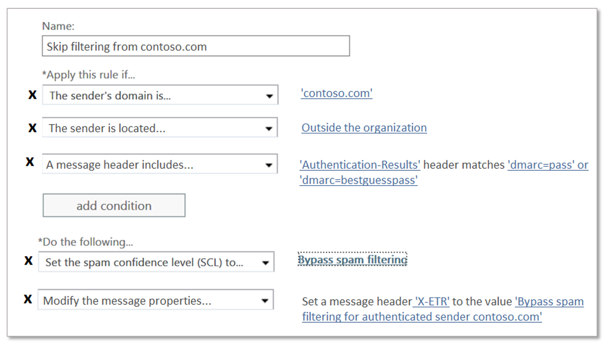

# 在 EOP 中创建安全发件人列表

[!INCLUDE [Microsoft 365 Defender rebranding](../includes/microsoft-defender-for-office.md)]

如果你是在 Exchange Online 中拥有邮箱的 Microsoft 365 客户，或者是没有 Exchange Online 邮箱的独立 Exchange Online Protection (EOP) 客户，则 EOP 提供多种方式确保用户将接收来自受信任发件人的电子邮件。 这些选项包括 Exchange 邮件流规则 (也称为传输规则) 、Outlook 安全发件人、IP 允许列表 (连接筛选) 以及反垃圾邮件策略中允许的发件人列表或允许的域列表。 统一来说，你可以将这些选项视为 _安全发件人列表_。

以下列表中介绍了可用的安全发件人列表，顺序从建议最多到建议最少：

1. 邮件流规则
2. Outlook 安全发件人
3. IP 允许列表 (连接筛选) 
4. 允许的发件人列表或允许的域 (反垃圾邮件策略) 

邮件流规则允许最灵活地确保仅允许正确的邮件。 反垃圾邮件策略中允许的发件人和允许的域列表没有 IP 允许列表安全，因为发件人的电子邮件域很容易被欺骗。 但是，IP 允许列表也带来风险，因为从该 IP地址发送的任何域的电子邮件将绕过垃圾邮件筛选。

> [!IMPORTANT]
>
> - 请注意，要密切 *监视* 使用安全发件人列表进行垃圾邮件筛选的任何异常。
>
> - 虽然可以使用安全发件人列表来帮助处理误报 (标记为垃圾邮件) 良好的电子邮件，但您应考虑使用安全发件人列表作为临时解决方案，如果可能，应避免使用。 我们不建议使用安全发件人列表管理误报，因为垃圾邮件筛选的例外情况可能会使组织受到欺骗和其他攻击。 如果你坚持使用安全发件人列表来管理误报，你需要保持谨慎，并随时向 [Microsoft](report-junk-email-messages-to-microsoft.md) 报告邮件和文件这一主题。
>
> - 若要允许域发送未经身份验证的电子邮件 (绕过反欺骗保护) 但不绕过反垃圾邮件和反恶意软件检查，可以将其添加到[AllowedToSpoof](walkthrough-spoof-intelligence-insight.md)安全发件人列表中
>
> - EOP 和 Outlook 检查不同的邮件属性以确定邮件的发件人。 有关详细信息，请参阅本文稍后的"批量电子邮件的注意事项"部分。

相比之下，您还可以使用阻止的发件人列表来阻止来自特定 _来源的电子邮件_。 有关详细信息，请参阅[在 EOP 中创建阻止发件人列表](create-block-sender-lists-in-office-365.md)。

##  (建议) 使用邮件流规则

Exchange Online 和独立 EOP 中的邮件流规则使用条件和例外来标识邮件，以及用于指定应针对这些邮件执行哪些操作的操作。 有关详细信息，请参阅 Exchange Online 中的 ([传输规则) 规则](https://docs.microsoft.com/Exchange/security-and-compliance/mail-flow-rules/mail-flow-rules)。

下面的示例假定你需要电子邮件contoso.com跳过垃圾邮件筛选。 为此，请配置以下设置：

1. **条件****：发件人** \> **域contoso.com。** \>

2. 配置以下任一设置：

   - **邮件流规则条件**： **邮件头** \> **包含以下** 任何词语的标题 \> **名称**： `Authentication-Results` \> **标头值**： `dmarc=pass` 或 `dmarc=bestguesspass` 。

     此条件检查发送电子邮件域的电子邮件身份验证状态，以确保发送域未遭到欺骗。 有关电子邮件身份验证详细信息，请参阅[SPF、DKIM](set-up-spf-in-office-365-to-help-prevent-spoofing.md)和[DMARC。](use-dmarc-to-validate-email.md) 

   - **IP 允许列表**：在连接筛选器策略中指定源 IP 地址或地址范围。

     如果发送域不使用电子邮件身份验证，请使用此设置。 当涉及 IP 允许列表中的源 IP 地址时，请尽可能严格。 我们建议 IP 地址范围为 /24 或更少， (范围最好) 。 请勿使用属于使用者服务的 IP 地址 (例如，outlook.com) 或共享基础结构。

   > [!IMPORTANT]
   >
   > - 切勿将 *仅发件人域* 配置为跳过垃圾邮件筛选的条件来配置邮件流规则。 这样做将显著增加攻击者欺骗发送域 (或模拟完整电子邮件地址) 、跳过所有垃圾邮件筛选和跳过发件人身份验证检查以便邮件到达收件人收件箱的可能性。
   >
   > - 不要将你拥有 (域（也称为接受) 或热门 (，例如，microsoft.com) 规则中的条件。 这样做被视为高风险，因为它会为攻击者创造机会来发送电子邮件，否则会进行筛选。
   >
   > - 如果允许网络地址转换 (NAT) 网关后面的 IP 地址，则需要知道 NAT 池中涉及的服务器，以便知道 IP 允许列表的范围。 IP 地址和 NAT 参与者可以更改。 作为标准维护程序的一部分，需要定期检查 IP 允许列表条目。

3. **可选条件**：

   - **发件人** \>**是内部/外部** \>**组织外部**：此条件是隐式的，但可以使用它来说明可能无法正确配置本地电子邮件服务器。

   - **主题或正文** \>**主题或正文包含以下任何词语** \>：如果可以按主题行或邮件正文中的关键字或短语进一步限制邮件，可以使用这些词 \<keywords\> 作为条件。

4. **操作**：在规则中配置这两个操作：

   a. **修改邮件属性** \>**将垃圾邮件可信度设置为 (SCL)** \>**绕过垃圾邮件筛选**。

   b. **修改邮件属性** \>**设置邮件头**：**将邮件头** \<CustomHeaderName\> **设置为值** \<CustomHeaderValue\> 。

      例如，`X-ETR: Bypass spam filtering for authenticated sender 'contoso.com'`。 如果规则中具有多个域，则可以根据需要自定义标头文本。

      当邮件由于邮件流规则而跳过垃圾邮件筛选时，值值将标记 `SFV:SKN` 在 **X-Forefront-Antispam-Report** 标头中。 如果邮件来自 IP 允许列表上的源，则也会 `IPV:CAL` 添加该值。 这些值可以帮助您进行疑难解答。

## 使用 Outlook 安全发件人

用户或管理员可以将发件人电子邮件地址添加到邮箱中的"安全发件人"列表中，而不是组织设置。 有关说明，请参阅 [在 Office 365](configure-junk-email-settings-on-exo-mailboxes.md)中的 Exchange Online 邮箱上配置垃圾邮件设置。 在大多数情况下，这是不可取的，因为发件人将绕过筛选堆栈的某些部分。 尽管您信任发件人，但发件人仍可能会遭到入侵并发送恶意内容。 最好让筛选器执行检查每封邮件所需的操作，然后在筛选器出错时向 Microsoft 报告误报 [/](report-junk-email-messages-to-microsoft.md) 负数。 绕过筛选堆栈也会干扰[ZAP。](zero-hour-auto-purge.md)

当邮件由于用户的安全发件人列表而跳过垃圾邮件筛选时 **，X-Forefront-Antispam-Report** 头字段将包含值，该值指示已绕过对垃圾邮件、欺骗和网络钓鱼的筛选。 `SFV:SFE`

## 使用 IP 允许列表

如果您无法按前面所述使用邮件流规则，则下一个最佳选项是向连接筛选器策略中的 IP 允许列表添加源电子邮件服务器。 有关详细信息，请参阅["在 EOP 中配置连接筛选"。](configure-the-connection-filter-policy.md)

**注意**：

- 将允许的 IP 地址数保持在最少，这一点很重要，因此尽可能避免使用整个 IP 地址范围。

- 请勿使用属于使用者服务的 IP 地址 (例如，outlook.com) 或共享基础结构。

- 定期查看 IP 允许列表中的条目并删除不再需要的条目。

> [!CAUTION]
> 如果不进行其他验证（如邮件流规则），来自 IP 允许列表中的源的电子邮件将跳过 SPF、DKIM、DMARC (垃圾邮件筛选和发件人身份验证) 检查。 这给攻击者将电子邮件成功发送到收件箱（否则会进行筛选）带来高风险。

## 使用允许的发件人列表或允许的域列表

最不可取的选项是在反垃圾邮件策略中使用允许的发件人列表或允许的域列表。 如果发件人绕过 SPF、DKIM、DMARC (所有垃圾邮件、欺骗和网络钓鱼防护以及发件人身份验证，你应尽可能避免) 。  此方法最好仅用于临时测试。 可以在 EOP 主题中的 ["配置反垃圾邮件策略"中找到详细](configure-your-spam-filter-policies.md) 步骤。

这些列表的最大限制为大约 1000 个条目;但是，你只能向门户输入 30 个条目。 必须使用 PowerShell 添加 30 多个条目。

> [!CAUTION]
>
> - 此方法会为攻击者将电子邮件成功发送到收件箱带来高风险，否则会进行筛选。
>
> - 请勿使用你拥有 (域，) 或热门 (，例如，microsoft.com) 域列表中。

## 批量电子邮件的注意事项

标准 SMTP 电子邮件由 *邮件信封* 和邮件内容组成。 邮件信封包含在 SMTP 服务器之间传输和传递邮件所需的信息。 邮件内容包含邮件头字段（统称为 *邮件头*）和邮件正文。 RFC 5321 中介绍了邮件信封，RFC 5322 中描述了邮件头。 收件人永远不会看到实际的邮件信封，因为它由邮件传输进程生成，实际上并不是邮件的一部分。

- `5321.MailFrom`地址 (**MAIL FROM** 地址、P1 发件人或信封发件人) 是在邮件的 SMTP 传输中使用的电子邮件地址。 此电子邮件地址通常记录在邮件头的"返回路径"头字段中 (尽管发件人可以指定不同的"返回路径"电子邮件地址) 。  如果邮件无法传递，则它是未送达报告的收件人 (也称为 NDR 或退回邮件) 。

- 该 (也称为发件人地址或 P2 发件人) 是"发件人"头字段中的电子邮件地址，也是显示在电子邮件客户端中的 `5322.From` 发件人电子邮件地址。  

通常， `5321.MailFrom` 地址 `5322.From` 和地址 (人与个人之间的通信) 。 但是，当代表其他人发送电子邮件时，地址可能会有所不同。 这通常发生在批量电子邮件中。

例如，假设 Blue Yonder Airlines 雇用玛吉旅行社发送其电子邮件广告。 在收件箱中收到的邮件具有以下属性：

- 地址 `5321.MailFrom` blueyonder.airlines@margiestravel.com。

- 地址 `5322.From` 是blueyonder@news.blueyonderairlines.com，你将在 Outlook 中看到该地址。

EOP 中的反垃圾邮件策略中的安全发件人列表和安全域列表仅检查地址，这类似于使用该地址的 `5322.From` Outlook 安全 `5322.From` 发件人。

若要阻止筛选此消息，可以执行以下步骤：

- 将blueyonder@news.blueyonderairlines.com (`5322.From` 添加) Outlook 安全发件人。

- [将邮件流规则](#recommended-use-mail-flow-rules) 与以下条件一同使用：从blueyonder@news.blueyonderairlines.com (、blueyonder.airlines@margiestravel.com (或) `5322.From` `5321.MailFrom` 的邮件。

有关详细信息，请参阅在 [EOP 中创建安全发件人列表](create-safe-sender-lists-in-office-365.md)。
