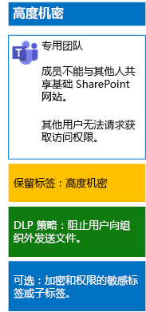

# 使用敏感度标签保护团队中的文件

与可由任何人应用于任何文件的高度管控数据敏感度标签不同，高度机密团队需要其自己的标签或子标签，以使分配的文件：

- 单独加密。
- 包含自定义权限，以便只有团队成员能打开文件。

若要以这种方式为团队的底层 SharePoint 网站中存储的文件实现更高的安全级别，必须配置一个自定义的敏感度标签，以用作其自身标签，或作为高度管控数据的常规标签的子标签。 只有团队成员可在其标签列表中看到自定义标签或子标签。

如果需要将少量标签应用于全局和各个私人团队，请使用敏感度标签。 

如果你拥有大量标签，或者希望在高度管控标签下整理高度机密团队的标签，请使用敏感度子标签。

按照[这些说明](https://docs.microsoft.com/microsoft-365/compliance/encryption-sensitivity-labels)，使用以下设置配置单独的标签或子标签：

- 标签或子标签名称包含团队名称
- 启用加密
- 团队的 Office 365 组有共同创作权限

创建后，为用户发布新的标签或子标签，用户可在将文件上传到团队之前或文件存储在团队中之后，将其应用到文件。

下面是高度机密团队的配置，该配置将敏感度标签用于文件加密和权限。

## 另请参阅

[保护 Microsoft Teams 中的文件](secure-files-in-teams.md)
  
[云应用和混合解决方案](https://docs.microsoft.com/office365/enterprise/cloud-adoption-and-hybrid-solutions)
