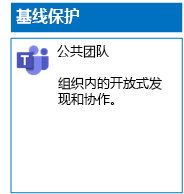
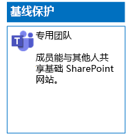
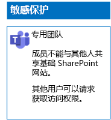
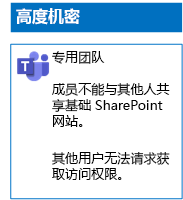

# 部署适用于三层文件保护的团队Deploy teams for three tiers of protection for files

使用本文中的步骤设计和部署基线、敏感和高度机密团队。Use the steps in this article to design and deploy baseline, sensitive, and highly confidential teams. 有关这三层保护的详细信息，请参阅[保护 Microsoft Teams 中的文件](secure-files-in-teams.md)。For more information about these three tiers of protection, see [Secure files in Microsoft Teams](secure-files-in-teams.md).

## 基准团队Baseline teams

基线保护同时包括公共和专用团队。Baseline protection includes both public and private teams. 组织中的任何人均可发现和访问公共团队。Public teams can be discovered and accessed by anybody in the organization. 只有与团队关联的 Office 365 组的成员才可以发现并访问专用网站。Private sites can only be discovered and accessed by members of the Office 365 group associated with the team. 两种类型的团队均允许成员与他人共享网站。Both of these types of teams allow members to share the site with others.

### 公开Public

按照[本文](https://support.office.com/article/174adf5f-846b-4780-b765-de1a0a737e2b)中的说明操作，创建具有公共访问权限和权限的基准团队。Follow the instructions in [this article](https://support.office.com/article/174adf5f-846b-4780-b765-de1a0a737e2b) to create a baseline Team with public access and permissions.

下面是生成的配置。Here is your resulting configuration.

### PrivatePrivate

按照[本文](https://support.office.com/article/174adf5f-846b-4780-b765-de1a0a737e2b)中的说明操作，创建具有私人访问权限和权限的基准团队。Follow the instructions in [this article](https://support.office.com/article/174adf5f-846b-4780-b765-de1a0a737e2b) to create a baseline Team with private access and permissions.

下面是生成的配置。Here is your resulting configuration.

## 敏感团队Sensitive teams

对于敏感团队，首先应[创建私人团队](https://support.office.com/article/174adf5f-846b-4780-b765-de1a0a737e2b)。For a sensitive team, you start by [creating a private team](https://support.office.com/article/174adf5f-846b-4780-b765-de1a0a737e2b).

接下来，配置底层 SharePoint 网站以防止团队成员共享。Next, you configure the underlying SharePoint site to prevent sharing by team members.

1. 在团队的工具栏中，单击“文件”\*\*\*\*。In the tool bar for the team, click **Files**.

2. 单击省略号，然后单击“在 SharePoint 中打开”\*\*\*\*。Click the ellipsis, and then click **Open in SharePoint**.

3. 在基础 SharePoint 网站的工具栏中，依次单击设置图标和“网站权限”\*\*\*\*。In the tool bar of the underlying SharePoint site, click the settings icon, and then click **Site permissions**.

4. 在“**网站权限**”窗格的“**共享设置**”下方，单击“**更改共享设置**”。In the **Site permissions** pane, under **Sharing Settings**, click **Change sharing settings**.

5. 在“共享权限”下方，选择“仅网站所有者可以共享文件、文件夹和网站”，然后单击“保存”\*\*\*\*\*\*\*\*\*\*\*\*。Under **Sharing permissions**, choose **Only site owners can share files, folders, and the site**, and then click **Save**.

下面是生成的配置。Here is your resulting configuration.

## 高度机密团队Highly confidential teams

对于高度机密团队，首先应[创建私人团队](https://support.office.com/article/174adf5f-846b-4780-b765-de1a0a737e2b)。With a highly confidential team, you start by [creating a private team](https://support.office.com/article/174adf5f-846b-4780-b765-de1a0a737e2b).

接下来，配置底层 SharePoint 网站以防止团队成员共享，并防止团队的非成员请求访问权限。Next, you configure the underlying SharePoint site to prevent sharing by team members and the requesting of access by non-members of the team.

1. 在团队的工具栏中，单击“文件”\*\*\*\*。In the tool bar for the team, click **Files**.

2. 单击省略号，然后单击“在 SharePoint 中打开”\*\*\*\*。Click the ellipsis, and then click **Open in SharePoint**.

3. 在基础 SharePoint 网站的工具栏中，依次单击设置图标和“网站权限”\*\*\*\*。In the tool bar of the underlying SharePoint site, click the settings icon, and then click **Site permissions**.

4. 在“**网站权限**”窗格的“**共享设置**”下方，单击“**更改共享设置**”。In the **Site permissions** pane, under **Sharing Settings**, click **Change sharing settings**.

5. 在“**共享权限**”下方，选择“**仅网站所有者可以共享文件、文件夹和网站**”。Under **Sharing permissions**, choose **Only site owners can share files, folders, and the site**.

6. 关闭“**允许访问请求**”，然后单击“**保存**”。Turn off **Allow access requests**, and then click **Save**.

下面是生成的配置。Here is your resulting configuration.

## 后续步骤Next step

[使用保留标签和 DLP 保护团队中的文件Protect files in teams with retention labels and DLP](deploy-teams-retention-DLP.md)

## 另请参阅See also

[保护 Microsoft Teams 中的文件Secure files in Microsoft Teams](secure-files-in-teams.md)

[云应用和混合解决方案Cloud adoption and hybrid solutions](https://docs.microsoft.com/office365/enterprise/cloud-adoption-and-hybrid-solutions)
