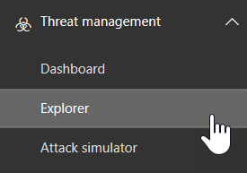

# 将 Microsoft Defender for Office 365 与 Microsoft Defender for Endpoint 一起使用

[!INCLUDE [Microsoft 365 Defender rebranding](../includes/microsoft-defender-for-office.md)]

可将[Microsoft defender For Office 365](office-365-atp.md)配置为与[Microsoft defender for Endpoint](https://docs.microsoft.com/windows/security/threat-protection)一起使用。

将 Microsoft Defender for Office 365 与 Microsoft Defender for Endpoint 集成可帮助你的安全操作团队监视并快速采取行动（如果用户设备面临风险）。 例如，在启用集成后，安全操作团队将能够查看检测到的电子邮件可能影响的设备，以及在 Microsoft Defender for Endpoint 中为这些设备生成了多少个最近的警报。 

下图显示了 " **设备** " 选项卡的外观，并启用了 Microsoft Defender for Endpoint integration：
  

  
在此示例中，可以看到检测到的电子邮件的收件人有四台设备，并且有一个警报。 单击设备的链接将在 Microsoft Defender 安全中心 () 中打开其页面 [https://securitycenter.windows.com](https://securitycenter.windows.com) 。

> [!TIP]
> **[了解有关 Microsoft Defender 安全中心](https://docs.microsoft.com/windows/security/threat-protection/microsoft-defender-atp/use)** (也称为 microsoft Defender for Endpoint portal 的详细信息。 ) 
  
## 要求

- 您的组织必须拥有 Microsoft Defender for Office 365 (或 Office 365 E5) 和 Microsoft Defender for Endpoint。
    
- 您必须是全局管理员或具有安全管理员角色 (如安全管理员) 在 [安全 & 合规中心](https://protection.office.com)中分配。  (查看 [安全 & 合规性中心中的权限](permissions-in-the-security-and-compliance-center.md)) 
    
- 您必须具有对 [资源管理器 (或实时检测) ](threat-explorer.md) 在安全 & 合规中心和 Microsoft Defender 安全中心中的访问权限。
    
## 将 Microsoft Defender for Office 365 与 Microsoft Defender for Endpoint 集成

将 Microsoft Defender for Office 365 与 Microsoft Defender for Endpoint 的集成通过使用安全 & 合规中心和 Microsoft Defender 安全中心进行设置。
  
1. 作为全局管理员或安全管理员，请转到 [https://protection.office.com](https://protection.office.com) 并登录。  (此操作将转到 Office 365 安全 & 合规中心。 ) 
    
2. 在导航窗格中，选择 "**威胁管理**  >  **资源管理器**"。  
    
3. 在屏幕的右上角，选择 " **Defender For Endpoint Settings**"。
    
4. 在 "Microsoft Defender for Endpoint connection" 对话框中，启用 " **连接到 Microsoft defender For endpoint**"。  
    
5. 请转到 Microsoft Defender 安全中心 ([https://securitycenter.windows.com](https://securitycenter.windows.com)) 。

6. 在导航栏中，选择 " **设置**"。 然后，在 " **常规**" 下，选择 " **高级功能**"。

7. 向下滚动到 " **Office 365 威胁智能连接**"，然后打开连接。  

## 相关文章

[Office 365 中的威胁调查和响应功能](office-365-ti.md)
  
[Microsoft Defender for Office 365](office-365-atp.md)
  
[Microsoft Defender for Endpoint](https://docs.microsoft.com/windows/security/threat-protection)
